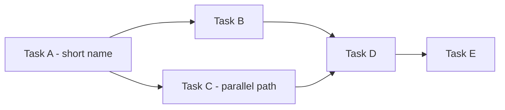
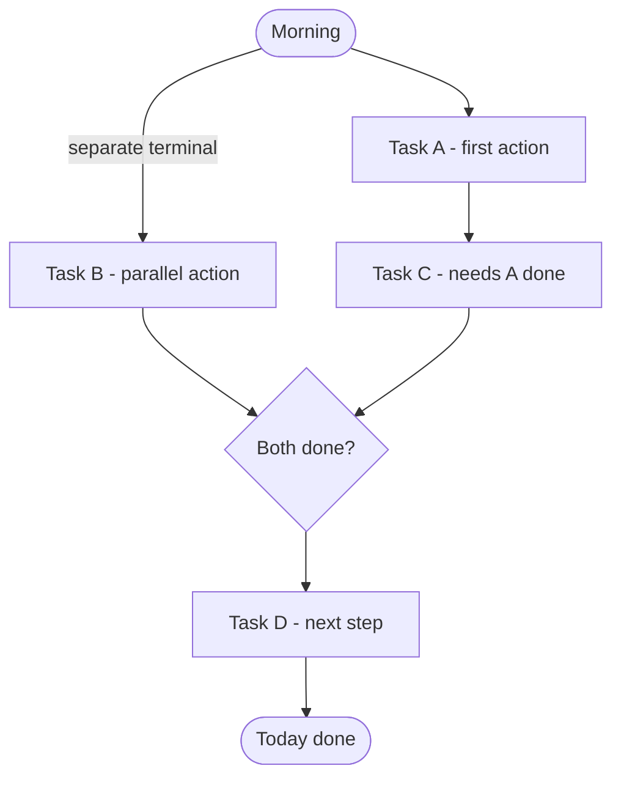

# Agile Daily Standup — Morning Brief

## What This Is

A morning check-in that takes less than 5 minutes to generate and less than 10 minutes
to read. It answers three questions before you open your first terminal:

1. **What moved or shipped since last session?** — so you know where you stand
2. **What should I work on today, and in what order?** — so you start the right thing
3. **What is in my way — and can I move it?** — so you're not blocked by something fixable

The brief is shown in conversation only. It does not write to disk unless
`docs/product/tasks/this-week.md` is absent or older than 24 hours — in that case,
`sync-this-week` runs first to pull a fresh snapshot from the board.

## Why These Agile Principles Are Built In

*Written for someone who hasn't read the agile literature — skip if you already know
Clean Agile, Shape Up, and Accelerate.*

**Finish before starting (Clean Agile)**
If you have a task waiting for your review — a PR to check, a result to approve — that
is your past self's finished investment, sitting idle. Closing it gives you a Done item
immediately. Starting a new task instead just adds to the pile of half-done work.
Rule: items in the "To Review" column always come before new starts.

**Scariest work uphill first (Shape Up)**
Sprint tasks are not equal. Some are well-understood ("add a field to the config file")
and some are unknowns ("wire up keyless auth for the first time"). Unknown tasks hide
surprises. If you do the easy ones first and hit the hard one on day 6 of 7, you have
no time to recover. This brief orders remaining sprint tasks by risk — hardest and most
novel work first.

**WIP limits (Lean / Accelerate)**
WIP (Work In Progress) is the number of tasks simultaneously in flight. For a solo
founder, every task in flight competes for your mental context. Research shows throughput
— tasks actually finished per week — *decreases* when WIP exceeds 2–3 items. The brief
flags when In Progress exceeds 2 and blocks you from pulling new work until something
closes.

**System parallelism — not mental multitasking**
The brief marks some tasks with a parallel symbol. This does NOT mean "think about
both at once." It means: task A can safely run in a second terminal (a build, a CI
pipeline, an AI sub-agent) while you give your full attention to task B.

## Boundary Contract

### Inputs

- GitHub Projects board (live, via `github-projects` → `list-tasks`)
- `docs/product/tasks/this-week.md` (sprint name; regenerate if older than 24 h)
- `docs/product/operations/cadences.md` (sprint date range)
- `docs/product/strategy/strategic-bets.md` (active bet for sprint context)
- `docs/product/tasks/sprint-<N>-goal.md` if it exists

### Outputs

- Formatted daily brief with up to three Mermaid diagrams, rendered in conversation
- Updated `docs/product/tasks/this-week.md` if stale (side-effect only)

### Does Not Cover

- Sprint planning or creating new sprints — use `agile-sprint-planning`
- Creating, updating, or moving board tasks — use `github-projects` directly
- Sprint retrospectives — use `session-retro`

## Steward

Mark (PM). In Mark's routing table. Board writes blocked to Mark — this skill reads
only, except for the optional `sync-this-week` write.

## Prerequisites (abort with clear error if either fails)

- G1: `gh auth status` lists `project` in scopes
- G2: `project_config.json` exists at `.agents/tools/github_projects/project_config.json`
  and is <= 24 h old

## Workflow

### Step 1 — Detect current sprint

Read `docs/product/tasks/this-week.md`.
- Modified today: use the sprint name from it.
- Stale or absent: run `sync-this-week` (procedure 10 in `github-projects` skill),
  then read the regenerated file.

### Step 2 — Fetch live board state

```python
config = resolve_project_config(project_number=1, owner="redmarklogic")
tasks  = list_tasks(config, sprint="<current-sprint-name>")
```

Group into five buckets: `To Review`, `Blocked`, `In Progress`, `Backlog`, `Done`
(all sprint-scoped).

### Step 3 — Fetch sprint context

1. Sprint dates from `cadences.md` → Sprint Conventions → current sprint entry.
   Compute Day X of Y and days remaining.
2. Sprint goal from `docs/product/tasks/sprint-<N>-goal.md` if it exists.
   If absent: surface `No sprint goal defined`.
3. Active bet from `strategic-bets.md`.

### Step 4 — Assess parallelism

For each Backlog task, check `blocked_by` and `depends_on` fields. Tasks with no
shared dependency are parallel-safe (can run in a separate terminal).

### Step 5 — Assess blockers

For each Blocked task, read its `blocked_by` field and reason:
- Third-party / approval needed: Cannot unblock today.
- Blocker is a task we own that is Done or near-Done: Likely unblockable.
- Blocker is a decision: Surface to founder.

### Step 6 — Order execution plan

1. To Review items first
2. Unblockable Blocked items
3. Riskiest In Progress item (most unknowns)
4. Other In Progress items
5. First backlog item only if WIP < 2 after steps 1-4

### Step 7 — Generate diagrams

See Diagram Rules section below. Generate each diagram unless its skip condition
applies; replace skipped diagrams with the empty-state line.

### Step 8 — Render brief

Use the Output Format section below. Write for a first-time reader — define
every piece of jargon in parentheses on first use.

---

## Diagram Rules

### The Three Diagrams and When to Use Them

Three diagrams are permitted. Each must earn its place by replacing prose or table
scanning. Purely decorative diagrams are not permitted.

| # | Diagram | Replaces | Skip when |
|---|---|---|---|
| 1 | Sprint Gantt (timeline) | Target-date column scanning + overdue detection across many rows | Sprint has <= 3 tasks total |
| 2 | Dependency chain | Parsing "Depends on:" columns across multiple tasks; critical path invisible in prose | No inter-task dependencies exist (`depends_on` and `blocked_by` both empty for all tasks) |
| 3 | Today's execution plan | Numbered list + parallel annotations; parallel branches invisible as text | Only 1-2 tasks today (a numbered list is cleaner) |

All diagrams use Mermaid <= 8.8.0 syntax (VS Code Office Viewer ceiling). See
`mermaid-diagrams` skill for full rules. Key constraints:
- No `--` inside labels (v8.8.0 lexes it as an edge token)
- No em dash `--` or en dash in labels
- No `\n` inside stadium `([...])` or diamond `{...}` shapes
- Use plain hyphens and straight quotes only

---

### Diagram 1 — Sprint Timeline (Gantt)

Shows every sprint task as a horizontal bar anchored to its start/target date.
Overdue tasks (target date < today) are marked `crit`. A milestone marks today.

Purpose: lets you see the full sprint at a glance — which tasks are overdue, which
are coming up, and how much of the sprint window is left — without scanning a table
of dates.

```mermaid
gantt
    title Sprint N Timeline
    dateFormat YYYY-MM-DD
    axisFormat %d/%m
    section Done
    #N Task title (max 30 chars)  :done, t1, YYYY-MM-DD, Nd
    section In Progress
    #N Task title                 :active, t2, YYYY-MM-DD, Nd
    section Backlog
    #N Overdue task title         :crit, t3, YYYY-MM-DD, Nd
    #N Normal task title          :t4, YYYY-MM-DD, Nd
```

Rules:
- Task labels: max 30 characters total (including `#N ` prefix); truncate with `...` if needed
- Always prefix each task bar label with `#<issue-number> ` (e.g. `#70 `) — extract the number from `issue_url`
- Always include `axisFormat %d/%m` so x-axis shows day/month (e.g. `08/06`) instead of full ISO dates
- No `--`, `—`, `–` inside labels — use plain hyphen
- Duration `Nd` = number of days from start to target date
- `crit` = overdue (target date is before today)
- `active` = In Progress
- `done` = Done
- Do NOT add an explicit `Today` milestone — Mermaid draws a red vertical line at the current timestamp automatically; a redundant milestone anchors to midnight and creates a confusing double-marker

Legend:
- Grey bars: Done
- Blue bars: In Progress (active)
- Red bars: Overdue (crit) — target date already passed

---

### Diagram 2 — Dependency Chain (flowchart LR)

Shows which tasks must complete before others can start. Makes the critical path
(the longest chain of dependencies) visible at a glance.

Purpose: when tasks form a chain (A must finish before B which must finish before C),
scanning "Depends on:" fields across a table requires re-reading it multiple times.
A left-to-right graph shows the chain in one view.

Only generate this diagram when at least one task has a non-empty `depends_on` or
`blocked_by` field. If no dependencies exist, skip — independent tasks need no graph.



Rules:
- Direction: `flowchart LR` (left to right = time order)
- Labels: short task names, max 25 characters, plain hyphens only
- Parallel branches: fan out from a common predecessor, converge at a common successor
- Every path must end at a terminal node
- No `--` in labels

Legend:
- Left-to-right arrow = must finish before next task starts
- Branching paths = tasks that can run in parallel terminals
- Converging arrows = both prerequisites must complete before proceeding

---

### Diagram 3 — Today's Execution Plan (flowchart TD)

Shows what you do today as a top-down flow. Parallel branches (tasks that can run
in separate terminals simultaneously) appear side-by-side.

Purpose: a numbered list with "parallel with #N" annotations is hard to visualise.
Two side-by-side branches in a flowchart makes "run these simultaneously" obvious.

Only generate when 3+ tasks are in today's plan. For 1-2 tasks, use a numbered list.



Rules:
- Direction: `flowchart TD` (top to bottom = time order)
- Stadium shapes `([...])` for Start/End anchors only — no newlines inside
- Rectangle `[...]` for action tasks
- Diamond `{...}` for sync points (where parallel paths converge)
- Edge label `-- separate terminal` for parallel paths
- Diamond labels: short single line only

Legend:
- Side-by-side nodes = run simultaneously in separate terminals
- Diamond = sync point — cannot proceed until both branches complete

---

## Output Format

Write for a first-time reader. Define jargon in parentheses on first use.
Use plain language — no insider shorthand.

```
## Morning Brief — Sprint [N]: [date range] (Day [X] of [Y]) — [Date]

Sprint Goal: [one sentence — what success looks like when the sprint ends]
OR: No sprint goal defined. Run /sprint-planning to set one.

Bet: [active bet name] | Sprint health: on track / at risk / unknown

────────────────────────────────────────────────────────────────

### Sprint Timeline

[Diagram 1: Gantt]
OR: (skipped — 3 or fewer tasks this sprint)

────────────────────────────────────────────────────────────────

### Task Dependencies (what must happen before what)

[Diagram 2: Dependency flowchart]
OR: No dependencies between tasks — any task can start independently.

────────────────────────────────────────────────────────────────

### 1. ACTION REQUIRED: Under Review ([count])
  "Under Review" means the task is finished but waiting for you to close it out:
  check a PR (Pull Request — a code change waiting for your approval), approve
  a test result, or confirm the work meets the goal. These come first because
  every hour they sit idle is a completed investment that hasn't paid off yet.

  [If empty] Nothing waiting for your review.

  (#N) [title] · [type label: ops / feature / design]
    What it is: [one plain sentence — what this task does and why it matters]
    In review since: [X days]
    Your move: [specific action — e.g. "merge PR #N after checking the test output"]

────────────────────────────────────────────────────────────────

### 2. BLOCKED ([count])
  "Blocked" means the task cannot proceed because something else is in the way.
  Assess each one: fix the blocker now, escalate, or move the task back to the
  backlog (the waiting pile of not-yet-started work).

  [If empty] Nothing blocked.

  (#N) [title] · [type label: ops / feature / design]
    What it is: [one plain sentence]
    Blocked by: [exact blocker text from the board]
    Decision: Unblock now — [specific action to remove the blocker]
           OR Needs your decision — [what the decision is]
           OR Return to backlog — [why it cannot move this sprint]

────────────────────────────────────────────────────────────────

### 3. IN PROGRESS ([count])
  Tasks you are actively working on right now.

  [If count > 2]
  WIP (Work In Progress) warning: [count] tasks in flight simultaneously.
  Research shows that for a solo developer, finishing rate drops when more
  than 2 tasks are active at once. Finish or close one before pulling new work.

  [If empty] No tasks actively in progress.

  (#N) [title] · [type label: ops / feature / design]
    What it is: [one plain sentence]
    Target: [target_date] | Started: [start_date]
    [Note if start_date is in the future: pre-staged — not yet active]

────────────────────────────────────────────────────────────────

### Today's Execution Plan

[Diagram 3: Execution flowchart]
OR: (skipped — 1-2 tasks; see list below)

Order: finish near-done first, then remove blockers, then the riskiest unknown task.
Second terminal means: run this in a separate window as automated work — not split focus.

1. [title] — [REVIEW / UNBLOCK / CONTINUE / START]
   Why first: [one sentence]
2. [title] [second terminal]
   Why here: [one sentence]
3. ...

────────────────────────────────────────────────────────────────

### Sprint Queue — What's Left ([count] tasks, [Y] days remaining)
  Tasks not yet started, ordered so the hardest and most unknown work comes first.
  Why: discovering a hard problem on the last day leaves no time to recover.
  Pull from the top only when In Progress drops below 2.

  [#] (#N) [title] · [type label: ops / feature / design]
      What it does: [one plain sentence]
      Risk: High (novel — first time doing this) / Med / Low (routine, well-understood)
      Needs first: [task it depends on, or "nothing — can start any time"]
      [Can run in a second terminal once [prerequisite] completes]

────────────────────────────────────────────────────────────────

### Recently Completed This Sprint ([count])
  (#N) [title] · [type label] — Done
  ...
  [If none] Sprint just started or no tasks closed yet.

────────────────────────────────────────────────────────────────

Sprint Health: [X/N tasks Done] | [Y days remaining] | [Z In Progress] | [W Blocked]
[bet name] — on track / at risk
```

---

## Common Mistakes

| Mistake | Fix |
|---|---|
| Generating all three diagrams regardless of sprint size | Apply the skip rules. A two-bar Gantt and a two-node dependency graph are decoration, not communication. |
| Using `--` inside Mermaid labels | v8.8.0 lexes `--` as an edge token — rephrase the label using a plain hyphen or remove the characters |
| Using `\n` inside stadium `([...])` shapes | Unreliable in v8.8.0 — use a short single-line label |
| Writing "WIP" without defining it | Always expand on first use: "WIP (Work In Progress)" |
| Skipping To Review items to start something new | To Review items are near-done investments. They always come first. |
| Using the parallel symbol to mean split focus | It means a second terminal running automated work — never split human attention |
| Ordering sprint queue by task number | Task numbers are creation order. Re-order by uncertainty: novel first, routine last. |
| Leaving sprint goal warning unaddressed | If no goal file exists, surface the gap and direct the founder to /sprint-planning |
