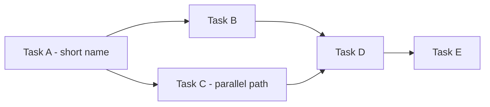

# Agile Daily Standup — Morning Brief

## What This Is

A morning brief that tells the story of where the sprint stands, what is threatening
it, and what the single right move is — before you open your first terminal.

Written for an **uninitiated reader**: someone intelligent but unfamiliar with the
project, the tech stack, and agile terminology. Every acronym is glossed on first
use. Every task is described in plain language — what it does, why it matters to the
product — not just its title.

The brief is always written to `docs/standups/YYYY-MM-DD.md`. It is never rendered
in the conversation — only the file path is confirmed in chat. If
`docs/product/tasks/this-week.md` is absent or older than 24 hours, `sync-this-week`
runs first to pull a fresh snapshot from the board.

## Narrative Framework: Situation–Complication–Resolution (SCR)

The brief uses the **SCR framework** (McKinsey, Barbara Minto): know where you stand
before a complication means anything; name the complication before a resolution feels
justified.

**Situation** — What is objectively true right now. Sprint day, tasks done, tasks in
flight, what shipped. No editorialising. A snapshot a stranger could verify from the
board.

**Complication** — What threatens the sprint goal or the active bet. Overdue tasks,
WIP (Work In Progress — too many things active at once) creep, idle review items,
blockers, board gaps. Cast from the *content* of the tasks — what they actually do
and why their delay matters to the product — not just their metadata.

**Resolution** — The single right move. One clear instruction, not a list of options.
Derived from the execution ordering rules (information gaps first, then To Review,
then unblockable blockers, then riskiest in-progress, then new starts only if WIP
permits) but expressed as a narrative conclusion.

## Why These Agile Principles Are Built In

*Written for someone who hasn't read the agile literature.*

**Finish before starting (Clean Agile):** A task waiting for your review is finished
work sitting idle. Closing it gives you a Done item immediately. Starting something
new instead adds to the pile of half-done work. To Review items always come before
new starts.

**Scariest work uphill first (Shape Up):** Sprint tasks are not equal. Unknown tasks
hide surprises. If you do the easy ones first and hit the hard one on day 6 of 7,
you have no time to recover. Remaining tasks are ordered by risk — hardest and most
novel first.

**WIP limits (Lean / Accelerate):** For a solo founder, every task in flight competes
for mental context. Finishing rate drops when more than 2–3 items are active at once.
When In Progress exceeds 2, the brief names this explicitly and the resolution does
not add new starts.

**System parallelism — not mental multitasking:** Some tasks can run in a second
terminal (a build, a CI pipeline, an AI sub-agent) while you give full attention to
something else. The brief identifies these — but this means a *second terminal*,
never split human focus.

## Boundary Contract

### Inputs

- GitHub Projects board (live, via `github-projects` → `list-tasks`)
- `docs/product/tasks/this-week.md` (sprint name; regenerate if older than 24 h)
- `docs/product/operations/cadences.md` (sprint date range)
- `docs/product/strategy/strategic-bets.md` (active bet for sprint context)
- `docs/product/tasks/sprint-<N>-goal.md` if it exists

### Outputs

- Formatted daily brief written as SCR narrative to `docs/standups/YYYY-MM-DD.md`
  (never rendered in conversation)
- Updated `docs/product/tasks/this-week.md` if stale (side-effect only)

### Does Not Cover

- Sprint planning or creating new sprints — use `agile-sprint-planning`
- Creating, updating, or moving board tasks — use `github-projects` directly
- Sprint retrospectives — use `session-retro`

## Steward

PM steward. Board writes blocked to PM — this skill reads only, except for the
optional `sync-this-week` write.

## Prerequisites (abort with clear error if either fails)

- G1: `gh auth status` lists `project` in scopes
- G2: `project_config.json` exists at `.agents/tools/github_projects/project_config.json`
  and is <= 24 h old

---

## Workflow

### Step 1 — Detect current sprint

Read `docs/product/tasks/this-week.md`.
- Modified today: use the sprint name from it.
- Stale or absent: run `sync-this-week` (procedure 10 in `github-projects` skill),
  then read the regenerated file.

### Step 2 — Fetch live board state

Use the `github-projects` skill's `list-tasks` procedure — never a hand-rolled
GraphQL query. Hand-rolled queries with a fixed page size (`first: 50`) silently
truncate, producing a brief that fabricates complications from incomplete data.

```python
config = resolve_project_config(project_number=1, owner="redmarklogic")
tasks  = list_tasks(config, sprint="<current-sprint-name>")
```

**Completeness assert (mandatory):** request `totalCount`. Assert that returned item
count equals `totalCount`; paginate until exhausted. A fetch whose returned count
equals the requested page size is **presumed truncated until proven complete**.

Group into five buckets: `To Review`, `Blocked`, `In Progress`, `Backlog`, `Done`
(all sprint-scoped).

**Then build the dependency map from native issue dependencies — the only dependency
source (founder ruling 2026-06-12).** The legacy `Depends on` / `Blocked by` text fields
are deprecated (see `github-projects` → set-dependencies) and must not be read. For every
sprint task:

```bash
gh api repos/redmarklogic/redline/issues/<N>/dependencies/blocked_by --jq '.[].number'
```

Empty result = no predecessors. The resulting map {task → blocker issue numbers} feeds
Steps 2c, 4, 5, and Diagram 2.

### Step 2b — Fetch task comments

For every task returned in Step 2, fetch its GitHub issue comments:

```bash
gh issue view <number> --repo redmarklogic/redline --comments --json comments
```

Extract and retain **commentary signals** — text in any of these categories:

- **Gotchas / surprises discovered during work** — discoveries, edge cases, or
  "note for later" flagged while the task was in progress.
- **Cross-task flags** — comments referencing another issue number (`#N`) with a
  warning, dependency note, or "heads-up when you get to #N".
- **Status clarifications** — comments that contradict or extend the board status
  (e.g. "marked Done but pending manual step", "blocked on X").
- **Scoping changes** — decisions made mid-task that changed what the task covers.

**Cap:** fetch comments for at most 10 tasks per run; prioritise In Progress,
Backlog, and Blocked tasks over Done tasks. Skip silently if a task has no comments.

**Where commentary signals surface in the brief:**

- **Complication section:** a cross-task flag or gotcha affecting a Backlog/In
  Progress task is narrated as a complication, attributed by issue number
  (e.g. "A note on #64 warned that…").
- **Resolution / execution steps:** a gotcha relevant to the day's first move is
  appended as a one-sentence "Watch out:" at the end of the relevant execution step.
- **Situation section:** a scoping change on a Done task is noted in plain language
  so the reader knows what "Done" actually means for that task.

**Do not surface:** routine progress updates, "+1" or emoji reactions, automated bot
comments, or CI status lines. Filter to human-authored substantive text only.

### Step 2c — Reconcile snapshot vs live board

Diff the live fetch against `docs/product/tasks/this-week.md`:

- A task present in the snapshot but missing from the live fetch is a **fetch error
  until proven otherwise** — re-query before concluding the board changed.
- A Done-count mismatch between snapshot and live data **blocks brief composition**
  until reconciled.
- A task whose native dependency links (blocked-by) name issue numbers absent from the
  result set is a third truncation signal — stop and re-fetch.

**No unresolved unknowns in the brief.** If a task's status is verifiable via
read-only calls (`gh issue view`, linked PRs, issue timeline), verify it during brief
generation — cap of roughly 5 verification calls. The brief may never recommend
"investigate/audit X" to the founder where the agent can resolve X itself.

### Step 3 — Fetch sprint context

1. Sprint dates from the current Sprint option name in `project_config.json`
   (format `Sprint N - <dates>`); `cadences.md` holds only the boundary convention,
   not a per-sprint date table. Compute Day X of Y and days remaining.
2. Sprint goal from `docs/product/tasks/sprint-<N>-goal.md` if it exists.
   If absent: surface `No sprint goal defined`.
3. Active bet from `strategic-bets.md`.

### Step 3b — Dated-commitment linkage

Pull the active bet's dated clocks from `strategic-bets.md` — ship targets, launch
backstops, kill-criterion checkpoints. State the sprint critical path's slack against
the **nearest dated commitment**. This sentence is mandatory in the Complication
section: a complication without a clock is mood, not stakes.

### Step 4 — Assess parallelism

For each Backlog task, check its native dependency links (Step 2 dependency map).
Tasks with no shared dependency are parallel-safe (can run in a separate terminal).

### Step 5 — Assess blockers

For each Blocked task, read its native blockers (Step 2 dependency map) and reason:
- Third-party / approval needed: Cannot unblock today.
- Blocker is a task we own that is Done or near-Done: Likely unblockable.
- Blocker is a decision: Surface to founder.

### Step 6 — Order execution plan

0. Resolve information gaps before ordering anything else — everything ordered after
   an unknown is ordering noise
1. To Review items first (scope-qualified — see filter below)
2. Unblockable Blocked items
3. Riskiest In Progress item (most unknowns)
4. Other In Progress items
5. First Backlog item only if WIP < 2 after steps 1–4

**Scope filter on To Review items:** an item qualifies for today's plan only if it
is in the current sprint OR its target date is ≤ today. Otherwise it gets a one-line
parking note — never a top execution slot.

**Ending WIP:** the execution plan must state what WIP (Work In Progress count) will
be at end of day. New starts are forbidden while WIP > 2 or while any In Progress
item's true status is unverified.

### Step 7 — Generate diagrams

See Diagram Rules section below. Generate each diagram unless its skip condition
applies; replace skipped diagrams with the empty-state line.

### Step 7.5 — Pre-write audit checklist

Verify every item before writing the file. Any failure sends you back to the step
named in parentheses.

- [ ] Counts reconcile — the header `X/N` is derived from the reconciled set (Step 2c)
- [ ] Every snapshot task is accounted for in the brief (Step 2c)
- [ ] Zero unresolved unknowns remain (Step 2c rule)
- [ ] Every To Review item in today's plan is scope-qualified (Step 6 filter)
- [ ] Gantt includes ALL Done tasks (Diagram Rules)
- [ ] Every diagram is consistent with the prose claims it accompanies (Step 7.5)

### Step 8 — Compose narrative and write to file

Compose the brief using the SCR structure in the Output Format section. Write for an
uninitiated reader — define every acronym and term on first use. Cast the narrative
from task *content*: read titles, descriptions, dependencies, and their relationship
to the active bet. Translate technical tasks into plain-language stakes.

Write the completed brief to: `docs/standups/YYYY-MM-DD.md`

**Do not render the brief content in the conversation.** After writing the file,
confirm in one line: `Brief written to docs/standups/YYYY-MM-DD.md`

---

## Diagram Rules

### The Three Diagrams and When to Use Them

Three diagrams are permitted. Each must earn its place by replacing prose or table
scanning. Purely decorative diagrams are not permitted.

| # | Diagram | Replaces | Skip when |
|---|---|---|---|
| 1 | Sprint Gantt (timeline) | Target-date column scanning + overdue detection across many rows | Sprint has <= 3 tasks total |
| 2 | Dependency chain | Parsing dependency links across multiple tasks; critical path invisible in prose | No native dependency links exist on any sprint task (Step 2 dependency map empty) |
| 3 | Today's execution plan | Numbered list + parallel annotations; parallel branches invisible as text | Only 1–2 tasks today (a numbered list is cleaner) |

All diagrams use Mermaid <= 8.8.0 syntax (VS Code Office Viewer ceiling). See
`mermaid-diagrams` skill for full rules. Key constraints:
- No `--` inside labels (v8.8.0 lexes it as an edge token)
- No em dash or en dash in labels
- No `\n` inside stadium `([...])` or diamond `{...}` shapes
- Use plain hyphens and straight quotes only

---

### Diagram 1 — Sprint Timeline (Gantt)

Shows every sprint task as a horizontal bar anchored to its start/target date.
Overdue tasks (target date < today) are marked `crit`. Purpose: see the full sprint
at a glance — which tasks are overdue, which are coming up, how much window remains.

```mermaid
%%{init: {"gantt": {"useWidth": 960, "barHeight": 20, "barGap": 4}}}%%
gantt
    title Sprint N Timeline
    dateFormat YYYY-MM-DD
    axisFormat %d/%m
    section Done
    #N Completed task title       :done, t0, YYYY-MM-DD, Nd
    section In Progress
    #N Task title                 :active, t1, YYYY-MM-DD, Nd
    section Backlog - Overdue
    #N Overdue task title         :crit, t2, YYYY-MM-DD, Nd
    section Backlog
    #N Normal task title          :t3, YYYY-MM-DD, Nd
```

**Full-width rendering (mandatory):**
- The `%%{init}%%` directive must be the first line inside the fenced code block,
  before `gantt`. Without it, Mermaid calculates a narrow default width.
- `useWidth: 960` — forces the SVG to fill the document content column. Keep between
  800 and 1000; values above 1000 are clipped by some renderers.
- `barHeight: 20` and `barGap: 4` — include explicitly for predictable output.
- Task labels: **max 20 characters total** (including `#N ` prefix). Truncate with
  `...` if needed.
- If the sprint has more than 12 tasks, collapse the Done section to the **3 most
  recently completed** tasks and add `%% N earlier Done tasks omitted`. The mandatory
  Done section rule still applies; 3 is the minimum.

**Content rules:**
- **MANDATORY: Include Done tasks** — `section Done` at the top is required. Every
  sprint task with status Done must appear here (or the most recent 3 if >12 total
  tasks). Omitting this section is a skill violation — the Gantt exists to show sprint
  progress, which is invisible without it.
- Always prefix each task bar label with `#<issue-number> ` (e.g. `#70 `) — extract
  from `issue_url`.
- Always include `axisFormat %d/%m` so the x-axis shows day/month (e.g. `08/06`).
- No `--`, `—`, or `–` inside labels — use plain hyphen.
- Duration `Nd` = days from start to target date; **minimum `2d` for all tasks** —
  `1d` bars render as thin slivers and collapse the chart. Same-day tasks get `2d`.
- `crit` = overdue (target date before today).
- `active` = In Progress.
- Do NOT add an explicit `Today` milestone — Mermaid draws a red vertical line at the
  current timestamp automatically; a redundant milestone creates a confusing
  double-marker.
- Do NOT add a legend — the chart is self-explanatory.

---

### Diagram 2 — Dependency Chain (flowchart LR)

Shows which tasks must complete before others can start, making the critical path
visible at a glance. Only generate when at least one sprint task has a native
dependency link (Step 2 dependency map).



Rules:
- Direction: `flowchart LR` (left to right = time order)
- Labels: short task names, max 25 characters, plain hyphens only
- Parallel branches: fan out from a common predecessor, converge at a common successor
- Every path must end at a terminal node
- No `--` in labels

Legend:
- Left-to-right arrow = must finish before next task starts
- Branching paths = tasks that can run in parallel terminals
- Converging arrows = both prerequisites must complete before proceeding

---

### Diagram 3 — Today's Execution Plan (flowchart TD)

Shows what you do today as a top-down flow. Parallel branches (tasks that can run in
separate terminals simultaneously) appear side-by-side. Only generate when 3+ tasks
are in today's plan — for 1–2 tasks, use a numbered list.


Rules:
- Direction: `flowchart TD` (top to bottom = time order)
- Stadium shapes `([...])` for Start/End anchors only — no newlines inside
- Rectangle `[...]` for action tasks
- Diamond `{...}` for sync points (where parallel paths converge)
- Edge label `-- separate terminal` for parallel paths
- Diamond labels: short single line only

Legend:
- Side-by-side nodes = run simultaneously in separate terminals
- Diamond = sync point — cannot proceed until both branches complete

---

## Output Format

The brief has four parts. Default register is flowing prose — not field dumps or
status-report bullets. Define every acronym and technical term in parentheses on
first use. Embed diagrams inline as visual evidence for a claim made in prose — not
as standalone sections the reader must decode.

**When to use lists inside prose:** Lists are permitted — and preferred — when content
is genuinely enumerable: multiple completed tasks, multiple items waiting for review,
multiple blockers, a ranked execution order. A list is wrong when it fragments a
single continuous thought. The test: if removing the bullets and joining the items
with "and" or "then" reads naturally, use prose. If the items are parallel, discrete,
and three or more, use a list. Never mix list style with prose in the same paragraph.

---

### Part 1 — Header (3 lines max)

```
# Morning Brief — [Date]
Sprint [N] · Day [X] of [Y] · [days remaining] days left · [X/N tasks Done]
Bet: [active bet short name] | Goal: [one sentence, or "No sprint goal set — run /sprint-planning"]
```

---

### Part 2 — Situation (~2–3 short paragraphs)

State the sprint position as a stranger would verify it from the board: what day it
is, how many tasks are done vs. remaining, what is actively in progress, and what the
sprint is ultimately building toward. Name the active bet in plain language — not its
code name, but what it is trying to prove. No editorialising.

Name recently completed tasks and say in one plain sentence what each one enables.
Three or more completed tasks: use a bulleted list — one item per task, each a single
sentence of the form "**#N Title** — [what it does and what it unlocks]." One or two:
fold into prose. Apply the same rule to tasks in progress.

Example list form:
- **#51 Skeleton endpoint** — the core API that turns an uploaded report outline into
  a Word document is live and running behind authentication.
- **#70 Cloud Run deploy** — the service is deployed to Google's managed
  infrastructure and can receive real traffic.

Include Diagram 1 (Sprint Gantt) immediately after the Situation prose as visual
confirmation of the task timeline.

**Diagram placement:**
```
[Situation prose]

[Diagram 1: Gantt — see Diagram Rules]
```

---

### Part 3 — Complication (~2–4 paragraphs)

Name every active threat to the sprint goal. Write from the *content* of the tasks,
not just their status fields. For each complication, say what it is, why it matters
to the product or the bet, and what happens if it is not resolved today.

**Mandatory stakes-clock sentence (from Step 3b):** state the sprint critical path's
slack against the nearest dated commitment in the active bet (ship target, launch
backstop, kill-criterion checkpoint). A complication without a clock is mood,
not stakes.

**Complication types to check and narrate:**

- **Overdue tasks:** Name them, explain what they unblock, and say how many days they
  have slipped. Example: "GCP project setup (#64) was due June 9 and is now a day
  overdue. Every deployment task downstream — Artifact Registry, Dockerfile, CI
  pipeline, Cloud Run deploy — is blocked. One day's slip risks compressing the entire
  ops chain into the last two days of the sprint."

- **Tasks under review (finished work idle):** Name them and say what closing them
  unlocks.

- **WIP creep:** If more than 2 tasks are In Progress, name the risk explicitly.

- **Riskiest unknown task:** Identify the single task with the most hidden unknowns.
  Name it, say what makes it novel, and say what a surprise discovery at this stage
  of the sprint costs versus discovering it later.

- **Board gaps:** If the board state is inconsistent with reality (done tasks not
  marked, sprint tags missing), name the gap and its operational consequence. Before
  calling anything a board gap, confirm the fetch passed Step 2's completeness assert
  — a truncated fetch masquerades as a board gap.

- **Dependency completed out of order:** A Done task whose native blocked-by links
  reference a non-Done task signals hidden manual work — the "Done" likely papers over
  a step performed by hand. Name it and say what the manual workaround was or must have been.

- **Sprint-tag/target-date contradiction:** A task whose iteration tag and target date
  fall in different sprint windows violates the no-cross-boundary convention in
  `cadences.md`. State which field you believe and why.

If a dependency chain is relevant, include Diagram 2 (Dependency flowchart) here as
evidence of what is blocking what.

**Diagram placement:**
```
[Complication prose]

[Diagram 2: Dependency chain — only if dependencies exist, see Diagram Rules]
```

If nothing is threatening the sprint, say so plainly: "The sprint is on track. No
overdue tasks, no WIP creep, no idle review items."

---

### Part 4 — Resolution (~2–3 paragraphs + execution detail)

Open with the resolution stated directly: what to do first and why. This is not a
list of options — it is a conclusion. "The right move this morning is X because Y."

Then give the execution order for the full day, with a plain-language reason for each
step's position. If parallel work is possible (task A can run in a second terminal
while you work on task B), name the tasks and say explicitly what "second terminal"
means — automated work running independently, not split focus.

**The plan must state ending WIP:** one sentence naming what WIP will be at end of
day if the plan is followed. A plan that ends the day above the WIP limit of 2
contradicts the skill's own principles — rework the order until it doesn't, or name
explicitly why today is an exception.

Include Diagram 3 (Execution flowchart) here if 3 or more tasks are in today's plan.

**Diagram placement:**
```
[Resolution opening paragraph]

[Diagram 3: Execution plan — only if 3+ tasks, see Diagram Rules]

[Execution order with plain-language reasoning]
```

Close with a single bolded line:

**Today's first move: [one sentence — the specific action to take right now, with the
task number and what "done" looks like for that action].**

---

### What the Output Looks Like (annotated example structure)

```markdown
# Morning Brief — 2026-06-10
Sprint 2 · Day 3 of 7 · 4 days left · 4/10 tasks Done
Bet: Free Skeleton Wedge | Goal: No sprint goal set — run /sprint-planning

---

## Situation

[2–3 paragraphs: sprint position, what shipped, what it enables, what is in flight]

[Gantt diagram]

---

## Complication

[2–4 paragraphs: threats named from task content — overdue items, idle reviews,
WIP creep, riskiest unknown, board gaps — each explained in terms of product stakes]

[Dependency diagram, if relevant]

---

## Resolution

[Opening: the single right move stated as a conclusion]

[Execution flowchart, if 3+ tasks]

[Ordered execution steps with plain-language reasoning]

**Today's first move: [specific action].**
```

---

## Common Mistakes

### Narrative mistakes

| Mistake | Fix |
|---|---|
| Using prose for a list of 3+ parallel items | Use a bulleted list — one item per task, each a single sentence. Prose is harder to scan when items are discrete and parallel. |
| Using lists for continuous reasoning | If the content is a single argument that builds across sentences, keep it as prose. Bullets fragment reasoning and make the logic invisible. |
| Writing from metadata instead of content | Task titles and status fields are not the story. Read what the task *does* and why it matters to the active bet. "WIF keyless auth overdue" is metadata. "The first-time OIDC federation to GCP is overdue — every deployment task downstream is now compressed" is narrative. |
| Producing three SCR sections as bullet lists | SCR is a prose framework. Bullets are permitted only inside the execution order steps; everything else is sentences. |
| Giving the resolution as a list of options | The resolution is a conclusion, not a menu. "You could do X or Y" is not a resolution. "Do X because Y" is. |
| Defining jargon once and forgetting | Define on first use in each major section if the section can be read standalone. |
| Narrating a missing sprint goal without consequence | A missing sprint goal is itself a complication — the sprint has no success criterion. Name it as a risk in the Complication section, not just a metadata gap in the header. |
| Embedding diagrams without prose context | Every diagram must be introduced with a sentence explaining what it shows. |
| Complications with no stakes-clock | Slippage without reference to the active bet's dated commitments has no stakes. Always state the critical path's slack against the nearest dated commitment (Step 3b). |

### Diagram mistakes

| Mistake | Fix |
|---|---|
| Using `1d` duration on Gantt bars | `1d` bars render as thin slivers. Minimum is `2d` for every bar, including same-day tasks. |
| Omitting `section Done` from the Gantt | Hard violation. Every Done task must appear at the top with the `done` tag. |
| Generating all three diagrams regardless of sprint size | Apply the skip rules. A two-bar Gantt and a two-node dependency graph are decoration, not communication. |
| Using `--` inside Mermaid labels | v8.8.0 lexes `--` as an edge token — use a plain hyphen. |
| Using `\n` inside stadium `([...])` shapes | Unreliable in v8.8.0 — use a short single-line label. |

### Ordering mistakes

| Mistake | Fix |
|---|---|
| Skipping To Review items to start something new | To Review items are finished investments sitting idle. They always come before new starts. |
| Scheduling unknowns last | Resolving information gaps is position 0 of the execution order. Starting new work before resolving unknowns means everything ordered after them is ordering noise. |
| Out-of-sprint To Review items in top slots | Apply the scope filter (Step 6): an item qualifies only if it is in the current sprint or its target date is ≤ today. Future-sprint review items get a one-line parking note. |
| Ending WIP never stated | The Resolution must say what WIP will be at end of day. |
| Using the parallel symbol to mean split focus | It means a second terminal running automated work — never split human attention. |
| Ordering sprint queue by task number | Task numbers are creation order. Re-order by uncertainty: novel first, routine last. |

### Data integrity mistakes

| Mistake | Fix |
|---|---|
| Treating a truncated fetch as a board gap | A query whose returned count equals the page size is presumed truncated. Assert against `totalCount` and paginate (Step 2); reconcile against the snapshot (Step 2c) before narrating "missing" tasks as complications. |
| Hand-rolling a GraphQL query | Always use the `github-projects` skill's `list-tasks` procedure. Hand-rolled queries skip completeness guarantees and have produced briefs with fabricated complications and wrong header math. |
| Delegating verifiable checks to the founder | If a task's status can be resolved with read-only calls (`gh issue view`, linked PRs, timeline), verify it during brief generation. "Audit #N's board status" is never a valid founder action item when the agent can read the answer itself. |
| Chart contradicting prose | Resolve the contradiction before writing — every diagram must agree with the prose it accompanies (Step 7.5). |
| Ignoring contradiction signals | A snapshot task missing from the live fetch, or a `depends_on` referencing issue numbers absent from the result set, are fetch-error signals — stop and reconcile (Step 2c). |
