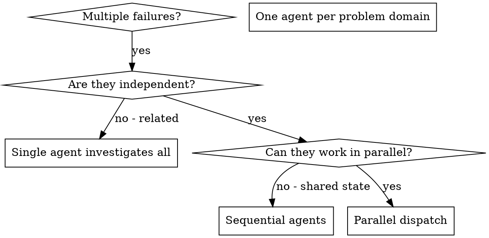

## Boundary Contract

## When to Use

**Use when:**
- 3+ test files failing with different root causes
- Multiple subsystems broken independently
- Each problem can be understood without context from others
- No shared state between investigations

**Don't use when:**
- Failures are related (fix one might fix others)
- Need to understand full system state
- Agents would interfere with each other

See `procedures/dispatching-parallel-agents.md` for detailed rules, examples, and extended reference.

## Common Mistakes

**Too broad:** "Fix all the tests" - agent gets lost
**Specific:** "Fix agent-tool-abort.test.ts" - focused scope

**No context:** "Fix the race condition" - agent doesn't know where
**Context:** Paste the error messages and test names

**No constraints:** Agent might refactor everything
**Constraints:** "Do NOT change production code" or "Fix tests only"

**Vague output:** "Fix it" - you don't know what changed
**Specific:** "Return summary of root cause and changes"
