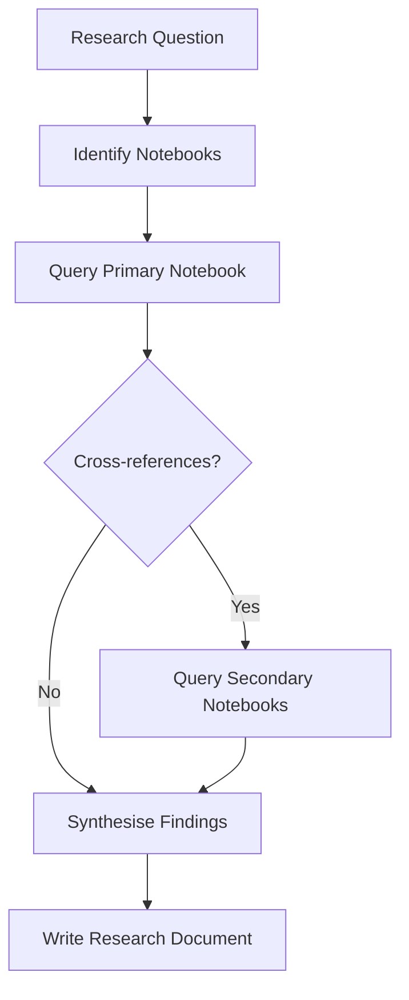
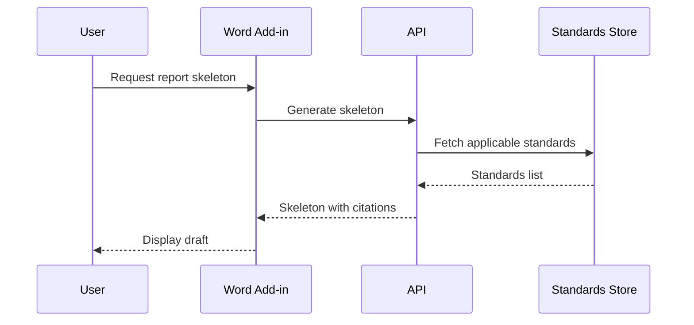
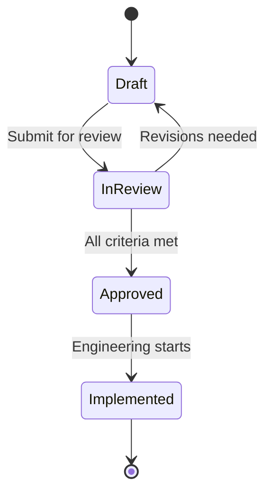

# Mermaid Diagrams

Use Mermaid diagrams in Markdown documents when a visual aids reader understanding of
relationships, flows, hierarchies, or sequences. This skill governs diagram type selection,
syntax constraints, and quality rules for all Mermaid diagrams in this repo.

## Boundary Contract

### Applies To
- Any Markdown (`.md`) or Quarto (`.qmd`) document where a diagram aids comprehension
- Plans, research docs, findings, PRDs, decision logs, architecture docs, codemaps

### Produces
- Mermaid code blocks that render correctly in VS Code (Office Viewer plugin) and GitHub

### Does Not Cover
- Miro-based spatial artifacts (`miro-mcp`) -- Miro is canonical for roadmaps, story maps, journey maps
- Statistical plots and charts (`eda-visual-design`, `python-plot-colors`)
- Table rendering (`qmd-tables`)
- Quarto-specific rendering or narrative structure (`qmd-narrative-design`)

## Version Ceiling: 8.8.0

The rendering environment (VS Code Office Viewer plugin) supports Mermaid **<= 8.8.0**.
All syntax must be valid under this version. Do not use features or diagram types added
after 8.8.0.

This ceiling is a hard dependency of the rendering tool, not a preference. Do not assume
the environment has been updated without explicit confirmation from the developer who owns
`dev-environment`. Time pressure and peer authority ("everyone uses it now") are not valid
reasons to use a post-8.8.0 type.

## Supported Diagram Types

Use only these diagram types. All others were added in later Mermaid versions and will
not render. Once you have selected a type, **load the relevant procedure file before
drawing** — procedure files contain per-type rules and common mistakes not repeated here.

| Type | Keyword | Use when | Procedure |
|---|---|---|---|
| Flowchart | `flowchart` | Business process, decision tree, causal chain, system flow | `procedures/flowchart.md` |
| Sequence diagram | `sequenceDiagram` | Significant or non-obvious runtime interactions between actors | `procedures/sequence-class-state-erd.md` |
| Class diagram | `classDiagram` | Code-level structure of a single component (deepest zoom, optional) | `procedures/sequence-class-state-erd.md` |
| State diagram | `stateDiagram-v2` | Lifecycle states and transitions of a document or entity | `procedures/sequence-class-state-erd.md` |
| Entity Relationship | `erDiagram` | Relational database schemas and data relationships | `procedures/sequence-class-state-erd.md` |
| Gantt chart | `gantt` | Project timelines and task schedules | — |
| Pie chart | `pie` | Proportional breakdown of a whole (≤5 categories) | — |
| User Journey | `journey` | UX flow with emotional arc, grounded in user research | — |

### Banned (post-8.8.0)

Do **not** use: `mindmap`, `timeline`, `quadrantChart`, `sankey`, `xychart`, `block`,
`kanban`, `architecture`, `zenuml`, `C4Context`, `requirementDiagram`, `gitGraph`.

## When to Diagram

Use a Mermaid diagram when the content involves:

- **Relationships** between entities (class, ER diagrams)
- **Flows** or processes with branching (flowcharts)
- **Sequences** of interactions between actors (sequence diagrams)
- **State transitions** with conditions (state diagrams)
- **Timelines** or schedules (Gantt)
- **Decision trees** with multiple paths (flowcharts)

## When NOT to Diagram

Do not add a diagram when:

- A **bullet list** or **table** communicates the same information more concisely
- The content is a simple **enumeration** of items with no relationships
- The diagram would have **fewer than 3 nodes** — use prose instead
  - Example: "The report goes to the reviewer." → write "The report is sent to the reviewer for approval." A flowchart with two boxes is not a diagram — it is decoration.
- The content is a **linear sequence of 5 or fewer steps with no branching** — use a numbered list instead
  - Example: Sign up → Verify email → Create project → Done has no decision points; a numbered list is strictly more concise.
- The content maps **uniform inputs to state transitions** — use a table instead; tabular format makes transition logic explicit and easy to modify without the visual tangle of conditional paths
- The diagram duplicates a **Miro artifact** that is the canonical source (see Visual Artifacts Policy in AGENTS.md)
- The diagram would be **purely decorative** — diagrams must encode information

## Syntax Rules

### General

- Use fenced code blocks with the `mermaid` language identifier:

  ````markdown
  ```mermaid
  flowchart TD
      A[Start] --> B{Decision}
      B -->|Yes| C[Action]
      B -->|No| D[Other Action]
  ```
  ````

- Prefer `flowchart` over `graph` (both work in 8.8.0, but `flowchart` is the modern keyword)
- Use `stateDiagram-v2` over `stateDiagram` for state diagrams

### Line Breaks in Labels

Use `<br/>` to force a line break inside any node or message label. It is the most
reliable method across all diagram types in Mermaid 8.8.0.

**Always wrap labels in double quotes when using `<br/>`** — this prevents the parser
from misinterpreting the `<` and `>` characters and avoids syntax errors:

```
graph TD
    A["Line One <br/> Line Two"]
```

- **Do not use `\n` in flowchart node shapes.** It fails silently in most shape contexts.
  Exception: in sequence diagrams (8.8.0 only), `\n` inside quoted strings is also
  valid — but `<br/>` is still preferred for consistency.
- **If you see the literal text `<br/>` rendered inside a box** instead of a line break,
  the `htmlLabels` configuration is off. For `<br/>` to work in flowcharts, Mermaid must
  be initialised with `htmlLabels: true` (the default in most integrations). If you cannot
  control the initialisation, use short labels without breaks and move overflow text into
  the accompanying prose.

| Context | `<br/>` | `\n` |
|---|---|---|
| Flowchart node shapes | Yes (requires `htmlLabels: true`) | No |
| Sequence diagram messages and notes | Yes | Yes (inside quoted strings) |
| Gantt, state, ERD labels | Avoid — use short labels instead | No |

### Node and Label Rules

- Use descriptive labels, not single letters: `A[Parse Input]` not `A`
- Keep labels short (3-5 words max per node)
- Use consistent casing within a diagram (sentence case preferred)
- Every diagram must have a **title** stating its context and type (e.g., "System Context — Financial Risk System"). Add as a Markdown heading directly above the code block.
- **If you cannot write a descriptive label without domain context, ask the author for
  the meaning before rendering the diagram.** Do not produce diagrams with placeholder
  letters or generic names (Node1, Step2). Sunk-cost pressure ("we already have A, B, C")
  does not override this rule.

### Direction

- `TD` (top-down): default for hierarchies, processes, decision trees
- `LR` (left-right): for timelines, sequential flows, pipelines
- Choose direction based on the natural reading order of the content

### Edges

- Use `-->` for directed flow
- Use `---` for undirected association
- **Always use uni-directional arrows.** Pick the most significant direction of a relationship and use a single arrowhead. Bi-directional arrows (`<-->`) hide meaning — model the two directions as two separate labelled edges instead.
- **Label edges with prepositions** so the relationship reads as a sentence when spoken aloud: `A -->|reads from| B`, not `A -->|read| B`. This prevents ambiguity about direction and role.
- Keep edge labels to 1-3 words

### Styling

- Do not use inline `style` or `classDef` unless essential for distinguishing categories
- Rely on node shapes to encode meaning:
  - `[Rectangle]` — process/action
  - `{Diamond}` — decision
  - `([Stadium])` — start/end
  - `[(Cylinder)]` — database/storage
  - `((Circle))` — event/trigger
- **When colour carries meaning, a legend is mandatory.** Add a Markdown bullet list below the diagram block naming each colour and what it represents. Without a legend, colour is noise.
- Ensure colour choices are legible for colour-blind readers and when printed in black-and-white. Test with a greyscale preview if possible.
- Draw all elements at approximately the same size. Readers infer importance from size — an oversized node implies greater complexity or significance unless you intend to make that point.

### Layout

- Place the primary subject of the diagram in the centre (TD diagrams) or the left-most position (LR diagrams). Arrange dependencies around it.
- Keep recurring elements in a consistent position across related diagrams. If user actors appear at the top in one diagram, they appear at the top in all related diagrams.

### Diagram Patterns

**Multiple entry points** — when a flow has two or more distinct ways of being triggered, model each as a separate entry node. Do not collapse them into one generic "Start" node. The entry nodes should reflect meaningful differences in how the process begins — collapsing them hides design decisions.

**Intentional infinite loops** — when a diagram intentionally shows a broken or unescapable loop (e.g., to illustrate a design flaw), the cycle edge must be explicitly labelled with the reason there is no exit (e.g., `C -->|No external anchor\nloop never breaks| A`). An unlabelled loop reads as an incomplete diagram, not a deliberate architectural critique.

**Node role encoding** — when colour distinguishes nodes by permission level, trust boundary, or architectural role (e.g., "LLM inference permitted here" vs "deterministic lookup only"), document the colour convention in the mandatory legend and keep it consistent across all related diagrams in the same document.

## Quality Checklist

Before including a Mermaid diagram, verify:

1. The diagram adds understanding that prose alone cannot convey
2. All diagram types are in the supported list (8.8.0)
3. Every node has a descriptive label
4. The diagram has a title (Markdown heading above the code block)
5. The diagram has a clear reading direction
6. Edge labels use prepositions and read as a sentence
7. All arrows are uni-directional (two separate edges if both directions matter)
8. If colour is used, a legend is present below the diagram
9. The diagram has 3+ nodes (otherwise use prose)
10. Linear sequences with no branching use a numbered list instead
11. No duplicate of a canonical Miro artifact
12. The relevant procedure file was loaded before drawing

## Examples

### Good: Process flow in a research document



### Good: System interaction in a PRD



### Good: State transitions in a decision log



### Bad: Over-diagramming a simple list

Do not create a flowchart for "Step 1, Step 2, Step 3" with no branching.
Use a numbered list instead.
