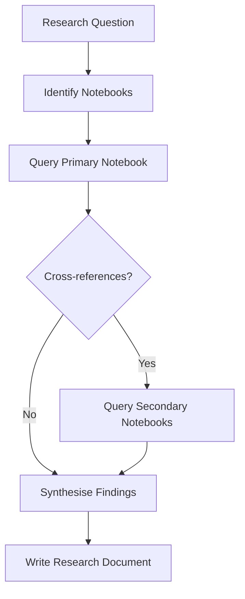
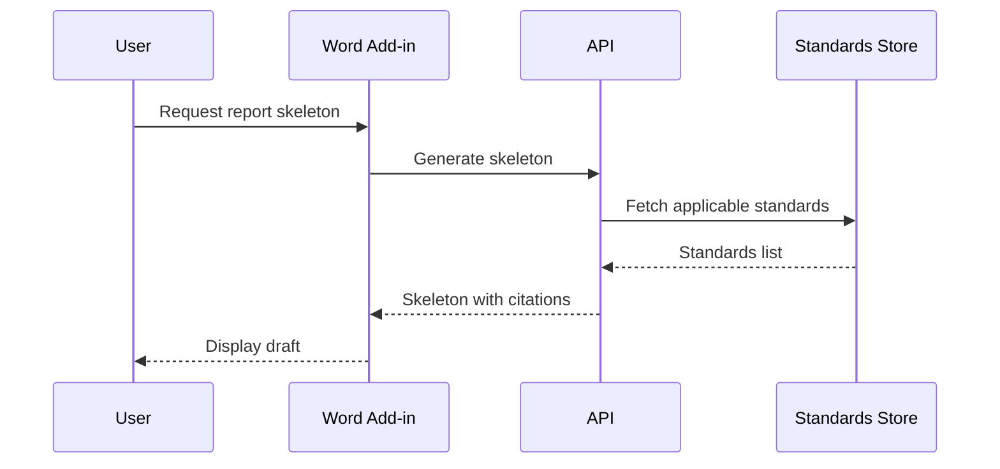
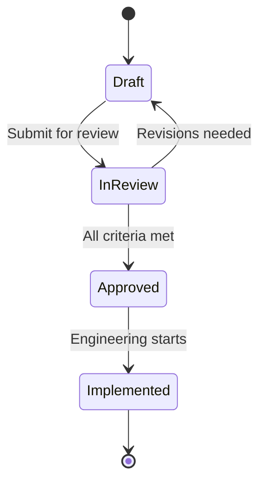

# Mermaid Diagrams

Use Mermaid diagrams in Markdown documents when a visual aids reader understanding of
relationships, flows, hierarchies, or sequences. This skill governs diagram type selection,
syntax constraints, and quality rules for all Mermaid diagrams in this repo.

## Boundary Contract

### Applies To
- Any Markdown (`.md`) or Quarto (`.qmd`) document where a diagram aids comprehension
- Plans, research docs, findings, PRDs, decision logs, architecture docs, codemaps

### Produces
- Mermaid code blocks that render correctly in VS Code (Office Viewer plugin) and GitHub

### Does Not Cover
- Miro-based spatial artifacts (`miro-mcp`) -- Miro is canonical for roadmaps, story maps, journey maps
- Statistical plots and charts (`eda-visual-design`, `python-plot-colors`)
- Table rendering (`qmd-tables`)
- Quarto-specific rendering or narrative structure (`qmd-narrative-design`)

## Version Ceiling: 8.8.0

The rendering environment (VS Code Office Viewer plugin) supports Mermaid **<= 8.8.0**.
All syntax must be valid under this version. Do not use features or diagram types added
after 8.8.0.

This ceiling is a hard dependency of the rendering tool, not a preference. Do not assume
the environment has been updated without explicit confirmation from the developer who owns
`dev-environment`. Time pressure and peer authority ("everyone uses it now") are not valid
reasons to use a post-8.8.0 type.

## Supported Diagram Types

Use only these diagram types. All others were added in later Mermaid versions and will
not render.

| Type | Keyword | Best for |
|---|---|---|
| Flowchart | `flowchart` or `graph` | Processes, decision trees, system flows, causal chains |
| Sequence diagram | `sequenceDiagram` | Interactions between actors/systems over time |
| Class diagram | `classDiagram` | Domain models, data structures, entity relationships |
| State diagram | `stateDiagram-v2` | Lifecycle states and transitions |
| Entity Relationship | `erDiagram` | Data models, table relationships |
| Gantt chart | `gantt` | Timelines, schedules, project plans |
| Pie chart | `pie` | Simple proportional breakdowns |
| User Journey | `journey` | User experience flows, task satisfaction mapping |

### Banned (post-8.8.0)

Do **not** use: `mindmap`, `timeline`, `quadrantChart`, `sankey`, `xychart`, `block`,
`kanban`, `architecture`, `zenuml`, `C4Context`, `requirementDiagram`, `gitGraph`.

## When to Diagram

Use a Mermaid diagram when the content involves:

- **Relationships** between entities (class, ER diagrams)
- **Flows** or processes with branching (flowcharts)
- **Sequences** of interactions between actors (sequence diagrams)
- **State transitions** with conditions (state diagrams)
- **Timelines** or schedules (Gantt)
- **Decision trees** with multiple paths (flowcharts)

## When NOT to Diagram

Do not add a diagram when:

- A **bullet list** or **table** communicates the same information more concisely
- The content is a simple **enumeration** of items with no relationships
- The diagram would have **fewer than 3 nodes** -- use prose instead
  - Example: "The report goes to the reviewer." → write "The report is sent to the reviewer for approval." A flowchart with two boxes is not a diagram — it is decoration.
- The content is a **linear sequence of 5 or fewer steps with no branching** -- use a numbered list instead
  - Example: Collect data → Clean data → Analyse data has no decision points; a numbered list is strictly more concise.
- The diagram duplicates a **Miro artifact** that is the canonical source (see Visual Artifacts Policy in AGENTS.md)
- The diagram would be **purely decorative** -- diagrams must encode information

## Syntax Rules

### General

- Use fenced code blocks with the `mermaid` language identifier:

  ````markdown
  ```mermaid
  flowchart TD
      A[Start] --> B{Decision}
      B -->|Yes| C[Action]
      B -->|No| D[Other Action]
  ```
  ````

- Prefer `flowchart` over `graph` (both work in 8.8.0, but `flowchart` is the modern keyword)
- Use `stateDiagram-v2` over `stateDiagram` for state diagrams

### Node and Label Rules

- Use descriptive labels, not single letters: `A[Parse Input]` not `A`
- Keep labels short (3-5 words max per node)
- Use consistent casing within a diagram (sentence case preferred)
- **If you cannot write a descriptive label without domain context, ask the author for
  the meaning before rendering the diagram.** Do not produce diagrams with placeholder
  letters or generic names (Node1, Step2). Sunk-cost pressure ("we already have A, B, C")
  does not override this rule.

### Direction

- `TD` (top-down): default for hierarchies, processes, decision trees
- `LR` (left-right): for timelines, sequential flows, pipelines
- Choose direction based on the natural reading order of the content

### Edges

- Use `-->` for directed flow
- Use `---` for undirected association
- Add labels to edges when the relationship needs clarification: `A -->|validates| B`
- Keep edge labels to 1-3 words

### Styling

- Do not use inline `style` or `classDef` unless essential for distinguishing categories
- Rely on node shapes to encode meaning:
  - `[Rectangle]` -- process/action
  - `{Diamond}` -- decision
  - `([Stadium])` -- start/end
  - `[(Cylinder)]` -- database/storage
  - `((Circle))` -- event/trigger

## Quality Checklist

Before including a Mermaid diagram, verify:

1. The diagram adds understanding that prose alone cannot convey
2. All diagram types are in the supported list (8.8.0)
3. Every node has a descriptive label
4. The diagram has a clear reading direction
5. Edge labels clarify non-obvious relationships
6. The diagram has 3+ nodes (otherwise use prose)
7. No duplicate of a canonical Miro artifact

## Examples

### Good: Process flow in a research document



### Good: System interaction in a PRD



### Good: State transitions in a decision log



### Bad: Over-diagramming a simple list

Do not create a flowchart for "Step 1, Step 2, Step 3" with no branching.
Use a numbered list instead.
