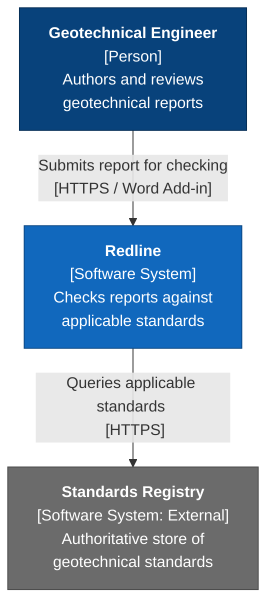
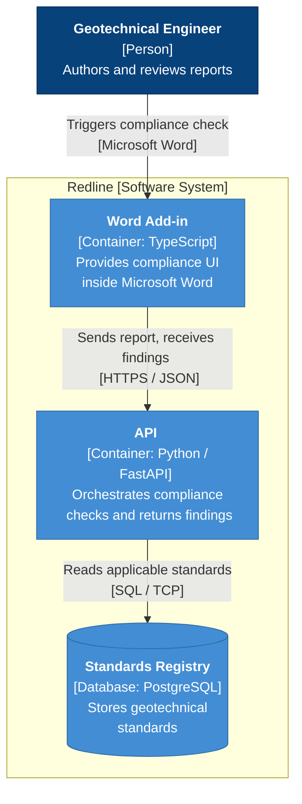

# C4 Diagrams Procedure

The C4 model is a hierarchical framework for visualising the static structure of a software
system at four levels of abstraction: System Context → Containers → Components → Code.

Load this file before drawing any C4 diagram. Read the Version Gate first.

---

## Version Gate

Before drawing, check which Mermaid version is active in this repo (see `dev-environment`
skill or `SKILL.md` version ceiling).

| Mermaid version | Section to follow |
|---|---|
| **≤ 8.8.0** (current repo ceiling) | **Section A — Flowchart Approximation** |
| **> 8.8.0** | **Section B — Native C4 Syntax** |

**Do not use Section B until `dev-environment` confirms the rendering environment has been
upgraded.** The current ceiling is a hard constraint of the VS Code Office Viewer plugin,
not a preference. Do not assume it has changed.

---

## Section A — Flowchart Approximation (Mermaid ≤ 8.8.0)

`C4Context`, `C4Container`, and `C4Component` are **banned** in Mermaid 8.8.0 — they were
added in later versions and will not render. Use `flowchart TD` with the conventions below
to approximate C4 intent.

> **Prerequisite:** `htmlLabels: true` must be active (the default in VS Code Office Viewer).
> If you see literal `<br/>` or `<b>` text in boxes instead of formatting, the configuration
> is off — use plain-text labels until it is fixed.

### A.1 Colour Conventions (mandatory)

Always use `classDef` with these standard C4 colours. Always include a legend.

```
classDef person    fill:#08427b,color:#fff,stroke:#052e56
classDef system    fill:#1168bd,color:#fff,stroke:#0b4884
classDef external  fill:#6b6b6b,color:#fff,stroke:#4a4a4a
classDef db        fill:#438dd5,color:#fff,stroke:#2e6da4
classDef container fill:#438dd5,color:#fff,stroke:#2e6da4
```

**Legend (add as Markdown below every diagram):**
- Dark blue: Person (internal user)
- Blue: Internal Software System or Container
- Grey: External Software System
- Light blue: Database / Data Store

### A.2 Label Format

Every element box must include three pieces of information, stacked using `<br/>`:

```
Name["<b>Display Name</b> <br/> [Type: Technology] <br/> Short description of responsibility"]
```

- `<b>Display Name</b>` — bold name
- `[Type: Technology]` — e.g., `[Person]`, `[Software System]`, `[Container: Python / FastAPI]`, `[Database: PostgreSQL]`
- Short description — one sentence max (7 ± 2 words)

**Never leave a box with only a name.** A box without a type tag and description is not a C4 diagram — it is a labelled rectangle.

### A.3 Level 1 — System Context

Shows the system as one box, surrounded by the people who use it and the external systems it depends on.



**Legend:**
- Dark blue: Person
- Blue: Internal Software System
- Grey: External Software System

### A.4 Level 2 — Containers

Zooms inside the system boundary to show deployable units. Use `subgraph` to represent the
system boundary explicitly.



**Legend:**
- Dark blue: Person
- Light blue: Container (internal)
- Light blue with cylinder shape: Database

### A.5 Level 3 — Components

Zooms inside one container. Use a `subgraph` for the container boundary. Show only the
components relevant to the narrative — do not attempt to show every class or function.
This level is optional; do not draw it unless the internal structure is genuinely complex
and non-obvious.

### A.6 Level 4 — Code

Do not draw in Mermaid at this level. Use a class diagram (`classDiagram`) instead and
load the `procedures/sequence-class-state-erd.md` procedure. Level 4 is highly optional —
engineers get this from the IDE.

### A.7 Relationship Labels

Every arrow must carry three pieces of information on the edge label:

1. **Purpose** — what the interaction does ("reads standards from", "submits report to")
2. **Communication style** — synchronous / asynchronous / batched (omit only if obvious)
3. **Protocol / port** — HTTPS, SQL/TCP, SMTP, REST, etc.

Use a preposition so the label reads as a sentence: "reads standards *from*", not "reads standards".

### A.8 Boundaries

- **Level 2**: wrap all containers in a `subgraph` labelled `"System Name [Software System]"`
- **Level 3**: wrap all components in a `subgraph` labelled `"Container Name [Container]"`
- Do not use `subgraph` at Level 1 (System Context) — the boundary is the diagram itself

---

## Section B — Native C4 Syntax (Mermaid > 8.8.0)

> **Status: placeholder.** Populate this section when `dev-environment` confirms the
> rendering environment has been upgraded past 8.8.0. Do not use this section until then.

When available, Mermaid supports native C4 diagram types: `C4Context`, `C4Container`,
`C4Component`, `C4Dynamic`. These use purpose-built keywords that encode C4 element types
directly, eliminating the need for `classDef` colour hacks and `<b>` label formatting.

**Migration steps when upgrading:**
1. Confirm the new version ceiling in `dev-environment`.
2. Update the Version Gate table at the top of this file.
3. Replace the flowchart approximation examples in Section A with equivalent native C4 examples in Section B.
4. Update `SKILL.md` banned list — remove `C4Context`, `C4Container`, `C4Component` from the banned types once verified to render.
5. Existing diagrams drawn under Section A do not need to be migrated immediately — they will continue to render.

**Native syntax preview (do not use until version ceiling is lifted):**

```
C4Context
title System Context — Redline

Person(engineer, "Geotechnical Engineer", "Authors and reviews geotechnical reports")
System(redline, "Redline", "Checks reports against applicable standards")
System_Ext(registry, "Standards Registry", "External authoritative standards store")

Rel(engineer, redline, "Submits report for checking", "HTTPS / Word Add-in")
Rel(redline, registry, "Queries applicable standards", "HTTPS")
```

---

## Anti-Patterns (apply regardless of version)

These are named in the C4 book and apply to both Section A and Section B:

- **Assuming a narrative** — the diagram must stand alone without verbal explanation.
- **Boxes and no lines** — functional decomposition with no interactions shown tells the reader nothing.
- **Missing technology labels** — omitting how containers are built (technology string) at Levels 2 and 3.
- **Generically true labels** — "business logic", "data layer", "transport" — too broad to be useful.
- **HOCO** — mixing abstraction levels (high-level systems next to low-level classes) in one diagram.
- **Stormtroopers** — unlabelled person/actor boxes with no description of who they are or why they use the system.
- **Airline Route Map** — showing every execution path in one diagram. Pick the significant or non-obvious scenario only.
- **Expanding the canvas** — making the diagram bigger instead of splitting it into focused sub-diagrams.
- **Model-code gap** — drawing a component that does not exist as a named structure in the codebase.
