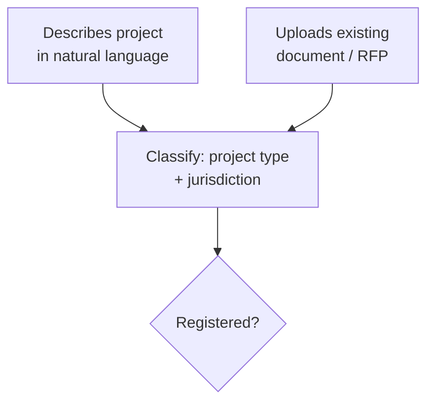
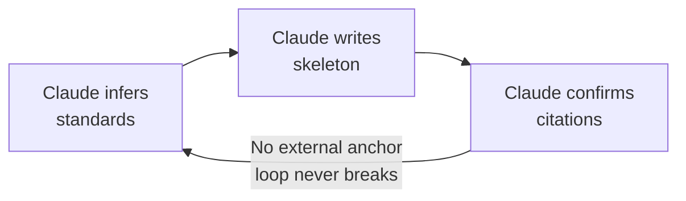

# Flowchart Procedure

Load this file after selecting `flowchart` as your diagram type. Apply every rule here
before drawing.

## What It Is For

A flowchart summarises a **business process or user workflow** — the logical progression
of steps — without detailing technical implementation. Use it to communicate *what happens*,
not *how the system executes it*.

## When to Use vs Alternatives

| Situation | Use |
|---|---|
| Business process for non-technical audience | Flowchart |
| Runtime interactions between system components | Sequence diagram |
| Entity lifecycle (document goes through states) | State diagram |
| Linear steps with no branching, ≤5 steps | Numbered list (not a diagram) |
| Decision logic mapping inputs to outputs uniformly | Table (not a diagram) |

## Rules

### Entry Points

- When a process has two or more distinct ways of being triggered, model **each as a
  separate entry node**. Do not collapse them into one generic "Start" node.
- After distinct entry nodes, merge into a single classification or routing node before
  the first decision gate. This makes clear that different inputs share the same downstream
  logic.



### Direction

- Use `TD` (top-down) for processes that have a natural hierarchy or funnel.
- Use `LR` (left-right) for pipelines and sequential flows where time moves left to right.

### Decision Nodes

- Every decision diamond must have all outgoing edges labelled (Yes/No, or the specific
  condition).
- Every branch must resolve — do not leave a path with no terminal node.

### Intentional Infinite Loops

- If the diagram is intentionally showing a loop with no exit (e.g., to illustrate a
  design flaw), **label the cycle edge** with the reason there is no exit.
- An unlabelled back-edge reads as an incomplete diagram, not a deliberate critique.



### Node Role Encoding with Colour

- Colour may be used to distinguish nodes by architectural role, trust boundary, or
  permission level (e.g., "LLM inference permitted" vs "deterministic lookup only").
- When you use colour this way, **a legend is mandatory** — add a Markdown bullet list
  immediately below the diagram naming each colour and its meaning.
- Keep the same colour convention across all related diagrams in the same document.

```
Legend:
- Grey: entry point (no constraint)
- Indigo: LLM classification permitted
- Green: deterministic registry lookup (LLM inference prohibited)
- Yellow: decline / escalation path
```

## Common Mistakes

- **Collapsed entry points** — one "Start" node hiding two meaningfully different triggers.
  Split them.
- **Unlabelled decision edges** — a diamond with no Yes/No labels forces the reader to
  guess. Label every outgoing edge.
- **No terminal node** — a branch that just ends with no outcome node. Every path must
  resolve.
- **Drawing a numbered list** — if there is no branching and ≤5 steps, use a numbered
  list. A straight-line flowchart is decoration.
- **Omitting the legend** — using colour or `classDef` without a legend. Colour without
  a legend is noise.
- **`--` inside node labels** — Mermaid 8.8.0 lexes `--` as an edge token anywhere in
  the source, including inside `[...]` labels. CLI flags (`--flag`), double-hyphens, and
  similar constructs will cause a syntax error. Rephrase as plain text.
- **`\n` in non-rectangular shapes** — newlines inside stadium `([...])` and diamond
  `{...}` nodes are unreliable in 8.8.0. Use shorter single-line labels in these shapes.
- **Non-ASCII punctuation in labels** — em dash (`—`), en dash (`–`), and curly quotes
  break the 8.8.0 tokeniser. Use plain hyphens and straight quotes.
