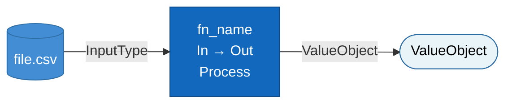
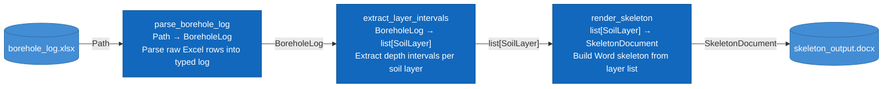
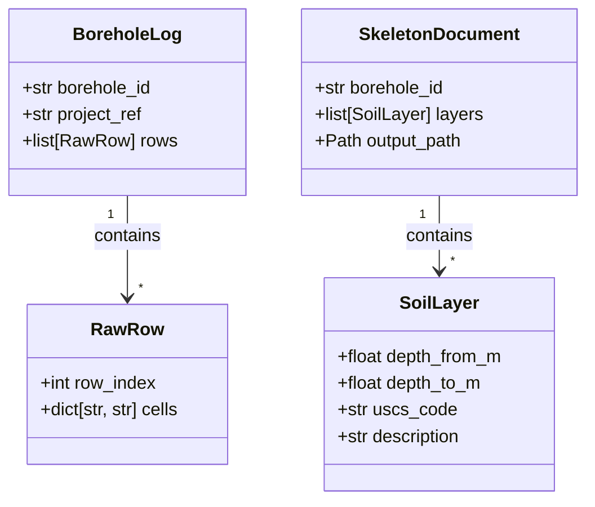
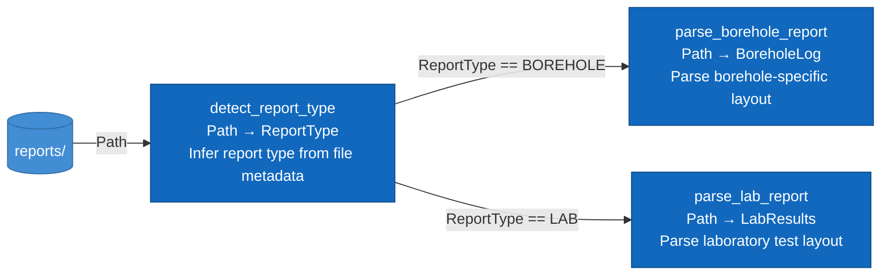

# Function Pipeline Diagram — Procedure

A **Function Pipeline Diagram** shows how functions chain together: inputs, outputs,
and the value objects or data that flow between them. Use it when designing a feature
before code is written, or when reviewing a feature's structure after implementation.

This is NOT a C4 diagram. C4 Level 3 describes modules/services; this describes
individual function signatures and their connections. C4 Level 4 (Code) is optional
and not recommended as long-lived documentation — this diagram fills that gap
at the right level of abstraction.

---

## Design Principles

**Signature-first.** Before any implementation, define: function name, typed inputs,
typed output, one-line process description. The diagram enforces this — every box
must show `InputType → OutputType`.

**Value object preference.** Value objects (VOs) are mandatory at file/DB boundaries
and at layer crossings (e.g., parse layer → domain layer). For purely internal
intermediates within a single layer, stdlib types (`Path`, `datetime`, `str`) are
acceptable without re-wrapping. Do not create a VO just to have one.

**VO discovery via domain expert.** Before finalising VOs, ask the domain expert.
Decomposition signal: if the expert says "it depends on whether…",
the VO probably needs to split into two. Named field choices should reflect
domain terminology, not programmer convenience.

**Reusability balance.** Name VOs for the domain, scoped to current use case needs.
Do not add fields "for later" without grounded domain knowledge. Over-engineering
VOs is as harmful as under-engineering them.

---

## Two-Phase Design Workflow

Use this workflow whenever designing a new pipeline feature.

```
Phase 1 — Pipeline Diagram   →   Founder approval   →   Phase 2 — Class Diagram
(function names, data flow)                              (VO fields, for programmer)
```

### Phase 1: Function Pipeline Diagram (this file)

- Agree on function names and the types flowing between them with the founder
- No field-level detail yet — edge labels carry type names only
- Outcome: founder signs off on the pipeline shape before any code is written

### Phase 2: Class Diagram (after Phase 1 approval)

- Detail the value object fields for the programmer hand-off brief
- Produced in `classDiagram` syntax — see `procedures/sequence-class-state-erd.md`
- Includes field names, types, and relationships between VOs

---

## When to Use

Use a Function Pipeline Diagram when:
- Designing a new feature and need to agree function signatures before coding
- Reviewing how data flows between functions across a pipeline
- Communicating design intent to the programmer
- The founder asks "how does this work at the function level?"

Do NOT use when:
- A simple list of functions suffices (no branching, no data flow to show)
- The design is already captured in code that is readable and well-named
- You're showing system or container-level architecture (use C4 instead)

---

## Shape Convention

```
flowchart LR
```

Always left-to-right (`LR`). Functions flow from source to sink left to right.

| Element | Shape | Mermaid syntax |
|---|---|---|
| Function / process | Rectangle | `fn["fn_name\nIn → Out\nProcess summary"]` |
| File / disk source or sink | Cylinder | `file[("filename.csv")]` |
| Database source or sink | Cylinder | `db[("Table: boreholes")]` |
| Value object label on edge | Arrow label | `-->|"BoreholeLog"|` |
| Value object (standalone node) | Stadium / pill | `vo(["BoreholeLog"])` |
| Decision / branch | Rhombus | `{condition}` (use sparingly) |

**Label format inside function boxes (mandatory):**

```
fn_name
InputType → OutputType
One-sentence process (≤10 words)
```

Never leave a function box with only a name. The `InputType → OutputType` line is the
contract. The process line is the intent.

---

## Colour Convention



- Blue (`fn`): functions / processes
- Light blue (`io`): file / database nodes
- Near-white (`vo`): value object nodes (when shown as standalone nodes rather than
  edge labels — only needed when a VO is shared by multiple functions)

Always include a legend below the diagram.

---

## Example: Phase 1 — Simple Pipeline

A three-function pipeline reading from file, transforming, and writing to disk.



**Legend:**
- Blue: function / process
- Light blue cylinder: file or data store

---

## Example: Phase 2 — Class Diagram (VO Detail)

After founder approves the Phase 1 pipeline above, produce the class diagram
for the programmer hand-off. Shows field names, types, and VO relationships.



> For full `classDiagram` syntax and conventions, see `procedures/sequence-class-state-erd.md`.

---

## Example: Branch in Pipeline

When a function conditionally routes data to different paths.



---

## Common Mistakes

| Mistake | Fix |
|---|---|
| Arrow with no type label | Always label the arrow with the type flowing (e.g. `BoreholeLog`) |
| Function box with only a name | Add `InputType → OutputType` and one-line process |
| Showing implementation details inside the box | Process line is WHAT, not HOW — one sentence max |
| Using C4 `C4Component` syntax | Banned at Mermaid ≤ 8.8.0; use `flowchart LR` with this convention |
| Mixing abstraction levels (module next to function) | One diagram = one abstraction level; split if needed |
| Parallelogram for value objects | Mermaid 8.8.0 doesn't render `/text/` reliably; use edge labels instead |
| Skipping Phase 1 approval and going straight to class diagram | Phase 2 is blocked on founder sign-off of Phase 1 |
| Adding VO fields "for later" without domain grounding | Ask the domain expert first; scope to current use case only |

---

## Relationship to Other Diagram Types

| If you need... | Use |
|---|---|
| System context (external users, external systems) | C4 L1 — `procedures/c4-diagrams.md` |
| Container-level architecture | C4 L2 — `procedures/c4-diagrams.md` |
| Module / service boundaries | C4 L3 — `procedures/c4-diagrams.md` |
| **Function inputs, outputs, pipeline** | **This file** |
| Class / VO field structure | `classDiagram` — `procedures/sequence-class-state-erd.md` |
| Runtime actor interactions | `sequenceDiagram` — `procedures/sequence-class-state-erd.md` |
