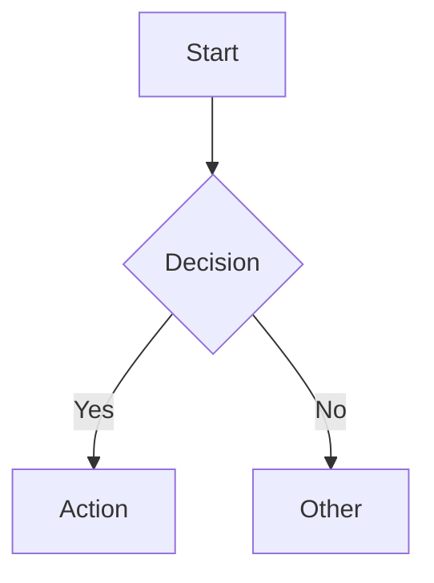

# Mermaid Syntax — Cross-Type Rules

General syntax rules that apply to **all** Mermaid diagram types in this repo. Load after
selecting a diagram type and loading its procedure file, or when a syntax error occurs that
is not covered by the type-specific procedure.

## Code Block Syntax

Wrap every diagram in a fenced code block with the `mermaid` language identifier:

````markdown

````

- Prefer `flowchart` over `graph` (both valid in 8.8.0; `flowchart` is the modern keyword)
- Use `stateDiagram-v2` over `stateDiagram`
- Add a Markdown heading directly above every diagram block stating its context and type
  (e.g., "System Context — Financial Risk System")

## Line Breaks in Labels

Use `<br/>` to force a line break inside a node or message label. Always wrap labels
that contain `<br/>` in double quotes to prevent the parser from misinterpreting `<`:

```
A["Line one <br/> Line two"]
```

- `\n` fails silently in most flowchart node shapes — do not use it in flowcharts
- In sequence diagram messages, `\n` inside quoted strings is valid but `<br/>` is preferred
- If `<br/>` renders as literal text instead of a line break, `htmlLabels` is off. Use short
  single-line labels and move overflow text to the prose instead.

| Context | `<br/>` | `\n` |
|---|---|---|
| Flowchart node shapes | Yes (requires `htmlLabels: true`) | No |
| Sequence diagram messages and notes | Yes | Yes (inside quoted strings) |
| Gantt, state, ERD labels | Avoid — use short labels | No |

## Node and Label Rules

- Use descriptive labels: `A[Parse Input]` not `A`
- Keep labels to 3-5 words per node
- Use consistent casing within a diagram (sentence case preferred)
- Do not use placeholder names (`Node1`, `Step2`); ask the author for domain context if needed

## Special Characters in Labels

**`--` in labels** — the 8.8.0 lexer treats `--` as an edge token anywhere in the source,
including inside `[...]` node text. One unquoted `--` breaks the entire diagram.

```
# Option 1: double-quote the entire label
A["gh run view --log-failed"]

# Option 2: rephrase (preferred when the flag name adds no meaning)
A[Inspect failed run logs]
```

**Non-ASCII punctuation** — em dash (`—`), en dash (`–`), and curly quotes break the 8.8.0
tokeniser even inside quoted strings. Use plain hyphens (`-`) and straight quotes.

## Direction

- `TD` (top-down): hierarchies, processes, decision trees
- `LR` (left-right): timelines, sequential flows, pipelines
- Choose based on the natural reading order of the content

## Edges

- Use `-->` for directed flow; `---` for undirected association
- Never use bi-directional arrows (`<-->`); model each direction as two separate labelled edges
- Label edges with prepositions so the relationship reads as a sentence:
  `A -->|reads from| B`, not `A -->|read| B`
- Keep edge labels to 1-3 words

## Styling

Rely on node shapes to encode meaning rather than colour:

| Shape syntax | Meaning |
|---|---|
| `[Rectangle]` | Process / action |
| `{Diamond}` | Decision |
| `([Stadium])` | Start / end |
| `[(Cylinder)]` | Database / storage |
| `((Circle))` | Event / trigger |

- Do not use inline `style` or `classDef` unless essential for distinguishing categories
- When colour carries meaning, a legend is mandatory — add a Markdown bullet list directly
  below the diagram block naming each colour and what it represents
- Ensure colour choices are legible for colour-blind readers and in greyscale
- Draw elements at approximately equal size; an oversized node implies greater significance

## Layout

- Place the primary subject in the centre (TD diagrams) or the leftmost position (LR diagrams)
- Keep recurring elements at a consistent position across related diagrams in the same document
