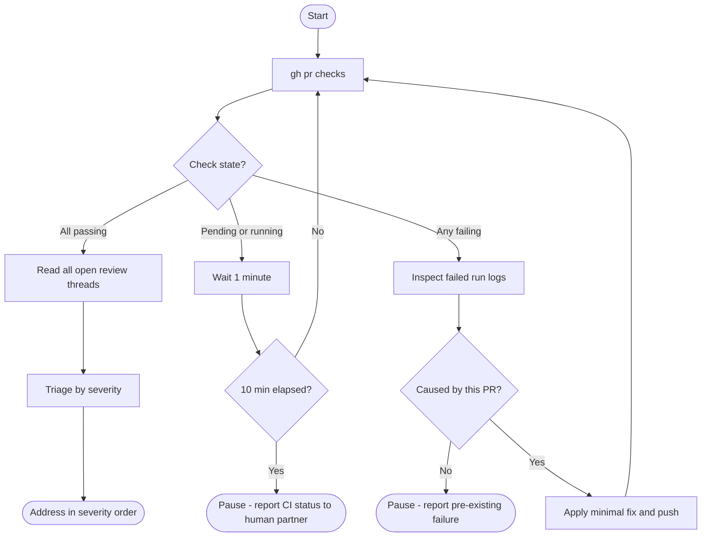

# Pre-Flight: Before Addressing Any Review Comments

Run this procedure **before reading or acting on any review thread**.

---

## Flow



Legend:
- Rounded rectangle: start / end / escalation point
- Rectangle: action
- Diamond: decision gate

---

## CI/CD Polling Rules

```
Poll interval : 1 minute
Max wait      : 10 minutes (10 polls)
Command       : gh pr checks
Failure log   : gh run view --log-failed
```

**Do not proceed to review threads while any check is pending or failing.**
This is a hard gate, not a suggestion.

---

## Severity Triage Order

Address threads in this order. Do not mix levels — finish one level before moving to the next.

| Priority | Category | Examples |
|---|---|---|
| 1 | CI/CD failure (this PR) | Test failures, lint errors, build breaks |
| 2 | Security / breaking | Auth bypass, data loss, API contract breakage |
| 3 | Conflicts with architectural decisions | Reviewer suggests pattern that contradicts a team ADR |
| 4 | Correctness bugs | Logic errors, wrong type, off-by-one |
| 5 | Simple fixes | Typos, unused imports, variable names |
| 6 | Nits / style | Formatting preferences, minor wording |

For Priority 3 (architectural conflicts): stop and discuss with your human partner first — do not implement and do not silently dismiss.

---

## Reviewer Trust When Triaging

Apply trust level from `Source-Specific Handling` in `SKILL.md` before acting on a comment:

| Reviewer source | Trust level | Rule |
|---|---|---|
| Human partner | Trusted | Implement after understanding |
| GitHub Copilot | External — verify | Technically correct for this codebase? Check before implementing |
| External reviewers | External — skeptical | All 5 verification checks before implementing |

Do not treat Copilot comments as authoritative. Copilot can be wrong.
