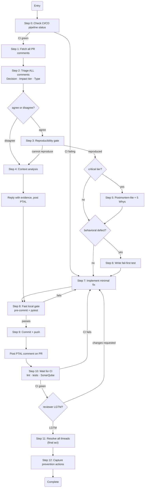

## Boundary Contract

### Applies To
- Resolving incoming PR code-review comments
- Addressing agreed or disagreed reviewer feedback
- Closing a PR review cycle (reviewer re-consent + CI + threads)

### Produces
- Fixed code with fail-first tests for behavioral defects
- Reviewer re-consent (LGTM or explicit approval) for all changed threads
- CI presubmit green (lint + full tests + SonarQube)
- Prevention actions captured for critical/repeat defects

### Does Not Cover
- Conducting a PR review from scratch (use `pr-review`)
- Merging or branching decisions (use `finishing-a-development-branch`)
- Root-cause logging format (use `python-error-handling`)

See `procedures/resolve-cycle.md` for the numbered step-by-step procedure.

## Non-Negotiable Rules

These rules apply regardless of time pressure, sunk cost, or authority:

1. **Reproducibility before files** — for agreed comments, confirm the issue exists in the current codebase before editing anything.
2. **Fail-first test for behavioral defects** — write a failing automated test that captures the defect before implementing the fix.
3. **PTAL after every response** — after replying to any thread (agreed change or disagreed reasoning), post PTAL to request re-review. Treat the thread as open until the reviewer explicitly approves or re-consents.
4. **Two-stage quality gate** — fast local gate first, then CI presubmit. Not one, not three.
5. **Completion requires reviewer re-consent + CI green + threads resolved** — pushing the branch is not completion.
6. **Disagree path requires evidence and closure** — for disagree comments: (1) reply with concrete evidence (spec reference, benchmark, or code example), (2) post PTAL, (3) if disagreement persists escalate to tech lead or team convention, and (4) record the final decision in the thread.
7. **Never resolve threads before CI is green** — thread resolution is the final act, after fixes are committed + pushed + CI green + reviewer LGTM. Resolving threads with unflushed local fixes is a false signal to reviewers.

## Triage Schema

Every comment gets all three tags before any file is touched:

| Tag | Values |
|---|---|
| **Decision** | `agree` / `disagree` |
| **Impact tier** | `critical` · `standard` · `low` |
| **Type** | `behavioral-defect` · `maintainability` · `style-docs` · `tooling` |

Impact tier controls mandatory steps; Decision controls whether you reproduce-and-fix or evidence-and-escalate:

| Tier | Mandatory extras |
|---|---|
| `critical` | Reproducibility gate · Fail-first test (behavioral) · Postmortem-lite + 5 Whys · Immediate lesson capture |
| `standard` | Reproducibility gate · Fail-first test (behavioral) |
| `low` | None — minimal fix path |

## Control Flow

## Automation Capture Priority

When a comment reveals a gap that automation could prevent, record it as a follow-up task. Do not implement automation as part of the current review cycle unless it is critical and can be implemented in under 15 minutes without modifying application code. Priority order when you do implement:

1. **Enable a ruff rule** — check `ruff rule <CODE>`; add to `extend-select` in `pyproject.toml`
2. **Add a community pre-commit hook** — search [pre-commit hook catalog](https://pre-commit.com/hooks.html)
3. **Extend an existing `hooks/` script** — add a case to an existing domain-specific hook
4. **Write a new local hook** — last resort; follow `pre-commit-hooks-create` skill

## Common Mistakes (Baseline Failures)

| Mistake | Correct behaviour |
|---|---|
| Starting with PR comments when CI is already red | Stop. Run Step 0 (CI status check) first — CI failures block closure regardless of review state |
| Implementing a fix without reproducing the issue | Stop. Run the reproduction check first, even under time pressure |
| Skipping the failing test because "the fix is obvious" | Obvious fixes still need a test — obvious is when rationalization is highest |
| Adding a code comment on a disagreed thread and closing it | Reply with evidence, then request PTAL and wait for re-consent |
| Running pre-commit only | Run fast local gate (pre-commit + impacted tests), then push and let CI run in parallel |
| Treating "push branch" as done | Done = reviewer re-consent + CI green + all threads resolved |
| Applying postmortem/lessons to every comment | Batch reflection for `low`-tier items; immediate for `critical`/`behavioral-defect` |
| Resolving threads before pushing or before CI green | Thread resolution is the final act — commit, push, CI green, reviewer LGTM, then resolve |
