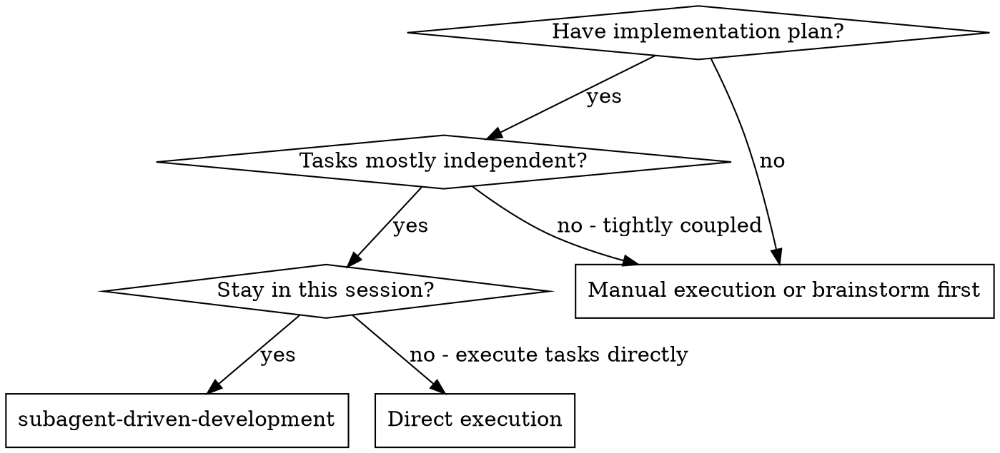

## Boundary Contract

## When to Use

**Why this over direct execution:**
- Same session (no context switch)
- Fresh subagent per task (no context pollution)
- Two-stage review after each task: spec compliance first, then code quality
- Faster iteration (no human-in-loop between tasks)

See `procedures/subagent-driven-development.md` for detailed rules, examples, and extended reference.

## Common Mistakes

| Mistake | Fix |
|---|---|
| Dispatching subagents for tasks with shared mutable state | Only dispatch tasks that are truly independent; tasks touching the same file must run sequentially |
| Not specifying the exact skill the subagent should load | Name the skill explicitly in the subagent prompt; vague prompts produce inconsistent results |
| Treating subagent output as final without a review pass | Always review subagent output before merging; the orchestrating agent is responsible for final quality |