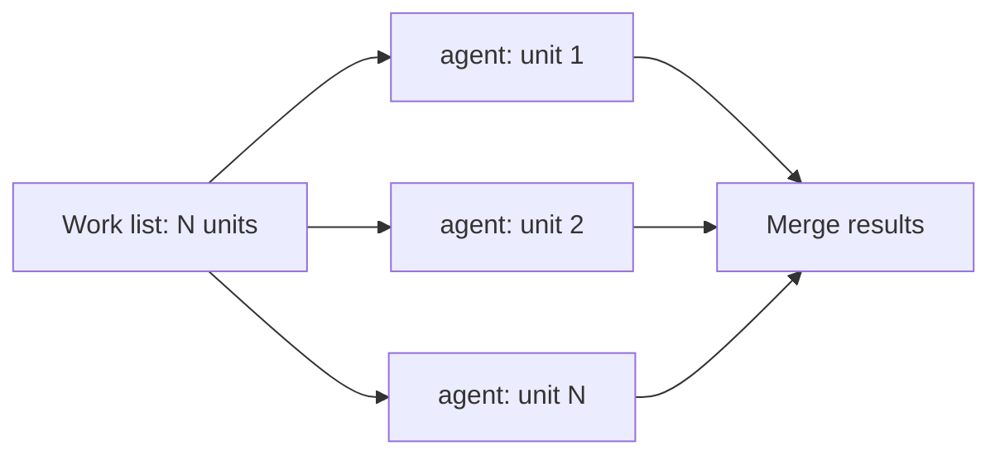
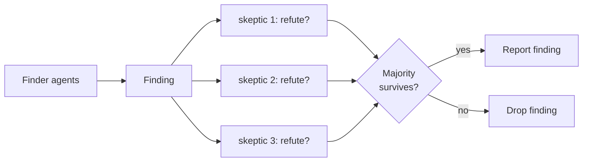
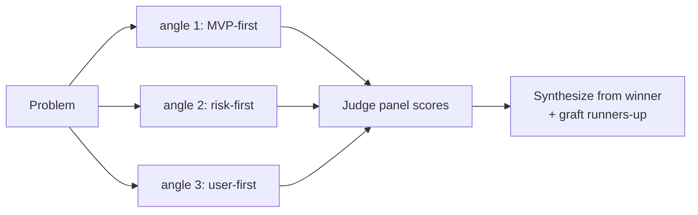
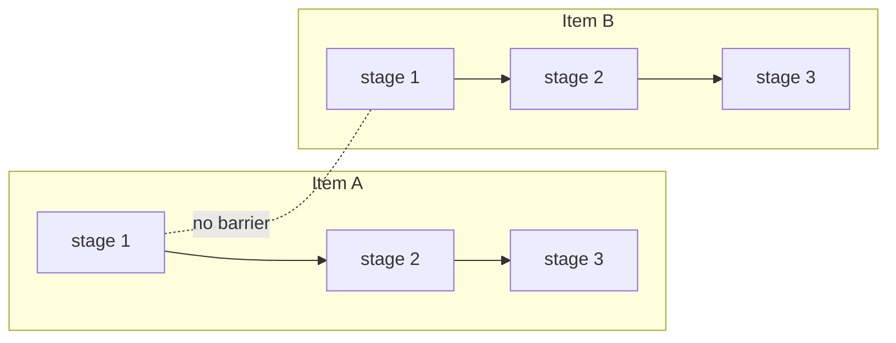
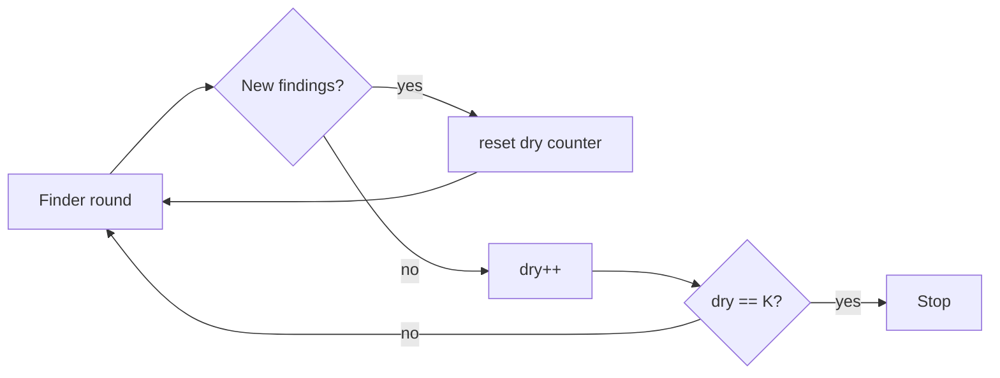
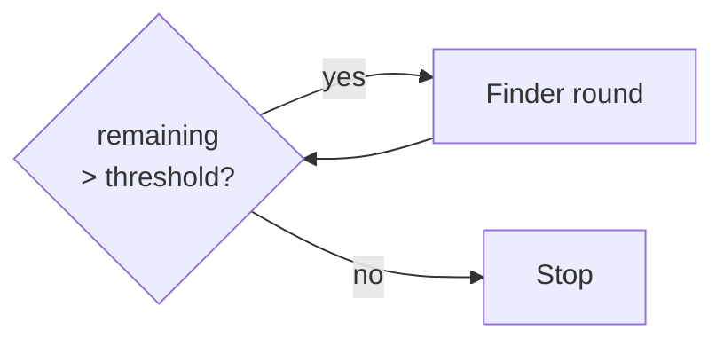

# Dynamic Workflow Patterns — Detailed Reference

Loaded after the Agent Orchestration Tier gate in `SKILL.md` returns **DYNAMIC WORKFLOW**.
The gate decides *whether* to use a workflow; this file decides *which shape*.

A dynamic workflow is a JavaScript script the Claude Code runtime executes in the
background, orchestrating subagents at scale. Intermediate results live in script
variables, not the conversation context. There are no formal "types" in the product —
these are the recurring orchestration **patterns**. Compose them freely.

---

## Pattern Selection Table

| Pattern | Shape | Use when | Barrier? |
|---|---|---|---|
| [Fan-out sweep](#fan-out-sweep) | N agents, one per file/unit; results merged | Codebase-wide audit, large migration, lint-fix-at-scale | No — pipeline |
| [Adversarial verify](#adversarial-verify) | Finders produce findings → independent skeptics try to refute each before it is reported | High cost-of-wrong-answer: security audit, red-team, correctness review | Per-finding |
| [Multi-angle draft](#multi-angle-draft) | Same problem solved N independent ways → judged → best synthesized | Hard plan or design worth drafting from several angles before committing | Yes — judge needs all attempts |
| [Pipeline](#pipeline) | Items flow through stages independently; item A can be in stage 3 while B is in stage 1 | Per-item multi-step work (review → verify each finding) | No — this is the default |
| [Loop-until-dry](#loop-until-dry) | Keep spawning finder rounds until K consecutive rounds surface nothing new | Unknown-size discovery (bug hunt, edge-case sweep) | Per-round |
| [Loop-until-budget](#loop-until-budget) | Keep spawning until token budget is exhausted | Depth scaled to an explicit token target | Per-round |

**Default to pipeline.** Reach for a barrier (collect all stage-N results before stage N+1)
only when stage N+1 genuinely needs every prior result at once — dedup/merge across the
full set, early-exit on zero findings, or cross-comparison between findings.

---

## Pattern Catalog

### Fan-out sweep

One agent per unit, all in parallel; results merged at the end. Justified by *scale* alone.

### Adversarial verify

Each finding faces independent skeptics that try to *refute* it before it is reported. Majority-refute kills weak findings. Value is the refutation pass, not the agent count.

### Multi-angle draft

Same problem solved N independent ways, each blind to the others; a judge panel scores; synthesis grafts the best ideas from runners-up. A barrier — the judge needs all attempts.

### Pipeline

Items flow through stages independently — no barrier between stages, so item A can be in stage 3 while item B is still in stage 1. The default shape.

### Loop-until-dry

Keep spawning finder rounds until K consecutive rounds surface nothing new. Catches the tail a fixed agent count would miss.

### Loop-until-budget

Keep spawning rounds until the token budget is exhausted; depth scales to an explicit target.

---

## When each pattern earns its cost

- **Fan-out sweep** — the baseline "more agents" use. Justified by *scale* alone: more
  units than one context can hold. No quality multiplier beyond parallelism.
- **Adversarial verify** — justified by *cost-of-wrong-answer*, not scale. The value is the
  independent refutation pass, not the agent count. Use majority-refute to kill weak findings.
- **Multi-angle draft** — justified when the *solution space is wide* and one-attempt-iterated
  would lock in early. Each angle is blind to the others; a judge panel scores; synthesis
  grafts the best ideas from runners-up.
- **Pipeline** — justified whenever items are independent and each needs multiple steps.
  Saves the wall-clock a barrier would waste.
- **Loop-until-dry / -budget** — justified when you cannot know the work size up front.
  A fixed agent count would either undershoot (miss the tail) or overshoot (waste spend).

---

## Anti-patterns — do NOT reach for a workflow when

- The task is a **single pass** one context can hold → solo.
- It needs **mid-run human sign-off** → workflows forbid mid-run input; split each gate into
  its own workflow.
- The work is **judgment, not scale** (strategy, PRDs, design, prose) → solo regardless of length.
- You **haven't gauged spend** → run on a small slice first (one directory, one narrow
  question). Workflows are a deliberate token multiplier, never a default.

---

## Cost discipline

- Every agent uses the session model unless a stage routes to a smaller one. Check `/model`
  before a large run; route cheap stages to a smaller model.
- Concurrency is capped (~16 agents) and total agents per run is capped (1,000) — a
  runaway-loop backstop, not a target.
- `/workflows` shows per-agent token usage live. Stop a run there without losing completed work.

---

## Spec-Kit `[P]`-block link

When `speckit-implement` reaches a block of `[P]`-marked tasks, run the gate in `SKILL.md`
on that block. If it returns DYNAMIC WORKFLOW, a **fan-out sweep** (one agent per `[P]` task)
is the usual shape; add **adversarial verify** when the block is correctness- or
security-critical.
