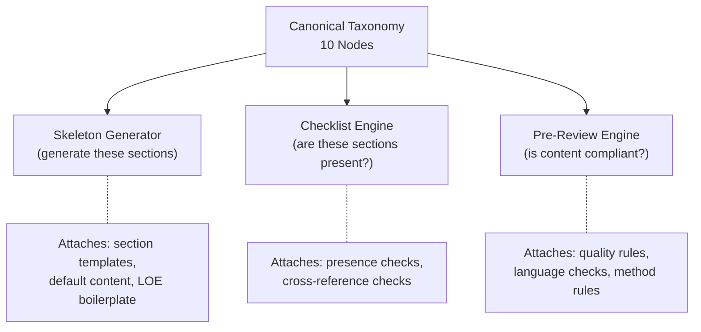

# ADR-006: Shared Taxonomy -- Skeleton Generator, Checklist Engine, Pre-Review Engine

**Status**: Accepted
**Date**: 2026-05-13
**Deciders**: Mark (PM), Graeme (domain), Ron (strategy)

---

## Context

Analysis of 10 geotechnical report checklists across 5 jurisdictions (NZ, US FHWA, US TDOT,
US Mason County, US USACE) revealed 70-80% convergence on a universal 10-node report taxonomy.
The 20-30% variation is jurisdiction- and depth-specific, not structurally different.

Three Redline product components need to reason about report structure:

1. **Skeleton Generator** (Bet 1): Generates a report template with the right sections for a
   given scope. Asks: "What sections should this report contain?"
2. **Checklist Engine** (future): Checks whether required sections are present in a submitted
   report. Asks: "Are these sections here?"
3. **Pre-Review Engine** (Bet 2): Checks whether section content meets quality and compliance
   rules. Asks: "Is this section's content compliant?"

The question is whether these three components should each maintain their own taxonomy, or
share a single canonical taxonomy.

---

## Decision

**One canonical taxonomy, three consumers.** All three components reference the same 10-node
taxonomy. Each component attaches its own logic (templates, presence checks, quality rules)
to the shared nodes.



### Taxonomy Nodes

| # | Node | Description |
|---|---|---|
| 1 | Site Context | Location, scope, purpose |
| 2 | Topography / Geomorphology | Terrain description, aerial photography |
| 3 | Geology / Stratigraphy | Geologic setting, subsurface profile |
| 4 | Field Investigation | Boreholes, CPT, SPT, field tests |
| 5 | Subsurface Conditions | Soil/rock description, groundwater |
| 6 | Laboratory Testing | Classification, strength, consolidation |
| 7 | Engineering Analysis | Stability, bearing capacity, settlement, seismic |
| 8 | Earthworks | Cut/fill design, shrink-swell, compaction |
| 9 | Drainage / Environment | Surface/subdrainage, environmental considerations |
| 10 | Deliverables | Logs, plans, cross-sections, photographs |

> **Live reference**: This table is replicated here at the date of this ADR (2026-05-13)
> for completeness. The canonical, maintained version is in
> [checklist-taxonomy-cross-jurisdiction.md](../knowledge/geotechnical/report-writing/checklist-taxonomy-cross-jurisdiction.md).
> If the node names or descriptions change, the knowledge document is the authoritative source.
> ADRs are immutable; this table is a snapshot.

### Rule Dimension Model

Every rule (from any consumer) carries:

```
rule_id: str
statement: str           # The check question (reviewer voice)
taxonomy_node: str       # Which of the 10 nodes this attaches to
workflow_moment: str     # pre-investigation | during-drafting | pre-review | pre-submission
depth_level: int         # 1=presence | 2=content-quality | 3=method-validation
jurisdiction: list[str]  # ["universal"] or ["nz", "au"] etc.
source_standard: str     # Document reference
severity: str            # high | medium | low
configurable: bool       # Whether a firm can override via House Rules
```

**`severity` and `depth_level` are orthogonal dimensions.** Neither implies the other.
A presence check (depth 1) can be HIGH severity (e.g., scope limitation clause missing)
or LOW severity (e.g., photographs not included). A method validation check (depth 3) can
be HIGH (Vs used as sole liquefaction method) or MEDIUM (CPT cross-check not mentioned).
Both dimensions are required on every rule.

---

## Options Considered

### Option A: Shared taxonomy (chosen)

- One source of truth for "what a geotechnical report looks like"
- Three components hang their logic on the same tree
- Taxonomy evolves once, consumers inherit automatically

### Option B: Separate taxonomies per component

- Each component defines its own structure
- Skeleton Generator might call it "Slope Stability" while Pre-Review calls it "Engineering
  Analysis" and Checklist Engine calls it "Section 7"
- Drift is inevitable; NZ taxonomy node names would diverge from US names

### Option C: No taxonomy -- flat rule lists

- Rules are standalone, not grouped by section
- Makes cross-component reporting impossible ("show me all issues in Section 7")
- No structure for jurisdiction overlays

---

## Rationale

1. **Empirical convergence**: 10 checklists from 5 jurisdictions converge on the same 10 nodes.
   This is not an invented taxonomy -- it is an observed one. Maintaining separate taxonomies
   would mean separately maintaining structures that empirically converge anyway.

2. **Cross-component features**: The audit trail (Feature L, TDOT precedent) needs to link
   Skeleton Generator sections to Checklist Engine passes to Pre-Review flags. A shared taxonomy
   makes this linkage trivial. Separate taxonomies would require a mapping layer.

3. **Jurisdiction overlay model**: The 70% universal core + 30% jurisdiction-specific overlay
   model works naturally with a shared taxonomy. Each jurisdiction adds nodes or refines existing
   ones. With separate taxonomies, each jurisdiction would need to be maintained three times.

4. **Standards Knowledge Store synergy**: Bet 3 (Standards Knowledge Store) already defines rules
   with `source_standard` and `source_section` dimensions. Adding `taxonomy_node` as a dimension
   is a natural extension, not a new concept.

---

## Consequences

**Positive**:
- Single place to add a new taxonomy node (e.g., "Seismic Assessment" for NZ)
- All three components automatically gain access to new nodes
- Audit trail can trace from skeleton section to checklist result to pre-review flag
- Jurisdiction overlays are additive, not multiplicative

**Negative**:
- Taxonomy changes affect all three components simultaneously -- requires coordination
- Components cannot evolve their structure independently (but this is also a feature, not a bug)
- Initial taxonomy must be correct enough to serve all three use cases

**Mitigations**:
- Taxonomy nodes are intentionally broad ("Engineering Analysis" not "Slope Stability FoS
  Check") to accommodate all three consumers
- The `depth_level` dimension allows each consumer to operate at its own abstraction level
- The `workflow_moment` dimension keeps pre-investigation rules separate from pre-review rules

---

## References

- [Checklist taxonomy analysis](../knowledge/geotechnical/report-writing/checklist-taxonomy-cross-jurisdiction.md)
- [FHWA reviewer vocabulary](../knowledge/geotechnical/report-writing/fhwa-reviewer-checklist-rule-vocabulary.md)
- [Strategic bets](../product/strategy/strategic-bets.md) -- Bets 1, 2, 3
- [Standards registry concept](../concepts/02-standards-registry/standards-registry.md) -- rule
  structure with `source_standard` and `source_section`
