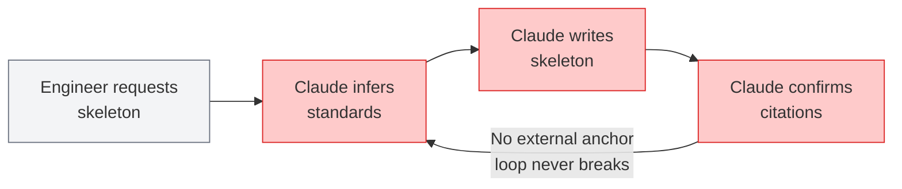
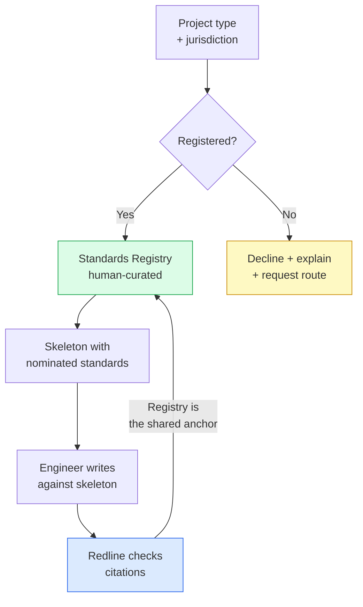

# ADR-007: Standards Registry as Deterministic Anchor for Skeleton Generator

**Status**: Accepted
**Date**: 2026-05-14
**Deciders**: Ron (strategy), Graeme (domain), Mark (PM)

---

## Context

The Skeleton Generator (Bet 1) must nominate applicable standards when producing a report
template for a given project type and jurisdiction. Two approaches are possible:

1. **LLM inference** — the language model infers which standards apply based on project
   type, jurisdiction, and scope described in the prompt.
2. **Registry lookup** — applicable standards are retrieved from the human-curated
   Standards Registry, which maps project types and jurisdictions to a deterministic
   list of mandatory and advisory standards.

The choice is not primarily a performance question. It is a correctness and trust question
that determines whether the adversarial loop is genuinely broken.

---

## Decision

**Standards nomination in the Skeleton Generator must be deterministic, sourced from the
human-curated Standards Registry. LLM inference of applicable standards is prohibited.**

---

## Options Considered

- **Option A — LLM inference**: The model infers applicable standards at generation time.
  Fast to implement; requires no pre-populated registry.
- **Option B — Registry lookup (selected)**: Applicable standards are fetched from the
  Standards Registry before generation. Deterministic; human-curated; auditable.
- **Option C — Hybrid**: Registry is preferred; LLM inference fills gaps for unregistered
  project types. Rejected because the hybrid creates a silent fallback that undermines the
  correctness guarantee without surfacing it to the user.

---

## Decision Rationale

If the model infers which standards apply when generating a skeleton, the adversarial loop
is not broken — the model nominates, the model writes, the model confirms. Consistent
errors become invisible to the checker because both the generation and the verification
share the same failure mode.

**The adversarial loop (Option A — rejected):**

- **Engineer requests skeleton** — a project type and jurisdiction are provided as input, same as Option B. From this point the paths diverge.
- **Claude infers standards** — the LLM nominates which standards apply based on its training data. No human has verified this nomination; it may be correct, outdated, or hallucinated.
- **Claude writes skeleton** — the skeleton is drafted against the inferred standards list. Errors in nomination propagate silently into structure and placeholders.
- **Claude confirms citations** — the same model that nominated the standards is used to verify them. Shared failure modes are invisible to the checker; a confidently wrong inference passes review.
- **No exit** — there is no external anchor that can break this cycle. Consistent errors recirculate undetected. This is not an edge case; it is the default behaviour.

The Standards Registry is the deterministic anchor that severs this loop. It represents
a human commitment: a qualified engineer has verified that these standards apply to this
project type in this jurisdiction. That commitment cannot be delegated to inference.

**The registry-anchored flow (Option B — selected):**

- **Project type + jurisdiction** — the engineer declares what they are writing (e.g., residential earthworks GIR, Canterbury) before the skeleton is generated.
- **Registered?** — the generator checks whether this project type / jurisdiction combination has a curated entry in the Standards Registry. This is a hard gate, not a soft preference.
- **Standards Registry (human-curated)** — a qualified engineer has verified which standards are mandatory and advisory for this project type. This is the only source of standards nomination; LLM inference is not permitted here.
- **Decline + explain + request route** — if the project type is not registered, the generator refuses, names the unrecognised type, and provides a route to submit a registration request. A silent fallback to inference is prohibited (see Option C rejection below).
- **Skeleton with nominated standards** — the generated skeleton carries the registry-sourced standards list as explicit placeholders, labelled with each standard's role (compliance framework, test methodology, etc.).
- **Engineer writes against skeleton** — the engineer drafts the report using the skeleton as a structured prompt. Standards are pre-nominated; the engineer applies judgment to the engineering content.
- **Redline checks citations** — Pre-Review verifies that the standards nominated in the skeleton are correctly cited in the final report. Because both the skeleton and the checker draw from the same registry, the loop anchor is external to the LLM.

Option C was rejected because a silent LLM fallback recreates the same loop for any
project type not yet in the registry, without alerting the user that the nomination was
inferred rather than curated.

---

## Consequences

**Positive:**

- The adversarial loop is genuinely broken for all registered project types.
- Standards nominations are auditable — every skeleton can cite its registry entry.
- The quality guarantee is honest: it holds exactly where the registry holds and no
  further.

**Negative / Constraints:**

- The Standards Registry must be populated before the Skeleton Generator ships.
- Any new project type requires a human-curated entry in the Standards Registry before
  the Skeleton Generator can serve it. There is no graceful degradation — the generator
  must decline to produce a skeleton for unregistered types rather than fall back to
  inference.
- When the generator declines, it must explain why and provide a path forward. A blank
  refusal will produce confusion and user abandonment. The minimum acceptable decline
  response: name the unregistered type, explain that deterministic standards nomination
  is not yet available for it, and provide a route to request registration. This UX
  path must be defined before Phase 1 ships — hybrid project types (e.g., foundation
  design + retaining wall on the same site) are not an edge case in NZ practice.
- This is a correctness and trust constraint, not a performance constraint. Speed-of-
  delivery pressure must not be used to justify a temporary inference fallback.
- **Registry curation obligation created**: the correctness guarantee is bounded by
  the accuracy and currency of the registry. Registry entries must be reviewed when
  referenced standards are updated (e.g., a new NZS edition). The responsible owner
  and review cadence for registry curation must be defined before the Skeleton
  Generator ships. A wrong entry in the registry produces a wrong-but-confident output
  — this may be harder to detect than a wrong LLM inference, because it carries the
  authority of "human-curated."
  *Owner to be assigned. Cadence: at minimum, review triggered by any Standards
  Knowledge Store update.*

---

## References

- ADR-005: Standards Knowledge Store — Citation-Only Internal Architecture
- ADR-006: Shared Taxonomy — Skeleton Generator, Checklist Engine, Pre-Review Engine
