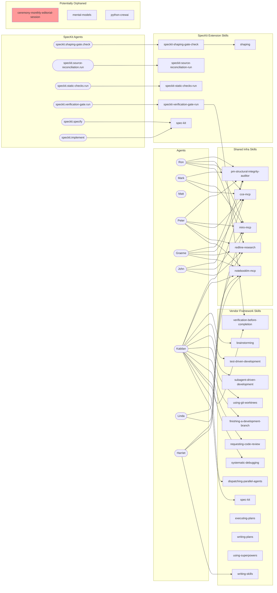

# Skill Bloat Diagnostic Approach

**Status:** Draft
**Date:** 2026-05-30
**Owner:** Harriet (People & Agent Development)

---

## Problem Statement

We maintain **87 custom skills** alongside two vendor frameworks (Superpowers, Spec Kit).
As skills accumulated organically, symptoms of bloat appeared:

- Skills that overlap with each other or with framework-provided capabilities
- Skills with no agent routing path (orphans)
- Context window tax: every skill description injected into system prefix costs tokens,
  even when unused
- Conflicting or redundant advice across similar skills

Research consistently shows that **more skills = worse agent performance**. A study on MCP
tool scaling found 72% of agent context consumed by tool definitions before any work begins
(Gan & Sun, arXiv 2505.03275). Benchmarks show per-tool accuracy of 96% in isolation
collapsing to under 15% in large-toolset multi-turn settings.

## Diagnostic Framework: Four-Phase Pruning

### Phase 1 -- Build the Agent-Skill Graph

**Goal:** Map every skill to its reachability from an agent invocation.

**Method:**

1. Extract all agent JDs (`.github/agents/rl.*.agent.md`) and their skill routing tables
2. For each agent, record directly-routed skills (degree-1 links)
3. For each skill, check if it references other skills (degree-2+ links).
   Skills reference other skills via procedure files, boundary contracts, or prose mentions
4. Build a directed graph: `Agent -> Skill -> Skill` (transitive closure)
5. Identify **orphan skills** -- skills unreachable from any agent node

**Output:** A reachability matrix and a visual graph (see Phase 4).

Current agent-skill mapping (extracted from JDs):

**Note:** Two routing layers exist:
- `rl.*` agents (custom Redline agents) -- route to custom and vendor skills
- `speckit.*` agents (Spec Kit extension agents) -- route to `speckit-*` skills and
  transitively to other skills via dispatchers

Both layers must be included in the reachability graph.

| Agent    | Direct Skills (degree 1) |
|----------|--------------------------|
| Ron      | pm-product-strategist, pm-personas, pm-roadmap, miro-mcp, pm-structural-integrity-auditor, strategy-pre-mortem, strategy-psf-domain, cce-mcp, redline-research |
| Mark     | pm-problem-framer, pm-hypothesis-builder, pm-prd-builder, pm-personas, pm-roadmap, pm-prioritization, miro-mcp, pm-structural-integrity-auditor, cce-mcp |
| Matt     | miro-mcp |
| Peter    | engineering-architecture, ddd-strategic, evaluation-architecture, shaping, ai-acceptable-use-policy, notebooklm-mcp, redline-research, cce-mcp, pm-structural-integrity-auditor, miro-mcp |
| Graeme   | notebooklm-mcp, redline-research, cce-mcp, pm-structural-integrity-auditor |
| John     | marketing-content-big-5, marketing-product-led-seo, marketing-social-selling-linkedin, marketing-ai-content-review, pm-personas, pm-prioritization, pm-structural-integrity-auditor, miro-mcp, qmd-narrative-design, redline-research |
| Kabilan  | python-style, python-patterns, python-typing, python-linting, python-function-design, python-class-design, python-module-structure, python-testing-unit, python-testing-api, test-driven-development, python-data-ingestion, python-pins-data-version-control, python-error-handling, python-paths, python-documentation, python-script, python-script-numbering, python-static-checks, python-deptry, systematic-debugging, dev-environment, python-usethis, version-control, git-push-batched, git-hooks-create, security, python-performance, python-domain-modeling, data-tidy, python-crewai, cce-mcp, eda-codebook, eda-interpreting-data, eda-qa, eda-visual-design, python-plot-colors, qmd-tables, qmd-narrative-design, mermaid-diagrams, python-mcp-tools, notebooklm-mcp, dispatching-parallel-agents, subagent-driven-development, using-git-worktrees, finishing-a-development-branch, requesting-code-review, resolving-pr-issues, spec-kit, doc-updater, verification-before-completion, brainstorming |
| Linda    | library-management, notebooklm-mcp, redline-research |
| Harriet  | hiring-agent-management, writing-skills, notebooklm-mcp, miro-mcp, ceremony-agent-topology-sync |
| speckit.shaping-gate.check | speckit-shaping-gate-check -> shaping (transitive) |
| speckit.source-reconciliation.run | speckit-source-reconciliation-run |
| speckit.static-checks.run | speckit-static-checks-run -> python-static-checks (dispatcher) |
| speckit.verification-gate.run | speckit-verification-gate-run -> verification-before-completion (dispatcher) |
| speckit.specify | spec-kit (custom wrapper) |
| speckit.implement | spec-kit (custom wrapper) |

### Phase 2 -- Classify Each Skill by Source Layer

Every skill falls into one of four layers. Pruning rules differ per layer.

| Layer | Description | Pruning action |
|-------|-------------|----------------|
| **Vendor-Framework** | Skills shipped by Superpowers or Spec Kit (e.g. brainstorming, writing-plans, test-driven-development, subagent-driven-development, using-git-worktrees, finishing-a-development-branch, requesting-code-review, systematic-debugging, verification-before-completion, writing-skills, dispatching-parallel-agents, executing-plans, using-superpowers) | Cannot remove. Can override/extend via Spec Kit extensions or Superpowers forks. If a custom skill duplicates one of these, the custom skill is the candidate for removal. |
| **SpecKit-Extension** | Custom Spec Kit lifecycle hooks living in `.specify/extensions/` with mirrored skills in `.agents/skills/speckit-*` and agents in `.github/agents/speckit.*.agent.md`. These are: speckit-shaping-gate-check, speckit-source-reconciliation-run, speckit-static-checks-run (dispatcher to python-static-checks), speckit-verification-gate-run (dispatcher to verification-before-completion), plus the wrapper skill spec-kit and the pre-SpecKit skill shaping. | Routed from `speckit.*` agents, NOT from `rl.*` agents -- so they appear orphaned in the rl-agent graph but are NOT orphans. Do not prune. The two dispatchers (static-checks, verification-gate) are thin stubs pointing to authoritative skills -- keep as-is per ADR-013. |
| **Tool/Platform** | Skills for specific tooling: MCP servers, Miro, NotebookLM, CCE (cce-mcp, miro-mcp, notebooklm-mcp, notebooklm-index, notebooklm-deep-research, python-mcp-tools, rag-prompting) | Keep if tool is actively used. Candidates for merge if multiple skills cover same tool. |
| **Language/Stack** | Python-specific skills (python-*, data-tidy, eda-*, qmd-*, mermaid-diagrams, dev-environment, security, version-control, git-push-batched, git-hooks-create) | Highest density area. Prime candidates for consolidation. |
| **Domain/Ops** | Business domain skills: PM, marketing, strategy, engineering-architecture, hiring, ceremonies, library-management, etc. | Prune only if orphaned or fully covered by another skill. |

### Phase 3 -- Detect Redundancy (MERGE/DELETE/KEEP/UPDATE)

Apply four tests to each skill pair, inspired by the ACE Framework deduplication system
(kayba-ai/agentic-context-engine):

| Test | Signal | Action |
|------|--------|--------|
| **Semantic overlap** | Two skills cover the same concern with different words (e.g. "python-error-handling" vs framework debugging skill) | MERGE into one |
| **Subset containment** | Skill A is a strict subset of Skill B (e.g. a narrow "python-script-numbering" could fold into "python-script") | DELETE the subset, absorb into parent |
| **Framework duplication** | Custom skill duplicates what Superpowers/Spec Kit already provides (e.g. custom "executing-plans" already superseded by speckit) | DELETE the custom one or reduce to a thin redirect stub |
| **Low-frequency orphan** | Skill has no agent routing path AND no transitive reference from any other skill | DELETE after confirming no implicit usage |

**Candidate clusters for investigation:**

1. **Python function/class/module** -- `python-function-design`, `python-class-design`,
   `python-module-structure` could potentially merge into a single `python-design` skill
2. **Python quality** -- `python-linting`, `python-static-checks`, `python-deptry`, `python-style`
   overlap in "make code correct" -- could merge into `python-quality`
3. **EDA cluster** -- `eda-codebook`, `eda-interpreting-data`, `eda-qa`, `eda-visual-design`,
   `python-plot-colors` -- five skills for one workflow; could merge to 2-3
4. **NotebookLM cluster** -- `notebooklm-mcp`, `notebooklm-index`, `notebooklm-deep-research`,
   `rag-prompting` -- four skills for one tool
5. **Workflow skills** -- `executing-plans` and `writing-plans` are already marked SUPERSEDED
   by spec-kit equivalents but still exist as files. The custom `spec-kit` wrapper skill
   and `shaping` skill are valid (routed from speckit.* agents) -- keep
6. **PM cluster** -- `pm-problem-framer`, `pm-hypothesis-builder`, `pm-prd-builder`,
   `pm-personas`, `pm-roadmap`, `pm-prioritization`, `pm-decision-architect`,
   `pm-product-strategist`, `pm-structural-integrity-auditor` -- nine PM skills across
   three agents; `pm-structural-integrity-auditor` alone is routed to 4+ agents
7. **Ceremony skills** -- `ceremony-agent-topology-sync`, `ceremony-monthly-editorial-session`
   -- check if either is orphaned

### Phase 4 -- Visualize the Graph

Build a Mermaid graph showing agents (rectangles), skills (rounded boxes), and edges
(routing relationships). Color-code by layer. Orphan skills will be visually isolated.

**Reading the graph:**
- Nodes with no incoming edges from any agent (directly or transitively) are orphan candidates
- Nodes connected to many agents are shared infrastructure -- high-value, low-risk to keep
- Dense clusters (many skills, few agents) signal consolidation opportunity

### Phase 5 -- Rename with Consistent Prefixes

After pruning and merging, rename surviving custom skills using a prefix convention so
skills sort into logical groups at a glance (like `speckit.*` agents already do).

**Proposed prefix groups:**

| Prefix | Scope | Current names (before) | Proposed names (after) |
|--------|-------|------------------------|------------------------|
| `mcp-` | All MCP server skills | `cce-mcp`, `miro-mcp`, `notebooklm-mcp`, `python-mcp-tools` | `mcp-cce`, `mcp-miro`, `mcp-notebooklm`, `mcp-python-tools` |
| `notebooklm-` | NotebookLM workflow skills (beyond MCP wiring) | `notebooklm-index`, `notebooklm-deep-research`, `rag-prompting` | `notebooklm-index`, `notebooklm-deep-research`, `notebooklm-rag-prompting` |
| `python-` | Python language skills | already consistent | no change |
| `eda-` | Exploratory data analysis | already consistent; absorb `python-plot-colors`, `data-tidy` after merge | `eda-visual-design` (absorbs plot-colors), `eda-tidy-data` |
| `pm-` | Product management | already consistent | no change |
| `marketing-` | Marketing | already consistent | no change |
| `strategy-` | Strategy & GTM | already consistent | no change |
| `ceremony-` | Periodic rituals | already consistent | no change |
| `qmd-` | Quarto/reporting | already consistent | no change |
| `git-` | Git workflow skills | `git-push-batched`, `git-hooks-create`, `version-control` | `git-push-batched`, `git-hooks-create`, `git-version-control` |
| `speckit-` | Spec Kit extension hooks | `speckit-shaping-gate-check`, `speckit-source-reconciliation-run`, `speckit-static-checks-run`, `speckit-verification-gate-run` | already consistent -- keep `speckit-` prefix |
| `arch-` | Architecture & design | `engineering-architecture`, `ddd-strategic`, `evaluation-architecture` | `arch-engineering`, `arch-ddd-strategic`, `arch-evaluation` |
| (unprefixed) | Cross-cutting / infra | `security`, `dev-environment`, `doc-updater`, `library-management`, `redline-research`, `mental-models`, `shaping`, `spec-kit` | keep unprefixed -- these are genuinely cross-cutting or have established identity |

**Rules:**
- Prefix = the _domain_ the skill belongs to, not the agent that uses it
- MCP skills always get `mcp-` prefix (tool wiring). Workflow skills for a tool
  keep the tool name as prefix (e.g. `notebooklm-`)
- Vendor framework skills (Superpowers, Spec Kit) are never renamed
- Renaming requires updating: skill directory name, SKILL.md `name` field, all
  agent JD routing tables, `skills-lock.json`, any cross-references in other skills
- Execute renames in a single atomic PR after all merges/deletions are done

**Migration checklist:**
1. Generate a rename map (`old_name -> new_name`) from the table above
2. `grep -r` for every `old_name` across `.github/agents/`, `.agents/skills/`, `AGENTS.md`
3. Rename directories, update `name:` frontmatter, update all references
4. Run `prek` to verify no broken hook references
5. Commit as a single "rename skills for prefix consistency" changeset

## Execution Plan

| Step | Action | Owner | Output |
|------|--------|-------|--------|
| 1 | Run a script to parse all agent JDs and skill SKILL.md files, extract references, build adjacency list | Kabilan | `agent_skill_graph.json` |
| 2 | Compute transitive closure; identify orphan skills (zero in-degree from agents) | Kabilan | Orphan list |
| 3 | For each candidate cluster (Phase 3), read both skills side-by-side, classify as MERGE/DELETE/KEEP/UPDATE | Harriet + domain owner | Decision table |
| 4 | Render full graph as interactive Mermaid or Miro board | Harriet | Visual artifact |
| 5 | Execute approved merges/deletions in a single PR | Kabilan | PR |
| 6 | Update `skills-lock.json` and agent JDs to reflect changes | Kabilan | Updated routing |
| 7 | Apply prefix rename map to surviving skills (Phase 5) | Kabilan | Rename PR |
| 8 | Run `prek` to verify no broken references post-rename | Kabilan | Clean run |

## Constraints

- **Cannot modify** Superpowers or Spec Kit vendor skills directly.
  Can only extend via Spec Kit extensions or override via project-local templates.
- **Thin stubs are fine** -- a skill that says "SUPERSEDED by X, use X instead" costs
  minimal tokens and prevents breakage if something still references it.
- **Each skill should have exactly one owning agent tier** (per hiring-agent-management
  skill). Shared skills (cce-mcp, miro-mcp, psi) are infrastructure exceptions.

## Sources

- [Scaling an AI agent to 53 tools without making it dumber](https://breeznik.github.io/blogs/scaling-ai-agent-53-tools/) -- attention budget, tool scoping, three-layer prompt
- [How We're Solving Context Window Bloat in an AI Agent Skill Ecosystem](https://dev.to/imaclaw/how-were-solving-context-window-bloat-in-an-ai-agent-skill-ecosystem-2265) -- pinned vs dynamic skills, embedding-based matching, 45% of installed skills never triggered
- [ACE Framework: Deduplication and Consolidation](https://deepwiki.com/kayba-ai/agentic-context-engine/9.4-deduplication-and-consolidation) -- embedding similarity, MERGE/DELETE/KEEP/UPDATE operations
- [AI Agent Workflow Composition and Skill Reuse](https://zylos.ai/en/research/2026-05-04-agent-workflow-composition-skill-reuse) -- progressive disclosure loading, three capability levels, context isolation
- [Google Agent Skills: Context Bloat](https://www.geeky-gadgets.com/google-agent-skills-context-bloat/) -- global vs project-specific skill categorization
- [RAG-MCP: Mitigating Prompt Bloat](https://arxiv.org/abs/2505.03275) -- 72% context consumed by tool definitions
- [Research: Architecting Tools for AI Agents at Scale](https://gziolo.pl/2026/04/09/research-architecting-tools-for-ai-agents-at-scale/) -- 8-vs-80 tools observation
