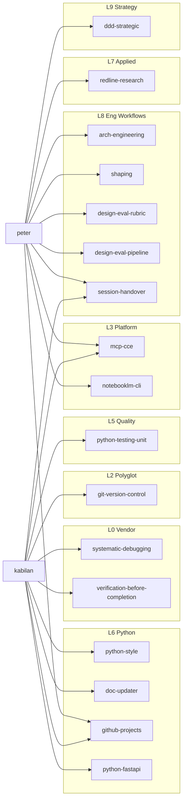
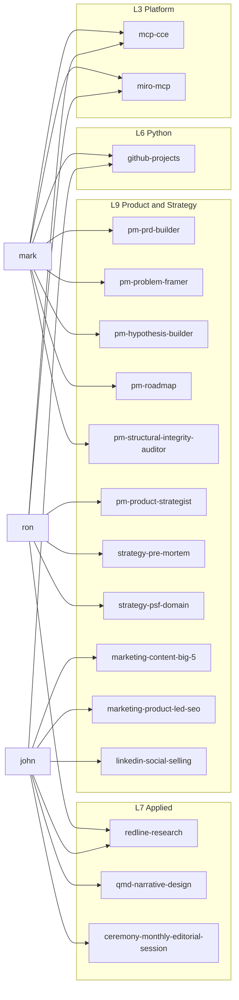
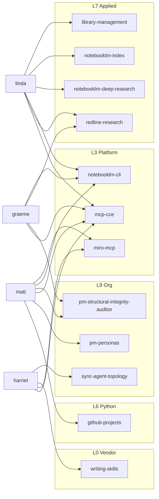

# Skills Architecture — Layered Architecture

> **SOT for layer assignments.** This document is the single authoritative source for
> skill-to-layer classification (L0-L9). The `layer` field in `skills-lock.json` is
> derived from this document via `hooks/sync-layer-to-lock.py`.
>
> For narrative context — what layers mean, why they are ordered this way, worked examples,
> and onboarding prose — see
> [docs/knowledge/software-engineering/skills-system.md](../knowledge/software-engineering/skills-system.md).

---

## Principles

### 1. Dependency Direction

A skill at layer N may reference skills at layers 0 through N. It must **never** reference a skill at layer N+1 or above.

```
Layer 6  ─────────────────────────────────────
  can reference →  Layer 5, 4, 3, 2, 1, 0

Layer 2  ─────────────────────────────────────
  can reference →  Layer 1, 0
  CANNOT reference →  Layer 3, 4, 5, 6, ...
```

### 2. Stability Gradient (lower = more stable)

Lower layers change less often. Upper layers are more volatile. Skills that change frequently belong in upper layers; stable standards and adapters belong near the foundation.

### 3. Vendor Boundary (Layer 0, immutable)

All vendor-maintained skills sit at Layer 0. They cannot reference project-owned skills — vendor updates overwrite local modifications.

| Vendor                 | Skills                                                                                                                                                                                                                                                                                                                                        |
| ---------------------- | --------------------------------------------------------------------------------------------------------------------------------------------------------------------------------------------------------------------------------------------------------------------------------------------------------------------------------------------- |
| `specify` (spec-kit) | `spec-kit`                                                                                                                                                                                                                                                                                                                                  |
| `obra/superpowers`   | `brainstorming`, `dispatching-parallel-agents`, `finishing-a-development-branch`, `receiving-code-review`, `requesting-code-review`, `subagent-driven-development`, `systematic-debugging`, `test-driven-development`, `using-git-worktrees`, `using-superpowers`, `verification-before-completion`, `writing-skills` |

### 4. Single Source of Truth (registries at the bottom)

Foundation registries (`mental-models`) define concepts once. All other skills reference
their files — never redefine concepts inline.

### 5. Polyglot Before Language-Specific

Language-agnostic skills (data-tidy, security, git-version-control, mermaid-diagrams) sit
below language-specific skills (python-*). Python skills are implementations or
customisations of polyglot concepts. If a concept applies regardless of programming
language, it belongs in a lower layer.

### 6. Deep Modules at Layer Boundaries

Each layer exposes a minimal, stable interface upward. Prefer fewer powerful skills per
layer over many shallow ones that leak implementation details.

### 7. Horizontal Independence (within a layer)

Skills within the same layer may reference each other when logically necessary. This is
not a violation. The rule applies only to **vertical** dependencies: no upward references.

### 8. Placement Rule

When placing a new skill, ask:

> *"What is the highest-numbered layer containing all the skills this skill needs to reference?"*
> Place the new skill at that layer + 1 (or at that same layer if it references nothing).

---

## Layer Map

```
┌──────────────────────────────────────────────────────────────────────┐
│  Layer 9: Product, Strategy & Organisation                           │
│  pm-* · strategy-pre-mortem · strategy-psf-domain · ddd-strategic    │
│  marketing-* · hr-hire-agent · hr-audit-agent · hr-maintain-agent-registry    │
│  ceremony-monthly-editorial-session · sync-agent-topology            │
├──────────────────────────────────────────────────────────────────────┤
│  Layer 8: Engineering Workflows                                      │
│  shaping · arch-engineering · create-adr · design-eval-rubric · design-eval-pipeline │
│  define-ai-policy · enforce-ai-batch-discipline                      │
│  doc-updater · sonarqube-quality-gate                                │
│  git-push-batched · resolving-pr-issues · skills-create              │
│  session-handover                                                     │
├──────────────────────────────────────────────────────────────────────┤
│  Layer 7: Applied Capabilities                                       │
│  eda-* · qmd-* · redline-research · notebooklm-index                 │
│  notebooklm-deep-research · library-management                       │
│  git-hooks-create                                                    │
├──────────────────────────────────────────────────────────────────────┤
│  Layer 6: Python Implementation (volatile)                           │
│  python-patterns · python-function-design · python-class-design      │
│  python-module-structure · python-domain-modeling                    │
│  python-documentation · python-error-handling · python-fastapi       │
│  python-data-ingestion · python-crewai                               │
│  python-script · python-script-numbering                             │
│  python-pins-data-version-control · python-plot-colors               │
│  github-projects                                                      │
├──────────────────────────────────────────────────────────────────────┤
│  Layer 5: Quality & Tooling                                          │
│  python-testing-unit · python-testing-api                            │
│  python-static-checks · python-deptry · python-performance           │
│  dev-environment · python-usethis                                    │
├──────────────────────────────────────────────────────────────────────┤
│  Layer 4: Core Language Standards                                    │
│  python-style · python-typing · python-linting · python-paths        │
├──────────────────────────────────────────────────────────────────────┤
│  Layer 3: Platform Integrations (external-platform adapters)         │
│  miro-mcp · notebooklm-cli · mcp-cce · python-mcp-tools              │
│  rag-prompting                                                       │
├──────────────────────────────────────────────────────────────────────┤
│  Layer 2: Language-Agnostic Standards (polyglot)                     │
│  data-tidy · security · git-version-control · mermaid-diagrams       │
├──────────────────────────────────────────────────────────────────────┤
│  Layer 1: Foundational Registries                                    │
│  mental-models                                                       │
├──────────────────────────────────────────────────────────────────────┤
│  Layer 0: Vendor Primitives (immutable)                              │
│  specify:     spec-kit                                               │
│  superpowers: brainstorming · dispatching-parallel-agents            │
│               finishing-a-development-branch · receiving-code-review │
│               requesting-code-review · subagent-driven-development   │
│               systematic-debugging · test-driven-development         │
│               using-git-worktrees · using-superpowers                │
│               verification-before-completion · writing-skills        │
└──────────────────────────────────────────────────────────────────────┘
         Dependencies flow DOWNWARD only  ↓  (upper may use lower)
```

---

## Layer Definitions

### Layer 0 — Vendor Primitives (immutable)

**Rule**: No outbound references to project-owned skills. Modifications are overwritten on
vendor update.

| Source               | Skills                                                                                                                                                                                                                                                                                                                                        |
| -------------------- | --------------------------------------------------------------------------------------------------------------------------------------------------------------------------------------------------------------------------------------------------------------------------------------------------------------------------------------------- |
| `specify`          | `spec-kit`                                                                                                                                                                                                                                                                                                                                  |
| `obra/superpowers` | `brainstorming`, `dispatching-parallel-agents`, `finishing-a-development-branch`, `receiving-code-review`, `requesting-code-review`, `subagent-driven-development`, `systematic-debugging`, `test-driven-development`, `using-git-worktrees`, `using-superpowers`, `verification-before-completion`, `writing-skills` |

---

### Layer 1 — Foundational Registries

**Rule**: No outbound references to any other skill. Pure reference registry.

| Skill             | Reason                                                                                                                                                            |
| ----------------- | ----------------------------------------------------------------------------------------------------------------------------------------------------------------- |
| `mental-models` | Single source of truth for reusable thinking frameworks. Other skills reference its files rather than defining models inline. Zero outbound references by design. |

---

### Layer 2 — Language-Agnostic Standards (polyglot)

**Rule**: May reference Layers 0-1.

| Skill                   | Scope                                                              |
| ----------------------- | ------------------------------------------------------------------ |
| `data-tidy`           | Tidy data principles (Wickham) — applies to any DataFrame library |
| `security`            | Secrets, configuration, logging — language-agnostic policy        |
| `git-version-control` | Commit conventions, hygiene — applies to any VCS workflow         |
| `mermaid-diagrams`    | Diagram syntax and selection — applies to any Markdown document   |

---

### Layer 3 — Platform Integrations (external-platform adapters)

**Rule**: May reference Layers 0-2.

**Definition**: Narrow, stable adapters to an external platform. The layer is defined by
this *role* — a thin boundary to an outside service — not by transport. A Layer 3 skill may
reach its platform via an MCP server, a CLI (e.g. `notebooklm-cli` uses the `nlm`
command), or a vendor SDK; the transport choice does not change the layer assignment.
Transport selection follows the CLI-first policy in ADR-016 (`docs/adr/adr-016-cli-first-tool-selection.md`).

| Skill | Platform | Transport |
| --- | --- | --- |
| `miro-mcp` | Miro boards | MCP server |
| `notebooklm-cli` | NotebookLM (setup, auth, config) | CLI (`nlm`) |
| `mcp-cce` | Code Context Engine | MCP server |
| `python-mcp-tools` | General MCP tooling guidance | MCP server |
| `rag-prompting` | Prompt engineering for RAG queries | n/a (technique) |

---

### Layer 4 — Core Language Standards

**Rule**: May reference Layers 0-3.

| Skill              | Scope                                                |
| ------------------ | ---------------------------------------------------- |
| `python-style`   | Formatting,`uv` usage, general Python idioms       |
| `python-typing`  | Type hint standards                                  |
| `python-linting` | Ruff/lint compliance and safe suppressions           |
| `python-paths`   | File path conventions (pathlib, importlib.resources) |

---

### Layer 5 — Quality & Tooling

**Rule**: May reference Layers 0-4.

| Group           | Skills                                                              |
| --------------- | ------------------------------------------------------------------- |
| Testing         | `python-testing-unit`, `python-testing-api`                     |
| Static analysis | `python-static-checks`, `python-deptry`, `python-performance` |
| Environment     | `dev-environment`, `python-usethis`                             |

---

### Layer 6 — Python Implementation (volatile)

**Rule**: May reference Layers 0-5.

| Group         | Skills                                                                                                |
| ------------- | ----------------------------------------------------------------------------------------------------- |
| Code design   | `python-patterns`, `python-function-design`, `python-class-design`, `python-module-structure` |
| Domain & data | `python-domain-modeling`, `python-data-ingestion`, `python-crewai`                              |
| Communication | `python-documentation`, `python-error-handling`, `python-fastapi`                                 |
| Scripts       | `python-script`, `python-script-numbering`                                                        |
| Specialised   | `python-pins-data-version-control`, `python-plot-colors`                                          |
| Board tooling | `github-projects`                                                                                 |

---

### Layer 7 — Applied Capabilities

**Rule**: May reference Layers 0-6.

| Group               | Skills                                                                         |
| ------------------- | ------------------------------------------------------------------------------ |
| EDA & visualisation | `eda-codebook`, `eda-interpreting-data`, `eda-qa`, `eda-visual-design` |
| Reporting           | `qmd-narrative-design`, `qmd-tables`                                       |
| Research            | `redline-research`, `notebooklm-index`, `notebooklm-deep-research`       |
| Infrastructure      | `git-hooks-create`, `library-management`, `branching-strategy`                 |

---

### Layer 8 — Engineering Workflows

**Rule**: May reference Layers 0-7.

| Group | Skills |
| --- | --- |
| Architecture | `shaping`, `arch-engineering`, `create-adr`, `design-eval-rubric`, `design-eval-pipeline`, `define-ai-policy`, `enforce-ai-batch-discipline` |
| Release & review | `resolving-pr-issues`, `git-push-batched`, `doc-updater`, `sonarqube-quality-gate` |
| Skill authoring | `skills-create` |
| Session discipline | `session-handover` |

---

### Layer 9 — Product, Strategy & Organisation

**Rule**: May reference Layers 0-8.

| Group | Skills |
| --- | --- |
| Product management | `pm-problem-framer`, `pm-hypothesis-builder`, `pm-personas`, `pm-roadmap`, `pm-prioritization`, `pm-decision-architect`, `pm-prd-builder`, `pm-structural-integrity-auditor` |
| Strategy | `pm-product-strategist`, `strategy-pre-mortem`, `strategy-psf-domain`, `ddd-strategic` |
| Marketing | `marketing-content-big-5`, `marketing-product-led-seo`, `linkedin-social-selling`, `marketing-ai-content-review` |
| Organisation | `sync-agent-topology`, `ceremony-monthly-editorial-session`, `hr-hire-agent`, `hr-audit-agent`, `hr-maintain-agent-registry` |

---

## Vendor Sources

- [obra/superpowers](https://github.com/obra/superpowers) — General AI agent superpowers (brainstorming, subagent-driven-development, systematic-debugging, etc.)
- [github/spec-kit](https://github.com/github/spec-kit) — Specification-driven development (spec-kit)

---

## Agent–Skill Topology

First-degree skill invocations from agent JDs (direct routing table entries only, not transitive). Updated: June 2026.

Split into three team clusters for readability. Skill nodes are labelled with their layer (L0–L9).

---

### Engineering



---

### Product and Strategy



---

### Knowledge, Domain and Org

