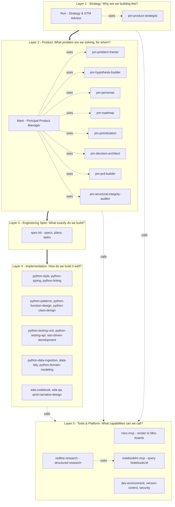

# Skills Architecture

## Who this is for

You — even if you have never written a line of Python or used GitHub Copilot before. This
document explains how Redline organises the "skills" that the AI agents use, why they are
layered the way they are, and how to know which one applies to a given task.

## What is a skill?

A **skill** is a small Markdown file that teaches the AI a single, well-defined competence.
Think of it like a recipe card pinned to a kitchen wall. The AI does not memorise the
recipe; it walks over to the wall, reads the card, and follows the steps when the situation
calls for it.

Each skill lives in its own folder at `.agents/skills/<skill-name>/SKILL.md` and answers
three questions:

1. **When should I use this?** (the trigger)
2. **When should I NOT use this?** (the guardrail)
3. **How do I do it?** (the steps)

We currently have around 60 skills. Without organisation, the AI would have to read all of
them every time you ask a question. So we layer them.

## The five layers

Redline's skills sit in a five-layer stack. Each layer answers a different kind of question
and hands off to the layer below it.

The thick arrows are the **handoff chain** — work flows downward, and each layer must be
satisfied before the next can begin. The dotted arrows are **tool calls** — any layer can
reach into Layer 5 to use a platform capability without changing layer.

## Reading the layers in plain English

### Layer 1 — Strategy

Ron answers questions like *"Should we build this at all?"*, *"Who is this for, in market
terms?"*, *"What is the bet we are making?"*. He produces strategic bets, OKRs, positioning
documents, and GTM plans. He never writes code. He hands off to Mark.

### Layer 2 — Product

Mark turns Ron's bets into something a team can actually build. He frames problems,
identifies personas, prioritises features, and writes the Product Requirements Document
(PRD) that tells engineering what to build and why. He never writes code either. He hands
off to spec-kit.

### Layer 3 — Engineering spec

spec-kit takes Mark's PRD and breaks it into a formal specification, an implementation
plan, and a task list. This is where words become acceptance criteria. It is the bridge
between product and code.

### Layer 4 — Implementation

These are the rules that govern *how* code is written: style, types, tests, error handling,
data modelling, reporting. They activate whenever someone is actually editing Python files.

### Layer 5 — Tools & platform

These are not about *what* to build; they are about *what tools you can use* while building.
Miro for visual artifacts, NotebookLM for research, Git for version control, the dev
environment itself. Any layer above can reach into this layer.

## A worked example: the trip from idea to code

Suppose you say: *"I want users to be able to export their reports as PDF."*

| Step | Layer | What happens |
|---|---|---|
| 1 | L1 — Ron | "Does this map to one of our strategic bets? If yes, which one? If no, stop and revisit." |
| 2 | L2 — Mark | "Who exactly wants PDF export? (loads `pm-personas`) What problem does it solve? (loads `pm-problem-framer`) Is this top of the list? (loads `pm-prioritization`) Write the PRD. (loads `pm-prd-builder`)" |
| 3 | L3 — spec-kit | "Turn the PRD into a spec with acceptance scenarios, a plan, and a task list." |
| 4 | L4 — implementation | "Write the code following `python-style`, `python-function-design`, and `python-testing-unit`." |
| 5 | L5 — tools | At any point, the team can use `miro-mcp` to draft a roadmap, `redline-research` to look up prior decisions, or `version-control` to commit work. |

Skipping a layer is the most common failure mode. A PRD without a strategic bet (skipping
L1) produces work nobody wanted. A spec without a PRD (skipping L2) produces a feature the
team cannot explain. Code without a spec (skipping L3) produces something that works but
solves the wrong problem.

## Two RICE skills, two altitudes — why we did not merge them

You will notice two skills that both mention RICE prioritization:

- `pm-prioritization` (Layer 2) — ranks **initiatives across the portfolio**. Should we
  build the PDF exporter, or the new dashboard, or the integration with Salesforce?
- `spec-kit` (Layer 3) — ranks **acceptance scenarios within a single spec**. Inside the
  PDF exporter spec, which scenarios do we ship in v1 and which in v2?

These are different decisions made by different people at different times. Merging them
would force the engineering team to import portfolio-level concerns into every spec, and
force product to think about acceptance scenarios when ranking initiatives. We keep them
separate on purpose.

## Two media for artifacts — Markdown and Miro

Some artifacts are best as text, others as visual layouts. The split is codified in the
"Visual Artifacts Policy" section of `AGENTS.md`. Short version:

- **Markdown wins** for narrative, decisions, and version-controlled records: PRDs,
  strategic bets, OKRs, positioning, decision logs, hypotheses.
- **Miro wins** for spatial and relational artifacts: roadmaps, opportunity solution trees,
  story maps, journey maps, prioritization matrices.
- **Hybrid** for personas: Miro to draft collaboratively, Markdown as the canonical
  reference once stable.

Miro is rendered via the `miro-mcp` skill in Layer 5. Skills in Layers 1 and 2 declare
which medium they own; `miro-mcp` is the rendering tool, not the decision-maker.

## What about the named agents (Mark and Ron)?

Mark and Ron are not skills. They are **personas** — addressable identities you invoke by
name ("Mark, ..." or "Ron, ..."). Each persona has a routing table that tells it which
skills to load when. Think of them as the chefs who know which recipe cards to pick off
the wall.

The persona files live in `.github/agents/<name>.agent.md` and are governed by the same
handoff rules described above.

## How to find the right skill yourself

If you are scoping a piece of work and want to know which skill applies:

1. **Identify the layer** using the questions above (strategy / product / spec / code / tool).
2. **Open the index in `AGENTS.md`** — every skill is listed under its layer with a
   one-line description.
3. **Read the skill's `description:` line** — it starts with "Use when..." and tells you
   the trigger. If your situation matches the trigger, the skill applies.
4. **Read the "When NOT to Use" section** — this is often where you discover you are
   reaching for the wrong skill.

If a skill is missing for a real, recurring need, that is a gap worth raising. New skills
are created by following the `skills-create` skill (which is itself a skill — yes, the
system is recursive).

## References

- `AGENTS.md` — the canonical index of every skill and persona.
- `.agents/skills/writing-skills/SKILL.md` — how skills are authored and tested.
- `.agents/skills/skills-create/SKILL.md` — checklist for adding a new skill.
- `.github/agents/mark.agent.md` and `.github/agents/ron.agent.md` — the two personas.
