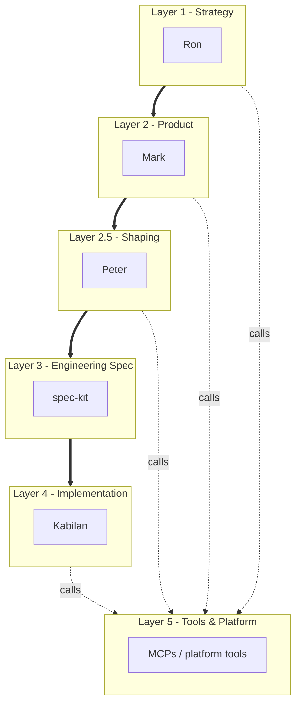

# Skills Architecture — Handoff Chain

> **Handoff chain reference.** This document describes the execution flow: who hands work
> to whom, in what sequence, and why skipping a layer is a defect.
>
> For the full layer map (which skills live at which layer) and dependency rules, see
> [skills-taxonomy.md](skills-taxonomy.md).
>
> For narrative context, onboarding prose, and worked examples, see
> [docs/knowledge/software-engineering/skills-system.md](../knowledge/software-engineering/skills-system.md).

## The six layers

Redline's skills sit in a six-layer stack. Each layer answers a different kind of question
and hands off to the layer below it.

The thick arrows are the **handoff chain** — work flows downward, and each layer must be
satisfied before the next can begin. The dotted arrows are **tool calls** — any layer can
reach into Layer 5 to use a platform capability without changing layer.

## Reading the layers in plain English

### Layer 1 — Strategy

Ron answers questions like *"Should we build this at all?"*, *"Who is this for, in market
terms?"*, *"What is the bet we are making?"*. He produces strategic bets, OKRs, positioning
documents, and GTM plans. He never writes code. He hands off to Mark.

### Layer 2 — Product

Mark turns Ron's bets into something a team can actually build. He frames problems,
identifies personas, prioritises features, and writes the Product Requirements Document
(PRD) that tells engineering what to build and why. He never writes code either. He hands
off to Peter for shaping.

### Layer 2.5 — Shaping

Peter takes Mark's PRD and shapes it into a Pitch: rough scope boundaries, rabbit holes
removed, technical risks triaged. The Pitch uses breadboard-level abstraction — components
and connections, no visual design. Mark sets the business appetite; Peter sets the technical
appetite. The Pitch is the handoff to spec-kit.

This layer sits between Product (L2) and Engineering Spec (L3) because shaping translates
product intent into buildable scope.

### Layer 3 — Engineering spec

spec-kit takes Mark's PRD and Peter's shaped Pitch and breaks them into a formal specification,
an implementation plan, and a task list. This is where words become acceptance criteria.
It is the bridge between product and code.

### Layer 4 — Implementation

These are the rules that govern *how* code is written: style, types, tests, error handling,
data modelling, reporting. They activate whenever someone is actually editing Python files.
For the full skill list at this layer, see [skills-taxonomy.md](skills-taxonomy.md).

### Layer 5 — Tools & platform

These are not about *what* to build; they are about *what tools you can use* while building.
Miro for visual artifacts, NotebookLM for research, Git for version control, the dev
environment itself. Any layer above can reach into this layer.

## Two RICE skills, two altitudes — why we did not merge them

You will notice two skills that both mention RICE prioritization:

- `pm-prioritization` (Layer 2) — ranks **initiatives across the portfolio**. Should we
  build the PDF exporter, or the new dashboard, or the integration with Salesforce?
- `spec-kit` (Layer 3) — ranks **acceptance scenarios within a single spec**. Inside the
  PDF exporter spec, which scenarios do we ship in v1 and which in v2?

These are different decisions made by different people at different times. Merging them
would force the engineering team to import portfolio-level concerns into every spec, and
force product to think about acceptance scenarios when ranking initiatives. We keep them
separate on purpose.

## Two media for artifacts — Markdown and Miro

Some artifacts are best as text, others as visual layouts. The split is codified in the
"Visual Artifacts Policy" section of `AGENTS.md`. Short version:

- **Markdown wins** for narrative, decisions, and version-controlled records: PRDs,
  strategic bets, OKRs, positioning, decision logs, hypotheses.
- **Miro wins** for spatial and relational artifacts: roadmaps, opportunity solution trees,
  story maps, journey maps, prioritization matrices.
- **Hybrid** for personas: Miro to draft collaboratively, Markdown as the canonical
  reference once stable.

Miro is rendered via the `miro-mcp` skill in Layer 5. Skills in Layers 1 and 2 declare
which medium they own; `miro-mcp` is the rendering tool, not the decision-maker.

## What about the named agents (Mark and Ron)?

Mark, Ron, Peter, and Matt are not skills. They are **personas** --- addressable identities you invoke by
name ("Mark, ...", "Ron, ...", or "Peter, ..."). Each persona has a routing table that tells it which
skills to load when. Think of them as the chefs who know which recipe cards to pick off
the wall.

The persona files live in `.github/agents/<name>.agent.md` and are governed by the same
handoff rules described above.

## How to find the right skill yourself

If you are scoping a piece of work and want to know which skill applies:

1. **Identify the layer** using the questions above (strategy / product / spec / code / tool).
2. **Open the index in `AGENTS.md`** — every skill is listed under its layer with a
   one-line description.
3. **Read the skill's `description:` line** — it starts with "Use when..." and tells you
   the trigger. If your situation matches the trigger, the skill applies.
4. **Read the "When NOT to Use" section** — this is often where you discover you are
   reaching for the wrong skill.

If a skill is missing for a real, recurring need, that is a gap worth raising. New skills
are created by following the `skills-create` skill (which is itself a skill — yes, the
system is recursive).

## References

- `AGENTS.md` — the canonical index of every skill and persona.
- `.agents/skills/writing-skills/SKILL.md` — how skills are authored and tested.
- `.agents/skills/skills-create/SKILL.md` — checklist for adding a new skill.
- `.github/agents/rl.mark.agent.md`, `.github/agents/rl.ron.agent.md`, and `.github/agents/rl.peter.agent.md` --- the personas.
