# Skills Taxonomy & Layered Architecture

## Who this is for

Anyone adding a new skill, placing an existing skill in context, or deciding whether a
skill may reference another. This document establishes the **taxonomy** (classification of
all skills by layer) and the **architectural rules** that govern reference direction.

---

## What this is NOT

This document does not describe the **handoff chain** (who hands work to whom in
execution). That chain — Ron → Mark → Peter → spec-kit → Kabilan — is documented in
[skills-architecture.md](skills-architecture.md). Handoff direction and dependency direction
are separate concerns.

The handoff chain answers: *"Who gives work to whom?"*
The taxonomy answers: *"Which skills may a skill reference?"*

---

## Principles

### 1. Dependency Direction (the import rule)

A skill at layer N may reference skills at layers 0 through N. It must **never** reference
a skill at layer N+1 or above.

This mirrors the Python import rule: a module in a lower layer must not import from a layer
above it. For skills, "import" means "reference" — invoking, loading, or pointing to
another skill as a prerequisite or cross-reference.

```
Layer 6  ─────────────────────────────────────
  can reference →  Layer 5, 4, 3, 2, 1, 0

Layer 2  ─────────────────────────────────────
  can reference →  Layer 1, 0
  CANNOT reference →  Layer 3, 4, 5, 6, ...
```

### 2. Stability Gradient (lower = more stable)

Lower layers change less often. Upper layers are more volatile and application-specific.
A change to a foundational skill (Layer 0) affects everything above it, so foundational
skills must be conservative. A change to a Python implementation pattern (Layer 6) affects
only its own callers.

Mental model: **Reversible vs Irreversible** (`mental-models/strategic_decisions/reversible-vs-irreversible.md`).
Changes to lower layers are harder to reverse because the blast radius is larger.

*Corollary*: skills that change frequently as defects are found (implementation patterns,
coding guidance) belong in upper layers, not lower ones. Platform adapters and standards
that rarely change belong near the foundation.

### 3. Vendor Boundary (Layer 0, immutable)

All vendor-maintained skills sit at Layer 0. They cannot reference project-owned skills
because vendor updates overwrite local modifications. Two vendor sources exist today:

| Vendor | Skills |
|---|---|
| `specify` (spec-kit) | `spec-kit` |
| `obra/superpowers` | `brainstorming`, `dispatching-parallel-agents`, `finishing-a-development-branch`, `receiving-code-review`, `requesting-code-review`, `subagent-driven-development`, `systematic-debugging`, `test-driven-development`, `using-git-worktrees`, `using-superpowers`, `verification-before-completion`, `writing-skills` |

Rule: *Don't depend on what you can't control* (Dependency Inversion Principle, sourced
from AI System Engineering notebook).

### 4. Single Source of Truth (registries at the bottom)

Foundation registries (`mental-models`) define concepts once. Other skills reference their
files rather than redefining concepts inline. This applies ADR-001 (single source of truth)
to the skill layer: definitions live in one place and callers point to them.

Anti-pattern: embedding a mental model definition inline in a skill rather than
referencing `mental-models/`. Each inline definition is a fork that drifts.

### 5. Polyglot Before Language-Specific

Language-agnostic skills (data-tidy, security, version-control, mermaid-diagrams) sit
below language-specific skills (python-*). Python skills are implementations or
customisations of polyglot concepts. If a concept applies regardless of programming
language, it belongs in a lower layer.

### 6. Deep Modules at Layer Boundaries

Each layer should expose a minimal, stable interface upward. Prefer a small number of
powerful, information-hiding skills in a layer over many shallow skills that leak
implementation details.

Mental model: **Deep Modules** (`mental-models/general_thinking/deep-modules.md`).

### 7. Horizontal Independence (within a layer)

Skills within the same layer may reference each other when logically necessary. This is
not a violation. The rule applies only to **vertical** dependencies: no upward references.

### 8. Placement Rule

When placing a new skill, ask:
> *"What is the highest-numbered layer containing all the skills this skill needs to reference?"*
> Place the new skill at that layer + 1 (or at that same layer if it references nothing).

---

## Layer Map

```
┌──────────────────────────────────────────────────────────────────────┐
│  Layer 9: Product, Strategy & Organisation                           │
│  pm-* · strategy-pre-mortem · strategy-psf-domain · ddd-strategic   │
│  marketing-* · hiring-agent-management · ceremony-*                  │
├──────────────────────────────────────────────────────────────────────┤
│  Layer 8: Engineering Workflows                                      │
│  shaping · engineering-architecture · evaluation-architecture        │
│  ai-acceptable-use-policy · doc-updater · git-push-batched           │
│  resolving-pr-issues                                                 │
├──────────────────────────────────────────────────────────────────────┤
│  Layer 7: Applied Capabilities                                       │
│  eda-* · qmd-* · redline-research · notebooklm-index                │
│  notebooklm-deep-research · library-management                       │
│  pre-commit-hooks-create                                             │
├──────────────────────────────────────────────────────────────────────┤
│  Layer 6: Python Implementation (volatile)                           │
│  python-patterns · python-function-design · python-class-design      │
│  python-module-structure · python-domain-modeling                    │
│  python-documentation · python-error-handling                        │
│  python-data-ingestion · python-crewai                               │
│  python-script · python-script-numbering                             │
│  python-pins-data-version-control · python-plot-colors               │
├──────────────────────────────────────────────────────────────────────┤
│  Layer 5: Quality & Tooling                                          │
│  python-testing-unit · python-testing-api                            │
│  python-static-checks · python-deptry · python-performance           │
│  dev-environment · python-usethis                                    │
├──────────────────────────────────────────────────────────────────────┤
│  Layer 4: Core Language Standards                                    │
│  python-style · python-typing · python-linting · python-paths        │
├──────────────────────────────────────────────────────────────────────┤
│  Layer 3: Platform Integrations (MCPs)                               │
│  miro-mcp · notebooklm-mcp · cce-mcp · python-mcp-tools             │
│  rag-prompting                                                       │
├──────────────────────────────────────────────────────────────────────┤
│  Layer 2: Language-Agnostic Standards (polyglot)                     │
│  data-tidy · security · version-control · mermaid-diagrams           │
├──────────────────────────────────────────────────────────────────────┤
│  Layer 1: Foundational Registries                                    │
│  mental-models                                                       │
├──────────────────────────────────────────────────────────────────────┤
│  Layer 0: Vendor Primitives (immutable)                              │
│  specify:     spec-kit                                               │
│  superpowers: brainstorming · dispatching-parallel-agents            │
│               finishing-a-development-branch · receiving-code-review │
│               requesting-code-review · subagent-driven-development   │
│               systematic-debugging · test-driven-development         │
│               using-git-worktrees · using-superpowers                │
│               verification-before-completion · writing-skills        │
└──────────────────────────────────────────────────────────────────────┘
         Dependencies flow DOWNWARD only  ↓  (upper may use lower)
```

---

## Mermaid Diagram

```mermaid
flowchart TD
    subgraph L0["Layer 0 - Vendor Primitives (immutable)"]
        SK["spec-kit (specify)"]
        SP["obra/superpowers: brainstorming,\ndispatching-parallel-agents,\nfinishing-a-development-branch,\nreceiving-code-review,\nrequesting-code-review,\nsubagent-driven-development,\nsystematic-debugging,\ntest-driven-development,\nusing-git-worktrees,\nusing-superpowers,\nverification-before-completion,\nwriting-skills"]
    end

    subgraph L1["Layer 1 - Foundational Registries"]
        MM[mental-models]
    end

    subgraph L2["Layer 2 - Language-Agnostic Standards"]
        DT[data-tidy]
        SEC[security]
        VC[version-control]
        MRD[mermaid-diagrams]
    end

    subgraph L3["Layer 3 - Platform Integrations"]
        MCP["miro-mcp / notebooklm-mcp / cce-mcp"]
        RAG["rag-prompting / python-mcp-tools"]
    end

    subgraph L4["Layer 4 - Core Language Standards"]
        PS["python-style / python-typing\npython-linting / python-paths"]
    end

    subgraph L5["Layer 5 - Quality and Tooling"]
        PT["python-testing-unit / python-testing-api"]
        PSC["python-static-checks / python-deptry\npython-performance"]
        DE["dev-environment / python-usethis"]
    end

    subgraph L6["Layer 6 - Python Implementation"]
        PP["python-patterns / function-design\nclass-design / module-structure"]
        PD["python-domain-modeling / data-ingestion\npython-crewai"]
        PDOC["python-documentation / error-handling"]
        PSCR["python-script / script-numbering\npins / plot-colors"]
    end

    subgraph L7["Layer 7 - Applied Capabilities"]
        EDA["eda-codebook / eda-interpreting-data\neda-qa / eda-visual-design"]
        QMD["qmd-narrative-design / qmd-tables"]
        RES["redline-research / notebooklm-index\nnotebooklm-deep-research"]
        LIB["library-management\npre-commit-hooks-create"]
    end

    subgraph L8["Layer 8 - Engineering Workflows"]
        SHP["shaping / engineering-architecture\nevaluation-architecture\nai-acceptable-use-policy"]
        REV["resolving-pr-issues / git-push-batched\ndoc-updater"]
    end

    subgraph L9["Layer 9 - Product, Strategy and Organisation"]
        PM["pm-problem-framer / pm-prd-builder\npm-hypothesis-builder / ddd-strategic"]
        STR["strategy-pre-mortem\nstrategy-psf-domain\npm-product-strategist"]
        MKT["marketing-content-big-5 / marketing-social-selling\nhiring-agent-management\nceremony-agent-topology-sync"]
    end

    L1 --> L0
    L2 --> L1
    L3 --> L2
    L4 --> L2
    L4 --> L3
    L5 --> L4
    L5 --> L3
    L6 --> L5
    L6 --> L4
    L6 --> L3
    L7 --> L6
    L7 --> L3
    L8 --> L7
    L8 --> L5
    L9 --> L8
    L9 --> L7
    L9 --> L3
```



> **Reading the arrows**: an arrow from Layer N to Layer M means skills in Layer N may
> reference skills in Layer M. Arrows point **down** toward the foundation. No arrow points
> upward — that is the invariant this architecture enforces.

---

## Layer Definitions

### Layer 0 — Vendor Primitives (immutable)

**Rule**: No outbound references to project-owned skills. Modifications are overwritten on
vendor update.

| Source | Skills |
|---|---|
| `specify` | `spec-kit` |
| `obra/superpowers` | `brainstorming`, `dispatching-parallel-agents`, `finishing-a-development-branch`, `receiving-code-review`, `requesting-code-review`, `subagent-driven-development`, `systematic-debugging`, `test-driven-development`, `using-git-worktrees`, `using-superpowers`, `verification-before-completion`, `writing-skills` |

---

### Layer 1 — Foundational Registries

**Rule**: No outbound references to any other skill. Pure reference registry.

| Skill | Reason |
|---|---|
| `mental-models` | Single source of truth for reusable thinking frameworks. Other skills reference its files rather than defining models inline. Zero outbound references by design. |

---

### Layer 2 — Language-Agnostic Standards (polyglot)

**Rule**: May reference Layers 0-1.

Standards that apply regardless of programming language. Python-specific skills in Layer 4+
are implementations or customisations of these polyglot concepts.

| Skill | Scope |
|---|---|
| `data-tidy` | Tidy data principles (Wickham) — applies to any DataFrame library |
| `security` | Secrets, configuration, logging — language-agnostic policy |
| `version-control` | Commit conventions, hygiene — applies to any VCS workflow |
| `mermaid-diagrams` | Diagram syntax and selection — applies to any Markdown document |

---

### Layer 3 — Platform Integrations (MCPs)

**Rule**: May reference Layers 0-2.

Narrow adapters connecting the project to external platforms. Stable, rarely changing.
Skills above this layer use MCPs to perform work; MCPs themselves know nothing about how
they are used.

| Skill | Platform |
|---|---|
| `miro-mcp` | Miro boards |
| `notebooklm-mcp` | NotebookLM (setup, auth, config) |
| `cce-mcp` | Code Context Engine |
| `python-mcp-tools` | General MCP tooling guidance |
| `rag-prompting` | Prompt engineering for RAG queries |

---

### Layer 4 — Core Language Standards

**Rule**: May reference Layers 0-3.

Stable Python conventions that change infrequently. These define the baseline coding style
that all Python skills assume. They sit above polyglot standards (Layer 2) because they
are Python-specific implementations of those language-agnostic principles.

| Skill | Scope |
|---|---|
| `python-style` | Formatting, `uv` usage, general Python idioms |
| `python-typing` | Type hint standards |
| `python-linting` | Ruff/lint compliance and safe suppressions |
| `python-paths` | File path conventions (pathlib, importlib.resources) |

---

### Layer 5 — Quality & Tooling

**Rule**: May reference Layers 0-4.

Skills that verify, check, or install. Testing and static analysis depend on core language
standards (Layer 4) and MCPs (Layer 3), but not on implementation patterns (Layer 6).
Implementation patterns reference quality skills — not the other way around.

| Group | Skills |
|---|---|
| Testing | `python-testing-unit`, `python-testing-api` |
| Static analysis | `python-static-checks`, `python-deptry`, `python-performance` |
| Environment | `dev-environment`, `python-usethis` |

---

### Layer 6 — Python Implementation (volatile)

**Rule**: May reference Layers 0-5.

The most volatile Python layer. These skills define how to write functions, classes,
modules, and domain models. They change frequently as defects are discovered in coding
workflows. They reference quality tools (Layer 5), MCPs (Layer 3), and core standards
(Layer 4) to do their work.

| Group | Skills |
|---|---|
| Code design | `python-patterns`, `python-function-design`, `python-class-design`, `python-module-structure` |
| Domain & data | `python-domain-modeling`, `python-data-ingestion`, `python-crewai` |
| Communication | `python-documentation`, `python-error-handling` |
| Scripts | `python-script`, `python-script-numbering` |
| Specialised | `python-pins-data-version-control`, `python-plot-colors` |

---

### Layer 7 — Applied Capabilities

**Rule**: May reference Layers 0-6.

Compound domain-specific workflows that combine Python implementation, MCPs, and quality
tools into coherent capabilities. EDA workflows use plotting (Layer 6), testing (Layer 5),
and MCPs (Layer 3). Research workflows use `notebooklm-mcp` (Layer 3) and
`rag-prompting` (Layer 3).

| Group | Skills |
|---|---|
| EDA & visualisation | `eda-codebook`, `eda-interpreting-data`, `eda-qa`, `eda-visual-design` |
| Reporting | `qmd-narrative-design`, `qmd-tables` |
| Research | `redline-research`, `notebooklm-index`, `notebooklm-deep-research` |
| Infrastructure | `pre-commit-hooks-create`, `library-management` |

---

### Layer 8 — Engineering Workflows

**Rule**: May reference Layers 0-7.

End-to-end engineering processes: shaping, architecture governance, code review, and
release workflows. Combines applied capabilities (Layer 7), quality tools (Layer 5), and
platform integrations (Layer 3) into repeatable engineering ceremonies.

| Group | Skills |
|---|---|
| Architecture | `shaping`, `engineering-architecture`, `evaluation-architecture`, `ai-acceptable-use-policy` |
| Release & review | `resolving-pr-issues`, `git-push-batched`, `doc-updater` |

---

### Layer 9 — Product, Strategy & Organisation

**Rule**: May reference Layers 0-8.

Highest abstraction. Agent-level skills used by named personas (Ron, Mark, John, Matt,
Peter, Harriet). These reference research (Layer 7), MCPs (Layer 3), and engineering
workflows (Layer 8) to produce strategic and product artifacts. Most volatile in terms
of business context.

| Group | Skills |
|---|---|
| Product management | `pm-problem-framer`, `pm-hypothesis-builder`, `pm-personas`, `pm-roadmap`, `pm-prioritization`, `pm-decision-architect`, `pm-prd-builder`, `pm-structural-integrity-auditor` |
| Strategy | `pm-product-strategist`, `strategy-pre-mortem`, `strategy-psf-domain`, `ddd-strategic` |
| Marketing | `marketing-content-big-5`, `marketing-product-led-seo`, `marketing-social-selling-linkedin`, `marketing-ai-content-review` |
| Organisation | `hiring-agent-management`, `ceremony-agent-topology-sync`, `ceremony-monthly-editorial-session` |

---

## Taxonomy vs Handoff Chain

These are two different views of the same skill set.

| Dimension | Handoff Chain | Taxonomy / Layered Architecture |
|---|---|---|
| Question answered | Who gives work to whom? | Which skills may a skill reference? |
| Direction | Top-down (strategy → code) | Bottom-up (code ← strategy) |
| Primary constraint | Execution order | Reference direction |
| Governed by | `skills-architecture.md` | This document |
| Analogy | Org chart (reporting lines) | Module graph (import lines) |

A product manager (Layer 9) **receives** work from strategy (higher in the handoff chain)
but **references** lower-layer skills (mental models, platform integrations) to do that
work. The handoff chain flows from strategy down to implementation; skill dependencies flow
from orchestration down to primitives.

---

## Enforcement

A skill violates the taxonomy if its `SKILL.md` contains a reference to (or prerequisite
of) a skill in a higher layer. Examples:

| Violation | Why it breaks |
|---|---|
| `python-linting` (L4) references `python-patterns` (L6) | Core standard referencing volatile implementation pattern |
| `mental-models` (L1) references any other skill | Foundational registry must have zero outbound references |
| `spec-kit` (L0) references a project-owned skill | Vendor skill cannot reference project skills |
| `notebooklm-mcp` (L3) references `redline-research` (L7) | Platform adapter referencing an applied capability |

Verification: when adding a cross-skill reference, check the layer of both skills.
If the referenced skill is in a higher layer than the referencing skill, stop and either:
- Move the referenced skill to a lower layer, or
- Extract the shared concept into an existing lower-layer skill.

---

## Design Record: Why This Ordering?

### Mistakes corrected from v1

The first version of this taxonomy cargo-culted the onion architecture from software (domain
core at center, infrastructure outside) and applied it to skills without verifying the
causal mechanism.

| v1 error | Root cause | Correction |
|---|---|---|
| Python implementation patterns at Layer 2 (low) | Assumed code patterns are stable like domain models — they are not; they change as defects are found | Moved to Layer 6 (high, volatile) |
| Quality & tooling above implementation patterns | Assumed tests depend on patterns — actually patterns reference tests | Inverted: Quality (L5) below Implementation (L6) |
| Only `spec-kit` identified as vendor | Missed 12 skills from `obra/superpowers` | All vendor skills at Layer 0 |
| Language-agnostic and Python-specific mixed in same layer | No polyglot principle | Separated: polyglot at Layer 2, Python at Layer 4+ |
| MCPs placed above quality/tooling | Assumed platform adapters are volatile — they are not; they are narrow and stable | MCPs at Layer 3, below quality |

Mental models that would have prevented these errors:
- **Cargo Cult** (`mental-models/root_cause_analysis/cargo-cult.md`) — reproducing the form
  of onion architecture without verifying the causal mechanism (reference direction) applies
  to skills
- **First Principles** (`mental-models/general_thinking/first-principles.md`) — should have
  started from "which skill actually references which" and built layers from observed
  dependencies, not from analogy to software architecture

---

## References

- [skills-architecture.md](skills-architecture.md) — handoff chain and persona routing
- `mental-models/general_thinking/deep-modules.md` — module depth principle applied to layer cohesion
- `mental-models/general_thinking/systems-thinking.md` — evaluating blast radius of changes to lower layers
- `mental-models/strategic_decisions/reversible-vs-irreversible.md` — changes to lower layers are harder to reverse
- `mental-models/root_cause_analysis/cargo-cult.md` — guard against copying architecture patterns without verifying fit
- `mental-models/general_thinking/first-principles.md` — build from observed dependencies, not analogies
- ADR-001 — single source of truth (motivation for `mental-models` as Layer 1 registry)
- AI System Engineering notebook — Onion Architecture, Dependency Inversion Principle, vendor lock-in mitigation
