# Current Process: Engineering Report Drafting

> **Audience**: New hires, process analysts, and automation engineers.
> This document maps the end-to-end process of producing a geotechnical
> (or other engineering) report -- from contractual kickoff to client issuance.
> It is written for the uninitiated: every step, entity, and handoff is explicit.

---

## Table of Contents

1. [Entities and Systems](#1-entities-and-systems)
2. [Process Overview](#2-process-overview)
3. [Phase 1 -- Contract and RFP Extraction](#3-phase-1----contract-and-rfp-extraction)
4. [Phase 2 -- Project Setup and Skeleton Creation](#4-phase-2----project-setup-and-skeleton-creation)
5. [Phase 3 -- Fieldwork and Data Collection](#5-phase-3----fieldwork-and-data-collection)
6. [Phase 4 -- Drafting the Report (Skeleton to Draft)](#6-phase-4----drafting-the-report-skeleton-to-draft)
7. [Phase 5 -- Self-Check and Technical Review](#7-phase-5----self-check-and-technical-review)
8. [Phase 6 -- Oversight Review and Sign-Off](#8-phase-6----oversight-review-and-sign-off)
9. [Phase 7 -- Issuance and Post-Report Actions](#9-phase-7----issuance-and-post-report-actions)
10. [Sequence Diagram](#10-sequence-diagram)
11. [Gaps in the Current Process](#11-gaps-in-the-current-process)
12. [Risks](#12-risks)
13. [Automation Potential](#13-automation-potential)
14. [Glossary](#14-glossary)

---

## 1. Entities and Systems

### Key Roles

| Abbreviation          | Role                                              | Responsibility                                                                                                           |
| --------------------- | ------------------------------------------------- | ------------------------------------------------------------------------------------------------------------------------ |
| **PM**          | Project Manager                                   | Owns the project commercially and operationally. Deconstructs the brief, writes the LOE, manages schedule and budget.    |
| **PD**          | Project Director                                  | Senior oversight. Acts as "client proxy" -- ensures the deliverable answers the brief and manages legal/commercial risk. |
| **TR**          | Technical Reviewer                                | Specialist engineer who interrogates methodology, calculations, and analytical models.                                   |
| **Author**      | Geotechnical Engineer                             | Drafts the report: builds the skeleton, populates content, runs analyses.                                                |
| **Drafter**     | CAD Technician                                    | Produces technical drawings (cross-sections, site plans) in AutoCAD / Civil 3D.                                          |
| **BIS / PC**    | Business Integrated Services / Project Controller | Handles formatting, template compliance, document naming, and final packaging.                                           |
| **Bid Advisor** | Proposal Support                                  | Assists PM in deconstructing the RFP and pricing the work.                                                               |
| **Client**      | External                                          | Issues the RFP, signs the LOE, receives the report.                                                                      |

### Key Documents

| Document                                         | Purpose                                                                           |
| ------------------------------------------------ | --------------------------------------------------------------------------------- |
| **RFP / Client Brief**                     | Defines scope, deliverables, timeframes, and terms from the client's perspective. |
| **LOE (Letter of Engagement)**             | The contract: Scope, Fee, Programme, Terms & Conditions.                          |
| **PMP (Project Management Plan)**          | Internal plan: WBS, schedule, resource allocation, risk register.                 |
| **GFR (Geotechnical Factual Report)**      | Objective record of all field and lab data -- no interpretation.                  |
| **GIR (Geotechnical Interpretive Report)** | Engineering interpretation, design parameters, recommendations.                   |
| **Style Reference Guide**                  | Corporate formatting rules (fonts, headings, numbering, referencing).             |
| **QA Sign-off Forms**                      | Checklists for each review gate (author self-check, drafting QA, TR, PD).         |

### Key Systems

| System                                | Function                                                                                                |
| ------------------------------------- | ------------------------------------------------------------------------------------------------------- |
| **Deltek Vantagepoint**         | Project tracking, financial management, resourcing, PMP workflows, Risk Assessment Task (RAT).          |
| **Word Template Platform**      | Standardised document generation: auto-populates corporate styles, logos, legal boilerplate.            |
| **SharePoint / Synergy**        | Document control, version management, QA record storage.                                                |
| **Company AI Hub**              | Enterprise-licensed LLM access (ChatGPT, Gemini, Polymath prompts) for rewording, summarising, grammar. |
| **AutoCAD / Civil 3D**          | Technical drawings (site plans, cross-sections, cut/fill).                                              |
| **12d Model**                   | Digital terrain analysis, geometric alignment.                                                          |
| **Leapfrog**                    | 3D geological and hydrogeological visualisation.                                                        |
| **GeoStudio (Slope/W, Seep/W)** | Limit equilibrium slope stability, seepage analysis.                                                    |
| **PLAXIS**                      | Finite element geotechnical modelling.                                                                  |
| **ArcGIS / QGIS**               | Spatial mapping and geomorphological overlays.                                                          |
| **Revizto**                     | 3D design viewer for QA tracking and Detailed Design workshops.                                         |
| **ProjectOrbit**                | Digital risk management solution offered to clients.                                                    |

---

## 2. Process Overview

The report lifecycle has **seven phases**:

```
Contract & RFP --> Project Setup & Skeleton --> Fieldwork & Data -->
Drafting (Skeleton to Draft) --> Self-Check & Technical Review -->
Oversight & Sign-Off --> Issuance & Archiving
```

Each phase has defined inputs, actors, outputs, and quality gates.
The process is **linear but iterative** -- review findings can push the
report back to earlier phases.

---

## 3. Phase 1 -- Contract and RFP Extraction

**Goal**: Transform the client's request into an agreed contract so work
can officially begin.

### Steps

1. **Deconstruct the Brief**

   - The PM and Bid Advisor deconstruct the client's RFP.
   - They identify: project scope, client drivers, "hot buttons",
     deliverables, timeframes, and contractual terms.
2. **Handle Client-Supplied Information**

   - If the client provides third-party data (e.g., prior site investigations),
     the team must explicitly state in the proposal whether that data will be:
     - Independently verified, or
     - Relied upon as presumed accurate (with risk/variation consequences noted).
3. **Draft the LOE / Contract**

   - The PM opens the LOE template in the **Word Template Platform**.
   - The Word Template Platform auto-populates corporate branding, standard terms, and
     legal boilerplate.
   - The PM fills in: Scope, Fee, Programme, Terms & Conditions.
4. **Internal Review and Issue**

   - The proposal is internally reviewed (typically by the PD).
   - Once approved internally, the proposal is sent to the client.
5. **Instruction to Proceed**

   - The client signs and returns the LOE.
   - The PM updates Deltek: project status changes from "Promotional" to "Regular".
   - Work can now officially commence.

### Outputs

- Signed LOE / Contract
- Deltek project record (active)
- Agreed scope, fee, and programme

---

## 4. Phase 2 -- Project Setup and Skeleton Creation

**Goal**: Mobilise the team, plan the work, and produce a report skeleton
that the PD/PM approve before any substantive writing begins.

### Steps

1. **Kick-off Meeting**

   - The PM assembles the project team.
   - Establishes the Project Management Plan (PMP) in Deltek.
   - Sets up the Work Breakdown Structure (WBS) and project schedule.
2. **Define Purpose and Audience**

   - Before opening Word, the author must answer three questions:
     - **Who** is the audience? (consenting team, contractor, non-technical board)
     - **What** is the purpose? (inform consent application, guide design, satisfy
       regulatory requirement)
     - **What decisions** will the report support?
   - This shapes tone, depth, and structure.
3. **Build the Skeleton Framework**

   - The author opens the correct **Word Template Platform report template** (GFR or GIR).
   - The Word Template Platform auto-generates: cover page, document control table, corporate
     styles, and the standard section structure.
   - The author completes the **"Scope of Works"** section first -- this
     acts as a **"touchstone"** against the client's requirements in the LOE.
   - Remaining sections are populated with placeholder headings, noting what
     content each section will contain.
4. **Skeleton Review (PD/PM Gate)**

   - The skeleton (with the completed Scope of Works) is sent to the PD and PM.
   - They review it against the client brief to ensure:
     - All required deliverables are addressed.
     - The section structure matches the client's end goal (e.g., if the
       report supports a consent application, the structure must mirror
       consent requirements).
     - No critical topics are missing.
   - The skeleton is approved or revised before drafting begins.

### Standard GIR Skeleton Headings

```
Document Control
Table of Contents
Client Summary / Executive Summary

1   Introduction
    1.1  Scope of Work
    1.2  Site Description
    1.3  Proposed Development

2   Assessment and Interpretation of Site Conditions
    2.1  Ground and Groundwater Conditions
         2.1.1  Geology and Faulting
         2.1.2  Previous Geotechnical Investigations
         2.1.3  Current Geotechnical Investigations
         2.1.4  Geotechnical Model
         2.1.5  Groundwater
    2.2  Seismic Shaking Hazard
         2.2.1  Seismic Site Subsoil Class
         2.2.2  Ground Shaking Hazard
    2.3  Liquefaction Assessment
    2.4  Other Geotechnical Hazards
    2.5  Geotechnical Issues Identified

3   Foundation Assessment
    3.1  Foundation Options
    3.2  Foundation Pile Design Parameters

4   Residual Geotechnical Risk
5   Further Work
6   Applicability

Appendices
    Appendix A  Figures
    Appendix B  Previous Ground Investigation Results
    Appendix C  Current Geotechnical Investigation Logs
    Appendix D  Geotechnical Laboratory Test Results
```

### Standard GFR Sections

- Borehole and test pit logs, field observations
- Laboratory testing results (permeability, dry density, moisture content)
- Geomorphological mapping
- Groundwater and leachate monitoring data
- Fault mapping and assessment

### Outputs

- Approved report skeleton (Word document with headings and scope)
- PMP with WBS and schedule
- Team mobilised

---

## 5. Phase 3 -- Fieldwork and Data Collection

**Goal**: Collect the physical site data that will populate the report.

### Steps

1. **Desktop Study**

   - Review published geological information, historical aerial imagery,
     existing site data, and natural hazard studies.
   - Produce a preliminary 3D ground model (using Leapfrog).
   - Identify **knowledge gaps** that targeted fieldwork must fill.
   - Generate preliminary design parameters.
   - This directly populates: Site Description, Geology and Faulting,
     and Previous Geotechnical Investigations sections.
2. **Geotechnical Investigations**

   - Targeted fieldwork based on desktop study gaps:
     - Machine boreholes with Standard Penetration Tests (SPTs)
     - Cone Penetration Tests (CPTs) with dissipation testing
     - Shallow test pits
     - Geological and geomorphological mapping
   - Data is recorded in field logs.
3. **Laboratory Testing**

   - Samples are sent to the lab for engineering property testing:
     - Particle size distributions
     - Atterberg limits (liquid limit, plastic limit)
     - Compaction testing
     - Permeability, consolidation, shear strength
4. **Compile the GFR**

   - All raw field and lab data is compiled into the **Geotechnical Factual
     Report (GFR)**.
   - The GFR is the definitive, objective record of surface and subsurface data.
   - It contains **zero interpretation** -- facts only.
   - This becomes the foundation for the interpretive report.

### Outputs

- Geotechnical Factual Report (GFR)
- Borehole logs, CPT profiles, lab certificates
- Desktop study summary and preliminary ground model

---

## 6. Phase 4 -- Drafting the Report (Skeleton to Draft)

**Goal**: Cast substantive content into the approved skeleton to produce a
complete first draft.

This is the most intellectually intensive phase. The author transforms
placeholders into engineering content.

### How Content is Cast into Each Section

#### Introduction (Section 1)

- **Scope of Work**: Already completed during skeleton phase. Refined to
  exactly mirror the LOE scope.
- **Site Description**: Populated from the desktop study -- location,
  topography, land use, access.
- **Proposed Development**: Description of what the client intends to build,
  sourced from the RFP and client communications.

#### Assessment and Interpretation (Section 2)

- **Geology and Faulting**: Populated from published geological maps,
  desktop study, and field observations.
- **Previous Investigations**: Summarise any prior third-party or company
  investigations found during the desktop study.
- **Current Investigations**: Reference the GFR. Describe scope of
  investigations conducted.
- **Geotechnical Model**: This is the centrepiece of the report.
  - **Data sources**: Borehole logs, CPT data, lab results, published geology.
  - **Presentation**: A structured table defining the soil profile (layer
    descriptions, thicknesses, SPT N-values, typical CPT qc values).
  - **Tools**: Leapfrog (3D visualisation), 12d Model (terrain analysis).
  - **Decisions**: Engineer determines stratigraphy, groundwater contours,
    fault geometries, and site variability.
- **Groundwater**: Monitoring data from piezometers and field observations.
- **Seismic Hazard**: Site subsoil class determination per NZS 1170.5;
  ground shaking hazard assessment.
- **Liquefaction Assessment**: Analysis using CPT and SPT data against
  triggering thresholds.
- **Other Hazards**: Slope instability, compressible soils, fault rupture,
  etc. -- identified via geomorphological mapping and engineering judgement.
- **Geotechnical Issues Identified**: Summary of all issues requiring
  design response.

#### Foundation Assessment (Section 3)

- **Foundation Options**: Engineer evaluates feasible options (shallow
  foundations, piles, ground improvement) based on the ground model and
  structural loads.
- **Design Parameters**: Derived from lab and field data -- unit weight,
  friction angle, cohesion, permeability, consolidation behaviour.
  - "Moderately conservative" parameters are typically adopted.
  - The basis of parameters must be stated; detailed calculations go
    to internal files or appendices.

#### Analyses Performed

- **Slope Stability**: GeoStudio (Slope/W) or PLAXIS -- limit equilibrium
  and finite element modelling for static and seismic conditions.
- **Settlement**: Consolidation modelling for compressible soils.
- **Seepage**: GeoStudio (Seep/W) for groundwater flow paths.
- Results documented as factors of safety and displacement estimates.

#### Residual Risk (Section 4)

- Any risks that remain unmitigated by the design **must** be explicitly
  stated here. Failure to identify them creates company liability.

#### Further Work (Section 5)

- Recommendations for additional investigations, monitoring, or analysis
  not covered in the current scope.

#### Applicability (Section 6) -- Mandatory Boilerplate

Standard legal text is always included:

- **Exclusive Use clause**: "This report has been prepared for the exclusive use
  of our client [Client Name], with respect to the particular brief given to us
  and it may not be relied upon in other contexts or for any other purpose, or by
  any person other than our client, without our prior written agreement."
- **Inferred Conditions clause**: "Recommendations and opinions in this report
  are based on data from discrete investigation locations. The nature and
  continuity of subsoil away from these locations are inferred but it must be
  appreciated that actual conditions could vary from the assumed model."
- **Observation Disclaimer**: "During excavation and construction, the site
  should be examined by an engineer competent to judge whether the exposed
  subsoils are compatible with the inferred conditions..."
- **Regulatory Use clause** (optional): Explicit consent for a named regulatory
  authority to rely on the report.

#### Appendices

- Placed after the Applicability section and before References.
- Contain: raw data, calculations, questionnaires, glossaries.
- Must be numbered and arranged in the order first mentioned in the text.
- Typical appendices: Figures (A), Previous Investigations (B),
  Investigation Logs (C), Lab Results (D).

### Figures, Drawings, and Visual Integration

- Drawings produced in AutoCAD / Civil 3D (cross-sections, site plans).
- Spatial maps in ArcGIS / QGIS.
- **Placement rule**: Graphics must appear immediately after the paragraph
  where they are first mentioned.
- **Labelling**: Table labels above the table; figure labels below the figure.
- Each figure referenced by number in the text.

### Formatting Rules (Style Reference Guide)

| Element             | Standard                                                                                                |
| ------------------- | ------------------------------------------------------------------------------------------------------- |
| Body font           | Calibri 11pt                                                                                            |
| Headings            | Calibri Bold (sized by level)                                                                           |
| Heading case        | Sentence case (first word + proper nouns capitalised)                                                   |
| Numbering           | Flush left, no indentation                                                                              |
| Bullet hierarchy    | Level 1: bullet; Level 2: dash; Level 3: hollow circle                                                  |
| Spacing             | One space after comma, colon, semi-colon, full stop. One space before units (e.g., "12 ha", "5.00 pm"). |
| Spelling            | English (not American). Maori macrons included where possible.                                          |
| External references | APA format, placed after Applicability and before Appendices                                            |
| Internal references | Footnotes for other company reports                                                                     |

### Document Naming Convention

```
[Job Number]-[Doc Type]-[Discipline]-[Element]-[Sequence]

Example: 1001234.1-RPT-GT-NRT-001
```

| Component  | Description                                                                      | Example   |
| ---------- | -------------------------------------------------------------------------------- | --------- |
| Job Number | Deltek project number                                                            | 1001234.1 |
| Doc Type   | 3-letter code (RPT = Report, LOE = Letter, DRG = Drawing, MNP = Management Plan) | RPT       |
| Discipline | 2-letter code (GT = Geotechnical, CV = Civil, ST = Structural, EC = Ecology)     | GT        |
| Element    | 3-letter zone/area code (optional)                                               | NRT       |
| Sequence   | 001-999                                                                          | 001       |

### Outputs

- Complete first draft (Word document)
- Supporting analysis files (GeoStudio, PLAXIS models)
- Technical drawings (.dwg and .pdf)

---

## 7. Phase 5 -- Self-Check and Technical Review

**Goal**: Systematically verify the draft for quality, accuracy, and
completeness before senior oversight.

### Step 1: Author Self-Check

- Review the draft against the **Style Reference Guide**.
- Use the **"20 Checkpoints in 90 Seconds"** checklist:
  - Logical sequence of sections
  - Tone appropriate for audience
  - Spelling and grammar
  - All acronyms defined at first use
  - Accuracy of figures and tables
  - Cross-references intact
- Read the document aloud to catch overly long sentences.

### Step 2: Drafting QA (for drawings)

- Formal process using the **"Drafting QA Signoff Form"**.
- The Drafter self-checks native .dwg files for:
  - Correct coordinate systems
  - Line types and fonts per company standard
  - Title block data accuracy
  - Layout scales and orientation
  - Spelling
- A Reviewer then independently checks the same items.
- **Minimum lead time**: 3 business days.
- All QA forms and final PDFs saved in the Synergy QA folder.

### Step 3: Technical Review (TR)

- A Technical Reviewer (specialist engineer) interrogates:
  - Methodology and assumptions
  - Calculations and analytical models
  - Ground model validity
  - Design parameter selection
- Uses specialist checklists (e.g., **"Stability Analysis Review Checklist"**):
  - Verifies analysis properties (soil/rock parameters, pore pressure,
    seismic acceleration)
  - Checks geometry (piezometric lines, slip surfaces)
  - Reviews outputs (factor of safety, failure surface location)
- The TR ensures "the right problem is getting solved, in the right way."

### Step 4: Automated and Peer QA

- Reports pass through the **Faultless** framework (and similar internal
  evaluation matrices) to check:
  - Style compliance and mechanical formatting
  - Broken cross-references and missing targets
  - Unit consistency
  - Numerical accuracy (table totals = sum of parts)
  - Mandatory report structure elements present

### Outputs

- Reviewed draft with tracked changes
- Completed QA forms (self-check, drafting QA, TR checklist)
- List of revisions to address

---

## 8. Phase 6 -- Oversight Review and Sign-Off

**Goal**: Final senior review to confirm the report meets commercial,
contractual, and quality obligations.

### Steps

1. **Project Director (Oversight) Review**

   - The PD acts as the client proxy.
   - Checks:
     - Report fulfils the brief and addresses all client deliverables.
     - Commercial and contractual obligations are met.
     - Appropriate legal caveats and applicability statements are present.
     - Risk is appropriately communicated.
   - Uses the **"Section B -- Review Checklist"**:
     - Calculations checked by multiple methods
     - Client comments integrated (if subsequent revision)
     - Appropriate DRAFT stamps present
     - PD formally authorises issue
2. **PM Review**

   - Verifies alignment with the brief and project controls.
   - Confirms budget, schedule, and scope alignment.
3. **Incorporate Revisions**

   - The author addresses all review comments.
   - Changes are tracked and visible.
4. **Authorisation**

   - Electronic signatures collected from:
     - Author
     - Technical Reviewer
     - Project Director
   - The document is now authorised for issue.

### Outputs

- Signed, authorised report (Word with signatures)
- Completed review checklists (Section B)

---

## 9. Phase 7 -- Issuance and Post-Report Actions

**Goal**: Package, name, transmit, and archive the final report.

### Steps

1. **Final Formatting**

   - BIS / PC team performs a final format check.
   - Verifies Word Template Platform style compliance.
   - Ensures the file path on the cover page is correct (the Word file
     must be saved in the "Issued Documents" folder before PDF conversion).
2. **PDF Conversion and Naming**

   - The Word document is saved as PDF.
   - Named per the strict naming convention:
     `[Job Number]-[Doc Type]-[Discipline]-[Element]-[Sequence]`
   - Example: `1001234.1-RPT-GT-NRT-001`
3. **Draft Issuance (if applicable)**

   - If issued as a draft for client review:
     - Document must be clearly marked / watermarked **"DRAFT"**.
     - Must **never** contain electronic signatures.
   - Client reviews and provides comments.
4. **Final Issuance**

   - After incorporating client comments and a final review cycle:
     - PD signs the document.
     - Report is transmitted to the client.
5. **Archiving**

   - All project files are archived in the enterprise system (Synergy):
     - Report drafts with track changes (legally defensible QA evidence)
     - Analytical models (GeoStudio, PLAXIS files)
     - AI-generated outputs (flagged and logged)
     - Client emails and correspondence
   - An **Information Register** logs document versions, authors,
     and distribution lists.
6. **Post-Report Actions**

   - PM evaluates if the report achieved its purpose.
   - Gathers client feedback for continuous improvement.
   - Actions any subsequent billing, variations, or follow-up work.

### Outputs

- Final PDF report, named and archived
- Information Register updated
- QA records stored in Synergy
- Client feedback recorded

---

## 10. Sequence Diagram

```mermaid
sequenceDiagram
    participant Client
    participant PM as PM / Bid Advisor
    participant PD as Project Director
    participant Author as Author (Engineer)
    participant TR as Technical Reviewer
    participant Drafter as CAD Drafter
    participant BIS as BIS / PC
    participant Deltek
    participant WordTP as Word Template Platform
    participant Synergy as Synergy / SharePoint
    participant Field as Field / Lab

    Note over Client, Synergy: Phase 1 -- Contract & RFP Extraction

    Client->>PM: Issue RFP / Brief
    PM->>PM: Deconstruct brief (scope, drivers, deliverables)
    PM->>WordTP: Open LOE template
    WordTP-->>PM: Auto-populated LOE (branding, boilerplate)
    PM->>PM: Fill Scope, Fee, Programme, T&Cs
    PM->>PD: Internal review of proposal
    PD-->>PM: Approved (or revised)
    PM->>Client: Send proposal / LOE
    Client->>PM: Signed LOE (Instruction to Proceed)
    PM->>Deltek: Update status: Promotional --> Regular

    Note over Client, Synergy: Phase 2 -- Project Setup & Skeleton

    PM->>PM: Kick-off meeting, establish PMP, WBS, schedule
    PM->>Deltek: Create PMP, WBS
    PM->>Author: Assign report authoring
    Author->>Author: Define purpose, audience, decisions supported
    Author->>WordTP: Open report template (GFR or GIR)
    WordTP-->>Author: Auto-generated skeleton (cover, styles, headings)
    Author->>Author: Complete "Scope of Works" as touchstone
    Author->>Author: Add placeholder notes for each section
    Author->>PD: Submit skeleton for review
    Author->>PM: Submit skeleton for review
    PD-->>Author: Skeleton approved (or revised)
    PM-->>Author: Skeleton approved (or revised)

    Note over Client, Synergy: Phase 3 -- Fieldwork & Data Collection

    Author->>Author: Desktop study (geology, aerial imagery, prior data)
    Author->>Author: Preliminary ground model, identify knowledge gaps
    PM->>Field: Commission fieldwork (boreholes, CPTs, test pits)
    Field->>Field: Execute investigations, record field logs
    Field->>Field: Laboratory testing (PSD, Atterberg, compaction)
    Field-->>Author: Raw field data, lab certificates
    Author->>Author: Compile GFR (factual data, zero interpretation)

    Note over Client, Synergy: Phase 4 -- Drafting (Skeleton to Draft)

    Author->>Author: Populate Introduction from LOE, desktop study
    Author->>Author: Build geotechnical model (table + 3D viz)
    Author->>Author: Populate ground/groundwater conditions
    Author->>Author: Run seismic, liquefaction, hazard assessments
    Author->>Author: Run stability/settlement/seepage analyses (GeoStudio, PLAXIS)
    Author->>Author: Determine design parameters (moderately conservative)
    Author->>Author: Write foundation assessment and recommendations
    Author->>Author: Document residual risk, further work
    Author->>Author: Insert mandatory Applicability boilerplate
    Author->>Author: Compile appendices (ordered by first mention)
    Author->>Drafter: Request technical drawings
    Drafter->>Drafter: Produce drawings (AutoCAD / Civil 3D)
    Drafter-->>Author: Draft drawings for integration
    Author->>Author: Integrate figures immediately after first mention

    Note over Client, Synergy: Phase 5 -- Self-Check & Technical Review

    Author->>Author: Self-check (20 Checkpoints in 90 Seconds)
    Author->>Author: Style Reference Guide compliance
    Drafter->>Drafter: Drafting self-check (.dwg QA)
    Drafter->>TR: Drafting QA review (3-day lead time)
    TR-->>Drafter: Drafting QA approved
    Drafter->>Synergy: Save QA forms and PDFs
    Author->>TR: Submit draft for Technical Review
    TR->>TR: Interrogate methodology, calculations, models
    TR->>TR: Complete Stability Analysis Review Checklist
    TR-->>Author: TR comments and required revisions
    Author->>Author: Automated QA (Faultless: style, links, units, numbers)
    Author->>Author: Incorporate TR revisions

    Note over Client, Synergy: Phase 6 -- Oversight Review & Sign-Off

    Author->>PD: Submit reviewed draft
    PD->>PD: Oversight review (brief fulfilment, legal caveats, risk)
    PD->>PD: Section B Review Checklist
    Author->>PM: Submit for PM review
    PM->>PM: Check brief alignment, budget, schedule
    PD-->>Author: PD comments (if any)
    PM-->>Author: PM comments (if any)
    Author->>Author: Incorporate final revisions
    Author->>Author: Electronic signature (Author)
    TR->>TR: Electronic signature (TR)
    PD->>PD: Electronic signature (PD)

    Note over Client, Synergy: Phase 7 -- Issuance & Archiving

    Author->>BIS: Submit for final formatting
    BIS->>BIS: Format check, Word Template Platform compliance
    BIS->>BIS: Save Word in "Issued Documents" folder
    BIS->>BIS: Convert to PDF, apply naming convention
    BIS-->>PM: Final PDF ready
    PM->>Client: Transmit report (DRAFT or FINAL)

    alt Draft Issuance
        Client->>PM: Review comments
        PM->>Author: Relay client comments
        Author->>Author: Revise and re-enter review cycle
        PD->>PD: Final sign-off
        PM->>Client: Transmit FINAL report
    end

    PM->>Synergy: Archive all files (drafts, models, emails, AI outputs)
    PM->>PM: Update Information Register
    PM->>PM: Evaluate report effectiveness, gather feedback
    PM->>Deltek: Update billing, close-out actions
```



---

## 11. Gaps in the Current Process

| #   | Gap                                                        | Description                                                                                                                                                                   | Impact                                                                             |
| --- | ---------------------------------------------------------- | ----------------------------------------------------------------------------------------------------------------------------------------------------------------------------- | ---------------------------------------------------------------------------------- |
| G1  | **No structured data handoff from field to report**  | Raw field data (logs, lab certs) is manually transcribed into the GFR and then re-interpreted for the GIR. There is no machine-readable intermediate format.                  | Transcription errors; duplicated effort; slow turnaround.                          |
| G2  | **Skeleton creation is ad-hoc**                      | Authors sometimes copy old reports rather than using the Word Template Platform template. The "which sections to include" decision is experience-dependent, not rule-driven.                | Structural misalignment with the brief; late-stage rework.                         |
| G3  | **No formal traceability from brief to sections**    | There is no explicit mapping between LOE scope items and report sections. The "touchstone" check is informal.                                                                 | Deliverables can be missed; QA reviewers lack a checklist to verify completeness.  |
| G4  | **Formatting consumes disproportionate author time** | Authors spend excessive time fighting Word formatting instead of writing content. BIS support is underutilised.                                                               | Skilled engineers doing low-value work; delays.                                    |
| G5  | **Review feedback is unstructured**                  | TR, PD, and PM comments arrive as tracked changes in Word with no standard severity, category, or resolution tracking.                                                        | Comments can be lost; no metrics on review quality or common defect types.         |
| G6  | **AI usage lacks guardrails**                        | The Company AI Hub is available, but there is no structured workflow for when/how AI should be used. Reviewers catch "AI tells" (American spelling, em dashes, unsourced claims). | Inconsistent quality; reputation risk if AI-generated text is not properly edited. |
| G7  | **Boilerplate insertion is manual**                  | Applicability statements and disclaimers are template-provided but must be manually tailored per project.                                                                     | Risk of wrong boilerplate or missing clauses.                                      |
| G8  | **No real-time progress visibility**                 | The PM has limited visibility into where the report is in the drafting/review pipeline until they actively chase status.                                                      | Schedule overruns; last-minute rushes.                                             |
| G9  | **Desktop study outputs are not reusable**           | Preliminary ground models and parameter estimates from the desktop study are not stored in a structured, queryable format for reuse across projects.                          | Lost institutional knowledge; repeated desktop studies for adjacent sites.         |
| G10 | **Version control is file-name-based**               | Draft versions are tracked via naming conventions and Information Registers rather than a proper versioning system. Track-changes Word files are the "audit trail".           | Merge conflicts; difficulty comparing versions; audit risk.                        |

---

## 12. Risks

| #   | Risk                                                          | Likelihood | Consequence                                                                               | Current Mitigation                                                                 |
| --- | ------------------------------------------------------------- | ---------- | ----------------------------------------------------------------------------------------- | ---------------------------------------------------------------------------------- |
| R1  | **Skeleton does not match brief**                       | Medium     | Major rework late in the process; missed deliverables; client dissatisfaction.            | PD/PM skeleton review gate.                                                        |
| R2  | **Undisclosed residual risk**                           | Low        | Professional liability -- if a geotechnical risk is not reported, the company is exposed. | Mandatory "Residual Geotechnical Risk" section; PD oversight review.               |
| R3  | **Inaccurate ground model due to transcription errors** | Medium     | Incorrect design parameters; unsafe recommendations; potential for structural failure.    | TR review; Faultless automated checks on numerical consistency.                    |
| R4  | **Draft issued with signatures**                        | Low        | Legal exposure -- a signed DRAFT implies final authorisation.                             | Style guide prohibition; BIS format check.                                         |
| R5  | **Client-supplied data is wrong**                       | Medium     | Conclusions based on false premises; variation claims needed.                             | Contractual disclaimer in LOE; explicit statement in report Applicability section. |
| R6  | **AI-generated content passes review unedited**         | Medium     | Factual errors; American spelling; unsourced claims; reputational damage.                 | Reviewer awareness; Company AI Hub policy. No automated detection.                     |
| R7  | **QA records not archived**                             | Low        | Loss of legally defensible evidence that the review process was followed.                 | Synergy QA folder policy; Section B checklist.                                     |
| R8  | **Formatting delays cause schedule overrun**            | High       | Report issue date slips; client penalties; resource conflicts.                            | BIS support available but underutilised.                                           |
| R9  | **Single point of failure on PD sign-off**              | Medium     | Bottleneck if PD is unavailable; project stalls.                                          | No current mitigation beyond escalation.                                           |
| R10 | **Field conditions differ from assumptions**            | Medium     | Report conclusions may be invalid; requires addendum or variation.                        | Mandatory "inferred conditions" disclaimer; contractual variation clause.          |

---

## 13. Automation Potential

| #   | Opportunity                                     | Current State                                             | Automation Approach                                                                                                                                                                   | Expected Benefit                                                       | Impact | Complexity           |
| --- | ----------------------------------------------- | --------------------------------------------------------- | ------------------------------------------------------------------------------------------------------------------------------------------------------------------------------------- | ---------------------------------------------------------------------- | ------ | -------------------- |
| A1  | **Skeleton generation from LOE**          | Manual: author reads LOE, decides sections                | Parse LOE scope items; map to standard section templates; auto-generate skeleton with pre-populated scope text.                                                                       | Eliminate structural misalignment (G2, G3); save 2-4 hours per report. | High   | Medium               |
| A2  | **Brief-to-section traceability matrix**  | Informal "touchstone" check                               | Auto-generate a traceability table mapping each LOE deliverable to the report section that addresses it. Flag any unmatched items.                                                    | Prevent missed deliverables; streamline PD/PM skeleton review.         | High   | Low                  |
| A3  | **Field data ingestion**                  | Manual transcription from logs/certs to GFR               | Structured data pipeline: ingest borehole logs (AGS format), lab results (CSV/PDF extraction), CPT data into a database. Auto-populate GFR tables.                                    | Eliminate transcription errors (G1, R3); save days of effort.          | High   | High                 |
| A4  | **Ground model table generation**         | Engineer manually builds table from multiple data sources | Aggregate investigation data into a standardised geotechnical model table (stratigraphy, parameters, SPT/CPT values) with linked source references.                                   | Faster, more consistent ground models.                                 | Medium | High                 |
| A5  | **Boilerplate and disclaimer management** | Template-provided but manually tailored                   | Rule-based insertion: based on project type, client, and regulatory context, auto-select and insert the correct combination of boilerplate clauses.                                   | Eliminate wrong/missing boilerplate (G7); reduce legal risk.           | Medium | Low                  |
| A6  | **Style and formatting compliance**       | Faultless framework (in development)                      | Expand Faultless to cover full Style Reference Guide: font, heading case, bullet hierarchy, spacing, figure placement, naming convention.                                             | Dramatically reduce formatting time (G4, R8).                          | High   | Medium (in progress) |
| A7  | **Automated QA checks**                   | Faultless + manual checklists                             | Extend automated checks: cross-reference integrity, table numerical accuracy, acronym tracking, unit consistency, AI-tell detection (American spelling, em dashes).                   | Catch defects earlier; reduce review cycles.                           | High   | Medium (in progress) |
| A8  | **Review workflow orchestration**         | Email/Teams-based; no structured tracking                 | Digital review pipeline: track review stage, assign reviewers, capture comments with severity/category, auto-notify on status changes.                                                | Real-time visibility (G8); structured feedback (G5); metrics.          | High   | Medium               |
| A9  | **AI-assisted drafting with guardrails**  | Company AI Hub available; no structured workflow              | Provide LLM-assisted section drafting with: NZ English enforcement, citation requirements, mandatory human review flags, and "AI confidence" indicators.                              | Faster first drafts; controlled AI quality (G6, R6).                   | Medium | Medium               |
| A10 | **Desktop study knowledge base**          | One-off research per project                              | Structured database of desktop study outputs (geological maps, prior investigations, hazard assessments) indexed by geographic location. Queryable for new projects in the same area. | Reuse institutional knowledge (G9); faster desktop studies.            | Medium | High                 |
| A11 | **Document naming and archiving**         | Manual naming per convention; manual Information Register | Auto-name documents from Deltek metadata; auto-populate Information Register; auto-archive to Synergy with correct folder structure.                                                  | Eliminate naming errors; ensure complete archives (G10, R7).           | Medium | Low                  |
| A12 | **Version comparison and diff**           | File-name-based versioning; track changes in Word         | Implement document diff tooling that compares report versions and highlights substantive changes vs. formatting changes.                                                              | Better audit trail; faster review of revisions (G10).                  | Medium | Medium               |

### Priority Recommendations

**Quick wins** (low complexity, high impact):

- A2: Brief-to-section traceability matrix
- A5: Boilerplate and disclaimer management
- A11: Document naming and archiving automation

**Strategic investments** (high complexity, transformative impact):

- A1: Skeleton generation from LOE
- A3: Field data ingestion pipeline
- A8: Review workflow orchestration

**Already in progress** (extend existing Faultless capabilities):

- A6: Style and formatting compliance
- A7: Automated QA checks

---

## Typical Timeline

Based on a comprehensive geotechnical assessment project:

| Phase                             | Duration                     | Notes                                            |
| --------------------------------- | ---------------------------- | ------------------------------------------------ |
| Phase 1: Contract & RFP           | 1-3 weeks                    | Depends on client procurement process            |
| Phase 2: Project Setup & Skeleton | 1-2 days                     | Quick if template is used correctly              |
| Phase 3: Desktop Study            | ~3 weeks (19 working days)   | Can overlap with procurement                     |
| Phase 3: Fieldwork & GFR          | ~6-8 weeks (45 working days) | Largest calendar block                           |
| Phase 4: Drafting (GIR)           | ~4 weeks (19 working days)   | Includes analysis and modelling                  |
| Phase 5: Review Cycle             | ~1-2 weeks                   | 5-step review; TR has 3-day minimum for drawings |
| Phase 6: Oversight & Sign-Off     | ~3-5 days                    | PD availability is the bottleneck                |
| Phase 7: Issuance                 | ~1-2 days                    | BIS formatting + PDF conversion                  |
| **Total (typical)**         | **~16-22 weeks**       | Highly variable by project scale                 |

### Review Cycles

A typical report goes through a **5-step internal review** before draft issuance:

1. **Peer / Component Review** -- calculations and raw data
2. **Technical Review (TR)** -- methodology and models
3. **PM Review** -- brief alignment and project controls
4. **Format Check (BIS)** -- Word Template Platform compliance
5. **PD Oversight Review** -- commercial/legal/client suitability

After draft issuance to the client, a **final review cycle** incorporates
client comments before the FINAL signed report is issued.

---

## 14. Glossary

Terms are defined as they are used in this document and in engineering practice.

| Term                                             | Definition                                                                                                                                                                                                                                      |
| ------------------------------------------------ | ----------------------------------------------------------------------------------------------------------------------------------------------------------------------------------------------------------------------------------------------- |
| **AGS format**                             | Association of Geotechnical and Geoenvironmental Specialists data transfer format -- a machine-readable text standard for geotechnical investigation data. Not widely adopted; field data typically arrives as PDF or paper.                   |
| **APA format**                             | Publication referencing style (Author, Year) used for all external citations in company reports. References are placed after the Applicability section and before Appendices.                                                                       |
| **Applicability clause**                   | Mandatory legal boilerplate section (Section 6 of a GIR) that limits the scope of reliance on the report: exclusive-use restriction, inferred-conditions caveat, observation disclaimer, and optional regulatory-reliance consent.              |
| **Atterberg limits**                       | Laboratory tests defining the moisture content boundaries at which a fine-grained soil transitions between liquid, plastic, and solid states. Results inform soil classification and compressibility assessment.                                |
| **Author**                                 | The geotechnical engineer who drafts the report -- builds the skeleton, populates content, runs analyses, and incorporates review comments.                                                                                                     |
| **Bid Advisor**                            | Proposal support role who assists the PM in deconstructing an RFP and pricing the work during Phase 1.                                                                                                                                          |
| **BIS / PC**                               | Business Integrated Services / Project Controller -- the team responsible for final formatting, Word Template Platform compliance, document naming, PDF conversion, and archiving.                                                                            |
| **Boilerplate**                            | Standard legal and corporate text (e.g., Applicability clauses, liability disclaimers) that must appear in every report. Provided by Word Template Platform templates but requires manual tailoring per project.                                              |
| **Brief**                                  | The client's stated requirements -- typically the RFP and subsequent clarifications. The brief is the primary reference point throughout the project.                                                                                           |
| **CPT (Cone Penetration Test)**            | In-situ field test where an instrumented cone is pushed into the ground at a constant rate, measuring tip resistance (qc) and sleeve friction. Used to infer soil stratigraphy, density, and strength without sampling.                         |
| **Deltek Vantagepoint**                    | The company's enterprise project management and financial system. Used for project activation (Promotional → Regular), PMP creation, WBS, resource allocation, billing, and the Risk Assessment Task (RAT).                                            |
| **Desktop study**                          | Pre-fieldwork research phase: review of published geological maps, historical aerial imagery, prior site investigations, and natural hazard datasets. Produces a preliminary ground model and identifies fieldwork gaps.                        |
| **DRAFT watermark**                        | Visible marking applied to any report issued before final sign-off. DRAFT documents must never carry electronic signatures; removal requires completion of the full review cycle.                                                               |
| **Factor of safety (FoS)**                 | Ratio of resisting forces to driving forces in a stability analysis. A FoS > 1.0 indicates stability; minimum acceptable values depend on analysis type and consequence category.                                                               |
| **Faultless**                              | The company's internal automated QA framework that checks reports for style compliance, cross-reference integrity, unit consistency, numerical accuracy, and mandatory structural elements. Currently in development.                                   |
| **GeoStudio**                              | Geotechnical modelling suite (Slope/W for limit-equilibrium slope stability; Seep/W for groundwater seepage). Used in Phase 4 analyses.                                                                                                         |
| **Geomorphological mapping**               | Field and remote-sensing survey of landform shape, origin, and process (e.g., landslide scarps, alluvial fans, fault traces). Used to identify natural hazards and interpret subsurface conditions.                                             |
| **GFR (Geotechnical Factual Report)**      | The objective, interpretive-free record of all field and laboratory data collected during a site investigation. Contains borehole logs, CPT profiles, lab test results, and monitoring data. The GFR is the evidentiary foundation for the GIR. |
| **GIR (Geotechnical Interpretive Report)** | The primary engineering deliverable: integrates and interprets GFR data to produce a ground model, design parameters, hazard assessments, foundation recommendations, and a residual risk statement.                                            |
| **Ground model**                           | A structured representation of the subsurface -- soil/rock layers, thicknesses, properties (SPT N-value, CPT qc, friction angle, cohesion), and groundwater. Presented as a table and optionally as a 3D visualisation (Leapfrog).              |
| **Information Register**                   | A controlled log of all document versions issued on a project: document number, revision, date, author, distribution list, and status. Maintained in Synergy.                                                                                   |
| **Leapfrog**                               | 3D geological and hydrogeological modelling software used to build and visualise the ground model during the desktop study and drafting phases.                                                                                                 |
| **Limit equilibrium**                      | Analysis method for slope stability that compares driving and resisting forces along a potential failure surface. Produces a factor of safety. Implemented in GeoStudio Slope/W.                                                                |
| **Liquefaction**                           | Phenomenon where saturated, loose granular soil temporarily loses shear strength when subjected to cyclic loading (earthquake). Assessed using CPT and SPT data against empirical triggering thresholds.                                        |
| **LOE (Letter of Engagement)**             | The binding contract between the engineering firm and the client. Defines Scope, Fee, Programme, and Terms & Conditions. Generated via the Word Template Platform LOE template. Signing the LOE is the Instruction to Proceed.                                                 |
| **Moderately conservative parameters**     | The company's standard design philosophy: parameters are not worst-case but represent the lower end of the plausible range for the material, providing an appropriate margin of safety without over-design.                                             |
| **NZS 1170.5**                             | New Zealand earthquake loading standard. Specifies site subsoil class determination and ground shaking hazard parameters used in seismic assessment sections.                                                                                   |
| **PD (Project Director)**                  | Senior engineer who provides oversight review. Acts as a client proxy -- verifies that the report answers the brief and manages legal and commercial risk. Signs the final report.                                                              |
| **Piezometer**                             | Instrument installed in the ground to monitor groundwater pressure (and hence level) over time. Data feeds the groundwater section of the GIR and informs design parameters.                                                                    |
| **PLAXIS**                                 | Finite element geotechnical modelling software used for complex deformation, consolidation, and stability analyses where limit equilibrium is insufficient.                                                                                     |
| **PM (Project Manager)**                   | The commercial and operational owner of the project. Deconstructs the brief, writes the LOE, manages schedule and budget, and is the primary client contact throughout.                                                                         |
| **PMP (Project Management Plan)**          | Internal plan created in Deltek: Work Breakdown Structure, schedule, resource allocation, budget, and risk register. Established at kick-off.                                                                                                   |
| **QA (Quality Assurance)**                 | Structured verification that a process or output meets defined standards. In this context: author self-check, drafting QA, TR review, Faultless automated checks, and PD oversight. Each gate has a sign-off form.                              |
| **RAT (Risk Assessment Task)**             | Deltek workflow for formally recording and managing project risks. Part of the PMP setup in Phase 2.                                                                                                                                            |
| **RFP (Request for Proposal)**             | The client's formal invitation to tender: defines scope, deliverables, timeframes, evaluation criteria, and contractual terms. The primary input to Phase 1.                                                                                    |
| **Section B**                              | The PD oversight review checklist. Formally authorises report issuance when signed. Triggers transition from DRAFT to FINAL.                                                                                                                    |
| **Seismic site subsoil class**             | Classification of a site's ground conditions (Class A through E) per NZS 1170.5, which determines the seismic amplification factors applied in the structural design loads.                                                                     |
| **Skeleton**                               | The approved report structure produced in Phase 2: cover page, document control, section headings, and a completed Scope of Works section. Drafting does not begin until the skeleton is PD/PM-approved.                                        |
| **SPT (Standard Penetration Test)**        | In-situ field test measuring the blow count (N-value) required to drive a 50 mm split-spoon sampler 300 mm into the soil. A primary index of soil density and strength; used in liquefaction assessment and parameter derivation.               |
| **Stratigraphy**                           | The sequence and characteristics of distinct soil or rock layers at a site, from surface to depth. The geotechnical model is a stratigraphic interpretation of borehole and CPT data.                                                           |
| **Style Reference Guide**                  | The company's corporate formatting standard for all technical documents: fonts, heading hierarchy, bullet styles, spacing rules, figure/table labelling, spelling conventions, and referencing format.                                                  |
| **Synergy / SharePoint**                   | The company's document control and collaboration platform. Used for version management, QA record storage, Information Register, and archiving of all project files at close-out.                                                                       |
| **Company AI Hub**                         | The company's enterprise-licensed large language model access (ChatGPT, Gemini, Polymath). Used ad-hoc by authors for rewording, summarising, and grammar. No structured guardrails currently in place.                                                 |
| **Word Template Platform**                 | Document generation platform integrated with the company's corporate identity. Auto-populates cover pages, styles, legal boilerplate, and standard section structures when a report template is opened.                                                 |
| **TR (Technical Reviewer)**                | Specialist engineer who independently interrogates the report's methodology, calculations, and analytical models. Completes specialist checklists (e.g., Stability Analysis Review Checklist) and co-signs the final report.                    |
| **Track changes**                          | Microsoft Word feature that records edits as visible insertions and deletions. Used as the primary audit trail for review comments and revisions throughout the report lifecycle.                                                             |
| **WBS (Work Breakdown Structure)**         | Hierarchical decomposition of all project tasks into manageable work packages. Created in Deltek during Phase 2 kick-off and used for scheduling and cost control.                                                                              |
