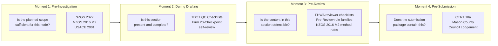
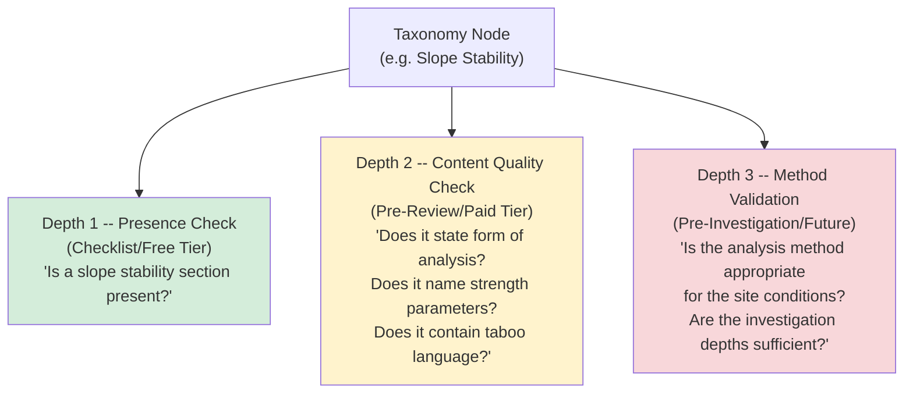
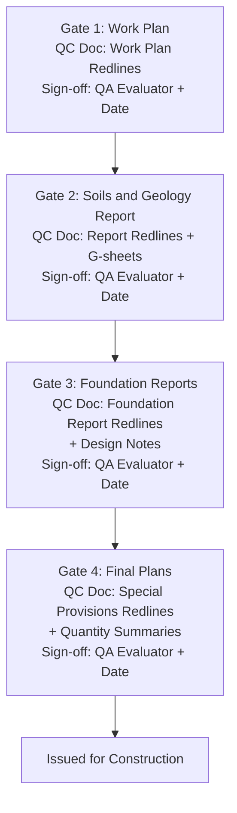

# Checklist Taxonomy -- Cross-Jurisdiction Convergence

**Sub-domain**: report-writing
**Last verified**: 2026-05-13
**Confidence**: cross-referenced (10 sources, 5 jurisdictions, 37-year span)
**Sources**: Geotechnical Engineering Checklists notebook (58764ffc), CERT 10a (Western Bay of
Plenty 2009), FHWA 1988 reviewer checklists, TDOT QC Checklists 2025, Mason County submittal
checklist, NZGS 2022 Ground Investigations Specification, NZGS 2016 Module 2 (earthquake
engineering practice), USACE 2001 Geotechnical Investigations, Commercial Lodgement Checklist
2025, Public Works Construction Geotechnical Checklist 2024

---

## Summary

Ten geotechnical report checklists across NZ, US federal (FHWA, USACE), US state (Tennessee DOT),
US county (Mason County, WA), and NZ/AU council lodgement converge on the same 10 primary
taxonomy nodes. The convergence holds despite differences in jurisdiction, purpose, age
(1988-2025), and report type (subdivision, highway, building consent, site investigation). This
empirical convergence confirms that the taxonomy is universal and suitable as the canonical
section classification for Redline's shared taxonomy architecture.

---

## The Universal Taxonomy (10 Primary Nodes)

Every checklist source covers at least 7 of these 10 nodes. No source introduces a primary node
that is absent from all other sources.

1. **Site Context** — Site history, Aerial photos, Previous reports, Existing infrastructure
2. **Topography and Geomorphology** — Terrain description, Slope angles, Geologic hazards, Landslide indicators
3. **Geology and Stratigraphy** — Geologic formations, Rock outcrops, Depth to bedrock, Stratigraphic description
4. **Field Investigation** — Exploration scope, Borehole locations, In-situ testing methods, Geophysical testing
5. **Subsurface Conditions** — Soils and fill, Rock quality, Groundwater, Organic soils
6. **Laboratory Testing** — Classification tests, Engineering property tests, Geoenvironmental tests
7. **Engineering Analysis** — Foundation bearing capacity, Settlement analysis, Slope stability, Seismic and liquefaction, Lateral earth pressures
8. **Earthworks** — Cut and fill design, Compaction criteria, Existing fills assessment, Site preparation
9. **Drainage and Environment** — Groundwater drainage, Surface water, Effluent disposal, Stormwater soakage
10. **Deliverables** — Tables, Figures, Appendices, Drawings, Digital data AGS4

---

## Convergence Matrix

| Taxonomy Node | CERT 10a (NZ 2009) | FHWA (US 1988) | TDOT (US 2025) | Mason County (US) | NZGS 2022 (NZ) | NZGS 2016 M2 (NZ) | USACE (US 2001) | Lodgement (NZ 2025) | Public Works (US 2024) |
|---|---|---|---|---|---|---|---|---|---|
| 1. Site Context | Y | Y | Y | Y | Y | Y | Y | N | Y |
| 2. Topography | Y | Y | Y | Y | Y | Y | Y | N | Y |
| 3. Geology | Y | Y | Y | Y | Y | Y | Y | N | Y |
| 4. Field Investigation | Y | Y | Y | Y | Y | Y | Y | N | Y |
| 5. Subsurface Conditions | Y | Y | Y | Y | Y | Y | Y | N | Y |
| 6. Laboratory Testing | N | Y | Y | Y | Y | Y | Y | N | Y |
| 7. Engineering Analysis | Y | Y | Y | Y | N | Y | Y | N | Y |
| 8. Earthworks | Y | Y | Y | Y | Y | N | Y | N | Y |
| 9. Drainage/Environment | Y | Y | N | Y | Y | N | Y | N | N |
| 10. Deliverables | Y | Y | Y | Y | Y | N | Y | N | Y |

Notes:
- The Lodgement Checklist (2025) is a building consent administrative document, not a
  geotechnical report checklist. It covers seismic assessment triggers and producer statement
  requirements, not report section structure. Included for completeness but not a primary
  taxonomy source.
- NZGS 2016 Module 2 focuses on earthquake engineering investigation practice. It covers Nodes
  4, 5, 6, and 7 deeply but does not address earthworks, drainage, or deliverable format.
- NZGS 2022 Ground Investigations Specification covers investigation methodology and data
  delivery. It does not include engineering analysis (Node 7) or earthworks (Node 8) because
  those are report outputs, not investigation scope items.

---

## Four Workflow Moments

The same taxonomy nodes appear in all four workflow moments, but the check performed against
each node changes depending on when the check occurs and who the audience is.

| Moment | Question asked | Audience | Anxiety | Source documents |
|---|---|---|---|---|
| Pre-Investigation | "Have I planned enough?" | Project manager, future council reviewer | Inadequate scope will be discovered later | NZGS 2022, NZGS 2016 M2, USACE 2001 |
| During Drafting | "Have I included everything?" | Technical Reviewer (TR) | The TR will send this back | TDOT QC, firm self-review checklists |
| Pre-Review | "Is the content right?" | Technical Reviewer, Project Director | Language, liability, and technical markup | FHWA reviewer checklists, Pre-Review rules |
| Pre-Submission | "Is the package complete?" | Council technical officer | Council will reject the consent application | CERT 10a, Mason County, Lodgement |

---

## Depth Model -- Checklist vs Pre-Review vs Pre-Investigation

Each taxonomy node can be interrogated at three depths. The checklist (Depth 1) is the shallowest;
Pre-Review (Depth 2) is intermediate; Pre-Investigation (Depth 3) requires engineering judgment
and site-specific data.

---

## Jurisdiction-Specific Overlays

The 10 primary taxonomy nodes are universal. Jurisdiction-specific variations appear in three
dimensions:

1. **Which nodes are mandatory vs optional** -- Effluent disposal is mandatory in Western Bay of
   Plenty (rural subdivision), not in Auckland CBD (urban building consent).
2. **Which standards govern each node** -- NZ: NZS references, NZGS guidelines. US: ASCE, FHWA.
   UK: Eurocode 7, BS 5930. AU: AS references.
3. **Which hazard-specific nodes are added** -- Canterbury/Christchurch: liquefaction and lateral
   spreading (mandatory post-2011). Wellington: fault avoidance zones. Western Bay: slope
   stability emphasis. Mason County (US): geologic hazard areas.

These overlays are a configuration layer on the universal taxonomy, not a different taxonomy.
Approximately 70-80% of requirements are shared across NZ councils; the remaining 20-30% is
per-council parameterisation.

---

## Sign-Off Requirements by Jurisdiction

| Jurisdiction | Required signer | Qualification |
|---|---|---|
| NZ (NZGS 2022) | Geotechnical Professional | CPEng or PEngGeol, 10+ years experience |
| NZ (council) | Professional engineer | Statement of professional opinion |
| US (Mason County) | Licensed civil engineer or geologist | Stamp + signed certification |
| US (TDOT) | Project QA Evaluator | Named sign-off per TDOT Quality Manual |
| US (FHWA) | State HQ geotechnical engineer | Explicit approval for regional work |

---

## Chain-of-Gates Model (TDOT Precedent)

The TDOT QC Checklists define a four-stage milestone chain. Each stage requires named sign-off,
specific QC documentation artefacts (redlines, G-sheets, quantity summaries), and completion
verification before progression.

This pattern maps directly to Redline's audit trail architecture (Feature L). Each gate produces
a timestamped artefact with a named signer. The chain of artefacts constitutes the portable
audit trail.

---

## Implications for Redline Architecture

1. **One canonical taxonomy, three consumers**: Skeleton Generator ("generate these sections"),
   Checklist Engine ("are these sections present?"), Pre-Review Engine ("is the content in these
   sections compliant?"). See ADR-006.
2. **Every rule carries a `workflow_moment` dimension**: Pre-Investigation, During Drafting,
   Pre-Review, Pre-Submission.
3. **Every rule carries a `depth` dimension**: Presence (Depth 1), Content Quality (Depth 2),
   Method Validation (Depth 3).
4. **Jurisdiction is a configuration layer**: Same 10 nodes, different mandatory/optional status,
   different governing standards, different hazard-specific additions.
5. **The checklist engine output must never say "pass"**: Structural presence is necessary but
   insufficient. The output must explicitly state: "Structural check complete -- content quality
   not assessed."
