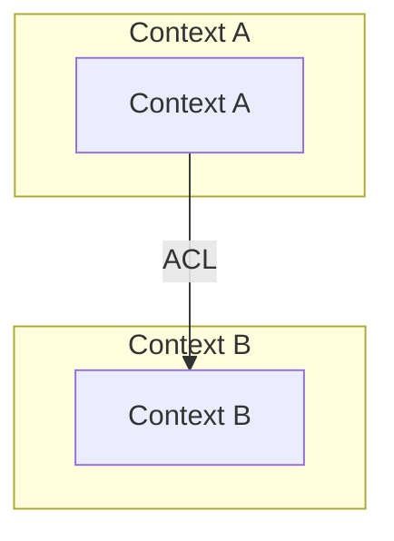

# Context Mapping Procedure

> DRAFT -- pending user approval. Do not promote to production.

**Parent skill:** `ddd-strategic`
**Source:** Evans (*DDD*), Vernon (*IDDD*), Khononov (*Learning DDD*)
**Diagram tool:** Mermaid `flowchart TD` (see `mermaid-diagrams` skill for constraints)

---

## When to Map

- After EventStorming identifies bounded contexts (Step 10).
- When adding a new bounded context or top-level package.
- When integration pain suggests a relationship has changed.
- During quarterly evaluation retros (Peter + Graeme).

## Steps

### 1. List all bounded contexts

Read the current bounded contexts from `docs/architecture/domain-model.md`. Each top-level package under `src/` is a bounded context candidate.

### 2. Identify relationships

For each pair of contexts that interact, classify the relationship using the eight types below. Ask:
- Who depends on whom?
- Who controls the shared model?
- Is there a translation layer?

### 3. Map current reality

Map what exists today, not the desired state. The Context Map is a diagnostic tool.

### 4. Record in domain-model.md

Update the Context Map section with a Mermaid flowchart and a relationship table.

---

## Relationship Types

| Type | Direction | Description | When to choose |
|---|---|---|---|
| **Partnership** | Bidirectional | Two contexts succeed or fail together; synchronise plans | Both teams are equally invested; joint planning is feasible |
| **Shared Kernel** | Bidirectional | Shared subset of model; changes need agreement from both sides | Stable, truly identical types across contexts (monorepo tradeoff: low cost) |
| **Customer-Supplier** | Upstream-Downstream | Downstream has veto/input on upstream priorities | Downstream needs are important enough to influence upstream |
| **Conformist** | Upstream-Downstream | Downstream conforms to upstream model without influence | Upstream model is acceptable and stable; translation cost not justified |
| **ACL** | Upstream-Downstream | Defensive translation layer isolating downstream from upstream | Downstream is Core; upstream is messy, legacy, or third-party |
| **Open Host Service** | Upstream provides | Upstream exposes a well-defined protocol/API | Upstream serves multiple consumers; stability contract is explicit |
| **Published Language** | Shared format | Shared interchange format (JSON schema, protobuf, XML) | Multiple contexts agree on a data exchange format |
| **Separate Ways** | None | No integration; contexts operate independently | Integration cost exceeds benefit |

---

## Mermaid Diagram Template

Use Mermaid `flowchart TD`. Label edges with the relationship type. Colour bounded contexts using C4 conventions from `mermaid-diagrams` skill's `procedures/c4-diagrams.md`.

---

## Decision Matrix: Which Relationship?

| # | Question | If yes | If no |
|---|---|---|---|
| 1 | Do both contexts need to change together? | Partnership or Shared Kernel | Continue |
| 2 | Does downstream influence upstream priorities? | Customer-Supplier | Continue |
| 3 | Is the upstream model acceptable as-is? | Conformist | Continue |
| 4 | Is the downstream context Core? | ACL (protect the Core) | Conformist or Separate Ways |
| 5 | Does upstream serve multiple consumers via API? | Open Host Service | Continue |
| 6 | Is there a shared data format? | Published Language | Separate Ways |
