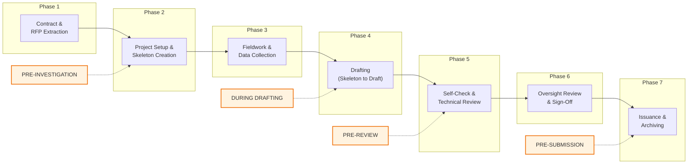
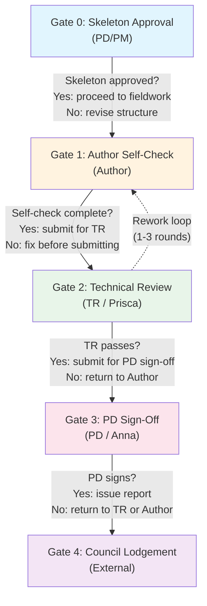
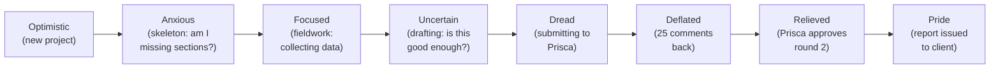
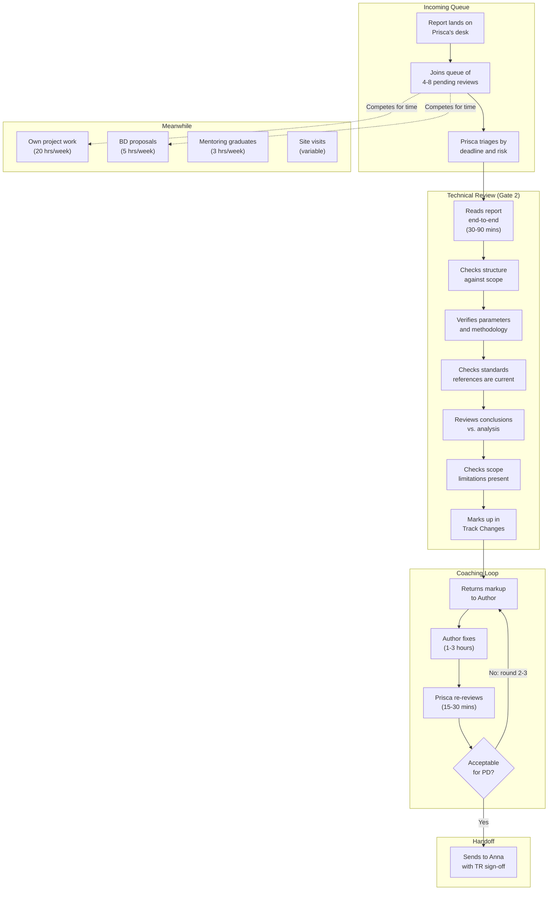
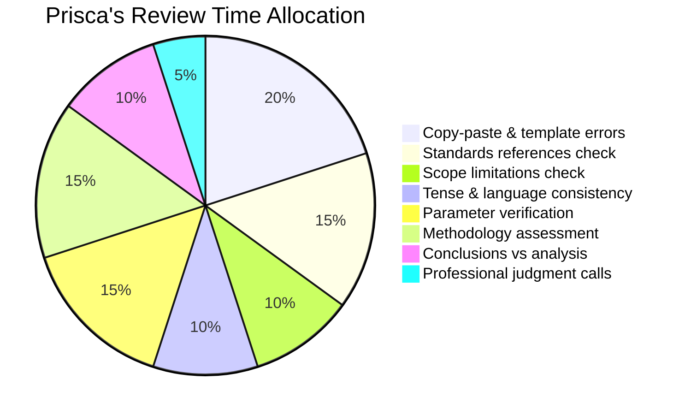
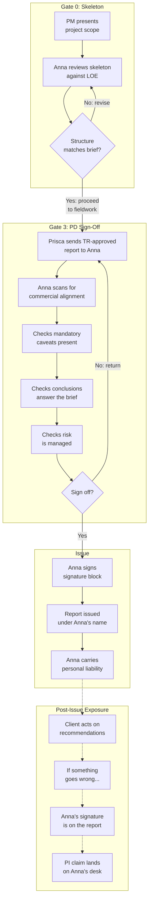
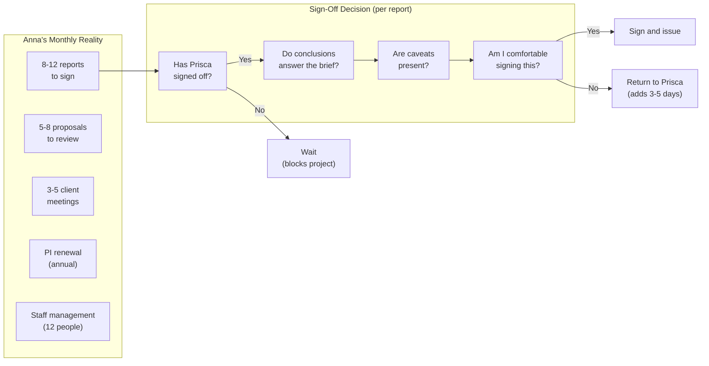
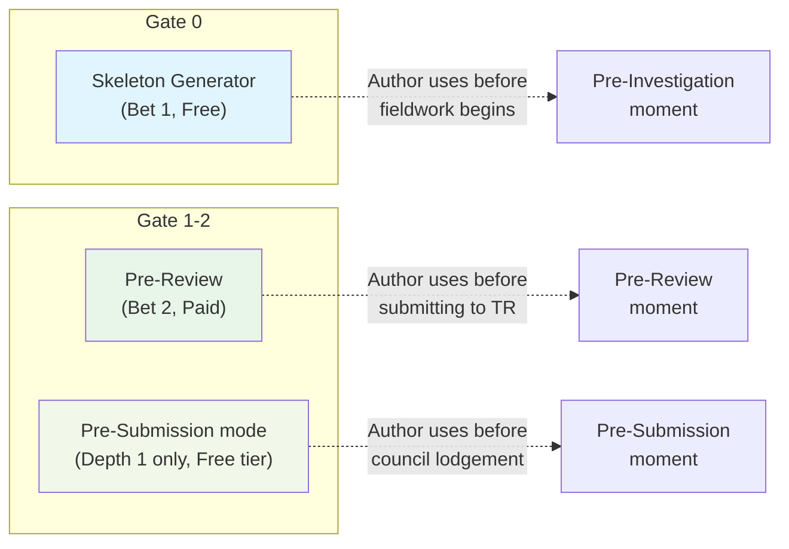

# A Day in the Life -- Author, Technical Director, Practice Director

**Owner**: John (Marketing), with Graeme (domain grounding)
**Status**: Pre-discovery draft v1
**Date**: 2026-05-13
**Output path**: `docs/product/marketing/`

> **Pre-discovery notice.** This map is grounded in Graeme's 25-year practitioner experience,
> the Geotechnical Report Workflows notebook, the FHWA/TDOT/NZGS checklist collection, and
> the incumbent process documentation. It is not validated by customer interviews. KR2
> discovery conversations should test these flows against real users.

---

## Purpose

This document maps the **full project lifecycle** -- not a literal calendar day -- through the
eyes of three personas at a Small (5-50 person) NZ geotechnical consultancy. It traces every
workflow moment, chain-of-gates decision, quality checkpoint, and anxiety point from the moment
a project is won to the moment the report is archived. The goal is to identify systemic
problems whether or not Redline exists.

The three personas correspond to the validated archetypes in
[personas.md](../strategy/personas.md):

| Persona | Archetype | Role in Chain | Primary Anxiety |
|---|---|---|---|
| **Perrie** (Author) | Day-1 User | Creates content, passes gates | "Will my draft survive review?" |
| **Prisca** (Technical Director / TR) | Gatekeeper | Controls quality gates | "Is this technically defensible?" |
| **Anna** (Practice Director / PD) | Day-1 Buyer | Final sign-off, commercial risk | "Does this protect the firm?" |

---

## The Full Project Lifecycle

### Overview: Seven Phases, Four Workflow Moments

The incumbent process has seven phases (from
[incumbent-process.md](../../concepts/01-skeleton-generator/incumbent-process.md)). Redline's
four workflow moments (from [checklist-taxonomy-cross-jurisdiction.md](../../knowledge/geotechnical/report-writing/checklist-taxonomy-cross-jurisdiction.md))
overlay onto specific phases:

> **Key insight**: Incumbent phases describe what happens. Workflow moments describe when
> Redline's rules apply. They are related but distinct concepts. Phase 5 may iterate 2-3 times
> before Phase 6 is reached.

---

## Chain of Gates

Every report passes through a sequence of quality gates. Each gate has a gatekeeper, criteria,
and consequences for failure. The chain is modelled on the TDOT 4-stage milestone system
(see [checklist-taxonomy-cross-jurisdiction.md](../../knowledge/geotechnical/report-writing/checklist-taxonomy-cross-jurisdiction.md))
adapted for NZ/AU Small firm practice.

### Gate Details

| Gate | Gatekeeper | What's Checked | What Happens on Failure | Redline Moment |
|---|---|---|---|---|
| **Gate 0** | PD (Anna) / PM | Skeleton structure matches LOE scope; all required sections present; traceability to brief | Skeleton revised before fieldwork begins | Pre-Investigation |
| **Gate 1** | Author (Perrie) | Self-review: copy-paste errors, standard references, tense consistency, scope limitations present | Author fixes own work before consuming TR time | During Drafting |
| **Gate 2** | TR (Prisca) | Technical robustness: correct parameters, valid methodology, defensible conclusions, standards compliance | Report returned to Author with markup; 1-3 rounds typical | Pre-Review |
| **Gate 3** | PD (Anna) | Commercial alignment: client brief answered, mandatory caveats present, risk managed, fee vs. scope balanced | Report returned to TR/Author; may trigger re-scoping | Pre-Review |
| **Gate 4** | Council officer | Lodgement checklist: required sections present, minimum content met, filing requirements satisfied | Report rejected at counter; engineer resubmits | Pre-Submission |

---

## Perrie's Journey (Author / Intermediate Engineer)

### Who is Perrie?

4 years post-graduation, working toward CPEng. Comfortable with Word, uses ChatGPT privately.
Reports to Prisca. Writes 3-5 reports per month across residential and commercial projects.

### The Full Cycle

```mermaid
flowchart TD
    subgraph "Phase 1-2: Setup"
        A1["Receives project brief\nfrom PM"]
        A2["Opens Word template\nfrom previous project"]
        A3["Copies skeleton from\nsimilar past report"]
        A4["Submits skeleton to\nAnna/PM for Gate 0"]
        A5{"Gate 0:\nSkeleton\napproved?"}
    end

    subgraph "Phase 3: Fieldwork"
        A6["Manages site investigation\n(boreholes, CPT, test pits)"]
        A7["Collects lab results\n(classification, strength)"]
    end

    subgraph "Phase 4: Drafting"
        A8["Populates skeleton\nwith field data"]
        A9["Writes ground model\nand engineering analysis"]
        A10["Copies scope limitations\nfrom previous report"]
        A11["Writes conclusions\nand recommendations"]
    end

    subgraph "Phase 5: Self-Check"
        A12["Reads through once\n(no systematic checklist)"]
        A13["Spell-checks in Word"]
        A14{"Gate 1:\nSelf-check\ncomplete?"}
    end

    subgraph "Phase 5-6: Review"
        A15["Submits to Prisca\nfor technical review"]
        A16["Waits 3-7 days for\nPrisca's markup"]
        A17["Receives 15-25\nTrack Changes comments"]
        A18["Fixes corrections\n(1-3 hours)"]
        A19{"Gate 2:\nPrisca\napproves?"}
    end

    subgraph "Phase 6-7: Sign-Off & Issue"
        A20["Anna reviews and\nsigns (Gate 3)"]
        A21["Report issued\nto client"]
        A22["Filed in\nSharePoint"]
    end

    A1 --> A2 --> A3 --> A4 --> A5
    A5 -->|No| A3
    A5 -->|Yes| A6
    A6 --> A7 --> A8 --> A9 --> A10 --> A11 --> A12 --> A13 --> A14
    A14 -->|Not ready| A12
    A14 -->|Good enough| A15
    A15 --> A16 --> A17 --> A18 --> A19
    A19 -->|No: round 2-3| A18
    A19 -->|Yes| A20 --> A21 --> A22
```

### Perrie's Pain Points (Mapped to Gates)

| Gate | Pain | Current Coping Mechanism | What Goes Wrong |
|---|---|---|---|
| **Gate 0** | No formal skeleton tool; copies from previous project | Find the "closest" past report and adapt | Wrong sections included; missing sections discovered in Phase 5 |
| **Gate 1** | No systematic self-check; relies on memory | Read-through + spell check | Copy-paste errors survive (previous project name, wrong site); wrong standard version cited |
| **Gate 2** | Prisca finds 15-25 issues; Perrie feels incompetent | Fix and resubmit; hope for fewer comments next time | 3-7 day wait per review round; 2-3 rounds = 2-3 weeks of calendar delay |
| **Gate 4** | Perrie doesn't know council-specific requirements | Asks a colleague who lodged at that council before | Report rejected at counter; rework and resubmission |

### Perrie's Emotional Arc

> **The critical moment**: Perrie's emotional low point is receiving Prisca's markup. If 80% of
> comments are mechanical (copy-paste, standards, tense), Perrie feels the review was wasted on
> things a machine should catch. This is the activation moment for Pre-Review.

---

## Prisca's Journey (Technical Director / TR)

### Who is Prisca?

10 years post-graduation, CPEng. Reviews work from 6 intermediates. Technically excellent,
protective of the firm's reputation. Reviews 15-25 reports/month at 1-3 hours each.

### The Review Cycle (Prisca's Perspective)

### Prisca's Pain Points (Mapped to Gates)

| Gate | Pain | Frequency | Time Cost |
|---|---|---|---|
| **Gate 2 entry** | Queue is always 4-8 reports deep; deadlines overlap | Constant | 3-7 day turnaround creates project delays |
| **Gate 2 review** | 60-80% of comments are mechanical (copy-paste, standards, tense) not technical | Every review | 20-40 mins of every 60-90 min review is drudge work |
| **Gate 2 coaching** | Same mistakes repeat across intermediates; feels like teaching hasn't landed | Monthly pattern | Cognitive drain; coaching energy depleted on mechanics, not judgment |
| **Gate 2 re-review** | Round 2 still contains unfixed items from round 1 | ~30% of reviews | 15-30 min additional; frustration compounds |

### What Prisca Actually Checks (Decomposed)

> **The key ratio**: Roughly 55% of Prisca's review time is spent on checks that could be
> automated (copy-paste, standards, scope limitations, language). Only 45% requires her
> professional expertise. The 55% is what Redline's Pre-Review targets.

---

## Anna's Journey (Practice Director / PD)

### Who is Anna?

18 years post-graduation, CPEng, co-owner. Reviews and signs 8-12 reports/month. Manages 12
people. Increasingly pulled into BD and management. Signs every report the firm issues.

### The Sign-Off Cycle (Anna's Perspective)

### Anna's Pain Points (Mapped to Gates)

| Gate | Pain | Consequence | Redline Surface |
|---|---|---|---|
| **Gate 0** | No tool to verify skeleton covers LOE scope systematically | Structural gaps discovered at Gate 2 or Gate 3, causing expensive rework | Skeleton Generator (Bet 1) |
| **Gate 3** | Relies on Prisca's TR sign-off as proxy for quality; Anna's review is commercial, not technical | If Prisca misses something technical, Anna's signature is on the line | Pre-Review (Bet 2) |
| **Gate 4** | Report rejected by council for missing sections | Embarrassment, wasted time, client frustration | Pre-Submission (Phase 2) |
| **Post-issue** | PI claim: Anna's signature, Anna's liability | $10K minimum cost; $500K claim can threaten firm survival | Audit trail (Feature L) |

### Anna's Decision Calculus

> **Anna's fear**: Not what she finds in the report. What she doesn't find. The scope
> limitation that should be there but isn't. The standard that was updated last month. The
> copy-paste error in the header that makes the firm look careless to the client. Every
> report she signs is a liability event she cannot fully control.

---

## The Systemic Problem: Where Time Is Wasted

### Time Allocation Across the Chain (Per Report)

| Phase | Perrie (Author) | Prisca (TR) | Anna (PD) | Calendar Days |
|---|---|---|---|---|
| Skeleton creation | 2-4 hrs | -- | 15-30 min review | 1-2 |
| Fieldwork & data | 3-10 days | Oversight only | -- | 5-15 |
| Drafting | 8-20 hrs | -- | -- | 3-7 |
| Self-check | 30-60 min | -- | -- | 0.5 |
| TR review (round 1) | -- | 1-3 hrs | -- | 3-7 (queue) |
| Author fixes | 1-3 hrs | -- | -- | 1-2 |
| TR re-review | -- | 15-30 min | -- | 1-3 (queue) |
| PD sign-off | -- | -- | 15-30 min | 1-3 (queue) |
| **Total** | **15-35 hrs** | **1.5-3.5 hrs** | **0.5-1 hr** | **15-40 days** |

> **The bottleneck is not effort -- it is queue time.** Prisca's 1.5-3.5 hours of review
> creates 4-10 days of calendar delay because the report waits in her queue. Reducing the
> number of review rounds from 2.5 (average) to 1.5 saves 5-10 calendar days per report --
> not by making Prisca faster, but by making Perrie's draft better.

### Where Redline Intervenes

```mermaid
flowchart TD
    subgraph "Without Redline"
        W1["Perrie drafts\n(8-20 hrs)"] --> W2["Self-check\n(30 min, informal)"]
        W2 --> W3["Prisca reviews\n(1-3 hrs, 15-25 comments)"]
        W3 --> W4["Perrie fixes\n(1-3 hrs)"]
        W4 --> W5["Prisca re-reviews\n(15-30 min)"]
        W5 --> W6["Maybe round 3\n(30% chance)"]
        W6 --> W7["Anna signs"]
    end

    subgraph "With Redline"
        R1["Perrie drafts\n(6-16 hrs, better skeleton)"] --> R2["Pre-Review scan\n(5 min)"]
        R2 --> R3["Perrie fixes\nflagged items\n(30-60 min)"]
        R3 --> R4["Prisca reviews\n(45-90 min, 5-10 comments)"]
        R4 --> R5["Perrie fixes\n(30 min)"]
        R5 --> R6["Anna signs"]
    end

    style R2 fill:#e8f5e9,stroke:#2e7d32,stroke-width:2px
    style R3 fill:#e8f5e9,stroke:#2e7d32,stroke-width:2px
```

| Metric | Without Redline | With Redline | Delta |
|---|---|---|---|
| Prisca's review comments | 15-25 | 5-10 | -60% |
| Review rounds | 2-3 | 1-1.5 | -50% |
| Calendar days (review phase) | 7-15 | 3-7 | -50% |
| Prisca's review hours/month | 22-75 hrs | 11-35 hrs | -50% |

---

## The Three Product Surfaces (Mapped to Chain of Gates)

Each Redline product surface targets a specific gate and workflow moment. Pre-Submission is a
free Depth-1 mode within the Pre-Review product, not a standalone surface.

---

## Content Marketing Angles (John)

This Day in the Life map reveals three Big 5 content narratives:

1. **"The 55% problem"**: More than half of a senior reviewer's time is spent on checks a
   machine could perform. This is not a technology pitch -- it is a staffing ROI argument.
   Target: Anna (buyer). Format: cost calculator or ROI article.

2. **"25 comments to 10"**: The emotional arc from Perrie's dread to relief. This is a
   day-in-the-life testimonial narrative. Target: Perrie (user). Format: case study or
   video testimonial (post-discovery).

3. **"What Anna doesn't find"**: The fear is not what the review catches. It's what it
   misses. Target: Anna at PI renewal time. Format: risk assessment article tied to CEAS
   Issue 88 and the Disputes Tribunal ceiling increase.

All three narratives are grounded in verifiable facts (Graeme's domain data, CEAS Issue 88,
FHWA 37-year checklist durability). None require fabrication or exaggeration.

---

## Provenance

- Persona archetypes: [personas.md](../strategy/personas.md) (Perrie, Anna, Prisca)
- Incumbent process: [incumbent-process.md](../../concepts/01-skeleton-generator/incumbent-process.md)
- Chain of gates: [checklist-taxonomy-cross-jurisdiction.md](../../knowledge/geotechnical/report-writing/checklist-taxonomy-cross-jurisdiction.md) (TDOT precedent)
- Workflow moments: [ADR-006](../../adr/adr-006-shared-taxonomy-skeleton-checklist-prereview.md)
- Sign-off workflows: [audit-trail-sign-off-workflows.md](../../knowledge/geotechnical/report-writing/audit-trail-sign-off-workflows.md)
- Persona grounding: [20260503-persona-grounding-firm-segmentation.md](../research/20260503-persona-grounding-firm-segmentation.md)
- Review time data: Graeme domain grounding (15-25 reports/month per senior, 1-3 hrs each)
- PI exposure data: CEAS Indemnity Matters Issue 88, Risk Assessment notebook
