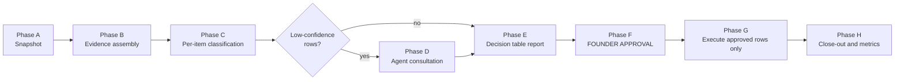

# Skill Design — `backlog-grooming` (Mark-owned, periodic backlog audit)

**Status**: RATIFIED 2026-06-12 — §8 answered by founder, SKILL.md materialised at
`.agents/skills/agile-backlog-grooming/SKILL.md`. No grooming pass run yet.
**Author**: Mark (PM). **Date**: 2026-06-12.
**Companion document**: `backlog-cultivation-principles.md` (the principles this
skill operationalises — read it first).

> **What this is.** A repeatable, founder-gated audit of the full GitHub Projects
> backlog. When run, it produces one decision table — one row per affected task, each
> row carrying a recommendation (**keep / update / drop / merge / re-parent / defer /
> split**) and an evidence-backed rationale. The founder approves rows explicitly;
> only approved rows are executed. Nothing on the board is dropped, merged, or
> rewritten without founder approval.
>
> **What this is not.** Not sprint planning (that is `agile-sprint-planning`), not
> task creation (that is `github-projects`), not strategy review (that is Ron's
> quarterly refresh). This skill only cultivates what already exists on the board.

---

## 1. Placement and ownership

| Field | Value |
|---|---|
| Skill name | `backlog-grooming` |
| Skill file (to be created) | `.agents/skills/agile-backlog-grooming/SKILL.md` |
| Owner / steward | Mark (PM). Founder is the sole decision-maker. |
| Trigger phrases | "groom the backlog", "backlog audit", "run a grooming pass", "declutter the board" |
| Proposed cadence | Monthly light pass (timeboxed ~45 min) + a mandatory full pass immediately after each Quarterly Strategy Refresh Review (bet changes are the largest source of newly-dead items). Cadence entry to be added to `docs/product/operations/cadences.md` on founder approval — that file is founder-owned, so I propose, I don't edit. |
| Reports location (proposed) | `docs/product/operations/backlog-grooming/YYYY-MM-DD-grooming-report.md` — mirrors the existing dated-file convention of `docs/product/operations/work-orders/`. Needs founder ratification (Open Question 1). |
| Working state | `.agents/tmp/backlog-grooming-YYYY-MM-DD/` (gitignored) |

**Implementation note (boundary):** I cannot write to `.agents/skills/` and Harriet
owns the agent-JD routing tables. Materialising the SKILL.md from this design, and
adding the routing row to my JD, are follow-up steps for the founder to dispatch
(see Handoffs, §9).

---

## 2. Inputs

| # | Input | Source | Used for |
|---|---|---|---|
| I1 | All board items (every status) | `github-projects` → `list_tasks(config)` | The audit population (Backlog + sprint-less open items) and the redundancy evidence (Done items) |
| I2 | Closed issues incl. close reasons | `gh issue list --state closed` | Items already superseded (e.g., #75 "closed as superseded") set precedent and catch near-duplicates of closed work |
| I3 | Active strategic bets, incl. revisions/kills | `docs/product/strategy/strategic-bets.md` | Principle 4 membership test; bet-orphan detection |
| I4 | OKRs | `docs/product/strategy/okrs/2026-h2.md` | Secondary alignment test |
| I5 | Accepted ADRs (Architecture Decision Records) | `docs/adr/` (26 as of 2026-06-12) | Direction/technology-change evidence — e.g., ADR-024 (Django single service), ADR-026 (Firebase Hosting domain) invalidate tasks written under older assumptions |
| I6 | Strategy decision logs and sweeps | `docs/product/strategy/decisions/`, `parked-decisions.md` | Recorded direction changes |
| I7 | Deferred-decision register | `docs/deferred/_index.md` (P-001…P-040) | Items that duplicate an already-deferred decision; routing target for "defer" recommendations |
| I8 | Open and shipped specs | `specs/NNN-*/` (incl. `specs/shaped/`) | Whether a task's scope was absorbed into a delivered or in-flight spec |
| I9 | Roadmap and non-goals | `docs/product/strategy/roadmap.md`, `non-goals.md` | A task matching a declared non-goal is a presumptive drop |
| I10 | Prior grooming reports | `docs/product/operations/backlog-grooming/` | Don't re-litigate founder-rejected recommendations; carry forward deferred rows |
| I11 | CCE session decisions (where available) | `session_recall` / `context_search` | Recent decisions not yet reflected in docs (e.g., issue #111 superseding #75 was recorded in CCE first) |
| I12 | Last sprint plan + this-week | `docs/product/tasks/` | Items belonging to the current sprint are out of audit scope |

**Discovery discipline:** CCE-first where the harness provides it; evidence beyond
that comes from the named files above — the skill must not free-range the repo.

## 3. Preflight guards (abort with a clear error if any fails)

- G1: `gh auth status` shows `project` scope (reuses `github-projects` guard).
- G2: `project_config.json` fresh (≤ 24 h).
- G3: `strategic-bets.md` exists with ≥ 1 active bet — without a live strategy there
  is no membership test, and the correct move is escalation to Ron, not grooming.
- G4: Not mid-sprint-planning — never run concurrently with `agile-sprint-planning`
  (both mutate the same board fields).
- G5 (**Stop Rule, pre-committed**): a per-pass budget is declared before Phase A
  begins — default **45 minutes / 80 items analysed**, whichever first. Unprocessed
  items are listed verbatim in the report's "Not yet reviewed" appendix and lead the
  next pass. The budget is not renegotiated mid-pass.

## 4. Workflow



### Phase A — Snapshot

1. `list_tasks(config)` → write the full board state to
   `.agents/tmp/backlog-grooming-YYYY-MM-DD/board-snapshot.json`. The pass analyses
   the snapshot, so a mid-pass board change cannot corrupt the table; any item
   touched after the snapshot is re-verified at execution time (Phase G, step 0).
2. Define the **audit population**: status `Backlog`, plus any open item with no
   sprint or a past sprint. Exclusions: `Done`, `In Progress`, `To Review`, and
   anything in the current sprint (those belong to sprint ceremonies).
3. Record headline metrics (total, by status, sprint-less count) for before/after
   comparison.

### Phase B — Evidence assembly

Build three founder-auditable evidence indexes in the tmp folder (these are the
grounding the founder asked for — every recommendation must cite at least one):

- **completed-work.md** — Done board items and merged-PR titles since the last pass,
  each with one line on what it shipped. *(Grounds: "redundant — already done.")*
- **direction-changes.md** — accepted ADRs, bet revisions/kills, decision-log
  entries, and non-goals added since the last pass. *(Grounds: "invalidated —
  direction/technology changed.")*
- **doc-landscape.md** — open specs, shaped pitches, deferred P-NNN entries relevant
  to audit-population items. *(Grounds: "duplicates an existing artifact" /
  "belongs in deferred.")*

### Phase C — Per-item classification

Each audit-population item passes through a fixed decision tree — order matters, and
it implements the principles doc (P-numbers refer to it):

| Step | Test | If it fails → recommendation |
|---|---|---|
| C1 Redundancy | Is the outcome already delivered by a Done task, merged PR, or shipped spec? (evidence: completed-work.md) | **drop** — superseded by completed work |
| C2 Invalidation | Does an accepted ADR, bet revision/kill, or declared non-goal contradict the item's premise? (evidence: direction-changes.md) | **drop** (premise dead) or **update** (premise survives, body stale) |
| C3 Alignment | Does it link to an active bet, or is it a named dependency of a bet-linked item? (Principle 4) | **defer** → `task-defer` P-NNN with unfreeze condition (valid idea, wrong time — Principle 5) or **drop** (no plausible future trigger) |
| C4 Duplication | Does another open item or deferred P-NNN cover the same outcome? | **merge** with the better-specified survivor (named in the row) |
| C5 Structure | Does the Structuring Doctrine (P1–P5 / K1–K4 in `github-projects`) say it belongs under a parent, or that an over-split shard should fold back in? | **re-parent** under task #Y, or **merge** shards |
| C6 Size | Will it not fit one sprint? (Sprint Conventions, `cadences.md`) | **split** (flagged for shaping first if unestimable) |
| C7 Hygiene | Missing `purpose` / `done_when` / bet reference, or untouched ≥ 2 sprints (staleness convention pending founder ratification — Open Question 6)? | **update** — rewrite per Clean Agile's placeholder fluidity (Principle 2) |
| Pass all | — | **keep** (with one-line reaffirmation) |

Each classification gets a **confidence**: `high` (direct documentary evidence),
`medium` (inference from documents), `low` (needs a domain judgment I cannot make).
Per Chesterton's fence (Principle 8): if I cannot state *why the item exists*, the
recommendation is never "drop" on first pass — it is "update" with a question, or it
goes to consultation.

### Phase D — Agent consultation (dispatch-table-compliant)

Only `low`-confidence rows, and only via my approved dispatch routes. Batched: one
dispatch per agent per pass, carrying all affected rows. Dispatches are stateless, so
each prompt embeds the row context and asks only WHAT, not HOW.

| Consultant | Route legitimacy (AGENTS.md dispatch table) | Question type | Verdict recorded in |
|---|---|---|---|
| **Peter** | Mark → Peter: feasibility assessment | "Does ADR-NNN / the shipped architecture make task #N redundant or technically obsolete?" — includes infra/DevOps-flavoured items, which I route through Peter, since Mark → Brent is not a permitted route | `Consulted` column + tmp consultation log |
| **Graeme** | Mark → Graeme: PRD/task touches geotechnical domain (blocking) | "Is the domain premise of task #N still correct / still required by NZ practice?" | same |
| **Ron** | Mark → Ron: no active strategic bet exists (blocking escalation) | Only when an item's bet linkage is genuinely ambiguous — "is this orphaned, or does it serve a bet I'm misreading?" | same |

Not consulted, by rule: **Kabilan** (never — hard rule), **Matt/John/Brent/Harriet**
(no applicable route for grooming questions). If a row needs a judgment none of the
permitted routes can give, the row ships to the founder marked `low` confidence with
the open question stated — I do not invent a verdict.

### Phase E — The decision table (report output)

Written to `docs/product/operations/backlog-grooming/YYYY-MM-DD-grooming-report.md`:

```markdown
# Backlog Grooming Report — YYYY-MM-DD

**Status**: AWAITING FOUNDER REVIEW  (→ APPROVED-PARTIAL / EXECUTED)
**Snapshot**: N total · N backlog · N sprint-less   **Budget used**: Nm / N items
**Evidence indexes**: [completed-work] [direction-changes] [doc-landscape] (tmp links)

## Decision table

| # | Issue | Title | Age/last-touch | Recommendation | Rationale (1–3 sentences) | Evidence | Consulted | Confidence | FOUNDER DECISION |
|---|---|---|---|---|---|---|---|---|---|
| 1 | #42 | … | 2026-04-18 / 54d | drop | Superseded: auth scope shipped in #110; remaining sliver tracked in #111. | #110 (Done), ADR-025 | Peter: concur | high | _approve / reject / modify:_ |
| 2 | #57 | … | … | merge → #63 | Same outcome as #63; #63 has the spec link. Unique detail X folded into #63 body. | spec 007 | — | high | |
| 3 | #61 | … | … | defer → P-NNN | Valid idea, serves no active bet; unfreeze: "Phase 2 gate passed". | strategic-bets §Bet 1 | Ron: concur | med | |

## Not yet reviewed (stop-rule remainder)
## Proposed execution plan (per approved action type)
## Open questions for the founder
```

Schema rules: **Recommendation** ∈ {keep, update, drop, merge → #X, re-parent → #Y,
defer → P-NNN, split}; merge rows name the survivor and list any unique content to
preserve; defer rows must state a candidate **unfreeze condition** (the `task-defer`
skill rejects deferrals without one); every non-keep row cites ≥ 1 evidence artifact
(issue #, ADR, doc path, or named consultation); the **FOUNDER DECISION** column is
the approval interface and is empty when I hand the report over.

### Phase F — Approval loop (hard gate)

1. I present the report with a 5-line summary (counts per recommendation type, the
   rows I am least sure about, total proposed board reduction).
2. The founder fills the FOUNDER DECISION column: `approve`, `reject` (+ optional
   note, which I record so future passes don't re-litigate — I10), or `modify:`
   (changed action, which replaces my recommendation verbatim).
3. Partial approval is the expected case: I execute only approved rows; everything
   else stays untouched. No timeout-approval, no default-approval, no batch
   "approve all" inferred from silence.
4. If the founder changes nothing on the board side but wants edits to the table, we
   iterate on the report file — the report is the single source of truth for what
   was decided.

### Phase G — Execution (approved rows only)

Step 0 for every row: re-fetch the live item; if it changed since the snapshot
(status, sprint, body), skip it, mark `stale — re-audit next pass`, and continue.

| Action | Mechanics | Audit trail |
|---|---|---|
| drop | Comment on the issue: one-line rationale + link to the grooming report → `gh issue close <n> --reason "not planned"` → `archive-item` to clear the board view (guard G7: archive alone never closes — both steps, comment first) | Comment + report row. Reversible: closed issues reopen cleanly (two-way door) |
| merge → #X | Fold any unique content into #X's body; cross-link comment on both; close the duplicate as above | Both issues carry the link |
| re-parent → #Y | `set-parent` procedure (native sub-issues; internal-id, `-F` typed integer) | Parent/child link; no body change |
| update | Edit issue body / board fields via `update-task` + `gh issue edit` (GitHub retains body edit history) | Edit history + report row |
| defer → P-NNN | Run `task-defer` (creates `docs/deferred/P-NNN-*.md` + index row with the approved unfreeze condition), then close + archive the board item with a pointer comment to the P-NNN file | P-NNN file + comment |
| split | Not executed inside grooming — flagged to the next sprint-planning/shaping session (splitting needs estimation context this skill does not carry) | Report row + sprint-planning input |
| keep | `update-task` to stamp a `groomed: YYYY-MM-DD` marker if the founder ratifies the freshness convention (Open Question 6); otherwise no-op | Report row |

Failures are logged per row and never retried destructively; a failed row reverts to
`pending` for the next pass.

### Phase H — Close-out

1. Update the report status to `EXECUTED`, append the execution log (per-row result)
   and after-metrics (board size before/after, count per action).
2. Name the next scheduled pass date.
3. Persist the session decision to CCE (where available) so the next pass — and other
   agents — inherit what was dropped and why.
4. Commit report + any doc changes **on a branch** (never to master), founder merges.

## 5. Safety rails (summary)

- Founder approval is per-row and explicit; the skill has no autonomous destructive
  path. The most destructive primitive (close issue) is a reversible two-way door.
- Done / In Progress / To Review / current-sprint items are never in scope.
- Stop Rule budget prevents the pass from becoming the time-waster Shape Up warns
  about (the failure mode where grooming itself becomes the waste).
- Snapshot + re-verify prevents acting on stale state.
- Every dropped item leaves a breadcrumb (comment + report) — nothing vanishes
  silently; "important ideas come back" is backed by searchable closed issues.
- Consultations stay strictly inside my approved dispatch rows.

## 6. Interaction with existing skills

| Skill | Relationship |
|---|---|
| `github-projects` | Provides all board primitives (list/update/archive/set-parent) and the Structuring Doctrine used in C5. Grooming adds no new board mechanics. |
| `agile-sprint-planning` | Downstream beneficiary: planning Step 2 reads a smaller, honest backlog. Grooming runs *between* sprints, never during planning (guard G4). Split-flagged rows feed its Step 4. |
| `task-defer` | The execution mechanism for every `defer` row — grooming never writes to `docs/deferred/` directly. |
| `pm-prioritization` | Out of scope here: grooming decides *existence and structure* of items, not rank order. Ranking remains a sprint-planning/prioritisation concern. |
| `session-handover` / CCE | Close-out decision persistence. |

## 7. Success criteria (how we know the skill works)

1. **Board size**: open Backlog count falls and then stabilises at a level the
   founder can read in ~10 minutes (target proposed: ≤ ~25 open backlog items ≈ one
   quarter of work at current throughput — a convention, not literature; founder
   sets the number).
2. **Sprint-planning speed**: Step 2–4 of sprint planning measurably faster (fewer
   candidates to INVEST-check).
3. **Zero regret events**: no dropped item has to be reopened because the rationale
   was wrong (a reopen due to genuine direction change is fine — that's the system
   working).
4. **Every non-keep row evidenced**: spot-checkable by the founder against the
   evidence indexes.

## 8. Open questions for the founder (blocking before first run)

> **FOUNDER DECISIONS — 2026-06-12 (questions answered; ratified values are
> authoritative in the SKILL.md):**
>
> 1. Report location: **ratified** as proposed.
> 2. Cadence: **on-demand only** — founder triggers; no `cadences.md` entry.
> 3. Approval interface: **verbal per row in session**; Mark records each verdict
>    into the FOUNDER DECISION column immediately (file remains the audit trail).
> 4. Drop semantics: **delete the issue** (`gh issue delete`), not close.
>    Irreversible — SKILL.md adds a mandatory Drop protocol: archive full issue
>    content into the report appendix, reference-check `#<n>` across docs/specs/
>    issues (any hit blocks deletion), then delete; permission failure falls back
>    to close-as-not-planned. Drop rows additionally require `high` confidence.
> 5. Defer routing as default: **ratified.**
> 6. Staleness: **N = 2 sprints** untouched with no bet link → flag. No `groomed:`
>    stamp (keep rows are a no-op).
> 7. First pass: **one-off double budget** (90 min / 160 items).

1. **Report location**: ratify `docs/product/operations/backlog-grooming/` (mirrors
   `work-orders/` dated-file convention) — or name another home.
2. **Cadence**: monthly light pass + post-quarterly-refresh full pass is my
   recommendation. Confirm, and confirm the entry I should draft for `cadences.md`
   (founder-owned file).
3. **Approval interface**: fill the FOUNDER DECISION column in the report file
   (async, auditable — my recommendation), or row-by-row verbally in session?
4. **Drop semantics**: close the GitHub issue + archive from board (full declutter —
   my recommendation), or archive-only (issue stays open invisibly — I advise
   against: it recreates the hidden pile)?
5. **Defer routing as default**: ratify the rule that valid-but-no-active-bet ideas
   route to `docs/deferred/` P-NNN instead of living on the board. This is the
   single biggest declutter lever and changes where ideas live, so it needs your
   explicit yes.
6. **Staleness convention**: no literature grounding exists for a numeric threshold —
   pick N for "flag after N sprints untouched with no bet link" (I propose N = 2),
   and whether keep-rows get a `groomed:` date stamp.
7. **First-pass scope**: with 69 Backlog items, the first pass will exceed the
   45-minute budget. Approve either a one-off double budget for pass #1 or two
   standard passes a week apart.

## 9. Handoffs after founder review

- **Founder → Mark**: answers to §8; then I finalise this design and run pass #1.
- **Founder dispatch (not Mark → direct)**: materialise
  `.agents/skills/agile-backlog-grooming/SKILL.md` from this design (I cannot write to
  `.agents/skills/`), and have **Harriet** add the routing row to my JD skills table
  (her domain).
- **Mark → Ron** (only if triggered): if pass #1 finds a large cluster of items that
  are strategy-orphaned because the bets themselves are ambiguous, that is a strategy
  gap, not a grooming problem — escalation per my JD.

## Provenance

Principles and citations: `backlog-cultivation-principles.md` (same date). Board
mechanics and guards: `.agents/skills/github-projects/SKILL.md`. Sprint interface:
`.agents/skills/agile-sprint-planning/SKILL.md`. Deferral mechanics:
`.agents/skills/task-defer/SKILL.md`. Board snapshot 2026-06-12: 106 items / 69
Backlog / 52 sprint-less open. Mental models: Reversible vs Irreversible, Stop Rule.
