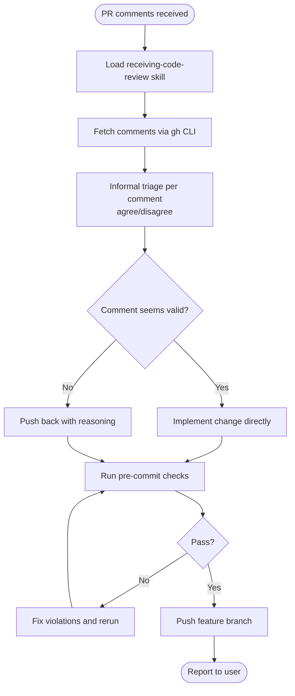
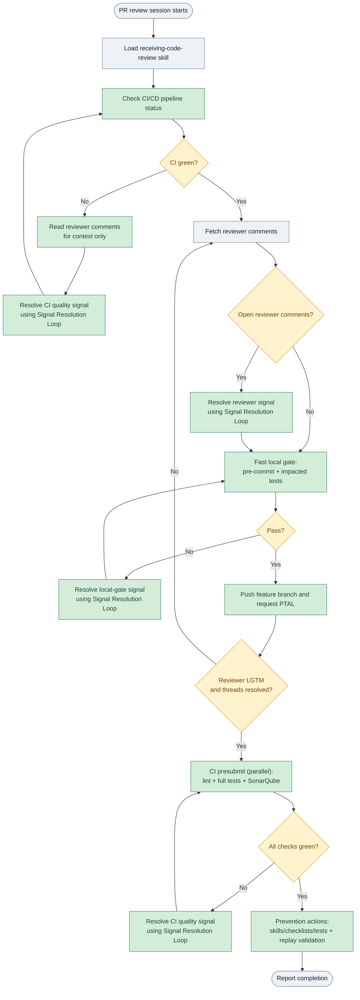

# PR Review Resolution - Process Improvement Proposal

**Date**: 2026-05-19  
**Status**: Draft for review

---

## Why improve?

The current process resolves comments but treats each PR cycle as a one-way event.
It does not:

- Confirm issues are reproducible before changing files
- Capture root-cause learning before the fix obscures what happened
- Run right-sized local checks and CI presubmit checks before declaring review
  complete, so reviewers and CI/CD find nothing late
- Treat disagreed comments as signals - evidence that a reviewer lacked context that
  a short code comment could have provided
- Check CI/CD pipeline health before fetching reviewer comments; addressing human
  feedback while the pipeline is failing means evaluating potentially broken code

The goal is for each PR review session to leave the codebase *and the process* better than it found them.

---

## Current Process

---

## Proposed Process (After Change)

> **Colour key**
>
> - **Blue/Grey** - unchanged baseline step
> - **Amber** - existing concept made explicit or significantly expanded
> - **Green** - new step introduced in the proposed process

---

## What changes

| Step | Current | Updated |
| ------ | --------- | --------- |
| **CI/CD gate** | Not present | Pipeline health checked before comment resolution and again before completion; failing CI signals use the shared Signal Resolution Loop. Reviewer comments may be read for context while CI is red, but comment resolution waits until CI is green. |
| **Triage** | Binary: agree/disagree informally during evaluation | Unified signal triage with source (`CI`, `reviewer`, `local gate`), decision, impact tier (`critical`, `standard`, `low`), and type metadata |
| **Reproducibility** | Not checked | Attempt local reproduction or evidence capture for fix-path signals before editing; if not feasible, document why and fix, suppress, or escalate without pretending the local gate can capture it |
| **Systematic classification** | Not present | Classify valid signals as proximate (point fix + specific test) or systematic (config / convention change + generalised test); applies to CI, local-gate, and reviewer signals |
| **Test-first / local capture** | Not explicit | Valid behavioral and quality failures require local capture before implementation where feasible: specific test/hook for proximate failures, generalised test/config for systematic failures |
| **Lesson writing** | Not part of the process | Mandatory for critical/repeat defects; standard and low-impact items are batched in retrospective |
| **Automation capture** | Not part of the process | Tagged during triage and prioritized later by ROI (not a blocker on fix path) |
| **Disagreed comments** | Push back with reasoning, stop there | Resolve context, reply with evidence, and request PTAL for re-consent |
| **Quality gates** | pre-commit only | Fast local gate (`pre-commit` + impacted tests), then CI presubmit runs full checks in parallel; failures from either gate re-enter the shared Signal Resolution Loop |
| **Reflection sequence** | Not defined | Postmortem-lite + 5 Whys are gated by impact/type (critical, repeat, systematic-suspected, or behavioral); prevention actions are captured after LGTM + CI green |
| **False positives** | Implicit and ad-hoc | Must include evidence, owner approval, and recheck date before acceptance |
| **Push trigger** | After pre-commit passes | After fast local gate passes |
| **Completion trigger** | Push branch and report | Reviewer LGTM + CI presubmit green + review threads resolved + reflection actions captured |

---

## New behaviours in detail

### 1. Shared Signal Resolution Loop

Use one loop for all quality signals: CI failures, local-gate failures, reviewer
comments, and reviewer confusion. The signal source changes the entry rule; it
does not change the underlying handling pattern.

| Step | Question | Outcome |
| --- | --- | --- |
| 1. Classify signal | Where did it come from, and what kind of issue is it? | Source (`CI`, `reviewer`, `local gate`), decision, impact tier, and type are recorded |
| 2. Capture evidence | Can the failure or concern be reproduced or evidenced locally? | Reproduce locally where feasible; otherwise document why local capture is not feasible |
| 3. Classify cause | Is this proximate or systematic? | Choose point fix + specific local capture, or generalised fix + config/convention change |
| 4. Act | Should this be fixed, suppressed, clarified, retried, or escalated? | Implement fix, apply false-positive governance, reply with context, retry infra/flake, or escalate |
| 5. Re-run gate | Which gate needs to confirm the signal is resolved? | Local gate, CI gate, or reviewer re-consent confirms closure |

This replaces separate CI-comment subflows. CI, reviewer, and local-gate signals
share the same diagnostic spine.

### 2. Reproducibility and evidence gate

Before editing any file for a fix-path signal, try to reproduce the failure or
capture evidence locally. If local reproduction is not feasible, document why
(environment-specific check, deployed-service dependency, external quality
platform, flake, or missing local tooling) and continue with the fix, suppression,
or escalation path.

This prevents phantom fixes while avoiding a deadlock when CI-only failures cannot
be replicated on a developer machine.

### 3. Local capture before implementation

For valid fix-path signals, close the local gate before implementing the fix where
feasible:

- **Behavioral defect**: write a failing automated test first.
- **Static quality issue**: enable or add the equivalent local hook/config where feasible.
- **Coverage gap**: write a meaningful test for the uncovered behavior, not a trivial coverage filler.
- **Complexity / duplication issue**: prefer a local rule or refactoring guard if the class of issue can recur.

Exemption: documentation/style comments and CI-only environment failures can skip
local capture if the reply or resolution note records why no local capture applies.

### 4. Disagreed comment analysis with reviewer re-consent

For disagreed comments, answer two questions:

1. **What context did the reviewer not have?** (domain knowledge, intent of the code,
   non-obvious invariant, established pattern)
2. **Would a short code or doc comment make that context visible next time?**

After replying with evidence, request **PTAL** and treat the thread as open until the
reviewer re-consents.

### 5. Hybrid quality pipeline (phase gates + fast local gate)

Use three gates:

| Stage | Scope | Purpose |
| ------ | ------- | --------- |
| Initial CI health gate | Existing PR branch CI status before comment resolution | Avoid resolving reviewer comments against broken code; comments may still be read for context |
| Fast local gate | `uv run pre-commit run -a` + impacted tests | Catch obvious regressions before push with low latency |
| CI presubmit | lint, full test suite, SonarQube (parallel) after push/PTAL | Authoritative quality decision before review closure |

Any failure from the initial CI gate, fast local gate, or final CI presubmit becomes
a quality signal and re-enters the shared Signal Resolution Loop. This avoids slow
sequential local gating while preserving shift-left quality.

### 6. False-positive governance

Any accepted false positive must record:

- Tool/check identifier
- Evidence snapshot (why it is false)
- Rationale for acceptance (not just "noisy")
- Owner approval
- Recheck date

Without these fields, the issue is treated as unresolved.

### 7. Lessons and automation outside the fix critical path

Lesson-writing and automation design are decoupled from standard fix flow:

- **Critical, repeat, systematic-suspected, or behavioral defects**: run Postmortem-lite (facts/evidence), then 5 Whys before implementation where feasible, and capture prevention actions after CI and review closure.
- **Standard or low-impact issues**: run lightweight reflection only when insight is non-obvious and generalizable; skip for trivial style or formatting nits.

Automation candidates are recorded as a follow-up task on the PR. They are not
implemented as part of the current review invocation unless the issue is critical
and the fix is low-effort (for example, enabling an existing ruff rule).

### 8. Two-phase reflection sequence (Postmortem-lite + 5 Whys)

For signals that warrant retrospective treatment, use this order:

1. **Postmortem-lite first (pre-fix)**: lock incident facts, timeline, and evidence while the failing state is still visible.
2. **5 Whys second (pre-fix)**: run evidence-backed root-cause drill-down on top failure path(s) before implementation starts.
3. **Action pack third (post-closure)**: after reviewer re-consent and CI green, record skill/checklist/test updates with owners, dates, and replay validation.

This sequence is not mandatory for every signal. Use it for critical failures,
repeat defects, suspected systematic gaps, and behavioral defects. Skip it for
trivial style, formatting, or documentation-only comments unless they reveal a
repeat pattern.

### 9. Automation capture decision order (when selected for action)

When an issue is selected for automation work, use this priority order and stop at
the first match:

| Priority | Approach | When to use |
| ---------- | ---------- | ------------- |
| 1 | **Enable a ruff rule** | Ruff has 800+ rules covering style, correctness, security, and anti-patterns. Check `ruff rule <CODE>` or browse [Ruff rules](https://docs.astral.sh/ruff/rules/). If a rule exists, add it to `extend-select` in `pyproject.toml` - zero code required. |
| 2 | **Add a community pre-commit hook** | Search [pre-commit hook catalog](https://pre-commit.com/hooks.html) for an existing hook. If found, add a `repo:` entry to `.pre-commit-config.yaml` - maintained externally, no code to own. |
| 3 | **Extend an existing `hooks/` script** | This repo has 15+ domain-specific hooks. If the new check is a close variant (e.g., another banned pattern, another file-type guard), add the new case inside the existing file rather than creating a new one. |
| 4 | **Write a new local hook** | Last resort. Only when the issue is genuinely domain-specific and not covered by any of the above. Follow the `pre-commit-hooks-create` skill. |

If none of the above is feasible (for example, issue requires runtime context), log
the decision and keep the manual review control.

### 10. CI/CD health gate and context-only comment read

Before resolving reviewer comments, check the CI/CD pipeline status on the PR
branch. Addressing human feedback while the pipeline is failing means evaluating
potentially broken logic.

**If all checks are green**, fetch and resolve reviewer comments.

**If any check is failing**, read reviewer comments for context only. A comment may
explain the failing check or point to the same root cause, but comment resolution
waits until CI is green. The failing check enters the shared Signal Resolution Loop.

CI signal decisions are:

| Decision | Use when | Required outcome |
| --- | --- | --- |
| **Fix** | The check found a real issue | Reproduce or evidence it where feasible, classify proximate/systematic, add local capture where feasible, fix, and re-run CI |
| **Suppress** | The check is a verified false positive | Apply false-positive governance before accepting the suppression |
| **Retry / infra** | The failure is flaky or environment-specific | Capture evidence, retry once where appropriate, then fix infra/config or escalate |
| **Blocked / escalate** | The author cannot resolve the check locally or in CI | Record owner, blocker, and next review point; do not present as complete |

There is no bare "disagree and defer" path for required CI checks. A required red
check must become green, be governed as a false positive, or be explicitly blocked
with an owner.

### 11. Proximate vs. Root Cause Classification

Apply this inside the shared Signal Resolution Loop for valid fix-path signals:
CI failures, local-gate failures, and reviewer comments. It is not limited to
behavioral bugs; maintainability, tooling, documentation, and reviewer-confusion
signals can also reveal systematic gaps.

The classification asks one question: **"Is this failure specific to one function or
scenario (proximate), or does it reveal a class of problem that could recur
elsewhere (systematic)?"**

| Classification | Signal | Response |
| --- | --- | --- |
| **Proximate** | The trigger and the broken code are co-located; fixing the specific function is sufficient | Write a specific failing test (or targeted hook) scoped to the exact failure |
| **Systematic** | 5 Whys surfaces a missing convention, absent config rule, or unchecked class of problem | Write a generalised test covering the class of problem, or change config / convention so the entire class is enforced |

**How to tell them apart using the 5 Whys output:**

- Why #1 or #2 identifies the broken code directly: **proximate**
- Why #3, #4, or #5 surfaces a missing rule, convention, or structural gap: **systematic**

**Deferral rule:** if the systematic fix is high-effort and low-urgency, record it
as an automation candidate (section 9) and apply the proximate fix now. The
structural fix is tracked as a prioritised backlog item, not a blocker on the
current review cycle.

*Grounded in: Proximate vs. Root Cause framework, Mental Models notebook
(Notebook D, queried 2026-05-22).*

---

## Skill changes required (if proposal is accepted)

1. **`receiving-code-review/SKILL.md`** - add the shared Signal Resolution Loop for
  CI, local-gate, and reviewer signals; add the initial CI health gate with
  context-only comment read while CI is red; require evidence capture, local
  reproduction where feasible, proximate/root-cause classification, local capture
  before implementation where feasible, governed suppression, PTAL/re-consent,
  gated Postmortem-lite + 5 Whys, and automation-candidate recording as a PR
  follow-up task.
2. **`finishing-a-development-branch/SKILL.md`** - replace sequential local gates with
   fast local gate + CI presubmit closure criteria (`LGTM + CI green + threads resolved`).
3. **`pre-commit-hooks-create/SKILL.md`** - keep as last-resort fallback for issues that
   cannot be caught by ruff, community hooks, or existing hook extensions.

No new standalone skills are required; this is a targeted expansion of existing
skills and checklists.

---

## Appendix - Research Findings

The findings below were used as evidence to revise the Updated Process above.
Some gaps called out in sections A-C are now explicitly addressed in this revision.
All statements in sections A-D refer to the pre-revision draft that was evaluated.

Queried on 2026-05-19 against three NotebookLM knowledge bases:

- **Notebook A** - *Product Roadmapping: Practical Guide to Prioritization and Value*
  (source: *Product Roadmapping - A Practical Guide to Prioritizing Opportunities, Aligning Teams, and Delivering Value to Customers*)
- **Notebook B** - *Business Process Management: Frameworks, Mapping, and Improvement*
  (sources: *BPM Practical Guidelines to Successful Implementations, 5th ed.*; *The Basics of Process Improvement*; *Value Stream Mapping - How to Visualize Work and Align Leadership for Organizational Transformation*)
- **Notebook C** - *Software Development Methodology & Engineering Organisation*
  (sources queried: *Software Engineering at Google*; *Accelerate*; *Continuous Delivery*; *Modern Software Engineering*; *Clean Agile*)
- **Notebook D** - *Mental Models and Decision-Making*
  (sources: cognitive bias and decision-making compendium; mental models reference text)
  Queried on 2026-05-22 for systematic vs. point failure diagnosis frameworks.

Findings are grouped by type. Each finding includes the supporting principle and its source.

---

### A. Omissions - steps missing from the proposed process

#### A1. Test-first before implementing any fix (TDD)

The process jumps from "reproduce issue" directly to "implement change." *Continuous Delivery* and *Modern Software Engineering* are unambiguous: when a defect is found, write a failing automated test that captures it *before* writing any fix code. Without the failing test, the bug is not permanently captured in CI - only in the lesson document, which no tool enforces. The test is the durable artefact; the lesson alone is not.

#### A2. Reviewer re-consent (LGTM) after changes are pushed

The process ends at "push feature branch." *Software Engineering at Google* states the primary end goal of code review is to get the reviewer to consent to the change ("Looks Good To Me"). There is no step where the reviewer confirms the changes address their feedback. The review cycle is left open.

#### A3. Metrics - the process has no feedback on itself

*Value Stream Mapping* and *BPM Practical Guidelines*: you cannot manage what you do not measure. The process tracks nothing - not how long each stage takes (**Lead Time**: total elapsed time from work becoming available to its completion), not whether fixes are usable without rework (**%C&A - Percent Complete and Accurate**: the percentage of time downstream customers receive work they can use as-is), not whether lessons reduce recurrence. Without measurement, the PDCA cycle (**Plan-Do-Check-Act**: a four-step continuous improvement framework) has no Check or Act phases.

#### A4. Team-level retrospective to act on accumulated lessons

Individual lessons are written but never reviewed collectively. *The Basics of Process Improvement*: lessons only create value when checked and acted on (the Check and Act phases of PDCA). As currently designed, lessons accumulate in `docs/lessons/` with no mechanism to surface recurring patterns or update skills globally. The process plans and does; it does not check or act.

---

### B. Over-engineering and waste

#### B1. Lesson writing + automation assessment applied uniformly to every comment

Three independent sources flag this:

- *BPM / Value Stream Mapping*: a textbook case of **Overprocessing** - applying elaborate procedures that add no market value to the final product. Lean's maxim is "maximum results through minimum effort."
- *Product Roadmapping*: the **MoSCoW** framework (Must-have / Should-have / Could-have / Won't-have) argues that the same heavyweight steps must not be applied uniformly. Root-cause analysis is a Must-have for critical, recurring bugs; it is a Won't-have for a one-off style nit or trivial formatting comment.
- *Software Engineering at Google*: formal root-cause analysis is reserved for postmortems after significant failures, not routine comments. Reviews should be nimble with initial feedback expected within 24 hours. The stated principle: **"Faster is safer."**

#### B2. Ad-hoc linter rule creation during a review is risky

*Software Engineering at Google*: static analysis tools must be rigorously tested to produce less than 10% effective false positive rates. Creating new rules mid-review, without proper testing, risks introducing noisy rules that developers will eventually ignore - the opposite of the intended outcome. Linter rule creation should be decoupled from the fix cycle and treated as a separate, validated task.

#### B3. Three sequential local quality gates multiply wait time

*Value Stream Mapping*: sequential gates directly increase **Lead Time**. The VSM design question is explicitly: "Can these processes be performed concurrently?" *Continuous Delivery*, *Accelerate*, and *Software Engineering at Google* all describe CI presubmit pipelines where lint, tests, and static analysis run in parallel automatically. Running them sequentially by hand contradicts the automation principle and is a measurable bottleneck.

---

### C. Steps that contradict established best practice

#### C1. Disagreed comments: adding an inline comment without re-engaging the reviewer

*Software Engineering at Google*: "Treat questions on code comprehension using the maxim 'the customer is always right.'" If a reviewer is confused, the author cannot unilaterally resolve the disagreement by adding a comment and moving on. The required action is to make the code clearer *and* ask the reviewer to **PTAL** ("Please Take Another Look") - i.e., re-engage them. The current process routes directly to quality gates after adding the inline comment, meaning the reviewer never sees the resolution.

#### C2. Manual sequential quality gates contradict the CI shift-left principle

*Accelerate* and *Software Engineering at Google*: high-performing teams offload repetitive mechanical checks to machines. *Software Engineering at Google* is explicit - their review tooling runs static analysis in the background and surfaces results in the review UI specifically "to prevent sending an awkward email to a reviewer" and to allow reviewers to "focus on more important concerns than formatting." Requiring developers to run three tools manually and sequentially before pushing is the opposite of this. *Continuous Delivery* states: "Always run all commit tests locally before committing, or get your CI server to do it for you."

---

### D. Reconciliation and consolidation opportunities

#### D1. Decouple lesson writing and automation assessment from the fix critical path

*Value Stream Mapping*: batching is normally waste, but it is appropriate for administrative analysis tasks that do not need to block delivery. A leaner workflow: tag each comment during triage with a severity label, implement the fix, then batch all tagged lessons and automation candidates into a biweekly team retrospective where patterns are reviewed, automation additions are validated, and skills are updated. This removes the analysis burden from the immediate fix path without losing the learning.

#### D2. Merge the three quality gates into one CI presubmit pipeline

Rather than three developer-run sequential gates, configure a single CI presubmit that runs all three checks in parallel. The developer pushes and context-switches; CI reports back. This consolidates stage 4 into one non-blocking action and aligns with *Continuous Delivery*'s commit stage pattern. *Software Engineering at Google* implements exactly this as a "presubmit process" that runs automatically when a change is sent to a reviewer.

#### D3. Automation capture as a separate backlog item, not a blocker on the fix

*Product Roadmapping* ROI framework: evaluate each automation investment on Value divided by Effort. A custom hook that catches a rare, low-impact issue is low ROI and should not block delivering the fix. The cleaner model: tag "automation candidate" during triage, implement the fix, then handle automation as a prioritised backlog item assessed at the retrospective.

---

### E. What the research confirms as sound

The following steps in the proposed process are consistent with principles across the three knowledge bases and should be retained:

| Step | Supporting principle | Source |
| ------ | --------------------- | -------- |
| Explicit triage before any action | Process entry criteria; avoid acting on ambiguous input | *BPM Practical Guidelines* |
| Reproduce issue before touching files | Scientific debugging; necessary precondition for TDD | *Continuous Delivery*, *Modern SE* |
| Write lesson before the fix obscures the broken state | Knowledge capture at the point of maximum visibility | *BPM / PDCA* |
| Analyse disagreed comments for missing context | Reviewer confusion is a signal, not noise | *SE at Google* |
| Local quality checks before pushing | Shift-left; catch issues before CI spend | *Continuous Delivery*, *Accelerate* |

---

### F. Systematic failure classification research (2026-05-22)

Queried Notebook D for frameworks to distinguish isolated incidents from systematic
failures requiring configuration or architectural changes rather than point fixes.

#### F1. Proximate vs. Root Cause Classification (selected for integration)

The framework separates the *proximate cause* (the immediate trigger) from the
*root cause* (the structural reason the failure was possible). Addressing only the
proximate cause prevents the immediate recurrence; only addressing the root cause
prevents the class of recurrence.

The Challenger example from the source: the proximate cause was O-ring failure; the
root cause was a systemic absence of checks and balances within NASA's management
structure. Replacing the O-ring (proximate fix) would not prevent a recurrence
under the same management conditions.

Applied here: if 5 Whys reaches a missing convention, absent config rule, or
unchecked class of problem (Why #3+), the fix must be generalised — broader test
or config change — not scoped to the specific broken function.

*Source: Notebook D, decision-making / cognitive bias text.*

#### F2. Swiss Cheese Model (retained as reference, not integrated as a process step)

If a failure passed multiple local gate layers to reach CI, the holes in multiple
defensive layers aligned — confirming systematic rather than isolated failure.
Useful as a mental check when classifying, but not added as a diagram step to avoid
over-complicating Phase 0 triage.

#### F3. Double-Loop Learning (retained as reference)

Single-loop (point fix) vs. double-loop (structural / process change) maps directly
onto the proximate / systematic classification. Proximate vs. Root Cause was
selected as the primary framework because it provides a more concrete decision
criterion (5 Whys depth as the discriminator) rather than a conceptual framing.
