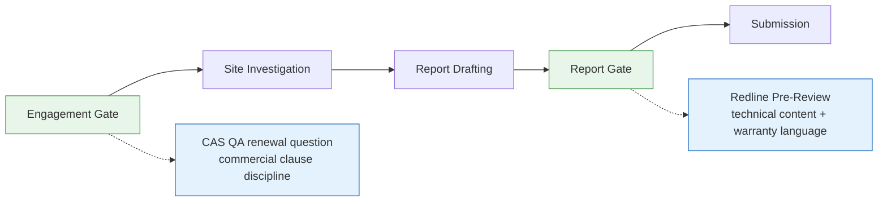

# Problem Statement: The Business-of-Engineering Quality Layer

**Status**: Draft v2. **Owner**: Mark. **Date**: 2026-05-14.
**Strategic bet**: [Bet 1 — The Free Skeleton Wedge Beats Paid Acquisition](../strategy/strategic-bets.md)
**Resolution source**: Founder Brain Dump Item 2.2 — Practice vs. Business of Engineering (resolved 2026-05-03, Ron + Graeme aligned).

---

## Context: Why This Problem Exists

Item 2.2 of the Founder Brain Dump Agenda distinguished two layers of engineering value:

- **Practice of engineering**: physical equations, calculation checks, design validation.
- **Business of engineering**: standards compliance for insurance, liability, and legal protection.

Ron and Graeme aligned: Redline's quality layer belongs squarely in the business lane. A design can work physically and still expose the firm to liability if the report does not comply with standards. That gap — between a technically sound design and a defensible, compliant document — is the problem Redline solves.

**Agreed positioning statement (Ron + Graeme, 2026-05-03)**: "We check the document, not the design."

---

## The Consultancy Pipeline: Known Gates

This is a living gate map. As Redline identifies where different quality interventions sit within the consultancy workflow, the map expands — but naming each gate also names what sits outside Phase 1 scope.

Gates shown in green are quality intervention points identified to date.

---

## Target User

Principal or intermediate engineer at a Small NZ or AU geotechnical consultancy (5–50 staff). These firms carry professional indemnity insurance, submit reports to councils and insurers, and operate without an in-house compliance function. They cannot afford dedicated Quality Assurance staff. They rely on individual engineers to self-check and on senior reviewers to catch what slips through.

**Economic buyer**: the firm's CEO or Principal Engineer. CEO priority hierarchy for Small firms: (1) Financial Performance, (2) Liability, (3) Talent.

---

## Core Pain

When a geotechnical report is submitted with a standards gap — a missing clause reference, an incorrect standard citation, a jurisdiction-specific requirement left unaddressed — the consequences flow to the firm, not the individual engineer: professional indemnity claims, council objections, project delays, and legal exposure. These are not theoretical risks. They are the consequences that Small-firm CEOs actively manage.

The engineer submitting the report has no systematic way to check for these gaps before the document leaves the building. Senior reviewers catch some, but they are already bottlenecked on engineering judgment. The applicable standards landscape (NZS, AS, NZGS, MBIE guidance, Canterbury-specific requirements) is too broad and too frequently updated for any individual to hold entirely in memory.

The job-to-be-done: the firm needs to demonstrate, at submission, that the report has been checked against the applicable standards framework — not because an engineer remembered everything, but because a systematic check was run and the gaps were flagged before sign-off.

---

## The QA Layer Distinction

Commercial QA and technical QA address different risks at different points in the project lifecycle. The CAS renewal question probes commercial QA: whether the firm uses industry-standard contract conditions, avoids signing bespoke client-drafted terms, and maintains upfront scope discipline. These risks crystallise at the moment of contract signature — before a bore log is reviewed or a report section drafted.

Technical QA operates at the report gate, after the engineering work is done. It asks whether the document evidence — the report submitted to a council or insurer — complies with the applicable standards framework. A firm can answer every CAS renewal question perfectly and still submit a report that omits a required clause reference under NZS 3604, cites a superseded standard, or fails to address a Canterbury-specific MBIE Part D requirement. The CAS renewal question has no visibility into the document. Redline does.

Warranty language drift is a specific failure mode that sits squarely in the technical QA domain. AI-assisted drafting tends to produce confident, declarative prose. That register can cross into warranty territory: a sentence such as "the ground will not liquefy under the design seismic event" is not a hedged professional opinion — it is an express warranty. A PI policy typically excludes liability for contractual guarantees of outcome. The CAS renewal question cannot detect this because it has no access to the report text. A Redline Pre-Review can flag it before the document leaves the building.

"We check the document, not the design" is the boundary — technical QA at the report gate is what Redline does.

---

## Measurable Outcome

A Small-firm principal can submit a geotechnical report and point to a completed Redline Pre-Review as evidence of standards due diligence — without adding material engineering review time. The Pre-Review output is a named, versioned artefact that the firm can attach to its professional indemnity file.

**Measurable proxy**: Pre-Review trial initiation rate among quota-exhausted skeleton users. Target: ≥ 20% of quota-exhausted Bet 1 users initiate at least one Pre-Review trial within 30 days of quota exhaustion.

---

## Strategic Link

Bet 1 acquires Small-firm engineers via the free Skeleton Generator. The quality layer is the paid conversion target that Bet 1's wedge is designed to unlock. Without a clear problem framing in the business-of-engineering lane, Pre-Review risks being positioned as a productivity tool — the wrong category and the wrong price ceiling per `positioning.md` — rather than as a liability risk management tool, which is the correct frame for the Small-firm CEO.

The "We check the document, not the design" positioning statement is the boundary condition: it anchors Redline in the business lane and explicitly out of the practice lane. CEO priority hierarchy for Small firms (Financial Performance > Liability > Talent) means the liability frame is the second-strongest value proposition, immediately behind financial impact — and reduced liability exposure has a direct financial consequence (lower PI insurance premiums, avoided claim costs, reduced write-off from rework).

---

## Constraints

- **Beachhead**: Small firms (5–50 staff), NZ and AU only. Medium firms follow bowling-pin expansion after Small-segment dominance. Large firms are explicitly out of scope — they build their own tools and require enterprise Security Operations Center (SOC2) compliance. See `strategic-bets.md` Bet 5 and Bet 6.
- **Switzerland-neutral**: Redline surfaces gaps; the engineer resolves them. No engineering opinions, no compliance attestation, no sign-off proxy. The product assists due diligence — it does not certify it. See `non-goals.md` items 1–2.
- **Standards Knowledge Store scope**: NZS, AS, NZGS, and jurisdiction-specific guidance (Canterbury: MBIE Part D, Canterbury City Council (CCC) Integrated Design Specification (IDS) Part 4). No structural, environmental, or civil drainage standards. See `non-goals.md` item 6.

---

## Non-Goal: Calculation-Checking

**Calculation-checking is not in scope for the beachhead.**

Calculation verification is a practice-of-engineering problem: it requires re-running the engineering mathematics against physical parameters and design inputs, not checking a document against a standards framework. It carries a different liability profile (if Redline's check is wrong, the firm has co-relied on a flawed design validation), a different competitive profile (calculation engines compete with structural and geotechnical analysis software, not document Quality Assurance tools), and a different trust profile (engineers must trust the calculation method, not just the clause reference). This is a different product with a different beachhead, sales motion, and professional indemnity exposure.

The "We check the document, not the design" boundary exists precisely to hold this line and to give the CEO a clear, defensible answer to the question: "What does Redline actually check?"

This does not foreclose a future product that addresses calculation-checking. It defers it deliberately.

---

## Non-Goal: Contract Clause Review at the Engagement Gate

Contract clause review would mean scanning bespoke, client-drafted contracts for deviations from ACENZ or CCCS standard terms — specifically: fitness-for-purpose warranties inserted by the client, removal of liability caps, and clauses granting unrestricted third-party reliance. This is a genuine risk for NZ consulting engineers and a known driver of PI claims.

It is not in Phase 1 scope. It operates at the engagement gate — before a project report exists — not at the report gate where Redline intervenes. The user is different: the principal negotiating the engagement contract, not the engineer finalising the report. The knowledge domain is different: contract law and deviation analysis against ACENZ/CCCS standard terms, not geotechnical reporting standards. The buying moment is different: a one-off decision at contract execution, not a recurring obligation at every report submission.

Ron has named this a deliberate non-goal for Phase 1. The engagement gate product direction will be reviewed when Phase 1 has its first paying firm and the report-gate value proposition is validated in market.

Redline's scope is the report gate; the engagement gate is a separate product direction.

---

## Next Step

1. Load `pm-hypothesis-builder` to formalise the liability-framing hypothesis: "Small-firm CEOs respond to the liability framing of the quality layer more than to an efficiency framing when contacted via outbound."
2. Update `docs/product/strategy/non-goals.md` to add calculation-checking as a named product non-goal, referencing this problem statement as the rationale source.
3. Hand off to `pm-prd-builder` when the hypothesis has a validation plan and the Pre-Review scope is defined.
