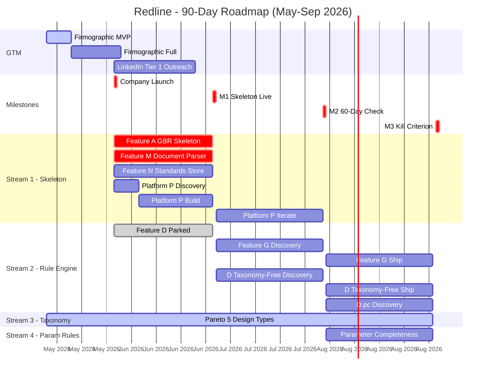

# 3-Month Roadmap — June–August 2026

> **Miro is canonical for this artifact.**
> This file is the synthesis layer only — it captures the decisions visible on the board but
> is not the source of truth for layout, status, or visual relationships.
>
> **Miro board**: [Redline — Product Management](https://miro.com/app/board/uXjVGgXTnIY=/?moveToWidget=3458764668404106570)
> (direct link to the roadmap table)

---

## Context

The founder's first official day is **2026-06-02**. This roadmap covers the first 90 days —
the period in which Bet 1's kill criterion must either pass or trip.

**Kill criterion for Bet 1**: By 2026-09-01, Redline must have ≥ 50 verified-email signups
and ≥ 5% outbound response rate from quota-exhausted users. Missing either number kills
the Free Skeleton Wedge without revival. See [strategic-bets.md](strategic-bets.md).

---

## Gantt Chart

---

## Roadmap Table

| Milestone / Feature | Bet | Month 1 — June 2026 | Month 2 — July 2026 | Month 3 — Aug 2026 | Kill / Gate |
|---|---|---|---|---|---|
| **[M1] Skeleton Generator live** | [Bet 1](strategic-bets.md) | Ship | — | — | First verified signups (Jun 30) |
| A — GBR Skeleton Generator | [Bet 1](strategic-bets.md) | Ship | — | — | Quota exhaustion → outbound |
| M — Document Parser | [Bet 1](strategic-bets.md) | Ship | — | — | Infra dependency of A |
| N — Standards Knowledge Store (MVP) | [Bet 3](strategic-bets.md) | Ship | — | — | NZ-only subset |
| P — Platform and Web Surface | [Bet 1](strategic-bets.md) | Discovery (Wk1) → Ship MVP (Wk2–4) | Iterate | — | SSO-gated signup flow live (Jun 30). See [platform-requirements.md](../../specs/003-platform-website/platform-requirements.md) |
| **[M2] 60-day warning check** | [Bet 1](strategic-bets.md) | — | Ship | — | KR1 ≥ 30 signups by Day 60 (Jul 31) |
| G — Justification Email Generator | [Bet 2](strategic-bets.md) | — | Discovery | Ship | Bottoms-up conversion |
| **[M3] 90-day kill criterion** | [Bet 1](strategic-bets.md) | — | — | Gate | 50 signups + 5% outbound → continue (Sep 1) |
| D — Inline Annotation Engine | [Bet 2](strategic-bets.md) | Parked | Discovery | Discovery | **P-030 decomposition required first** |
| **[M4] Pre-Review sprint kick-off** | [Bet 2](strategic-bets.md) | — | — | Ship | D decomposition session complete |
| D (taxonomy-free rules) — taboo words, undefined acronyms, ambiguity flags, unit inconsistencies, citation validator, section/structural completeness, passive voice/readability | [Bet 2](strategic-bets.md) | — | Discovery | Ship | 15–20 rules; no taxonomy dependency |
| Taxonomy Discovery (Graeme) — Pareto 5 design types | [Bet 3](strategic-bets.md) | Ship | Ship | Ship | Started 2026-05. No code dependency — domain research. Output: `design-type-taxonomy-and-parameter-completeness.md` |
| D.pc — Parameter Completeness Rules | [Bet 2](strategic-bets.md), [Bet 3](strategic-bets.md) | — | — | Discovery | Blocked until D engine scaffold + taxonomy validated |
| **[GTM] Firmographic spreadsheet — NZ civil engineering** | [Bet 1](strategic-bets.md) | MVP by 21 May → Full by 4 Jun | — | — | Tier 1 list (10–15 active LinkedIn posters) delivered to John before CEAS warm window closes (25 Jun). See [initiative scope](../../initiatives/firmographic-nz-engineering-scope.md) |
| **[GTM] LinkedIn social selling — Tier 1 outreach** | [Bet 1](strategic-bets.md) | Warm window open | Warm window closes 25 Jun | — | John executes against Tier 1 list. Hypothesis: [ceas-warm-window-linkedin-conversion.md](../../hypotheses/ceas-warm-window-linkedin-conversion.md). Evaluate at close of warm window. |

**Status key**: Ship = committed delivery · Discovery = design/research only · Parked = blocked (see below) · Gate = must-pass milestone · — = out of scope that month

---

## Development Streams — Parallelisation Plan (2026-05-04)

Four streams run in parallel. The key insight: taxonomy discovery (Stream 3) has no code
dependency and starts immediately, while the rule engine scaffold (Stream 2) proceeds
independently after P-030 unfreezes.

**Stream 1: Skeleton + Infra (Sprint 1 — current)**
Feature A (Skeleton Generator), Feature M (Document Parser), Feature N (Standards Store MVP),
Feature L (Audit Log). This is the vertical slice that must ship by M1 (2026-06-30).

**Stream 2: Rule Engine + Taxonomy-Free Rules (Sprint 2–3, after P-030 unfreezes)**
Feature D engine scaffold plus 15–20 taxonomy-free rules that require no design-type taxonomy:
taboo words, undefined acronyms, ambiguity flags, unit inconsistencies, citation validator,
section completeness, structural completeness, passive voice / readability.

**Stream 3: Taxonomy Discovery (starts 2026-05, parallel with all streams)**
Graeme validates parameter checklists for Pareto 5 design types: shallow foundations,
timber pole retaining walls, slope stability, liquefaction assessment, piled foundations.
No code dependency — this is pure domain research. Output target:
`docs/knowledge/geotechnical/report-writing/design-type-taxonomy-and-parameter-completeness.md`.

**Stream 4: Parameter Completeness Rules (Sprint 3–4, after Stream 2 engine + Stream 3 checklists)**
Encode validated parameter checklists as pluggable rules. Integration point: same rule
interface as taxonomy-free rules (takes parsed document, returns annotations). Presence
check only — no numeric validation.

**Key dependency**: Feature D decomposition remains parked under P-030 until Feature A ships.
Stream 3 is the only stream with no blocker — it starts now.

---

## Milestone Definitions

| ID | Date | Meaning |
|---|---|---|
| M1 | 2026-06-30 | Skeleton Generator live, SSO-gated, first verified signups received |
| M2 | 2026-07-31 | 60-day warning-signal checkpoint — KR1 signup count must be ≥ 30 to stay on track |
| M3 | 2026-09-01 | Kill-criterion deadline — 50 signups + 5% outbound response rate required to continue Bet 1 |
| M4 | 2026-08 | Pre-Review sprint kick-off — conditional on P-030 decomposition session being complete |

---

## Parked Items

**D — Inline Annotation Engine (P-030)**

Feature D cannot begin construction until:
1. Feature A (GBR Skeleton Generator) has shipped its first iteration, and
2. A dedicated decomposition session (decision parked as P-030) has been completed.

Month 2 and Month 3 entries for D are Discovery only — no production build is committed.
The P-030 session is a prerequisite gate; until it passes, D has no sprint commitment.

See [parked-decisions.md](decisions/parked-decisions.md) for the full P-030 record.

**Benton — Taxonomy Query Channel (P-035)**

The "Benton" concept — a conversational channel where users query design-type taxonomy
knowledge — is a GTM / sales-tooling item, not a product feature. It is parked under P-035.
If validated, it would serve as a sales enablement tool (demonstrate domain depth in live
calls) rather than a customer-facing product surface. No sprint commitment.

**Items not on this roadmap**: B, C (rejected/deferred); H, I (Phase 2, not in H2 2026 scope).

---

## Strategic Bet Coverage

| Bet | Coverage in this roadmap |
|---|---|
| Bet 1 — Free Skeleton Wedge | A, M, M1, M2, M3 (primary bet; kill criterion is the 90-day horizon) |
| Bet 2 — Pre-Review is Day-1 paid | G (discovery + ship), D (parked → discovery; taxonomy-free rules Sprint 2–3), D.pc (parameter completeness Sprint 3–4), M4 (sprint gate) |
| Bet 3 — Standards Knowledge Store is the moat | N (MVP ship in Month 1), Taxonomy Discovery (Stream 3, all months), D.pc (Stream 4, Month 3 discovery) |
| Bet 1 (GTM) — CEAS warm window | Firmographic spreadsheet (pre-M1 delivery), Tier 1 LinkedIn outreach (Month 1 → warm window close 25 Jun). See `strategy/gtm/2026-launch-plan.md`. |

Bets 4–6 are not surfaced in this horizon — they fall beyond the 90-day kill window.

---

> *Miro is canonical for this artifact. This file is the synthesis.*
> Last updated: 2026-05-14. Owner: Mark.
> GTM track added: firmographic spreadsheet + CEAS warm window LinkedIn outreach (Phase 1 activity, re-classified from Phase 2+ by Ron, 2026-05-14).
