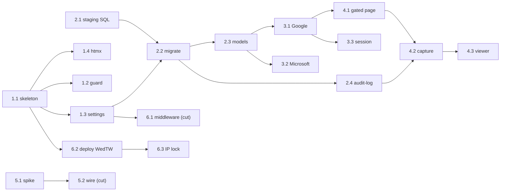

# Sprint 3 Plan — Jun 15–21, 2026

**Status**: Active. **Owner**: Founder.
**Generated**: 2026-06-12 (supersedes the 2026-06-11 draft, which was re-planned from scratch)

---

## Sprint Goal

> Deploy the first Django app in the monorepo to staging Cloud Run and prove the SSO-gated signal loop: a founder-access user signs in via Google **and** Microsoft, and only-when-authenticated clicks 3 placeholder buttons whose events are captured and viewable by the team.

**Success looks like**: On the staging `run.app` URL (access IP-restricted to the founder), signing in with both Google and Microsoft (django-allauth, ADR-025) lands an authenticated session. The post-login page shows 3 placeholder buttons; clicking each writes one event row (email, name, button id, timestamp) to the Cloud SQL audit log, visible to the team in Django admin. Logged-out visitors cannot see or click the buttons. Merge to master builds an image, pushes to Artifact Registry, and deploys to staging Cloud Run automatically.

**Failure looks like**: By Friday the Django app is not deployed, or sign-in fails for a provider, or button clicks do not produce captured event rows the team can see.

**Failure tripwire (verbatim)**: "If by Wednesday we have not seen the Django app running in the cloud, we will change course."

**Bet**: Bet 1 — The Free Skeleton Wedge (SSO-gated verified-email signup, B-1b / #73).
**OKR**: KR1 (verified-email signups — this sprint stands up the signup flow the KR measures).

---

## Capacity

Last sprint completed: 15 tasks (yesterday's weather — but Sprint 2 items were lighter infra one-liners).
This sprint planning for: 6 parents / 20 sub-tasks. **Held tight by complexity, not count:** 13 sub-tasks are greenfield (first Django in the repo, per Peter's decomposition). A **cut line** protects the critical path — below-the-line items yield first.

**Cut line (yield first, in order):** 5.2 external analytics wiring → 6.1 error middleware → (DNS already deferred to Sprint 4). Each can slip without falsifying the goal: events still land in the Cloud SQL audit-log floor, and the demo runs on `run.app`.

---

## Committed Tasks — WBS

| # | Issue | Task / Sub-task | Agent | Done when | Risk |
|---|---|---|---|---|---|
| 1 | #153 | **Django web shell scaffold** | Peter | App runs | Med |
| 1.1 | #159 | — Django project skeleton ★d1 | Peter (Kabilan impl) | `runserver`→200; `check` clean; Django in deps | Low |
| 1.2 | #160 | — Layer-guard import contract | Peter | import-linter fails if `domain` imports `django.*` | Low |
| 1.3 | #161 | — Settings + 12-factor config | Peter (Kabilan impl) | Boots from env only; `DEBUG=False` boots | Med |
| 1.4 | #162 | — HTMX vendoring | Peter (Kabilan impl) | Vendored htmx served; no Node/build step | Low |
| 2 | #154 | **Platform-state data layer (staging Cloud SQL)** | Peter | migrate on staging | High |
| 2.1 | #163 | — Provision staging Cloud SQL (Auth Proxy) ★d1 | Brent¹ | Auth-Proxy instance live (Sydney, backups/PITR); conn name + secret in boundary contract | High |
| 2.2 | #164 | — Django DATABASES + migrate ★d1 | Peter (Kabilan impl) | `migrate` succeeds local + staging Cloud Run | High |
| 2.3 | #165 | — User + identity models ★d1 | Peter (Kabilan impl) | `(provider,subject)` + stable internal id (ADR-025); in admin | High |
| 2.4 | #166 | — Audit-log model | Peter (Kabilan impl) | Append-only row: email, name, button_id, ts | Med |
| 3 | #155 | **Launch sign-in: Google + Microsoft SSO** | Peter | Both providers authenticate | High |
| 3.1 | #167 | — allauth Google ★d1 | Peter (Kabilan impl) | Google consent → authenticated; cookie set | High |
| 3.2 | #168 | — allauth Microsoft ★d1 | Peter (Kabilan impl) | Microsoft (work+personal) → authenticated | High |
| 3.3 | #169 | — Session-establish primitive | Peter (Kabilan impl) | Callback ends in named session-establish (bearer additive, ADR-025 A2) | Med |
| 3.4 | #170 | — OAuth secrets → Secret Manager | Brent¹ | Both client secrets in Secret Manager (Sydney); no plaintext | Low |
| 4 | #156 | **Auth-gated buttons + event capture** | Peter | Gated page; clicks captured | Med |
| 4.1 | #171 | — Auth-gated button page | Peter (Kabilan impl) | Logged-out→redirect; logged-in→3 buttons (negative test) | Low |
| 4.2 | #172 | — Click → event capture | Peter (Kabilan impl) | Each click writes one audit row | Med |
| 4.3 | #173 | — Team event viewer | Peter (Kabilan impl) | Team lists events in Django admin | Low |
| 5 | #157 | **Product analytics platform: spike + wire** | Peter | Spike + additive wire | Med |
| 5.1 | #174 | — Analytics platform spike ★d1 | Peter | Platform with **CLI/MCP/API** chosen day-1 + decision note; DB floor stands | Med |
| 5.2 | #175 | — Wire chosen platform *(cut line)* | Peter (Kabilan impl) | Team sees who logged in + clicks | High |
| 6 | #158 | **CI/CD + staging Cloud Run + IP lock** | Brent¹ | Merge→build→deploy | Med |
| 6.1 | #176 | — ADR-018 error middleware *(cut line)* | Peter (Kabilan impl) | `{code,message,trace_id}`; no stack leak | Med |
| 6.2 | #177 | — Cloud Run deploy on merge ★Wed | Brent¹ | Merge to master → app live on staging `run.app` (tripwire) | Med |
| 6.3 | #178 | — Lock staging ingress to founder IP | Brent¹ | Only founder IP reaches app; OAuth callback works (supersedes #71) | Med |

¹ **Resolved 2026-06-12:** the board `Agent` field now has a Brent option; #158, #163, #170, #177, #178 are tagged **Brent** on the board.

**Dependency order**: `1.1 → (1.3, 2.1) → 2.2 → 2.3 → {3.1, 3.2}`; `3.1 → {3.3, 4.1}`; `{4.1, 2.4} → 4.2 → 4.3`; `5.1 → 5.2`; `1.1 → 6.2 → 6.3`; `1.3 → 6.1`. Parent chain `P1 → P2 → P3 → P4`. The 4 High-risk zero-prior-art items (2.1, 2.2/2.3, 3.1, 3.2) and the spike (5.1) start Monday.

---

## Explicitly Out of Scope

| Task | Deferred to | Reason |
|---|---|---|
| DNS repoint redmarklogic.com → app | Sprint 4 | `run.app` is the POC front door (ADR-027); demo + tripwire run there |
| Cloud SQL connection-strategy ADR (Peter) | Sprint 4 | Gates *production* traffic only; staging migrate doesn't need it |
| Cloud SQL budget controls (80/100/150) | Sprint 4 | Prod gate — DB bills 24/7; not needed for staging week-one |
| Production Cloud SQL + prod deploy | Sprint 4 | Sprint 3 proves on staging |
| HTTPS Load Balancer + Cloud Armor | Dropped | Conflicts ADR-027 (ALB rejected); IP lock is via Cloud Run ingress |
| Bearer tokens, quota model, `build_skeleton` view, email fallback, account-linking | Later epics | Peter's deferral table (ADR-025 A2/A4, ADR-024 D6) |

---

## Sprint Risks

| Risk | Likelihood | Impact | Mitigation |
|---|---|---|---|
| 13/16 sub-tasks greenfield (no Django prior art) | High | High | Notebook `django-application-development` as per-task reference; ADR-024 licenses Phase-1 architecture as disposable |
| Dual-IdP OAuth friction (Azure app reg, consent screens) | Med | High | Google first; tripwire needs only the app running, not SSO; Microsoft follows |
| Cloud SQL connection rabbit-hole (#2.1/2.2) | Med | High | Auth Proxy via built-in connector (Brent-recommended); staging instance early; ADR gates prod, not the spike |
| CI/CD first-green-deploy time-sink | Med | Med | Pipeline exists for FastAPI; manual deploy by Tue de-risks; Wed tripwire guards it |
| Analytics platform has nowhere to land events | Low | Med | DB audit-log floor (2.4) is non-negotiable; external platform additive |
| One-week solo capacity overrun | Med | Med | Cut line: 5.2, 6.1 yield first; DNS already Sprint 4 |

---

## Kickoff Checklist

- [x] Goal + task list confirmed by founder (Hard Gate 1)
- [x] **[BLOCKING]** Close gate (Hard Gate 4): 6 parents on board == WBS level-1 count; Sprint field on all 26; 21 dependencies written; all 20 level-2 rows linked as sub-issues (mirror rule)
- [x] Out-of-scope list ≥ 3 (Hard Gate 3)
- [x] this-week.md regenerated
- [ ] Cloud SQL connection-strategy ADR (Peter, from Brent's analysis) — prod gate, runs in parallel
- [ ] Cleanup: close duplicate #71 (superseded by #178) — founder action

**Failure tripwire**: "If by Wednesday we have not seen the Django app running in the cloud, we will change course."
