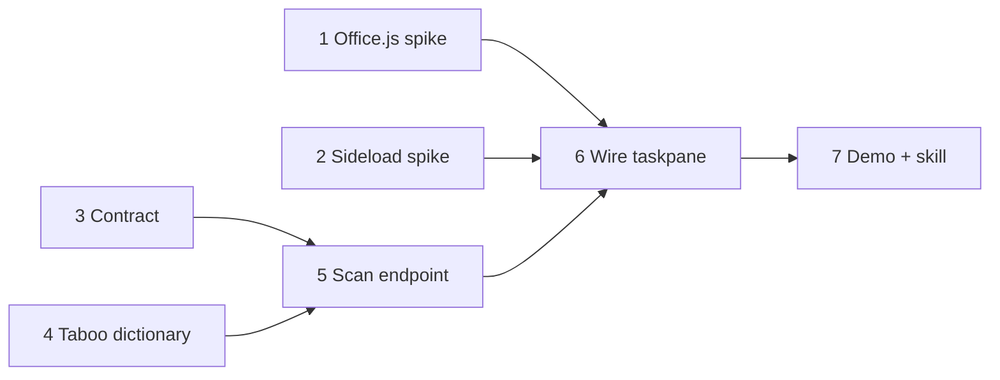

# Sprint 4 Plan — Jun 22–28, 2026

**Status**: Active. **Owner**: Founder.
**Generated**: 2026-06-13

---

## Sprint Goal

> A local end-to-end proof of concept exists: a Microsoft Word taskpane with one
> "Check document" button calls a new API endpoint that regex-scans the document
> against an SME-sourced taboo-word dictionary, and flagged words appear in the
> document with replacement suggestions — demonstrable by Fri Jun 26.

**Success looks like**: A user opens Word, clicks "Check document" in the taskpane,
and within seconds the taboo words in the document are visibly marked (content
controls or comments) with replacement suggestions shown. The taskpane is plain
HTML + vanilla JavaScript served from our Python stack — no Node.js toolchain.
A placeholder bearer token travels end-to-end, proving the ADR-025 auth path.

**Failure looks like**: No working taskpane sideloaded in desktop Word by Wednesday.

**Failure tripwire (verbatim)**: "If by Wednesday we have not seen a working
Microsoft taskpane, we will stop."

**Bet**: Bet 2 — Pre-Review Mode Is the Paid Product Day-1 (the taskpane is the
delivery surface for the inline annotation engine; this PoC de-risks its
technical path).
**OKR**: Feeds the Pre-Review product line; no direct KR this sprint — enabling
evidence for the Feature D (Inline Annotation Engine) PRD.

---

## Capacity

Last sprint completed: 11 tasks (Sprint 2, yesterday's weather)
This sprint planning for: 7 tasks — held below ceiling because tasks 2 and 6 are
high-risk novel work (no Word-add-in prior art in this codebase; 2 days each).

---

## Committed Tasks — WBS

| #   | Task / Sub-task | Agent | Done when / Description | Risk |
|-----|---|---|---|---|
| 1   | **Office.js spike (Script Lab)** ([#185](https://github.com/redmarklogic/redline/issues/185)) | Peter | Scan→mark→replace proven in Word, zero infrastructure — Kabilan implements | Med |
| 1.1 | — Read + find words in body ([#186](https://github.com/redmarklogic/redline/issues/186)) | Peter | Snippet locates hard-coded word list in doc text — Kabilan implements | Med |
| 1.2 | — Mark found ranges ([#187](https://github.com/redmarklogic/redline/issues/187)) | Peter | Content-control BoundingBox + color visible; comments as fallback — Kabilan implements | Med |
| 1.3 | — Replace range text ([#188](https://github.com/redmarklogic/redline/issues/188)) | Peter | `insertText "Replace"` swaps a flagged word — Kabilan implements | Low |
| 2   | **Python-served taskpane sideloaded** ([#189](https://github.com/redmarklogic/redline/issues/189)) | Peter | Hello-world pane in desktop Word from Python, no Node; auth gate passed — Kabilan implements | High |
| 2.1 | — Adapt Masterjx9 template ([#190](https://github.com/redmarklogic/redline/issues/190)) | Peter | Pane served over HTTPS via Python dev-certs port — Kabilan implements | Med |
| 2.2 | — Word manifest + desktop sideload ([#191](https://github.com/redmarklogic/redline/issues/191)) | Peter | Trusted-catalog sideload confirmed (notebook gap) — Kabilan implements | High |
| 2.3 | — Edit-to-refresh cycle verified ([#192](https://github.com/redmarklogic/redline/issues/192)) | Peter | Save → pane reload shows change, documented — Kabilan implements | Low |
| 2.4 | — Auth-compatibility check, ADR-025 A1 ([#193](https://github.com/redmarklogic/redline/issues/193)) | Peter | Bearer header on fetch + Office Dialog API confirmed from static pane; unsupported = approach disqualified — Kabilan implements | Med |
| 3   | **API↔taskpane contract** ([#194](https://github.com/redmarklogic/redline/issues/194)) | Peter | JSON schema: doc text in → flags + suggestions out; Bearer header + user-identity field (placeholder token) | Low |
| 4   | **Taboo-word dictionary** ([#195](https://github.com/redmarklogic/redline/issues/195)) | Graeme | ≥10 GBR/GIR taboo words + replacements + rationale | Low |
| 5   | **Taboo-scan endpoint** ([#196](https://github.com/redmarklogic/redline/issues/196)) | Peter | curl returns flags + suggestions; served same-origin as pane — Kabilan implements | Med |
| 6   | **Wire taskpane to endpoint** ([#197](https://github.com/redmarklogic/redline/issues/197)) | Peter | Click "Check document" → flags + suggestions in Word; placeholder bearer end-to-end — Kabilan implements | High |
| 7   | **Demo + taskpane skill writeup** ([#198](https://github.com/redmarklogic/redline/issues/198)) | Founder | Happy path demoed; taskpane skill (principles, contract, limitations, auth pattern) filed | Low |

**Dependency order**: Spikes 1 and 2 and dictionary 4 run in parallel from Monday;
contract 3 Tuesday; endpoint 5 waits on 3 + 4; wiring 6 waits on 1, 2, 5; demo 7
closes the chain. Critical path: 2 → 6 → 7.

### Schedule

| #   | Task                        | Track | Start  | Target | Days |
|-----|-----------------------------|-------|--------|--------|------|
| 1   | Office.js spike             | A     | Jun 22 | Jun 22 | 1    |
| 1.1 | — Find words in body        | A     | Jun 22 | Jun 22 | 1    |
| 1.2 | — Mark found ranges         | A     | Jun 22 | Jun 22 | 1    |
| 1.3 | — Replace range text        | A     | Jun 22 | Jun 22 | 1    |
| 2   | Sideload spike              | B     | Jun 22 | Jun 23 | 2    |
| 2.1 | — Adapt Masterjx9 template  | B     | Jun 22 | Jun 22 | 1    |
| 2.2 | — Manifest + sideload       | B     | Jun 22 | Jun 23 | 2    |
| 2.3 | — Edit-to-refresh cycle     | B     | Jun 23 | Jun 23 | 1    |
| 2.4 | — Auth-compatibility check  | B     | Jun 23 | Jun 23 | 1    |
| 3   | API↔taskpane contract       | A     | Jun 23 | Jun 23 | 1    |
| 4   | Taboo-word dictionary       | C     | Jun 22 | Jun 22 | 1    |
| 5   | Taboo-scan endpoint         | A     | Jun 24 | Jun 24 | 1    |
| 6   | Wire taskpane to endpoint   | B     | Jun 24 | Jun 25 | 2    |
| 7   | Demo + skill writeup        | B     | Jun 26 | Jun 26 | 1    |

Tripwire checkpoint: Wednesday Jun 24 — task 2 (working taskpane) must be done
(target Jun 23) before wiring starts.

---

## Explicitly Out of Scope

| Task | Deferred to | Reason |
|---|---|---|
| Bearer-token issuance + dialog-auth implementation ([#149](https://github.com/redmarklogic/redline/issues/149)) | Backlog (trigger: add-in epic) | ADR-025 Amendment 1 defers it; this sprint proves compatibility only |
| "Fix" one-click replace wired in the pane | Sprint 4 stretch / Sprint 5 | Should-have; the primitive is proven in 1.3 regardless |
| Deployment of taskpane/endpoint to GCP | Sprint 5+ | PoC is local-only by goal definition |
| Taskpane visual design (Fluent UI, UX patterns) | Add-in epic | Minimal one-button pane only; Matt not engaged |
| Office SSO / Nested App Authentication | Backlog | ADR-025: only if double sign-in becomes a measured complaint |
| Draft PRD: Inline Annotation Engine ([#37](https://github.com/redmarklogic/redline/issues/37)) | Backlog | PoC produces evidence for the PRD; writing it is not sprint-4 work |

---

## Sprint Risks

| Risk | Likelihood | Impact | Mitigation |
|---|---|---|---|
| Sideloading friction (HTTPS certs, trusted catalog) burns day 1–2 | Med | High | Riskiest task first (Mon); tripwire watches exactly this; Masterjx9 Python dev-certs port |
| Office.js marking method unsupported in installed Word build | Med | Med | "Any visible marking" accepted; content controls grounded in notebook sources; decided in spike 1, not Thursday |
| CORS/mixed-content blocks pane→API call | Low | High | Serve pane static files from the same Python app — one origin |
| Discovery rabbit hole hunting for templates | Med | Med | Discovery timeboxed to Monday; output is working hello-world, not a survey |
| Dictionary late from Graeme | Low | Low | Build against 5-word placeholder; swap is a data change |
| Chosen approach fails the auth-compatibility gate (ADR-025 A1) | Low | High | Checked Tuesday (2.4) before any wiring; disqualification forces approach change with 3 days left |

---

## Kickoff Checklist

- [x] Goal + task list confirmed by founder (Hard Gate 1)
- [x] **[BLOCKING]** Close gate passed (Hard Gate 4): 7 items == 7 WBS level-1 rows; Sprint field on all; distinct Start/Target dates per schedule; 6 dependencies written via set-dependencies; 7 sub-issues linked (mirror rule)
- [x] Out-of-scope list ≥ 3 (Hard Gate 3)
- [ ] this-week.md regenerated — deferred to Sprint 4 start (Mon Jun 22): the file currently serves Sprint 3 (Jun 15–21), which has not yet run; overwriting it now would erase the active week's view
- [x] Every prerequisite task Done or committed this sprint
- [x] No task flagged unestimable (notebook research + Masterjx9 template + ADR-025 research constitute prior art)
