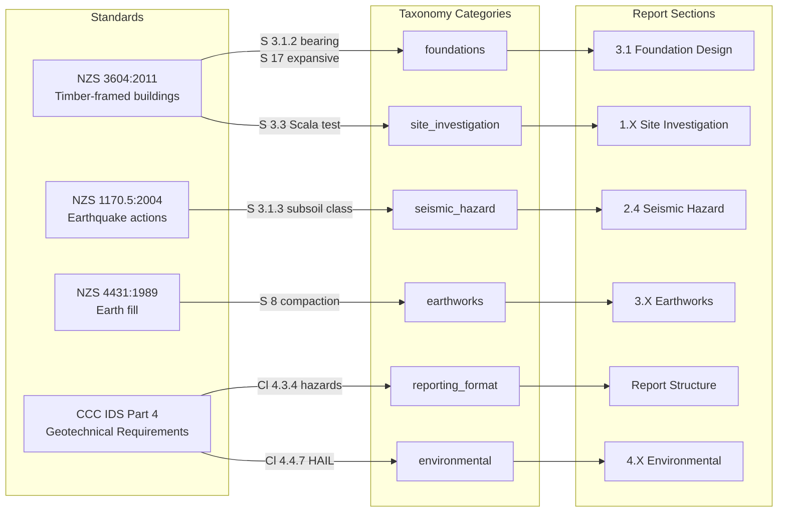

# Extracting and Dispatching Relevant Clauses from Engineering Standards

**Date**: 2026-04-13
**Research question**: What are the structured methodologies and software architecture practices for extracting, interpreting, and dispatching relevant clauses from engineering standards (e.g., ISO, NZS) to identify applicability for a specific project or report section?
**Actor**: A product owner and automation engineer building a category-based rule dispatch system for engineering standards in the Redline project.
**Redline domains**: Standards Registry, Rule Dispatch, Document Generation

---

## Summary

Extracting rules from dense engineering standards requires a structured linguistic methodology and a robust software architecture to ensure precision. The process involves establishing document hierarchy, filtering scope via standard flow charts, and extracting "Key Achievement Criteria" using strict linguistic rules (e.g., normative vs. informative text). Architecturally, this maps perfectly to Domain-Driven Design (DDD) patterns—specifically the Specification Pattern for applicability, the Knowledge Level pattern to separate rules from operational code, and a Microkernel/Dispatcher architecture to route rules by category to the right project sections.

## Findings

### Structured Methodology for Interpreting Standards

When parsing engineering standards (like NZS 3604 or ISO), the following step-by-step methodology ensures accurate clause extraction:

1. **Establish Document Hierarchy**: Local council or specific infrastructure standards override broad national or international standards. For example, "Where a conflict exists between any Standard and the specific requirements outlined in the IDS (Infrastructure Design Standard), the IDS takes preference" [Source: IDS Manual, §1.2].
2. **Determine Scope and Applicability**: Use scoping flow charts provided in the standards to filter out irrelevant projects. For example, NZS 3604 uses a strict "Flow chart for limitations and scope" based on wind zones and Importance Levels. If a project falls outside these limits, standard rules are voided, requiring Specific Engineering Design (SED).

   ```mermaid
   graph TD
       Start([Evaluate Project Parameters]) --> IL{Importance Level ≤ 2?}
       IL -- Yes --> WZ{Wind Zone ≤ Extra High?}
       IL -- No --> SED[Require Specific Engineering Design / SED]
       WZ -- Yes --> Scope[In Scope: Apply NZS 3604 Standard Rules]
       WZ -- No --> SED
   ```
3. **Apply Linguistic Rules**:

   - **Normative vs. Informative**: Only extract "normative" text (mandatory compliance) and ignore "informative" text (guidance).
   - **Strict List Comprehension**: Every item in a list must be adopted to comply, unless explicitly stated as an option.
   - **Ambiguity Qualifiers**: Flag subjective words like "suitable," "adequate," or "reasonably practicable," as these indicate reliance on engineering judgment rather than prescriptive compliance.
4. **Extract "Key Achievement Criteria"**: Identify specific elements critical to quality compliance. Every extracted rule must map directly back to proving one of these key criteria.
5. **Structure into Tabular Schedules**: Convert text into actionable data (like an "Inspection & Test Schedule" or "Compliance Requirements Checksheet") with fields for Phase/Material, Specification Reference, Acceptance Criteria, and Hold/Witness Points.

### Architectural Mapping for Rule Dispatch

Translating dense regulatory text into an automated, category-based dispatch system aligns strongly with several DDD and architectural patterns:

1. **The Specification Pattern (Applicability)**: Instead of hardcoding conditional logic, model each regulatory clause as a standalone `Specification` object. A Specification acts as a true/false predicate to determine if a rule evaluates to true for a given project section.
2. **The Knowledge Level Pattern (Modeling Text)**: Separate the system into an operational level and a knowledge level. The engineering standards themselves form the Knowledge Level—distinct rule objects that configure how the operational system determines applicability, allowing standards to be updated without rewriting core application code.
3. **Microkernel Architecture (Managing Multiple Standards)**: Treat the category-based rule dispatch system as the core engine, while specific ISO or NZS standards are modeled as independent plug-in components.
4. **Dispatcher and Strategy Patterns (Routing)**: Once a `Specification` deems a rule applicable, a `Dispatcher` evaluates the rule's category against the system's **taxonomy** and uses `Strategy` objects (encapsulated dispatch logic for different categories) to route the rule to the appropriate project section.

### Worked Example: Mapping Standards to Report Sections

To illustrate the methodology above, the following example maps four NZ engineering standards to specific report sections for a residential Geotechnical Interpretive Report (GIR). This is not exhaustive — it selects clauses that best demonstrate the extraction and dispatch pattern.

#### Standards-to-Report-Section Mapping Table

| Standard                                             | Clause   | Rule extracted                                                                                                   | Report section                |
| ---------------------------------------------------- | -------- | ---------------------------------------------------------------------------------------------------------------- | ----------------------------- |
| **NZS 3604:2011** (Timber-framed buildings)    | S 3.1.2  | "Good Ground" must permanently withstand an ultimate bearing capacity of 300 kPa                                 | Foundation Design             |
|                                                      | S 3.1.3  | Organic topsoil, soft peat, soft clay, and uncertified fill are excluded from "Good Ground"                      | Site Classification           |
|                                                      | S 3.3    | Scala Penetrometer test must reach at least 2 m below proposed footing                                           | Site Investigation            |
|                                                      | S 17     | Expansive soil thresholds: liquid limit > 50%, linear shrinkage > 15%                                            | Expansive Soils Assessment    |
| **NZS 1170.5:2004** (Earthquake actions)       | S 3.1.3  | Classify site subsoil from Class A (Strong Rock) to Class E (Very Soft Soil) to determine earthquake multipliers | Seismic Hazard Assessment     |
| **NZS 4431:1989** (Earth fill for residential) | S 8      | Construction procedures and compaction acceptance criteria for engineered fill platforms                         | Earthworks                    |
| **CCC IDS Part 4** (Geotechnical Requirements) | Cl 4.3.4 | Report must include assessments for liquefaction, lateral spread, rockfall, and bearing capacity                 | Report Structure (Canterbury) |
|                                                      | Cl 4.3.6 | Geotechnical Completion Report must include tabular data for council LIM systems                                 | As-Built Records              |
|                                                      | Cl 4.4.7 | Environmental evaluation required for Contaminated Sites (HAIL sites)                                            | Environmental / Contamination |

#### Dispatch Flow

The diagram below shows how specific clauses from these four standards fan out to report sections via the category taxonomy. Each standard contributes rules to one or more categories; the Dispatcher routes each rule to its target section.



#### Reading the Example

1. **NZS 3604 S 3.1.2** is a normative rule ("must withstand 300 kPa"). It maps to the `foundations` category and dispatches to the Foundation Design report section.
2. **NZS 3604 S 3.3** prescribes a test method (Scala Penetrometer to 2 m depth). It maps to `site_investigation` — a different category from the bearing rule, even though both come from the same standard.
3. **CCC IDS Cl 4.3.4** is a council-level override that dictates report structure for Canterbury projects. It maps to `reporting_format` and only fires when `jurisdiction = "Canterbury"`.
4. **CCC IDS Cl 4.4.7** triggers environmental assessment for HAIL (Hazardous Activities and Industries List) sites — an example of a rule conditioned on site-specific data, not just project type.

This demonstrates the core principle: a single standard contributes rules to multiple taxonomy categories, and the Dispatcher routes each rule independently based on its category and applicability conditions.

## Implications for Redline

- **Standards Registry Concept**: The current `standards-registry.md` concept strongly parallels the DDD Knowledge Level and Microkernel patterns. We must ensure the automation pipeline explicitly implements the **Specification Pattern** in Tier 2 (Applicability conditions) to evaluate variables like `project_types` and `jurisdictions`.
- **Extraction Pipeline**: The AI extraction pipeline must be prompt-engineered to respect the "Linguistic Rules" finding—specifically distinguishing normative vs. informative text, and flagging Ambiguity Qualifiers (e.g., "adequate", "suitable") for human review.
- **Rule Structure**: Tier 1 (The rule itself) should be expanded to ensure it explicitly maps to a "Key Achievement Criterion" or measurable "Acceptance Criteria", matching the best practice of Tabular Schedules.

## Open Questions

- How will the system encode and evaluate the flow charts (decision trees) that dictate overall scope applicability before evaluating individual clause rules?
- How should the extraction pipeline handle updating a rule when a standard releases a new revision (e.g., managing the Knowledge Level versioning)?

## Glossary

| Term                               | Definition                                                                                                                |
| ---------------------------------- | ------------------------------------------------------------------------------------------------------------------------- |
| **Normative Text**           | Text in a standard that identifies a mandatory requirement for compliance.                                                |
| **Informative Text**         | Text providing guidance or background information; not mandatory for compliance.                                          |
| **SED**                      | Specific Engineering Design; required when a project falls outside the scope of prescriptive standards.                   |
| **Knowledge Level**          | A DDD pattern separating configurable rules/metadata (the standards) from the core operational logic.                     |
| **Specification Pattern**    | A DDD pattern that extracts business rules into explicit, standalone objects that act as true/false predicates.           |
| **Microkernel Architecture** | An architectural style separating a core processing engine from standalone plug-in components (e.g., specific standards). |

## Sources Consulted

| Notebook                                     | Queries asked | Citations returned                                                                                                                   |
| -------------------------------------------- | ------------- | ------------------------------------------------------------------------------------------------------------------------------------ |
| Engineering Standards                        | 1             | [Source: IDS Manual], [Source: NZS 3604 Flow Chart], [Source: Normative linguistic rules], [Source: CSS Part 6]                      |
| Software Architecture & Domain-Driven Design | 1             | [Source: Evans DDD], [Source: Specification Pattern], [Source: Knowledge Level Pattern], [Source: Fowler / Microkernel Architecture] |

---

## Appendix: Chatbot Simulation -- Standards Clause Finder

The following simulates a "Standards Clause Finder" chatbot that, given a plain-language project description, identifies applicable standards, extracts exact clauses, and maps each to the correct report section.

### User Prompt

> I'm preparing a geotechnical assessment for a new residential subdivision in eastern Christchurch, NZ. The site is flat, reclaimed land with shallow groundwater at 1.5 m depth. We're building timber-framed houses with shallow foundations. The site is mapped TC3 for liquefaction. What standards and clauses do I need to address?

### Chatbot Response

Based on your project description, I have identified **4 governing standards** containing **13 clauses** that apply to your geotechnical report.

#### 1. CCC IDS Part 4 -- Geotechnical Requirements

*This is your governing local standard. It overrides national standards where conflicts exist.*

| Clause                   | Requirement                                                                                                                                              | Report Section                      |
| ------------------------ | -------------------------------------------------------------------------------------------------------------------------------------------------------- | ----------------------------------- |
| **Cl 4.3.4**       | Report must document soil types, liquefaction & lateral spread assessment, bearing capacity, and hazard mitigation per RMA s 106                         | Executive Summary, Report Structure |
| **Cl 4.4.6**       | Check council records for historic, uncertified, or contaminated fill on reclaimed land. Discuss remediation proposals with Council early                | Desk Study / Site History           |
| **Cl 4.5 & 4.5.1** | Establish natural long-term seasonal groundwater levels via borings. Extended monitoring likely required given 1.5 m depth                               | Groundwater Assessment              |
| **Cl 4.5.3**       | Advise measures for marine/estuarine soils, compressible soils, and soils subject to liquefaction -- all expected on reclaimed eastern Christchurch land | Geological Model                    |
| **Cl 4.4.9**       | Mandates use of MBIE Part D and NZGS Module 3 for TC3 subdivision assessments                                                                            | Liquefaction Assessment             |
| **App I**          | Sign and attach "Statement of Professional Opinion on the Suitability of Land for Subdivision" (boilerplate legal form)                                  | Appendices / Certification          |

#### 2. NZS 3604:2011 -- Timber-Framed Buildings

*Even though the houses are standard timber-frame, the ground conditions must be evaluated against this code.*

| Clause                    | Requirement                                                                                                                                                        | Report Section      |
| ------------------------- | ------------------------------------------------------------------------------------------------------------------------------------------------------------------ | ------------------- |
| **S 3.1.2**         | Determine if site provides "Good Ground" (ultimate bearing capacity >= 300 kPa)                                                                                    | Bearing Capacity    |
| **S 3.1.3**         | Reclaimed fill, liquefiable soil, and soft clay are**excluded** from "Good Ground". Your site **fails** this test -- report must state SED is required | Site Classification |
| **S 3.3.4 & 3.3.7** | Scala Penetrometer testing: >= 5 blows/100 mm to 2x footing width, >= 3 blows/100 mm at greater depths, to minimum 2 m below footing                               | Field Investigation |

#### 3. MBIE Part D & NZGS Module 3 -- Liquefaction Guidelines

*Triggered by IDS Cl 4.4.9 because the site is TC3.*

| Standard                         | Requirement                                                                                    | Report Section                           |
| -------------------------------- | ---------------------------------------------------------------------------------------------- | ---------------------------------------- |
| **MBIE Part D** (Dec 2012) | Prescribes CPT grid spacing, depth, and test type for TC3 subdivisions                         | Field Investigation Scope                |
| **NZGS Module 3**          | Calculate vulnerability to ground surface disruption, lateral spread, slumping, and sand boils | Liquefaction & Lateral Spread Assessment |

#### 4. NZS 4431:1989 -- Earth Fill

*Triggered if the subdivision design raises ground level above the shallow water table.*

| Clause                         | Requirement                                                                                                                        | Report Section                  |
| ------------------------------ | ---------------------------------------------------------------------------------------------------------------------------------- | ------------------------------- |
| **S 8** (+ IDS Cl 4.8.3) | All controlled residential earthfills must comply with NZS 4431 compaction standards, testing frequencies, and dry density targets | Earthworks / Ground Improvement |

#### Key Findings

> **Site fails NZS 3604 "Good Ground"** on three independent grounds (reclaimed fill, liquefiable soil, shallow groundwater). The report must explicitly state that Specific Engineering Design (SED) is required for all foundations.

> **Council trigger**: CCC IDS Cl 4.4.6 requires you to check council records for contaminated fill history **before fieldwork begins** -- this is often missed and results in RFIs (Requests for Information) from council.

### Relevance to Project Manager and Project Director Roles

The output above directly supports the responsibilities of both the PM and PD as defined in company role descriptions.

**For the Project Manager (PM)**

| PM Responsibility                | How the output helps                                                                                                                                                                 |
| -------------------------------- | ------------------------------------------------------------------------------------------------------------------------------------------------------------------------------------ |
| **Project Delivery / PMP** | Provides a pre-structured compliance checklist at kick-off — enabling proactive scope management without manual cross-referencing of four separate standards documents.             |
| **Quality Assurance**      | Flags that the site fails NZS 3604 "Good Ground" and requires SED, preventing a deliverable from reaching technical review with a missing or incorrect foundation recommendation.    |
| **Change Control**         | The "Council trigger" callout (IDS Cl 4.4.6 — check contaminated fill records before fieldwork) is an early warning that prevents scope creep and unplanned variations mid-project. |
| **Contract Management**    | Knowing upfront which clauses apply (e.g., Appendix I — Statement of Professional Opinion) means the PM can ensure the contract covers all required deliverables from day one.      |

**For the Project Director (PD)**

| PD Responsibility                              | How the output helps                                                                                                                                                                                                                                     |
| ---------------------------------------------- | -------------------------------------------------------------------------------------------------------------------------------------------------------------------------------------------------------------------------------------------------------- |
| **Project Governance / Risk Management** | Surfaces regulatory requirements the PMP must address. A PD reviewing project setup can instantly verify the PM has accounted for TC3 liquefaction obligations, council-specific IDS requirements, and SED triggers — key inputs to the risk register.  |
| **Commercial Oversight**                 | IDS Cl 4.4.9 mandates MBIE Part D investigation (CPT grids, specific depths) before fieldwork is scoped. Knowing this upfront ensures the fee reflects actual investigation requirements — missed clauses lead to underquoted scope and margin erosion. |
| **Quality Assurance**                    | The PD's KPI is "deliverables fit for purpose, minimising rework." The clause finder ensures no governing standard is omitted before technical review, directly reducing the rework loop.                                                                |
| **Client Alignment**                     | The structured output — clause numbers, plain-English requirements, and report sections — is directly shareable with a client or their representative to demonstrate compliance rigour.                                                                |

**Core value proposition for both roles**: the tool converts regulatory knowledge from *in the engineer's head* into an *auditable, structured checklist* at the start of every project — which is precisely what a PMP, a quality review, and a commercially sound contract all depend on.

---

## Appendix: Copyright and Licensing Constraints on Standards Text

### The Problem

NZ engineering standards (e.g., NZS 3604, NZS 1170.5, NZS 4431) are distributed under a Single User PDF licence by Standards New Zealand on behalf of the NZ Standards Executive. The licence terms are unusually restrictive and have direct implications for any system that stores, embeds, or retrieves clause text.

### Key Prohibitions (verbatim from the T&C)

1. **No derivative works**: "You undertake that you will not modify, adapt, translate, reverse engineer, decompile, disassemble or create derivative works based on any of the downloaded PDF file."
2. **No merging**: "...nor will you merge it with any other software or document, even for internal use within your organization."
3. **No partial copying**: "Under no circumstances are you permitted to save, sell, transfer, or copy this PDF file... or any part of either of them."
4. **No network placement**: "Under no circumstances may this PDF file be placed on a network of any sort without our express permission."

### What This Prohibits in Practice

| Action                                                                 | Permitted?                                                          |
| ---------------------------------------------------------------------- | ------------------------------------------------------------------- |
| Embedding verbatim clause text into a vector database                  | No -- derivative work + merging with software                       |
| Storing verbatim clause text in a JSON/YAML registry                   | No -- copying a part of the file                                    |
| Serving clause text via an API or shared service                       | No -- network placement                                             |
| Storing clause references + human-authored paraphrased rule statements | Likely yes -- facts and references are not copyrightable expression |
| Purchasing an enterprise or API licence from Standards NZ              | Removes restrictions per the negotiated terms                       |

### Implications for the Standards Registry

The Standards Registry design (see `standards-registry.md`) already separates the **rule statement** (Tier 1) from the **source reference** (standard + clause number). To comply with the Single User PDF licence:

- **Rule statements must be human-authored paraphrases**, not verbatim reproductions of clause text. For example, writing "bearing capacity must be >= 300 kPa" is a factual statement; copying the exact sentence from NZS 3604 S 3.1.2 is reproduction of copyrighted expression.
- **Source references** (e.g., "NZS 3604:2011, S 3.1.2") are factual pointers and are not subject to copyright.
- **The AI extraction pipeline** must be designed to produce original rule statements, not to copy-paste from the PDF. Prompt engineering should instruct the LLM to paraphrase and cite, never to quote.
- If verbatim text embedding is required (e.g., for high-fidelity retrieval), an **enterprise or API licence must be negotiated** with Standards NZ before implementation.

### Penalties

Under NZ law, copyright infringement may attract:

- A fine of up to $10,000 per infringing copy, or
- Imprisonment of up to 5 years, or
- A fine of up to $150,000 or imprisonment not exceeding 5 years.

### Why the Paraphrase-and-Reference Approach Is Legally Sound

The copyright-compliant output format (paraphrased rule statements with clause references, omitting proprietary numerical thresholds) is highly likely to be acceptable under general copyright principles, for three reasons:

1. **Facts and ideas are not copyrightable expression.** Copyright protects the specific way authors expressed the rules -- their exact sentences, tables, and phrasing -- but it does not protect the underlying facts or ideas. Stating "Clause 3.1.2 defines a minimum ultimate bearing capacity threshold" is a statement of fact about what the document contains, not a reproduction of the document itself.

2. **The system acts as an index, not a substitute.** By summarising the *purpose* of each clause rather than its *contents*, the tool functions as an advanced navigational index. It helps users find the right clause efficiently without giving them the standard itself.

3. **It does not act as a market substitute.** A major test for copyright infringement is whether the product replaces the need for the original copyrighted work. By explicitly directing the user to "Refer to original clause for the specific kPa value," the system makes clear that the user still needs a legitimate copy of the standard. Rather than undercutting Standards New Zealand's market, this approach drives people to refer to the official document.

### Best Practices for the Paraphrase-and-Reference Approach

- **Keep summaries high-level**: Use verbs like "Defines," "Lists," or "Specifies" instead of listing out the exact criteria.
- **Omit proprietary metrics**: Keep exact kPa values, blow-counts, and depth formulas out of the system's stored data and output. This is the safest way to ensure no reproduction of the standard.
- **Add a standard disclaimer**: The system should state upfront that it is a navigational aid and that users must refer to the official, legally binding standards for specific engineering values and compliance.
