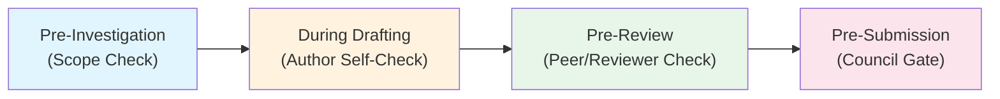
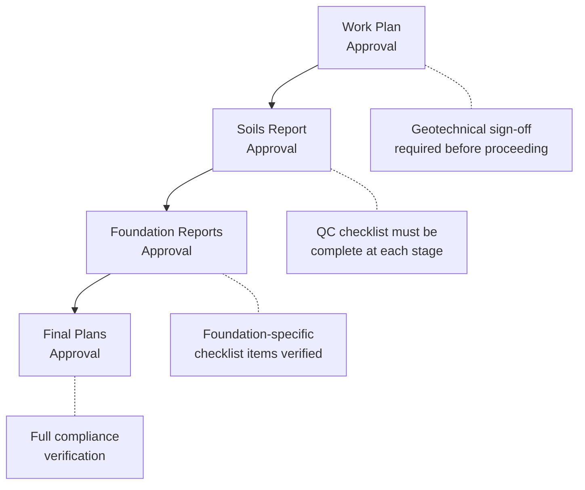

# Checklist Collection Analysis -- Cross-Jurisdiction Geotechnical Report Review

**Date**: 2026-05-13
**Type**: Empirical analysis
**Participants**: Graeme (domain), Mark (product), Ron (strategy), John (marketing)
**Notebook**: Geotechnical Engineering Checklists (58764ffc-c1f8-4739-884c-6036977f71e1)

---

## Research Question

What do geotechnical report checklists from multiple jurisdictions reveal about (a) universal
report quality patterns, (b) architecture decisions for Redline's Skeleton Generator, Checklist
Engine, and Pre-Review Engine, and (c) competitive positioning opportunities?

## Sources Analysed

| # | Source | Year | Jurisdiction | Perspective |
|---|---|---|---|---|
| 1 | FHWA Checklist and Guidelines | 1988 | US Federal | Reviewer |
| 2 | NZGS Module 2 (Earthquake Engineering) | 2016 | NZ | Author/Peer |
| 3 | Public Works Geotechnical Checklist | 2024 | US (unspecified) | Reviewer |
| 4 | TDOT Geotechnical Design QC Checklists | 2025 | US Tennessee | Author/QC |
| 5 | USACE 2001 Geotechnical Investigations | 2001 | US Federal (Military) | Specification |
| 6 | Mason County Submittal Checklist | undated | US Washington State | Council |
| 7 | NZGS Ground Investigations Specification | 2022 | NZ | Specification |
| 8 | CERT 10a Guide (Western Bay of Plenty) | 2009 | NZ | Council |
| 9 | Lodgement Checklist Commercial | 2025 | NZ/AU | Council |
| 10 | FHWA alt PDF (duplicate) | 1988 | US Federal | Reviewer |

---

## Key Findings

### 1. Universal Taxonomy (70-80% Shared)

All 10 checklists converge on the same 10 taxonomy nodes, regardless of jurisdiction, era, or
document perspective:

1. **Site Context** — Location, Scope/Purpose
2. **Topography/Geomorphology** — Terrain, Aerial Photography
3. **Geology/Stratigraphy** — Geologic Setting, Subsurface Profile
4. **Field Investigation** — Boreholes, CPT/SPT, Field Tests
5. **Subsurface Conditions** — Soil/Rock Description, Groundwater
6. **Laboratory Testing** — Classification, Strength, Consolidation
7. **Engineering Analysis** — Slope Stability, Bearing Capacity, Settlement, Seismic Assessment
8. **Earthworks** — Cut/Fill Design, Shrink-Swell, Compaction
9. **Drainage/Environment** — Surface Drainage, Subdrainage, Environmental
10. **Deliverables** — Logs, Plans, Cross-Sections, Photographs

The 20-30% variation is jurisdiction-specific: seismic (NZ), material sites (FHWA),
sign-off gates (TDOT), and council compliance (NZ councils).

### 2. Four Workflow Moments

Checklists are NOT interchangeable. They serve different temporal positions in the engineering
workflow:



| Moment | Audience | Anxiety | Sources |
|---|---|---|---|
| Pre-Investigation | Lead engineer, project manager | "Have we scoped the investigation correctly?" | USACE 2001, NZGS 2022 |
| During Drafting | Report author | "Am I covering everything the standard requires?" | TDOT (internal QC), NZGS 2016 M2 |
| Pre-Review | Reviewer, checker | "Is this report complete and defensible?" | FHWA 1988, Public Works 2024 |
| Pre-Submission | Engineer (filing), council officer (receiving) | "Will this pass the council gate?" | CERT 10a, Lodgement Checklist, Mason County |

### 3. Three Depth Levels

| Depth | What It Checks | Automation Level | Phase |
|---|---|---|---|
| Depth 1: Presence | "Is section X present?" | Fully automated | Free / Phase 1 |
| Depth 2: Content Quality | "Does section X contain the required sub-elements?" | LLM-assisted | Paid / Phase 1 |
| Depth 3: Method Validation | "Is the technical method correct?" | Expert judgment, partial LLM | Future |

### 4. FHWA 1988 as Seed Vocabulary

The FHWA checklist provides ~120 discrete yes/no items across 10 sections (A-J). Of these,
25-35 are directly checkable against a report's text using Layers 1-3 (presence, content
completeness, and linguistic analysis). These form the candidate seed set for the Pre-Review
rule library. See [fhwa-reviewer-checklist-rule-vocabulary.md](../knowledge/geotechnical/report-writing/fhwa-reviewer-checklist-rule-vocabulary.md).

The FHWA vocabulary is 37 years old and still structurally valid -- the same sections appear
in the 2025 TDOT checklists. This durability is a content marketing narrative: "The questions
reviewers ask haven't changed in 37 years. The method of asking them has."

### 5. TDOT Chain-of-Gates Precedent

TDOT implements a 4-stage milestone sign-off system:



Each stage requires the previous stage's checklist to be complete. This is a precedent for
Redline's audit trail capability (Feature L in the strategic bets) and the `workflow_moment`
dimension on taxonomy nodes.

### 6. Council Checklists as Free Rule Source

NZ council checklists (CERT 10a, Lodgement Checklist) are public documents, not copyrighted
standards. They represent the simplest, most prescriptive checklist tier (Depth 1 only) and
serve as the "council gate" that every submission must pass. This is the least-risk starting
point for the Pre-Submission product surface, and the rules are free to encode.

---

## Architecture Implications

### Decision: One Taxonomy, Three Consumers

The empirical convergence of 10 checklists on the same 10 nodes means that one canonical
taxonomy should serve three product components:

1. **Skeleton Generator** ("generate these sections") -- taxonomy nodes become section templates
2. **Checklist Engine** ("are these sections present?") -- taxonomy nodes become presence checks
3. **Pre-Review Engine** ("is content compliant?") -- taxonomy nodes become rule attachment points

This decision is recorded in ADR-006.

### Rule Dimension Model

Every rule in the Pre-Review engine should carry the following dimensions:

```
rule_id: str
statement: str          # The check question (reviewer voice)
taxonomy_node: str      # Which of the 10 nodes this attaches to
workflow_moment: str    # pre-investigation | during-drafting | pre-review | pre-submission
depth_level: int        # 1=presence, 2=content, 3=method
jurisdiction: str       # universal | nz | us-fhwa | us-tdot | etc.
source_standard: str    # Document reference
severity: str           # high | medium | low
```

---

## Marketing Implications (John)

1. **Big 5 content narrative**: "37 years unchanged" -- the FHWA 1988 checklist structure
   appearing verbatim in 2025 TDOT documents proves that quality has NOT been automated; the
   questions haven't changed, only the effort of asking them.

2. **"Above the council gate" positioning**: Redline checks a higher bar than the council
   requires. The council checklist (CERT 10a, Lodgement) is Depth 1 only. Redline goes to
   Depth 2 (content quality) and eventually Depth 3 (method validation). This positions Redline
   as a professional tool, not a compliance checkbox.

3. **Three product surfaces**: Pre-Submission (free mode within Pre-Review, council gate),
   Pre-Review (paid, professional quality), Pre-Investigation (future, scope planning). Each
   addresses a different buyer anxiety. Pre-Submission is not a standalone surface -- it is
   Depth 1-only mode within the Pre-Review product, zero cost until quota exhaustion.

---

## Provenance

All analysis grounded in the Geotechnical Engineering Checklists notebook (58764ffc). No online
search was used. Cross-reference the following domain knowledge documents:

- [checklist-taxonomy-cross-jurisdiction.md](../knowledge/geotechnical/report-writing/checklist-taxonomy-cross-jurisdiction.md)
- [fhwa-reviewer-checklist-rule-vocabulary.md](../knowledge/geotechnical/report-writing/fhwa-reviewer-checklist-rule-vocabulary.md)
- [nzgs-seismic-liquefaction-checklist-rules.md](../knowledge/geotechnical/report-writing/nzgs-seismic-liquefaction-checklist-rules.md)
- [pre-review-rule-validation-scope-and-language-checks.md](../knowledge/geotechnical/report-writing/pre-review-rule-validation-scope-and-language-checks.md)
