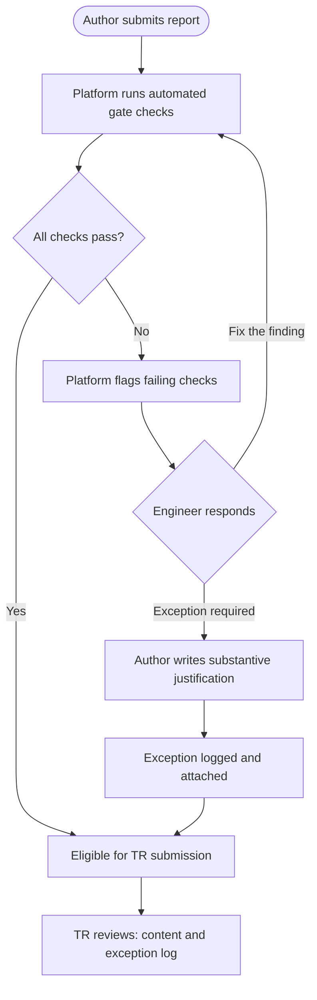

# Redline Quality Gate Design — Domain Perspective

**Date**: 2026-05-13
**Author**: Graeme (Principal Geotechnical Engineer)
**Confidence**: cross-referenced
**Sources**: Geotechnical Report Workflows (GRW), Risk Assessment in Engineering (RA),
Geotechnical Baseline Reports (GBR), practitioner experience (25+ years)

---

## Context

This document records Graeme's domain analysis of four Redline product design concepts
submitted for review on 2026-05-13. Each concept is assessed for fit with NZ/AU professional
practice, PLI implications, and domain risks.

---

## Concept 1 — Training and Tracing (Contextual Citations in Flags)

**Question**: Can the platform show the WHY behind each flag — citing the standard clause or PLI
implication — effectively teaching rather than just flagging? Is this valuable to intermediate
engineers (3-7 years)? Would senior practitioners object?

### Notebook-grounded findings

- The GRW notebook contains a dedicated training workbook titled *"Effective Report Writing:
  INTERMEDIATES"*. It explicitly teaches intermediates the legal rationale behind language QA
  rules: using inconsistent terminology "means the evidence your report provides will be
  undermined in any legal challenge" and consistent language "removes this risk" [GRW: citation
  12]. The platform's contextual-citation concept maps exactly onto existing firm training
  practice.

- PLI guidance explicitly recommends performing an automated "Global Search" for taboo and
  absolute words before issuing a report or signing a contract [RA: citations 1-4]. This is
  an industry-recognised practice — automated checking for PLI-risk language is already
  recommended by PLI providers.

- The Grad Coach Café (graduate training programme) advises junior engineers to "Ask for
  feedback and rationale behind changes to understand why they have made certain edits" [GRW:
  citation 2]. Providing the rationale inline in the flag is a direct technological substitute
  for this coaching loop.

- The Drafting QA Signoff Form mandates that the QA checker "Provide follow up communication,
  guidance or coaching if required to drawing author" [GRW: citation 1].

### Practitioner assessment

- **Intermediates (3-7 years)**: HIGH value. This cohort knows the rules but not the
  liability implications. They know not to write "ensure" but typically do not understand that
  it can void PLI cover by elevating standard of care to strict liability. Contextual citations
  bridge exactly this gap.

- **Senior engineers**: Will not object IF the framing is correct. Frame citations as "cited
  reasoning" (a professional courtesy), not "education" (condescending). Framing matters
  more than the content. A senior engineer who has been practising for 20 years is not
  threatened by a cited standard clause — they are irritated by being spoken to like a
  student.

- **Mentoring conflict**: Moderate risk, not fatal. The existing mentoring model asks juniors
  to seek rationale from reviewers. The platform providing rationale upfront could reduce the
  number of coaching conversations — that is a feature, not a bug, for TRs whose time is
  scarce. The deeper mentoring conversations about technical judgment are not threatened
  because the platform cannot address Layer 4 (technical defensibility).

### Domain risk

- The platform must cite the actual PLI guidance or standard clause, not a paraphrase. A
  paraphrase that misrepresents the scope of a clause could itself create liability for the
  firm developing the platform.

---

## Concept 2 — TR/PD Use as Coaching Backdrop

**Question**: The TR opens scan results first, sees pre-categorised findings, uses that as
structured agenda for review discussion. Does this fit actual review meeting dynamics? Would
TRs feel the machine is stepping on their role?

### Notebook-grounded findings

- Formal TR-author review meeting structure is **not documented in any notebook**. This is a
  significant gap. The GRW notebook documents the review *cycle* (Author → TR → PD) but
  gives no guidance on whether a face-to-face or structured meeting occurs.

- What IS documented: TRs are explicitly framed as "safety nets, not cleanup crews." Authors
  own initial quality. The TR role is defined as ensuring "technical robustness and alignment
  with guidelines" [GRW: citation 1]. The TR is not framed as a reviewer who sets the
  discussion agenda.

- Junior engineers are actively coached to engage TRs mid-draft, not to wait for a formal
  review meeting: "Ask questions early... engage your PMs and reviewers from the start" [GRW:
  citation 5]. This suggests the documented practice is continuous dialogue, not a
  structured end-of-draft meeting.

### Practitioner assessment

- **Does a formal review meeting exist?** In larger firms (50+ staff, complex or high-risk
  reports): yes, selectively. In smaller firms (5-20 staff): typically no — the TR marks up
  the document and sends it back. The "review meeting as structured coaching session" model
  is not universal.

- **Would TRs welcome the pre-triage?** In firms where review meetings happen: likely yes,
  IF the framing is "issues the TR must assess" not "issues the machine has resolved." The
  TR wants to spend 60 minutes on technical judgment, not 20 minutes finding the boilerplate
  issues. Pre-triage saves that 20 minutes.

- **Domain risk — the anchoring problem**: This is the most serious risk with this concept.
  A TR who anchors on the 12 pre-categorised findings may under-examine the technical content.
  The most dangerous geotechnical report failures are NOT in Layers 1-3 (which the platform
  checks). They are in Layer 4 — technical defensibility — which the platform cannot assess.
  If the pre-triage creates a cognitive ceiling ("these 12 things are the findings"), a TR
  may conclude their review after working through them. That is worse than no platform.

- **Mitigation**: The pre-triage summary must include an explicit statement: "These
  [N] findings cover Layers 1-3 only. Technical defensibility (Layer 4) requires independent
  engineering judgment and is not assessed by this system." This is not optional — it is the
  difference between a useful tool and a liability-creating tool.

---

## Concept 3 — Quality Gate with Firm-Set Thresholds

**Question**: Author cannot hand report to TR until mandatory gates pass (or provides written
justification for exception). Does this fit NZ/AU practice? Would engineers game it? Is there
a PLI risk from false assurance?

### Notebook-grounded findings

- The "20 Checkpoints in 90 Seconds" self-review checklist is explicitly documented as a
  mandatory pre-review gate in the GRW notebook — the report "should be bullet-proof in terms
  of grammar and good writing" before going to TR [GRW: citations 1-4]. A documented pre-TR
  gate already exists in practice.

- PLI guidance explicitly recommends a "Global Search" for taboo words before issuing any
  report [RA: citations 1-4]. This is an existing PLI-endorsed automated practice — the
  gate concept extends something already recommended.

- Exception documentation: Construction completion standards require that "any exceptions or
  non-compliances shall be stated in the report" [RA: citation 3]. The pattern of explicit
  exception documentation exists in adjacent practice.

- GBR practice: When baselines deviate from factual GDR data, the notebook recommends
  maintaining a record "to allow transparency should a claim be raised" [GBR: citation 2].

### Practitioner assessment

- **Fit with NZ/AU practice**: Good fit. The "20 Checkpoints" gate is a known precedent.
  Firms accept author self-attestation before TR submission. The platform formalises and
  automates what is currently a manual self-review step.

- **Gaming risk**: Real and significant. Engineers will substitute borderline language
  rather than fix the underlying problem. "Ensure" becomes "endeavour" (borderline) rather
  than "strive" (clean). The gate passes; the problem shifts rather than disappears. Counters:
  (a) the platform must check for the full taboo word list, not just exact-match the flagged
  word; (b) exception justifications must be reviewed at the TR stage, not just logged.

- **False assurance — PLI risk**: The platform passing an automated gate does NOT create a
  legal defence. The standard of care is what a reasonable engineer would do — not what an
  algorithm flagged and cleared. Passing a gate while knowing the flag was borderline could
  be evidence of deliberate avoidance rather than genuine quality assurance. The specific
  scenario to avoid: engineer triggers gate pass on a taboo-word finding, ignores it because
  "the system cleared it," and the word appears in a claim. The system having flagged and
  cleared it does not help — it provides a paper trail of the oversight.

- **Notebook gap**: The false-assurance angle is NOT covered in the RA notebook. This is an
  open question for PLI counsel, not a domain engineering question I can answer from the
  notebooks.

---

## Concept 4 — The "Justify the Exception" Workflow

**Question**: Gate failure requires written justification, logged and attached to the report.
Consistent with how firms document exceptions? PLI value?

### Notebook-grounded findings

- RA notebook explicitly states it constitutes professional misconduct for an engineer to fail
  to "clearly present to their employer the consequences to be expected from a deviation
  proposed in work" when professional judgment is overruled [RA: citation 4]. This frames
  documented exceptions as professionally mandatory, not just administratively useful.

- GBR practice: When baselines deviate from factual data at a contracting party's request,
  the notebook recommends "a record is maintained to allow transparency should a claim be
  raised" [GBR: citation 2]. This is a direct analogy — documented deviation + record for
  PLI defence.

- Construction standards: "Any exceptions or non-compliances shall be stated in the report"
  [RA: citation 3]. Mandatory exception documentation is an established pattern in
  adjacent fields.

- GRW notebook: No formal justification process for deviations from QA procedures is
  documented in the firm's internal procedures. The exception workflow concept would be new,
  not extending an existing practice.

### Practitioner assessment

- **Consistency with current practice**: Partially consistent. Large firms document
  deviations from QMS procedures, but this is typically an ISO 9001 obligation, not a
  report-by-report exception log. The report-level exception justification would be new.

- **PLI value**: Yes, but only for substantive justifications. A justification that says
  "client requested shorter report" provides no protection. A justification that says
  "preliminary report — scope limitation clause deferred to final GIR; reference LOE clause
  3.2, PD approved 2026-05-13" provides evidence of deliberate professional judgment.
  The system should prompt for substantive content, not accept one-liner justifications.

- **Audit trail value**: High. The most damaging position in a claim is where the firm
  cannot demonstrate whether an omission was deliberate or an oversight. A logged exception
  transforms "we missed it" into "we considered it, documented the reason, and the PD
  approved it." This is a meaningful distinction for a PI insurer assessing whether to defend.

- **Consistency risk**: If the exception log becomes boilerplate (every report triggers
  exceptions, justifications are copy-pasted), it loses all PLI value and becomes compliance
  theatre. The system needs to surface exception patterns to PD/QA for periodic review —
  a report that consistently needs the same exception is a signal to revise the gate
  threshold or provide additional training.

---

## Open Questions

1. Does the PLI-assurance angle on automated gate passing (Concept 3) require input from a
   PLI lawyer? Notebook-grounded answer: yes, this cannot be answered from the engineering
   knowledge base alone.

2. What is the actual review meeting structure (face-to-face or markup-and-return) in
   target NZ firms? This is not documented in the notebooks. The Concept 2 design should
   be validated with KR2 interview candidates before committing.

3. Does the "justify the exception" log need to be retained by the firm's QMS system (ISO
   9001 document control), or is attachment to the report package sufficient? This is a
   QMS question, not addressed in the notebooks.

4. How does the exception log interact with CPEng (Chartered Professional Engineer)
   professional obligations in NZ? Not covered in notebooks.

---

## Further Reading

- Engineering NZ Practice Note 19 (Engineers and the Law) — NZ professional liability
  obligations (unverified pointer, not ingested)
- ISO 9001:2015 clause 8.7 (Control of nonconforming outputs) — QMS framework for
  documented exceptions and dispositions (unverified pointer)
- ACENZ conditions of engagement — NZ consulting engineer contractual standards
  (unverified pointer)
