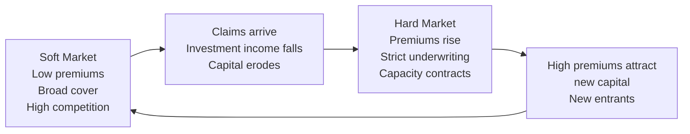
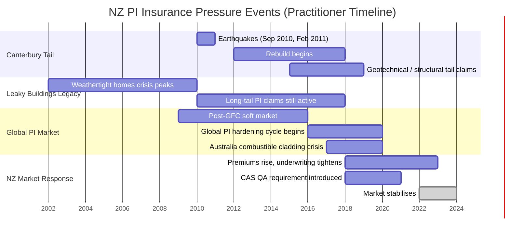
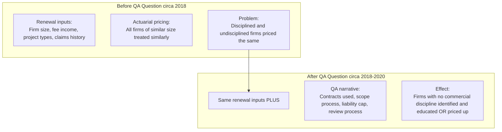
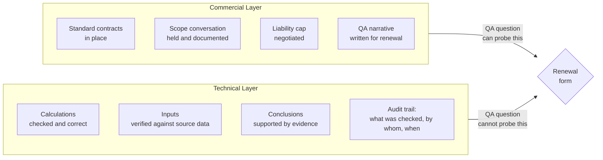
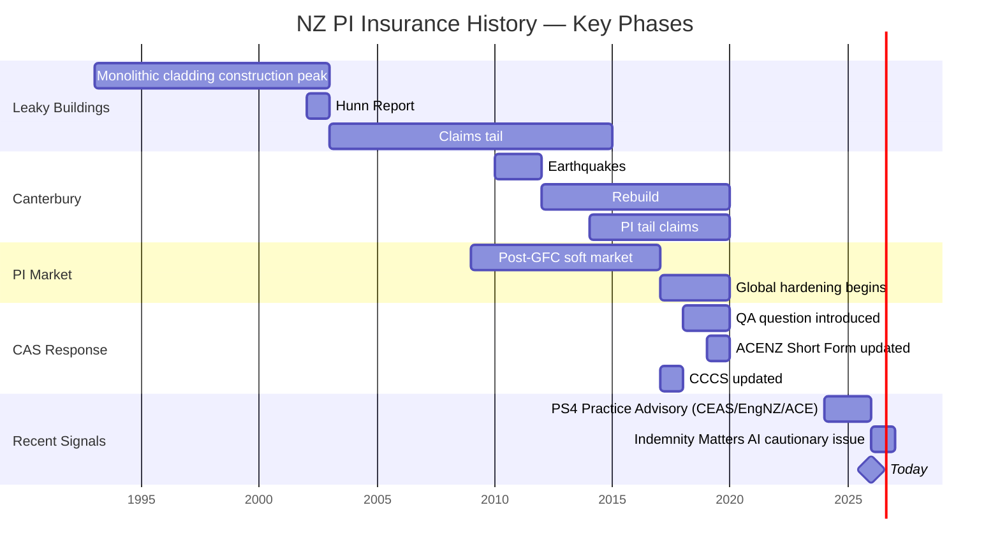

# The CAS QA Renewal Question: Why It Was Introduced and What It Was Designed to Do

**Author**: Graeme (Principal Geotechnical Engineer, Redline Advisory Board)
**Date**: 2026-05-14
**Status**: Research document — not for external distribution
**Confidence**: Mixed — see Provenance section

> **Reading note**: This document is written for someone who has not worked in NZ
> engineering or insurance. Every term is defined on first use. A glossary of key
> terms is at the end.

---

## Executive Summary

Around 2018–2020, an organisation called CAS — the Consulting Engineers Advancement
Society, the professional body that runs the insurance scheme for most NZ consulting
engineering firms — added a new question to its annual insurance renewal form. The
question asked firms to describe their internal Quality Assurance (QA) practices: how
they write contracts, how they define project scope, and how they check their own work.

Craig Lewis, the chair of CAS, explained in a 2026 webinar why this happened: the
insurers backing the scheme had been through a period of heavy losses, and they wanted
evidence that firms were managing their business properly — not just doing good
engineering, but running their practices in a commercially disciplined way.

This document explains what triggered that painful period, what the QA question was
designed to catch, and — critically — what it still cannot catch. That last point is
why this research matters for Redline.

**Key finding**: The QA question was designed to check whether firms had basic commercial
discipline (proper contracts, defined scope, liability limits). It was not designed to
verify whether the actual technical content of a specific report had been properly
checked. That gap — between commercial process and technical content verification —
is the space AI-assisted reporting is now making consequential.

---

## 1. Background: How Insurance Markets Work

To understand why the insurers backing CAS went through a "particularly painful period"
around 2017–2020, you need to understand that insurance markets are not stable. They
cycle between two states — a fact so well-established it has a name: the insurance cycle.

**Soft market**: Premiums (the annual price a firm pays for insurance) are low, cover
is broad, and many insurers are competing for business. Standards for who gets covered
and on what terms tend to slip. [Wikipedia, Insurance Cycle]

**Hard market**: After a period of heavy claims or investment losses, insurers have less
money. They raise premiums, cover less, and become much stricter about who they will
insure and on what terms. Reinsurers — the companies that insure the insurers themselves
— also raise their prices, which compounds the pressure. [Wikipedia, Insurance Cycle]

**Why this matters for engineering firms**: Professional Indemnity (PI) insurance —
the insurance that covers an engineering firm when a client sues them over a report or
design — follows this same cycle. But with a critical delay. An engineering mistake
might not be discovered until a building is constructed, or until a structure fails years
later. A claim can arrive five, eight, or even ten years after the work was done. This
time lag means a soft market can quietly accumulate hidden future losses — and when
those losses eventually surface, the market corrects suddenly and harshly.

---

## 2. The "Particularly Painful Period": Three Things Hit at Once

The distress Craig Lewis described was not caused by a single event. It was the collision
of three independent problems hitting the NZ professional indemnity market at roughly the
same time, between 2015 and 2020.

*Note: Dates above are practitioner estimates — see Provenance section.*

### 2a. The Canterbury Rebuild: Thousands of Claims, Years Later

In September 2010 and February 2011, a sequence of major earthquakes struck the Canterbury
region of NZ — the second killing 185 people in central Christchurch. The physical damage
was immense: tens of thousands of buildings were damaged or destroyed. The city's rebuild
took years. Some areas were not resolved until the late 2010s.

For engineering firms, the legal liability followed years behind the physical events — and
that delay is what made it so damaging to insurers.

Here is why the delay happens: a geotechnical engineer (a specialist who studies the
ground beneath buildings) might assess a site as suitable for housing before the
earthquakes. The earthquakes strike. The ground liquefies — behaves like liquid — and
the houses are destroyed. Years later, the homeowner or insurer sues the engineer:
*"Your site assessment said this ground was fine. It wasn't. You owe us."* That lawsuit
arrives at the engineer's PI insurer perhaps six or eight years after the original report
was written.

Multiply that by thousands of sites, hundreds of engineers, and years of rebuild disputes,
and you have a sustained flood of PI claims arriving at insurers through 2015–2019 —
all originating from events that happened half a decade earlier. [Practitioner knowledge
— see Provenance]

### 2b. The Leaky Buildings Legacy: A Slow-Burning Catastrophe

NZ had a second, older problem still running in the background: the "leaky buildings"
or "weathertight homes" crisis.

In the 1990s and early 2000s, NZ went through a construction boom. Many residential and
commercial buildings were built using a wall cladding style called monolithic cladding —
a smooth exterior finish (often a fibre-cement or plaster system) applied directly over
timber framing, with minimal gaps or drainage channels. The problem: these systems
allowed water to penetrate the walls but provided no way for it to escape. Timber framing
rotted. Structural damage was hidden behind intact-looking exteriors. In many cases,
homeowners did not discover the damage for years.

The Hunn Report (2002) — a government investigation — documented the scale. Estimates of
dwellings affected ranged up to 80,000. The total remediation cost ran to billions of
dollars. Councils, architects, engineers, and building product manufacturers were all sued.

By the late 2010s, the leaky buildings crisis was old news — but it was not finished.
Long-tail claims (lawsuits that arrive years after the damage was done) were still being
resolved. For PI insurers, leaky buildings had permanently established NZ residential
construction as a high-risk category. Canterbury then arrived on top of that existing
nervousness. [Practitioner knowledge — see Provenance]

### 2c. The Global PI Hardening Cycle: An International Problem

NZ does not have its own self-contained insurance market. Most NZ engineering PI coverage
is ultimately backed by insurers in London (Lloyd's of London syndicates) and Australia.
When those markets go through a hard period, NZ firms feel it directly.

After the Global Financial Crisis (GFC) — the 2008–2009 worldwide banking and financial
collapse — insurance markets entered a prolonged soft phase. Interest rates were pushed
near zero by central banks worldwide to stimulate the economy. Low interest rates matter
for insurers because they invest their reserves. When investments earn almost nothing,
insurers need underwriting (the insurance business itself, not investment returns) to be
profitable. That meant claims losses had to be contained.

In Australia, two high-profile construction disasters accelerated the hard market:

- **Combustible cladding crisis (2014–2019)**: Apartment towers across Australia were
  found to be clad in aluminium composite panels with a plastic core that caught fire
  easily. The Lacrosse tower fire in Melbourne (2014) and the Grenfell Tower disaster in
  London (2017) put the issue on front pages globally. Australian building professionals
  — architects, engineers, certifiers — faced massive liability exposure. PI insurers
  raised premiums sharply.

- **Opal Tower (Sydney, 2018) and Mascot Towers (Sydney, 2019)**: Two residential
  apartment buildings were evacuated after structural cracking was discovered shortly
  after construction. Both generated intense scrutiny of structural engineers' work and
  further hardened the PI market.

NZ engineering firms, whose risks were priced by the same underwriters in the same
cycle, faced equivalent pressure even though none of these events occurred in NZ.
[Practitioner knowledge, partially; Australian events are public record]

### 2d. Why These Three Pressures Converged

The timing was not coincidental — but neither was it coordinated. Each pressure was
already building independently:

- Canterbury tail claims were arriving precisely as the global soft market was turning
- Leaky buildings had already primed NZ insurers to expect residential construction losses
- Australian market problems tightened the capacity of the underwriters covering NZ
- Low interest rates meant investment income could not absorb claims losses

For the insurers backing the CAS scheme, the loss ratio (claims paid out as a percentage
of premiums collected) had deteriorated. The textbook response in a hard market is:
raise premiums, reduce what you cover, and require policyholders to demonstrate better
risk management. The QA renewal question was the mechanism for that last requirement.

---

## 3. What "Commercial QA Discipline" Means and Why Firms Were Not Doing It

When Craig Lewis described what the QA question was trying to drive, he named four
specific practices:

1. Not signing up to bespoke (custom, client-written) contract conditions
2. Having upfront conversations with clients about what the project scope includes
3. Using industry-standard contract conditions that limit the firm's financial liability
4. Having internal review processes — checking calculations and drawings before sign-off

Items 1–3 are what I call "commercial QA" — the business and contractual discipline that
protects a firm in court. Item 4 is "technical QA" — checking whether the engineering
work itself is correct. These are different things. The QA renewal question was mainly
designed to address items 1–3. Here is why those were problems in the first place.

### 3a. The Contract Conditions Problem: Firms Signing Whatever the Client Sent

The engineering profession has developed standard contract templates over decades. In NZ,
the main ones are:

- **ACENZ Short Form Agreement**: A short-form contract developed by ACENZ (the Association
  of Consulting Engineers New Zealand), the industry body for consulting engineering firms.
  It includes a built-in cap on the firm's liability — capping the maximum the firm can
  owe at (for example) five times the fee charged, up to $2 million.
- **CCCS (Conditions of Contract for Consultancy Services)**: A longer, more detailed
  standard contract with similar protections.

These standard contracts exist because the profession learned — through decades of claims
— what protections are essential. They are written by industry lawyers and are tested in
court.

The problem: many clients — particularly large commercial developers and government
procurers — send their own custom contracts instead. These bespoke (custom) contracts
often:

- Remove the liability cap entirely, exposing the firm to unlimited financial liability
- Require the engineer to take responsibility for errors in documents the client provided
  (even though the engineer didn't write them)
- Include "hold harmless" clauses where the engineer agrees to cover the client's losses
  in almost any situation

A large firm has a legal team that reviews every non-standard contract before it is signed.
A small firm — five to fifteen staff, where the principal (the owner) is also the engineer
doing the work — typically does not. The principal signs what the client sends because
they need the work. They are often not negligent; they simply do not know what they are
agreeing to.

This is exactly the pattern the QA renewal question was designed to surface: firms that
had signed unlimited-liability contracts without realising it.

A real NZ example of why this matters: in a 2024 case (Tauranga City Council vs Harrison
Grierson and Constructure), a claim exceeded $20 million. The structural design firm and
the peer reviewer both had ACENZ standard contracts with liability caps. The court upheld
those caps — the design firm's exposure was limited to $2 million, the reviewer's to
$500,000. Without those caps, they could have faced the full $20 million. For a small firm,
that is a firm-ending event. [Risk Assessment notebook; Geotechnical Report Workflows notebook]

### 3b. The Scope Problem: What Exactly Did You Agree to Do?

"Scope" in engineering means the defined boundaries of what the firm is being paid to
investigate, design, or advise on. A clear scope is: *"We will assess the bearing
capacity of the ground at this specific site for a two-storey residential building."*
An unclear scope is: *"Look at the site and tell us what you think."*

Scope problems cause PI claims in two ways:

1. **The client expects more than was delivered**: If you never agreed in writing what
   the investigation covered, the client can claim you missed something — even if you
   had no reason to investigate it. An undefined scope is an open invitation for a claim.

2. **A tight scope is your main legal defence**: When a claim does arrive, your first
   line of defence is showing that the problem was outside the agreed scope of your work.
   If there is no documented scope, you have no defence. The guidance from large NZ geotech
   firms is direct: *"A clear and tight scope will also assist us to defend spurious PI
   claims."* [Geotechnical Report Workflows notebook]

Small firms often skip the scope conversation because they do not want to appear difficult,
or because the client is an old relationship, or because the job seems simple. The result
— an undefined scope — makes PI claims more likely and harder to defend.

### 3c. The Liability Cap Problem: Unlimited Exposure

A liability cap is a contractual clause that says: *"If we make a mistake and you sue us,
you can recover a maximum of $X from us — not more, regardless of your actual losses."*

Without a liability cap, an engineering firm is exposed to the full cost of whatever
damage their work contributed to. In large infrastructure or commercial projects, that
could be tens of millions of dollars — far more than any small firm could pay, and
potentially beyond even their PI insurance limit.

The QA renewal question asked firms to confirm they had liability caps in their contracts.
For firms that did not — often because they were working on verbal arrangements,
email threads, or client purchase orders — it was the first time anyone had specifically
asked them to think about this.

### 3d. The Internal Review Problem: Checking the Work

The fourth practice the QA question addressed was internal review: does someone check
a report or design before the senior engineer signs it?

In large NZ engineering firms, multi-tier review is mandatory. A separate engineer — one
with equal or greater expertise — checks the inputs, the arithmetic, and the methodology
before the document is issued. This is embedded in what large firms call their "Six Key
Business Rules." [Geotechnical Report Workflows notebook]

In small firms, this does not exist in the same form. The principal reviews their own
work, or a more junior engineer checks the principal. The standard of checking is
materially lower. The QA question was calibrated to catch firms with essentially no
checking at all — not to distinguish between adequate and excellent checking.

---

## 4. What the Renewal Form Looked Like Before the QA Question

Before the QA question was introduced (roughly pre-2018), a NZ engineering firm's annual
PI renewal form asked:

- What services does your firm provide?
- What is your gross annual fee income?
- What are the construction values of projects you work on?
- How many staff do you have?
- Do you have any claims or potential claims to disclose?

These are all actuarial inputs — information to help the insurer price the premium
correctly. (Actuarial means statistical and mathematical — the insurer is calculating
the expected cost of claims based on the firm's size and activity.)

What these questions do not reveal: anything about how the firm actually manages risk.
Two firms of identical size, fee income, and project type could have completely different
practices — one using standard contracts with liability caps, one signing whatever clients
sent with unlimited exposure. Both would pay the same premium. The insurer had no way
to tell them apart.

For co-insurers (the multiple underwriters who shared the risk of the CAS scheme),
this theory broke down when the claims arrived. Similar-looking firms produced very
different claims patterns. The distinguishing factor was commercial discipline — whether
firms had proper contracts, defined scope, and liability caps. The QA question was
introduced to make that factor visible.

---

## 5. What the QA Renewal Question Actually Asks

Based on Craig Lewis's description, the QA renewal question asks member firms to write
a short narrative describing:

1. **Contract conditions**: Do you use the standard ACENZ/CCCS contracts? Or do you
   accept client-written bespoke contracts?
2. **Scope process**: Do you discuss and document project scope with clients upfront,
   before starting work?
3. **Liability limiting**: Do you have a liability cap clause in your contracts?
4. **Internal review**: Do you have a process for checking outputs before sign-off?

It is a written narrative — a paragraph or a few bullet points. There is no checklist,
no evidence requirement, and no audit. The firm writes whatever it wants to write. CAS
does not verify it.

The value is educational and declarative, not evidentiary. By requiring firms to write
this narrative annually, CAS:
- Forces every principal to think about these practices once a year
- Identifies firms that have never thought about them (they cannot write the paragraph)
- Creates a paper trail that could matter in a claim (if a firm described a process it
  demonstrably did not have, that is relevant)
- Gives CAS data to run targeted education programmes at firms with weak practices

---

## 6. What the QA Question Changed in Practice

The effect was cultural more than procedural.

**Awareness, not compliance.** Small firm principals who had never thought about whether
they were using standard contracts were now forced to confront the question annually.
For some, the QA question was the first time anyone had explained what the ACENZ short
form was, why it existed, and what protection it provided. That is a genuine education
effect.

**Targeted education became possible.** Once CAS could see which firms were not using
standard contracts, they could focus their roadshows and webinars on that cohort.
Craig Lewis's phrase — "driving the discipline" — is this educational function.
It is not punitive; it is informational.

**The question does not mandate compliance.** A firm that had always used standard
contracts continued to do so. A firm that signed whatever clients sent did not necessarily
change overnight. Awareness and change are not the same thing. The question creates no
enforcement mechanism. There is no published NZ data on whether the QA question actually
improved commercial discipline across member firms. [Gap — see Section 10]

---

## 7. What the QA Question Cannot Detect: The Structural Gap

This is the most important section for understanding Redline's positioning.

The QA renewal question was designed to detect commercial-layer failures. It cannot detect
technical-layer failures. The difference is fundamental:

**The question the renewal form asks**: *"Do you have a QA process?"*

**The question the renewal form does not ask**: *"Can you demonstrate what your QA
process actually checked, on this specific report, before the signing engineer signed it?"*

These are structurally different questions. The first is a process-existence check — it
confirms that some checking process exists. The second is an audit trail check — it
asks for evidence that the process was applied, on a specific piece of work, at a
specific time.

**For traditional engineering reports**, the distinction is manageable. A report written
entirely by a trained engineer and reviewed by another trained engineer is unlikely to
contain fabricated references or to systematically misrepresent technical conclusions.
A senior engineer doing a "plausibility read" — checking whether the conclusions look
reasonable for the site conditions — catches most real errors. The process-existence check
is a reasonable proxy for whether checking happened.

**For AI-assisted reports**, the distinction is critical. Here is why:

An engineer who uses AI to draft content, then reads the report to check it feels right,
has technically satisfied the process-existence requirement. But AI can fail in ways that
a plausibility read will not catch:

- AI can cite a standard that does not exist, or cite a real standard incorrectly. The
  report looks professionally written. The citation looks real. Only independent
  verification — actually looking up the standard — would catch it.
- AI naturally writes in a confident, definitive tone. In an engineering report, that
  confidence can cross into warranty territory — language that reads as a guarantee of
  an outcome rather than a professional opinion. Standard PI policies contain warranty
  exclusions: if the claim arises from language that functions as a warranty, the insurer
  may not cover it. An engineer who did not carefully review every sentence of
  AI-generated text for this drift could find their insurance does not respond.
- AI can make a category error that sounds technically plausible — the right terminology,
  wrong relationship. A reviewer checking for engineering logic may not catch it.

The audit trail question — *"show me what was checked, by whom, when"* — would expose
these gaps. The process-existence question cannot.

[Practitioner assessment. Supporting context: CEAS Indemnity Matters Issue 88 — the
Deloitte AI refund, the WA lawyer case, and Craig Lewis's "bright, very keen young
graduate" framing of AI checking obligations.]

---

## 8. Where This Sits in NZ PI Insurance History

*Note: Practitioner timeline estimates — see Provenance.*

NZ professional indemnity for engineers has been shaped by three defining episodes:

**Episode 1: Leaky buildings (1990s–2010s)**. This established that NZ's residential
sector was a high-risk PI category. Claims were large, long-tailed, and involved multiple
professionals — councils, architects, engineers. The legacy shaped how NZ PI underwriters
thought about residential work for a decade.

**Episode 2: Canterbury earthquakes (2010–2011, tail to ~2019)**. This concentrated
engineering liability claims in a single geographic area at a scale NZ had not seen before.
The question of what pre-earthquake geotechnical investigations were adequate, and what
post-earthquake rebuild work met the standard of care, generated sustained claims pressure
for nearly a decade.

**Episode 3: Global PI hardening (2017–2020)**. The convergence of thin investment income,
construction defect claims globally, and Australian market contagion produced the immediate
context in which the co-insurers were going through a "particularly painful period." This
was the proximate trigger for the QA renewal question.

**What's next (2024–2026)**: The recent PS4 practice advisories (three in 18 months from
CEAS, Engineering NZ, and ACE NZ) signal that scope qualification failures — engineers
signing documents with conclusions that exceed what the investigation actually found —
are still occurring. This problem predates AI. AI is now arriving into a profession where
this pattern already exists. [CEAS Indemnity Matters Issue 88, pages 3–5]

---

## 9. The Redline Implication

The QA renewal question established that commercial discipline is an underwriting factor.
That is now industry-accepted doctrine in NZ engineering PI — not a hypothesis.

The question is what comes next.

When an AI-assisted report produces a claim — and Gaynor Roberts, Aon's claims manager,
said in the 2026 webinar that the engineering book hasn't seen one yet, but "we're
expecting to" — the insurer will ask: *"Can you show me what your QA process actually
checked before the signing engineer signed this report?"*

A narrative on a renewal form is not an answer to that question. An audit trail is.

The QA question CAS has been asking for six to eight years was never designed to fill
that gap. It was designed to catch firms with no commercial discipline at all. It did
that job. The gap it left open — technical content verification, with evidence — is the
gap that Redline's pre-review layer is positioned to address.

---

## 10. Open Questions (What I Could Not Find)

1. **Precise year the QA question was introduced**: Craig Lewis said "six or eight years
   ago" in a 2026 webinar. That puts introduction between 2018 and 2020. I could not
   confirm the exact year from any notebook source. The CEAS newsletter does not date it.

2. **The exact wording of the renewal question**: I have Craig Lewis's description of
   its intent, not the actual text. The precise wording would clarify exactly what firms
   are and are not disclosing.

3. **Whether the QA narrative affects premium pricing**: It is unclear whether a stronger
   QA narrative materially reduces a firm's premium, or whether it functions purely as
   an educational and awareness tool. Craig Lewis's language ("drive the discipline")
   suggests education is the primary intent.

4. **The claims data that triggered the introduction**: What specific claims pattern made
   co-insurers ask for the QA narrative? Predominantly scope disputes? Bespoke conditions
   backfiring? Knowing this would sharpen the picture.

5. **NZ Canterbury rebuild PI claims data**: I could not access published claims figures.
   The Canterbury tail narrative is grounded in practitioner knowledge, not citable sources.

6. **NZ leaky buildings PI figures**: The scale of PI exposure is known in the profession
   but I could not find a citable published total for claims paid.

7. **AI-specific PI exclusions in NZ**: Whether any NZ PI underwriter has yet inserted
   an AI-use exclusion or condition into an engineering firm's policy is not confirmed.
   The CEAS newsletter signals this is being discussed, not yet implemented.

---

## 11. Glossary

**ACENZ** (Association of Consulting Engineers New Zealand): The main industry body for
consulting engineering firms in NZ. Produces standard contract templates used by members.

**Actuarial pricing**: Calculating insurance premiums using statistical models based on
the policyholder's size, activity, and claims history. It assumes similar firms carry
similar risk — an assumption that breaks down when behavioural differences (like
contract discipline) are not visible.

**Aon**: One of the world's largest insurance brokers. Acts as the administrator and
broker for the CAS PI insurance scheme in NZ. Aon arranges the insurance and liaises
between member firms and the underwriters.

**Audit trail**: A documented record of what was checked, by whom, and when. In the
context of engineering reports, an audit trail shows that a specific review step was
applied to a specific piece of work before sign-off.

**Bespoke conditions**: A custom contract written by a client (rather than using the
standard industry templates). Bespoke contracts often contain terms that are much more
favourable to the client than to the engineer.

**CAS** (Consulting Engineers Advancement Society): The NZ professional body that
administers the group PI insurance scheme for consulting engineering firms. Manages
the relationship with Aon and NZI (the underwriter).

**CCCS** (Conditions of Contract for Consultancy Services): A standard NZ contract
template for consulting engineering engagements. Includes built-in liability caps and
risk allocation clauses.

**Claims-made policy**: A type of insurance where the cover must be active when a claim
is made (discovered and reported), not when the original work was done. PI insurance for
engineers is claims-made. This means a firm can face a claim on work done a decade ago
if their current policy is the one active when the problem is discovered.

**Co-insurers**: Multiple insurance companies that share the risk of a single large
insurance pool (such as the CAS scheme). Each co-insurer takes a portion of the total
risk. When the pool performs poorly, all co-insurers share the losses.

**Commercial QA**: The business and contractual practices that protect an engineering
firm from PI claims: using standard contracts, defining project scope upfront, and
including liability caps. Distinct from Technical QA.

**CPEng** (Chartered Professional Engineer): A formal engineering qualification in NZ,
awarded by Engineering New Zealand. Signing authority for producer statements and
certifications. Personal liability attaches to the individual CPEng who signs.

**GFC** (Global Financial Crisis): The 2008–2009 worldwide banking and financial system
collapse, triggered by the US sub-prime mortgage market. Led to near-zero interest rates
for a decade and compressed investment income for insurers globally.

**Geotechnical engineer**: A civil engineering specialist who investigates the ground
beneath buildings and infrastructure — soil type, bearing capacity, groundwater,
liquefaction risk. Their reports underpin decisions about whether a site is suitable
for construction and how foundations should be designed.

**Hard market / Soft market**: See Section 1. A hard market is when insurance is
expensive and difficult to obtain. A soft market is when it is cheap and easy.

**Hold harmless clause**: A contract clause where one party agrees to take on all
liability for a given situation, even if they were not at fault. Often included in
bespoke client contracts to shift risk from the client to the engineer.

**Hunn Report**: A 2002 New Zealand government report, authored by Ian Hunn, that
documented the scale of the weathertight homes (leaky buildings) crisis and recommended
remediation and regulatory changes.

**Liability cap**: A contractual clause limiting the maximum financial amount a firm can
owe in a claim, regardless of actual losses. Typically set at a multiple of the fee
charged or a fixed dollar amount. A critical protection for small engineering firms.

**Liquefaction**: A phenomenon where saturated, sandy soil temporarily loses its strength
and behaves like a liquid when subjected to earthquake shaking. Buildings on liquefied
ground can sink, tilt, or be destroyed. Widespread in Canterbury during the 2010–2011
earthquake sequence.

**Lloyd's of London**: A specialist insurance and reinsurance market in London where
syndicates of underwriters share risk. A significant source of professional indemnity
coverage for engineering firms in NZ and Australia.

**Long-tail claim**: A liability claim that arrives years or decades after the original
work was done. Engineering and professional liability claims are characteristically
long-tailed because defects in buildings and infrastructure can take years to become
apparent.

**Monolithic cladding**: A wall cladding system applied as a continuous layer over
timber framing, with no cavity or drainage gap between the cladding and the frame.
Widely used in NZ residential construction in the 1990s–2000s. When poorly
detailed or built, it trapped moisture against the timber framing, causing rot.

**NZI** (New Zealand Insurance): The primary underwriter for the CAS PI insurance
scheme. The underwriter takes on the financial risk; Aon is the broker who manages
the relationship with member firms.

**PI insurance** (Professional Indemnity insurance): Insurance that covers a professional
firm if a client sues them for financial losses arising from the firm's professional
services — errors, omissions, bad advice, or inadequate investigations.

**Premium**: The annual fee a firm pays for its PI insurance coverage.

**Process-existence check**: A verification that confirms *some* process exists, without
checking whether it was applied to a specific piece of work. The CAS QA question is a
process-existence check.

**Producer Statement (PS4)**: A formal certification signed by a CPEng confirming that
construction was carried out in accordance with building consent documents. The signing
engineer takes personal professional and legal responsibility for the certification.

**Reinsurer**: A company that provides insurance to insurance companies. When an
insurer takes on more risk than it can carry alone, it passes (cedes) some of that risk
to a reinsurer. Reinsurers operate globally and their pricing directly affects what
local insurers charge.

**Scope**: The defined boundaries of what an engineering firm is being paid to
investigate, design, or advise on. A well-defined scope is both a commercial protection
(setting client expectations) and a legal defence (showing what was and was not included).

**Technical QA**: Checking that the actual technical content of an engineering report or
design is correct — calculations, inputs, conclusions, references. Distinct from
Commercial QA.

**Underwriter**: The company (or individual at Lloyd's) that accepts the financial risk
of an insurance policy. The underwriter collects premiums and pays claims.

**Warranty exclusion**: A clause in a PI policy that excludes cover for claims arising
from language in the engineer's report that functions as a guarantee or warranty of an
outcome. Engineers are covered for professional judgment, not for guarantees.

**Weathertight homes / Leaky buildings**: NZ residential and commercial buildings
constructed mainly in the 1990s–2000s using monolithic cladding systems that allowed
moisture to penetrate and become trapped in wall cavities, causing structural rot.
Affected up to 80,000 dwellings. One of the largest construction defect crises in
NZ history. See Section 2b.

---

## 12. Provenance

This document draws on three tiers of evidence: notebook-grounded sources (material
indexed in NotebookLM notebooks, which can be queried and cited), named external sources
(documents cited by name and page), and practitioner knowledge (professional judgment
stated as such, not traceable to a notebook or document). The tables below identify each
claim's tier and confidence.

This section separates what I found in notebooks (cited) from what I know as a practitioner
(stated judgment) from what I found online (labelled as unverified pointers).

### Notebook-Grounded (cited, authoritative within the corpus)

| Claim | Source | Confidence |
|---|---|---|
| QA is an underwriting factor — insurers require applicants to provide information on QA practices | Risk Assessment in Engineering notebook | High |
| Typical information insurers require: personnel, gross income, construction values, QA processes | Risk Assessment in Engineering notebook | High |
| "Beneficial to risk management if the insured has procedures to check the quality of its designs" | Risk Assessment in Engineering notebook | High |
| WSP/CPB tender phase pavement design failure: $5.3M liability (NZ High Court, 2023/2024) | Risk Assessment notebook + Geotechnical Report Workflows notebook | High |
| Tauranga City Council vs Harrison Grierson: $20M+ claim, contractual caps upheld ($2M + $500K) | Risk Assessment notebook + Geotechnical Report Workflows notebook | High |
| "Clear and tight scope will also assist us to defend spurious PI claims" | Geotechnical Report Workflows notebook | High |
| "A report should be confirmation of what has already been discussed with the client" | Geotechnical Report Workflows notebook | High |
| ACENZ Short Form (Feb 2019 edition) and CCCS (Dec 2017 edition) as standard terms | Geotechnical Report Workflows notebook | High |
| Non-standard terms "often attempt to pass risk of errors in owner-supplied documents" to consultant | Geotechnical Report Workflows notebook | High |
| Six Key Business Rules including Rule 5: "Appropriate technical and oversight review of all outputs" | Geotechnical Report Workflows notebook | High |
| Component review must be by engineer "equal to or above" author in knowledge | Geotechnical Report Workflows notebook | High |
| Standard PSF guidance: QA system "foundation for providing top quality service; helps limit liability" | Professional Services Firm Management notebook | High |
| "A quality control program can help to... Satisfy owner requirements (insurance and quality control)" | Professional Services Firm Management notebook | High |
| Bespoke conditions risk: "if you indemnify someone, you accept all of the liability" | Professional Services Firm Management notebook | High |

### From Named External Source (CEAS Indemnity Matters Issue 88, April 2026)

| Claim | Source | Confidence |
|---|---|---|
| QA renewal question introduced "six or eight years ago" by CAS | Craig Lewis quote, CEAS Indemnity Matters Issue 88 | High (primary source) |
| Driver: co-insurers going through "a particularly painful period" | Craig Lewis quote, CEAS Indemnity Matters Issue 88 | High (primary source) |
| Question designed to drive: not signing bespoke conditions, scope conversations, standard conditions with liability caps, internal QA | Craig Lewis quote, CEAS Indemnity Matters Issue 88 | High (primary source) |
| CEAS reprinted 1979 case study (scope qualification failure) alongside AI section in 2026 | CEAS Indemnity Matters Issue 88 | High |
| Three PS4 practice advisories in 18 months (Aug 2025, Oct 2025, Dec 2024) | CEAS Indemnity Matters Issue 88, page 3 | High |
| Disputes Tribunal doubled to $60,000 from Jan 2026 | CEAS Indemnity Matters Issue 88, page 4 | High |
| Deloitte AI refund (A$440K government report) and WA lawyer fake citations | CEAS Indemnity Matters Issue 88, page 4 | High (citing Guardian articles) |

### Practitioner Knowledge (stated as professional judgment, not notebook-grounded)

These claims are grounded in my 25+ years of NZ practice. I am treating them as high-
confidence professional judgment, but they are not citeable to a notebook source.

| Claim | Basis | Confidence |
|---|---|---|
| Canterbury earthquake sequence (Sep 2010, Feb 2011) and the long liability tail | Standard professional knowledge | High |
| Geotechnical PI claims from pre-quake site assessments and post-quake rebuild | Professional experience | High |
| Leaky buildings / weathertight homes crisis (1990s–2010s), scale and legacy | Standard professional knowledge | High |
| Small firm principal-as-author-reviewer-signer dynamic and its effect on checking standards | Professional experience | High |
| NZ PI market tightly linked to Australian underwriters and London market | Professional experience | Medium-High |
| Australian combustible cladding crisis (Lacrosse 2014, Opal Tower 2018, Mascot Towers 2019) | Professional awareness of AU market | Medium — unverified in detail |
| Global PI soft market post-GFC and hardening 2017–2020 | General practitioner awareness | Medium |
| QA question functions as education mechanism, not pricing differentiator | Professional judgment | Medium — needs direct insurer confirmation |

### Online Sources Retrieved (general principles only)

| Claim | Source | Status |
|---|---|---|
| Insurance cycle mechanism (hard/soft markets, capital dynamics) | Wikipedia: Insurance Cycle | Retrieved; general principles only |
| Hard market follows poor underwriting results, large losses, investment income decline | Wikipedia: Insurance Cycle | Retrieved |
| Reinsurers reinforce hard market conditions | Wikipedia: Insurance Cycle | Retrieved |

### What I Could NOT Access (failed web retrieval)

I attempted to retrieve NZ-specific PI market data from the following sources. All failed:

- ACENZ news archive (membership paywall or redirected)
- Engineering NZ news archive (404 errors)
- CEAS news archive (membership paywall)
- Aon NZ professional indemnity market reports (gone or paywalled)
- NZ construction law resources (404 errors)
- Canterbury rebuild liability data (no publicly accessible source found)
- Leaky buildings PI totals (no publicly accessible source found)

I am labelling the Canterbury tail, leaky buildings, and global PI hardening context
as **practitioner knowledge** — I know this from working in the industry. But a reader
wanting cited sources for these claims would need to access:

> "I have not verified these sources, but they may contain the answer:"
> - ACENZ insurance guidance documents (members' area)
> - CEAS back issues of Indemnity Matters (likely document this period directly)
> - Branz (Building Research Association of NZ) weathertight homes reports
> - MBIE building performance statistics (NZ Ministry of Business, Innovation and Employment)
> - Canterbury Earthquakes Royal Commission reports (publicly available)
> - Aon NZ annual PI market update reports (broker access required)

---

## 13. Knowledge Store Update

This research document constitutes the primary source for the following knowledge register
entry. The index should be updated:

- **Topic**: CAS QA Renewal Question — History and Design Intent
- **Sub-domain**: contracts-and-risk
- **Confidence**: cross-referenced (notebook-grounded + primary source Craig Lewis)
- **Related entry**: AI Signing Liability and QA as an Underwriting Factor
  (`contracts-and-risk/ai-signing-liability-and-qa-underwriting.md`)

---

*End of document.*
