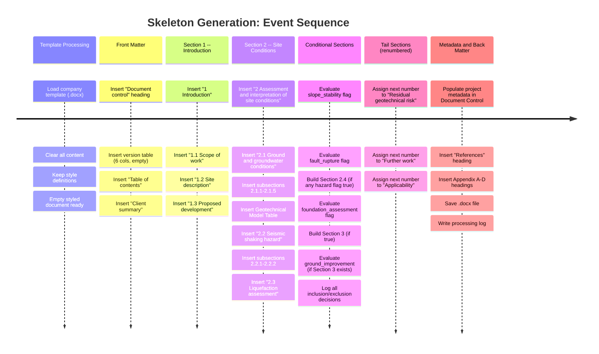
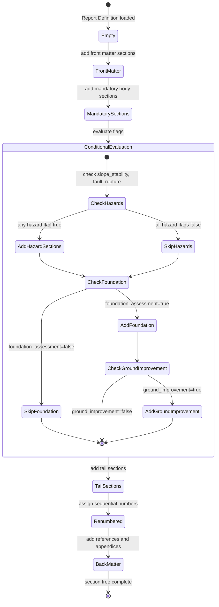

# Event Storming: Skeleton Generation Process

**Date**: 2026-04-12
**Scope**: From "nothing" to a structurally complete GIR skeleton document.
**Notation**: Domain Events (orange), Commands (blue), Policies (purple),
Read Models (green), Aggregates (yellow), External Systems (pink).

## Process Flow

```mermaid
flowchart TD
    classDef command fill:#5B9BD5,color:#fff,stroke:#2E75B6
    classDef event fill:#ED7D31,color:#fff,stroke:#C55A11
    classDef policy fill:#BF8FD4,color:#fff,stroke:#7030A0
    classDef readmodel fill:#70AD47,color:#fff,stroke:#548235
    classDef aggregate fill:#FFC000,color:#000,stroke:#BF9000
    classDef external fill:#FF6B8A,color:#fff,stroke:#C0392B
    classDef decision fill:#A9D18E,color:#000,stroke:#548235

    %% ===== PHASE 0: INPUTS =====
    subgraph INPUTS ["External Inputs"]
        EXT_RFP["RFP / Client Brief\n(PDF, DOCX)"]:::external
        EXT_LOE["LOE / Contract\n(PDF, DOCX)"]:::external
        EXT_TEMPLATE["Company Word Template\n(.docx)"]:::external
    end

    %% ===== PHASE 1: INITIATION =====
    subgraph INITIATION ["1. Initiation"]
        CMD_GENERATE["COMMAND\nGenerate Skeleton"]:::command
        RM_REPORT_DEF["READ MODEL\nReport Definition\n(jurisdiction, report type,\nsection tree, standards,\nstyle profile)"]:::readmodel
        EVT_DEF_LOADED["EVENT\nReport Definition\nLoaded"]:::event
    end

    EXT_RFP --> CMD_GENERATE
    EXT_LOE --> CMD_GENERATE
    CMD_GENERATE --> RM_REPORT_DEF
    RM_REPORT_DEF --> EVT_DEF_LOADED

    %% ===== PHASE 2: TEMPLATE HANDLING =====
    subgraph TEMPLATE ["2. Template Processing"]
        CMD_LOAD_TEMPLATE["COMMAND\nLoad Template"]:::command
        POL_STYLES_ONLY["POLICY\nClear content,\nkeep styles only"]:::policy
        EVT_DOC_CREATED["EVENT\nEmpty Document\nCreated"]:::event
    end

    EVT_DEF_LOADED --> CMD_LOAD_TEMPLATE
    EXT_TEMPLATE -.->|optional| CMD_LOAD_TEMPLATE
    CMD_LOAD_TEMPLATE --> POL_STYLES_ONLY
    POL_STYLES_ONLY --> EVT_DOC_CREATED

    %% ===== PHASE 3: SECTION STRUCTURE =====
    subgraph SECTIONS ["3. Section Structure Generation"]
        CMD_BUILD_FRONT["COMMAND\nBuild Front Matter"]:::command
        EVT_FRONT_BUILT["EVENT\nFront Matter Built\n(Doc Control, ToC,\nClient Summary)"]:::event

        CMD_BUILD_MANDATORY["COMMAND\nBuild Mandatory\nSections"]:::command
        AGG_SECTION_TREE["AGGREGATE\nSection Tree\n(reads from\nReport Definition)"]:::aggregate
        EVT_MANDATORY_BUILT["EVENT\nMandatory Sections\nBuilt\n(Sections 1, 2, ...)"]:::event

        CMD_EVAL_CONDITIONS["COMMAND\nEvaluate Conditional\nFlags"]:::command
        RM_CONFIG["READ MODEL\nSkeleton Config\n(boolean flags)"]:::readmodel
        DEC_INCLUDE["DECISION\nInclude or Exclude\nConditional Section?"]:::decision
        EVT_CONDITIONAL_BUILT["EVENT\nConditional Sections\nBuilt\n(2.4, 2.5, 3, ...)"]:::event
        EVT_EXCLUSION_LOGGED["EVENT\nExclusion Decision\nLogged"]:::event

        CMD_RENUMBER["COMMAND\nAssign Sequential\nNumbers"]:::command
        EVT_NUMBERED["EVENT\nSections Numbered\nSequentially"]:::event
    end

    EVT_DOC_CREATED --> CMD_BUILD_FRONT
    CMD_BUILD_FRONT --> EVT_FRONT_BUILT

    EVT_FRONT_BUILT --> CMD_BUILD_MANDATORY
    CMD_BUILD_MANDATORY --> AGG_SECTION_TREE
    AGG_SECTION_TREE --> EVT_MANDATORY_BUILT

    EVT_MANDATORY_BUILT --> CMD_EVAL_CONDITIONS
    CMD_EVAL_CONDITIONS --> RM_CONFIG
    RM_CONFIG --> DEC_INCLUDE
    DEC_INCLUDE -->|include| EVT_CONDITIONAL_BUILT
    DEC_INCLUDE -->|exclude| EVT_EXCLUSION_LOGGED

    EVT_CONDITIONAL_BUILT --> CMD_RENUMBER
    EVT_EXCLUSION_LOGGED --> CMD_RENUMBER
    CMD_RENUMBER --> EVT_NUMBERED

    %% ===== PHASE 4: TABLES =====
    subgraph TABLES ["4. Mandatory Table Insertion"]
        CMD_INSERT_TABLES["COMMAND\nInsert Mandatory\nTables"]:::command
        EVT_DOC_CONTROL_TABLE["EVENT\nDocument Control\nTable Inserted\n(6 columns)"]:::event
        EVT_GEO_MODEL_TABLE["EVENT\nGeotechnical Model\nTable Inserted\n(6 columns)"]:::event
    end

    EVT_NUMBERED --> CMD_INSERT_TABLES
    CMD_INSERT_TABLES --> EVT_DOC_CONTROL_TABLE
    CMD_INSERT_TABLES --> EVT_GEO_MODEL_TABLE

    %% ===== PHASE 5: METADATA =====
    subgraph METADATA ["5. Metadata Population"]
        CMD_POPULATE_META["COMMAND\nPopulate Project\nMetadata"]:::command
        RM_META["READ MODEL\nProject Metadata\n(number, client,\naddress, date)"]:::readmodel
        EVT_META_POPULATED["EVENT\nMetadata Populated\nin Document"]:::event
    end

    EVT_GEO_MODEL_TABLE --> CMD_POPULATE_META
    EVT_DOC_CONTROL_TABLE --> CMD_POPULATE_META
    CMD_POPULATE_META --> RM_META
    RM_META --> EVT_META_POPULATED

    %% ===== PHASE 6: BACK MATTER =====
    subgraph BACKMATTER ["6. Back Matter"]
        CMD_BUILD_BACK["COMMAND\nBuild Back Matter"]:::command
        EVT_REFS_ADDED["EVENT\nReferences Heading\nAdded"]:::event
        EVT_APPENDICES_ADDED["EVENT\nAppendix Headings\nAdded (A-D in order\nof first reference)"]:::event
    end

    EVT_META_POPULATED --> CMD_BUILD_BACK
    CMD_BUILD_BACK --> EVT_REFS_ADDED
    CMD_BUILD_BACK --> EVT_APPENDICES_ADDED

    %% ===== PHASE 7: OUTPUT =====
    subgraph OUTPUT ["7. Output"]
        CMD_SAVE["COMMAND\nSave Document"]:::command
        EVT_SAVED["EVENT\nSkeleton Document\nSaved (.docx)"]:::event
        EVT_LOG_WRITTEN["EVENT\nProcessing Log\nWritten"]:::event
    end

    EVT_APPENDICES_ADDED --> CMD_SAVE
    EVT_REFS_ADDED --> CMD_SAVE
    CMD_SAVE --> EVT_SAVED
    CMD_SAVE --> EVT_LOG_WRITTEN

    %% ===== DEFERRED (Steps 4-8) =====
    subgraph DEFERRED ["Deferred (future spec)"]
        direction LR
        CMD_TRACE["Traceability\nMatrix"]:::command
        CMD_INTRO["Abstract &\nIntro Draft"]:::command
        CMD_STANDARDS["Standards\nMapping"]:::command
        CMD_BOILERPLATE["Applicability\nClauses"]:::command
        CMD_PLACEHOLDERS["Placeholder\nInjection"]:::command
    end

    EVT_SAVED -.->|"future"| CMD_TRACE
    style DEFERRED fill:#f5f5f5,stroke:#ccc,stroke-dasharray: 5 5
```

## Detailed Event Timeline

## Aggregate: Section Tree

The Section Tree aggregate is the core domain object. It holds the ordered list
of sections to emit, computed from the Report Definition and SkeletonConfig.

## Key Domain Events (for acceptance testing)

These are the events a code reviewer or UAT tester should verify:

| # | Event | What to check |
| --- | --- | --- |
| E1 | Report Definition Loaded | Correct jurisdiction, report type, section tree |
| E2 | Empty Document Created | Template styles preserved, no content |
| E3 | Front Matter Built | Document control, ToC, Client summary present |
| E4 | Mandatory Sections Built | All sections from definition present |
| E5 | Conditional Sections Built | Only flagged sections present |
| E6 | Exclusion Decision Logged | Processing log records why each section was excluded |
| E7 | Sections Numbered Sequentially | No gaps in numbering |
| E8 | Document Control Table Inserted | 6 columns, correct headers |
| E9 | Geotechnical Model Table Inserted | 6 columns, correct headers |
| E10 | Metadata Populated | Project number, client name, date, etc. in document |
| E11 | Appendix Headings Added | A-D in correct order |
| E12 | Skeleton Document Saved | Valid .docx, reopenable by python-docx |
| E13 | Processing Log Written | All decisions recorded |
