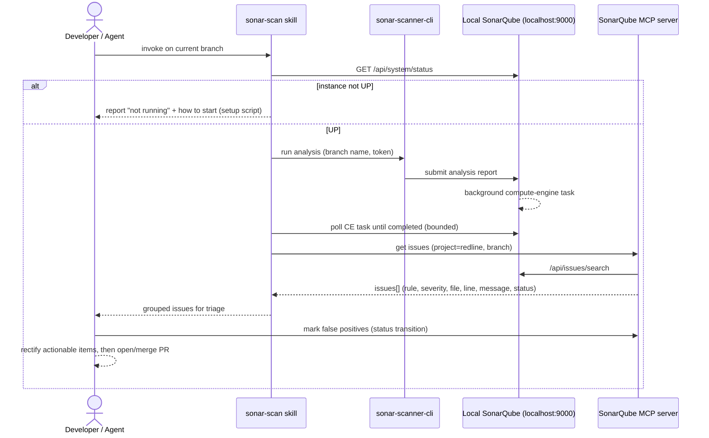

# Implementation Plan: Local RedMark SonarQube + Branch Scan Workflow

**Date**: 2026-06-05 | **Spec**: [spec.md](spec.md)
**Status**: Draft

## Summary

Convert an existing third-party "SonarQube Emulator" into a RedMark Logic, local-only
SonarQube service (rebrand and strip all cloud/production machinery), run it via Docker
with persistent storage, then integrate the `redline` repository so a branch can be
analysed and its findings triaged by an agent before a PR. The technical approach reuses
the emulator's Docker stack as-is (SonarQube Community Edition with the community
branch-analysis plugin, plus PostgreSQL), adds a `sonar-project.properties` and a scan
script to redline, wires in the official SonarSource MCP server for issue retrieval, and
wraps the loop in an on-demand Claude Code skill. Delivery is five independently
reviewable phases, each producing a working artifact.

## Technical Context

**Service repo** (the converted emulator): Docker Compose; SonarQube image
`mc1arke/sonarqube-with-community-branch-plugin` (pinned); PostgreSQL `15-alpine`;
PowerShell + Bash setup scripts. Runs on Docker Desktop (Windows host), containers Linux.

**redline repo**: Python 3.14, uv, pytest. This feature adds **no new Python package** —
its redline-side artifacts are configuration (`sonar-project.properties`), a scan script
(PowerShell + Bash), an MCP server registration, and a skill (`SKILL.md` + procedure).

**Analyzer**: `sonarsource/sonar-scanner-cli` run as a container (avoids a host Java/scanner
install).

**Issue retrieval**: official SonarSource SonarQube MCP server, pointed at
`http://localhost:9000`, authenticated by a token held outside version control.

**Storage**: PostgreSQL data in a named Docker volume by default; optional host bind-mount
to a fixed path for a visible, backup-friendly database location.

**Testing**: Most phases are infrastructure/config — verification is by command (build, HTTP
status, project/issue queries), not pytest. If any Python helper is introduced (Phase 4),
it gets fail-first tests per the `test-driven-development` skill and MUST raise typed
exceptions (Constitution Principle X), never sentinel returns.

## Constitution Check

*GATE: assessed before implementation.*

| Principle | Applies? | Assessment |
| --------- | -------- | ---------- |
| I. Single Source of Truth | Yes | `.sonarqube-version` stays the SSOT for the image tag; `sonar-project.properties` is the SSOT for scan config; the token is a secret, not a duplicated artifact. No new duplication. |
| II. Hook-First Enforcement | Partial | The founder chose an on-demand skill over a git hook. "Scan before PR" is a workflow, not a deterministic pattern check, so a hook is not mandatory. A `pre-push` hook is recorded as a future Could-have enforcement layer, not a substitute. |
| III. Defence-in-Depth | Yes | The skill is the agent-instruction layer; a future hook + CI gate would be independent layers. None is removed by adding the skill. |
| IV. Skills Inward, Agents Outward | Yes | `sonar-scan` SKILL.md MUST NOT name any agent; agent JDs (e.g. Kabilan) reference the skill, not the reverse. |
| V/VI. Facades / Data-Driven Config | N/A | No new Python component boundary or domain model. Scan config is data (`.properties`), satisfying VI by default. |
| VIII/IX. Determinism / Citation | N/A | No standards data involved. |
| X. Raise on Failure | Conditional | Applies only if a Python helper is added in Phase 4. |

**ADR gate (Development Workflow: "ADR before code")**: Introducing a local code-quality
gate + MCP integration is a system-level workflow decision. **Recommended pre-work**: the
principal engineer (Peter) records a short ADR (e.g. ADR-015: "Local SonarQube quality gate
for redline") before Phase 0 code begins. Flagged, not assumed — founder/Peter to confirm.

## Design Decisions

| #   | Decision | Choice | Rationale |
| --- | -------- | ------ | --------- |
| D1  | Service location | Convert the emulator folder in place; rename `sonarqube.emulator` -> `redmark-sonarqube` | Founder decision; keeps scan infra out of the app repo |
| D2  | Cloud/production assets | Strip entirely (bicep, deploy/update/migrate/rollback workflows, GitHub App, prod-infra docs) | Founder decision; local-only goal; ~80% less to maintain |
| D3  | Issue retrieval | Official SonarSource SonarQube MCP server | Founder decision; maintained; exposes issues/rules |
| D4  | Scan trigger | On-demand Claude Code skill | Founder decision; matches the agent-driven triage flow |
| D5  | Analyzer delivery | `sonarsource/sonar-scanner-cli` container | No host Java/scanner install; reproducible |
| D6  | Branch analysis | Reuse the existing community-branch-plugin image | Already in the stack; enables per-branch analysis on Community Edition |
| D7  | DB persistence | Named Docker volume (default) + optional host bind-mount | Survives stop/start; bind-mount gives a stable, visible location ("place for the database") |
| D8  | Token handling | Env var / untracked gitignored file in both repos | No secret in version control |
| D9  | Git history of the service | Re-initialise git in the converted folder (fresh history) | True white-label: drops prior-owner commit metadata; local-only means no shared history to preserve. **Founder to confirm** |
| D10 | redline scan config home | `sonar-project.properties` at redline root; project key `redline`; sources `src/marker`, `src/rl` | Conventional scanner location; matches the monorepo packages |

## Domain Impact

**New packages**: None.
**Bounded context changes**: None.
**Import-linter contract updates**: None.
**Subdomain classification**: Generic (off-the-shelf tooling: SonarQube, Docker, MCP).
**New domain terms**: None binding; "issue triage" and "false positive" are used in their
standard SonarQube sense.

## Architecture & Flow

This feature has no function pipeline and no value-object model, so the preset's
`pipeline-diagram.md` (function pipeline) and `class-diagram.md` (domain classes) artifacts
are **not applicable**. The relevant architecture is the runtime interaction of the
scan-and-triage loop:



**Founder approval gate**: please sign off on the **phase shape below** before
implementation begins (the analogue of the preset's pipeline-approval gate).

## MoSCoW

| Category | Items |
| -------- | ----- |
| **Must have** | Rebrand + strip to RedMark local-only service (Scn 1); local run + persistent DB (Scn 2); analyse current branch into a `redline` project (Scn 3); official MCP issue retrieval (Scn 4); on-demand scan-and-triage skill (Scn 5); token never committed |
| **Should have** | Coverage report fed to the scan; false-positive recording so issues are not re-surfaced; host bind-mount option for the DB |
| **Could have** | `pre-push` hook variant; convenience "open UI" command; new-code-focus / baseline configuration; CI workflow |
| **Won't have (this time)** | Any cloud/Azure deploy; multi-repository support; shared/hosted instance; multi-user auth hardening; rewriting the service's prior git history beyond a fresh init |

## Phased Delivery

### Phase 0: Convert, rebrand, strip (service repo)

**Goal**: The emulator folder becomes `redmark-sonarqube` — zero prior-owner identifiers,
RedMark Logic branding applied, all cloud/production assets removed, and the local Docker
stack still builds.

**Approach**:
- (Recommended) Land ADR-015 first (see Constitution Check).
- Rename the folder; optionally re-init git (D9, founder to confirm).
- Delete: `infra/deploy/` (bicep + params), the `.github/workflows/sonarqube-*.yml` update/
  migrate/deploy/notify/orchestrate workflows, `.github/scripts/update-sonarqube.sh`,
  `docs/project/production-infrastructure.md`, the Azure-specific plan/lessons docs.
- Rebrand: `README.md` (title, badges, drop job number + atlassian/azure URLs), `pyproject.toml`
  (package name + authors + towncrier/ruff URLs), `.copier-answers.yml`, `Dockerfile` comment,
  `docker-compose.yml` container/volume names (`sonarqube-emulator*` -> `redmark-sonarqube*`),
  `LICENSE.txt`.
- Keep: `infra/docker/` stack, `.sonarqube-version`, setup scripts.

**Deliverables**: rebranded service repo; deleted-asset list captured in the PR/commit.

**Verification**:
```
# from the service repo root
rg -i "tonkin|tonkintaylor|yyyttnz|azurewebsites|atlassian|t-t-sonarqube"   # -> no matches
rtk docker compose -f infra/docker/docker-compose.yml config                    # -> valid
rtk docker compose -f infra/docker/docker-compose.yml build                     # -> builds
```

**Acceptance Gate**:
- [ ] No prior-owner identifier matches remain
- [ ] Compose config validates and the image builds

---

### Phase 1: Run locally with persistent data (service repo)

**Goal**: One documented command brings the instance up at `http://localhost:9000`; data
survives a stop/start; the database lives at a defined location.

**Approach**: run the rebranded setup script; confirm UP + admin password set; decide DB
location (named volume default, or bind-mount to e.g. `<service>/data/postgres`) and apply
it in compose; document local credentials and the persistence guarantee in the README.

**Deliverables**: possibly an updated `docker-compose.yml` (bind-mount); README "Run locally"
section.

**Verification**:
```
./infra/docker/setup.ps1
# status UP:
curl http://localhost:9000/api/system/status        # -> {"status":"UP",...}
# persistence: create a project in the UI, then:
rtk docker compose -f infra/docker/docker-compose.yml down
rtk docker compose -f infra/docker/docker-compose.yml up -d
# re-open UI -> the project is still present
```

**Acceptance Gate**:
- [ ] Instance reaches UP via one command
- [ ] A created project survives a down/up cycle

---

### Phase 2: Analyse the current redline branch (redline repo)

**Goal**: Running the scan against the checked-out branch populates a `redline` project with
branch-attributed issues, authenticating with an uncommitted token.

**Approach**:
- Generate a token in SonarQube; store it outside VCS (env var `SONAR_TOKEN` or a gitignored
  file); add the ignore rule.
- Add `sonar-project.properties` at the redline root: `sonar.projectKey=redline`,
  `sonar.sources=src/marker,src/rl`, `sonar.tests=tests`, `sonar.python.version=3.14`,
  sensible exclusions (`src/**/_version.py`, vendored assets), and coverage path
  (`sonar.python.coverage.reportPaths=test-reports/coverage.xml`) for the Should-have.
- Add `scan.ps1` (+ `scan.sh`): derive the current branch, run `sonarsource/sonar-scanner-cli`
  as a container with `SONAR_HOST_URL=http://host.docker.internal:9000`, the token, and
  `-Dsonar.branch.name=<branch>`.

**Deliverables**: `sonar-project.properties`, `scan.ps1`, `scan.sh`, `.gitignore` token entry.

**Verification**:
```
$env:SONAR_TOKEN = "<token>"; ./scan.ps1
curl "http://localhost:9000/api/projects/search?projects=redline"   # -> project present
# UI: issues listed under the analysed branch
```

**Acceptance Gate**:
- [ ] `redline` project populated for the current branch
- [ ] Token is not present anywhere in tracked files

---

### Phase 3: Retrieve issues via the official MCP (redline repo)

**Goal**: An agent lists redline issues (current branch) through the SonarSource MCP server.

**Approach**: register the SonarQube MCP server in redline's MCP config with
`SONARQUBE_URL=http://localhost:9000` and the token from env (confirm the exact distribution
and env-var names in a short spike — Docker image vs. jar; `SONARQUBE_TOKEN` /
`SONARQUBE_USER_TOKEN`). Validate that the MCP issue list matches the Web API for the same
project/branch.

**Deliverables**: MCP server entry (`.mcp.json` or equivalent), a short doc on required env.

**Verification**:
```
# via MCP: list issues for project=redline, branch=<current>
# compare count to:
curl "http://localhost:9000/api/issues/search?componentKeys=redline&branch=<branch>"
```

**Acceptance Gate**:
- [ ] MCP returns the full open-issue set with rule/severity/file/line/message/status
- [ ] MCP auth uses an uncommitted token

---

### Phase 4: Scan-and-triage skill (redline repo)

**Goal**: One skill invocation runs the scan, waits for completion, retrieves issues via the
MCP, presents them for triage, supports marking false positives so they are not re-surfaced,
and guides rectification — with a clear message when the instance is down.

**Approach**: create `.agents/skills/sonar-scan/SKILL.md` (boundary contract: pre-PR branch
scanning -> triaged issue list) + `procedures/sonar-scan.md` (ensure-up check; run `scan.ps1`;
poll the compute-engine task; retrieve via MCP; group by file/severity; triage loop; record
false positives via issue status transition). Keep SKILL.md agent-agnostic (Principle IV);
add the routing entry to the relevant agent JD, not the skill. Any Python helper added here
follows TDD and Principle X.

**Deliverables**: `SKILL.md`, `procedures/sonar-scan.md`, optional helper script, JD routing
entry.

**Verification**:
```
# on a branch with a seeded lint/quality issue:
# invoke the sonar-scan skill -> produces a grouped triage list
# mark one finding false-positive -> re-run -> it is not re-surfaced
# stop the instance -> invoke -> clear "not running, start with setup.ps1" message
```

**Acceptance Gate**:
- [ ] End-to-end loop works from a single invocation
- [ ] False-positive marking persists across scans
- [ ] Instance-down path reports clearly

## File Inventory

| Phase | Repo | New / Changed / Deleted |
| ----- | ---- | ----------------------- |
| 0 | service | CHANGE: README, pyproject.toml, docker-compose.yml, Dockerfile, .copier-answers.yml, LICENSE. DELETE: infra/deploy/**, .github/workflows/sonarqube-*.yml, .github/scripts/update-sonarqube.sh, docs/project/production-infrastructure.md, Azure plan/lessons |
| 1 | service | CHANGE: docker-compose.yml (optional bind-mount), README |
| 2 | redline | NEW: sonar-project.properties, scan.ps1, scan.sh; CHANGE: .gitignore |
| 3 | redline | NEW/CHANGE: .mcp.json (MCP server entry), docs/mcp env note |
| 4 | redline | NEW: .agents/skills/sonar-scan/SKILL.md, procedures/sonar-scan.md (+ optional helper); CHANGE: agent JD routing table |
| pre-0 | redline | NEW (recommended): docs/adr/ADR-015-local-sonarqube-quality-gate.md |

**Total new (redline)**: ~6-8 | **Total deleted (service)**: ~10+

## Library Best Practices

<!-- Confirm exact tags/distribution during implementation. -->

### mc1arke/sonarqube-with-community-branch-plugin
- Already pinned in the stack (`26.4.0.121862-community`); keep the pin; it provides
  branch/PR analysis on Community Edition.

### sonarsource/sonar-scanner-cli
- Run as a container with the repo bind-mounted; pass `SONAR_HOST_URL`,
  `SONAR_TOKEN`, `-Dsonar.branch.name`. Pin a specific image tag.
- On Windows Docker Desktop, reach the instance via `http://host.docker.internal:9000`.

### SonarSource/sonarqube-mcp-server
- Official MCP server. **Confirm in a Phase 3 spike**: distribution (Docker image vs. jar),
  exact env-var names (`SONARQUBE_URL`, token variable), and whether org is required (it is
  not, for a local Server instance). Fallback: a thin Web-API skill calling
  `/api/issues/search` if the official server cannot authenticate locally.

## Risk Register

| Risk | Mitigation |
| ---- | ---------- |
| JVM/search engine heavy on a dev laptop | Keep the constrained JVM profile already in the compose; document minimum memory |
| Branch-analysis plugin image tag unavailable | Pin the tag; fall back to main-branch-only analysis |
| Token committed by accident | Gitignore + env-based tokens + a search check; never echo tokens in logs |
| Stripping cloud assets breaks the local build | Re-verify `docker compose build` after removals; keep removals reviewable in one PR |
| Official MCP cannot auth against local instance | Spike connectivity in Phase 3; fall back to a thin Web-API skill |
| First scan floods triage with pre-existing findings | Establish a baseline / focus on new code; document a triage convention |
| `host.docker.internal` networking differs across OSes | Document the host URL per OS; the scanner runs from the redline working copy |
