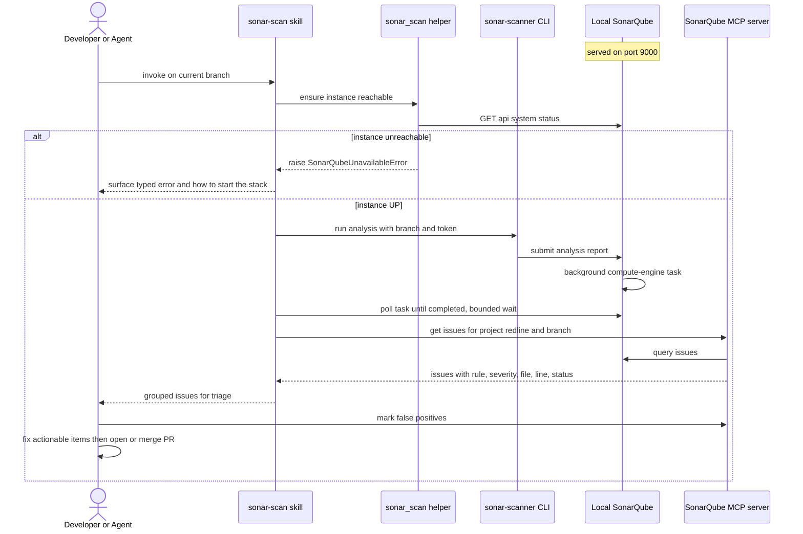

# Implementation Plan: Local RedMark SonarQube + Branch Scan Workflow

**Date**: 2026-06-05 | **Spec**: [spec.md](spec.md)
**Status**: Draft

## Summary

Convert an existing third-party "SonarQube Emulator" into a RedMark Logic, local-only
SonarQube service (rebrand and strip all cloud/production machinery), run it via Docker
with persistent storage and auto-start, then integrate the `redline` repository so a branch
can be analysed and its findings triaged by an agent before a PR. The technical approach
reuses the emulator's Docker stack as-is (SonarQube Community Edition with the community
branch-analysis plugin, plus PostgreSQL); generates scan properties from a single source in
`pyproject.toml` (`[tool.usethis]`, mirroring the reference wallplanner project); runs the
`sonar-scanner` CLI directly against the local instance (reusing the CI workflow's logic but
not emulating a CI runner); wires the official SonarQube MCP server under `.vscode/` with the
secret in an untracked `.env`; and wraps the loop in a standalone Claude Code skill backed by
a small, unit-tested Python helper that raises a typed error when the instance is down.
Delivery is five independently reviewable phases, each producing a working artifact.

## Technical Context

**Service repo** (the converted emulator): Docker Compose; SonarQube image
`mc1arke/sonarqube-with-community-branch-plugin` (pinned); PostgreSQL `15-alpine`;
PowerShell + Bash setup scripts. Runs on Docker Desktop (Windows host), containers Linux.
Containers use a restart policy so the stack auto-starts with the Docker runtime.

**redline repo**: Python 3.14, uv, pytest. redline-side artifacts: scan config in
`[tool.usethis]` (`pyproject.toml`), a generated (gitignored) `sonar-project.properties`, a
scan script (PowerShell + Bash), a small tested Python helper under `.agents/tools/sonar_scan/`
(availability check + branch/issue glue, raising typed errors), an MCP server registration in
`.vscode/mcp.json`, an `.env` (untracked) + `.env` template (committed), and a skill
(`SKILL.md` + procedure).

**Properties generation**: `uvx usethis show sonarqube --output-file=sonar-project.properties`
reads `[tool.usethis]` + `SONAR_PROJECT_KEY`. Single source of truth; generated file is
transient and gitignored.

**Analyzer**: `sonar-scanner` CLI (the `sonarsource/sonar-scanner-cli` container) run directly
against `http://localhost:9000`. The CI workflow's steps are mirrored locally; no GitHub-Actions
runner is emulated.

**Issue retrieval**: official SonarQube MCP server, Docker image `mcp/sonarqube`, env
`SONARQUBE_URL=http://localhost:9000` + `SONARQUBE_TOKEN` (no organisation for self-hosted
Server). Non-secret config in committed `.vscode/mcp.json`; token from untracked `.env`.

**Storage**: PostgreSQL data in a named Docker volume by default; optional host bind-mount
to a fixed path for a visible, backup-friendly database location.

**Testing**: Infra/config phases verify by command (build, HTTP status, project/issue
queries). The availability check + orchestration glue are Python and follow TDD per the
`test-driven-development` skill, raising typed exceptions (Constitution Principle X), never
sentinel returns.

## Constitution Check

*GATE: assessed before implementation.*

| Principle | Applies? | Assessment |
| --------- | -------- | ---------- |
| I. Single Source of Truth | Yes | `.sonarqube-version` = SSOT for the image tag; `[tool.usethis]` in `pyproject.toml` = SSOT for scan properties (generated file is transient, gitignored); the token is a secret, not a duplicated artifact. |
| II. Hook-First Enforcement | Partial | The founder chose an on-demand skill over a git hook. "Scan before PR" is a workflow, not a deterministic pattern check, so a hook is not mandatory. A `pre-push` hook and a future umbrella pre-PR checks skill are recorded as additional layers, not substitutes. |
| III. Defence-in-Depth | Yes | The standalone skill is the agent-instruction layer; a future umbrella checks-skill + hook + CI gate would be independent layers. None is removed by adding the skill. |
| IV. Skills Inward, Agents Outward | Yes | `sonar-scan` SKILL.md MUST NOT name any agent; agent JDs (e.g. Kabilan) reference the skill, not the reverse. |
| V/VI. Facades / Data-Driven Config | Yes | Scan config is data (`[tool.usethis]`), satisfying VI. The Python helper exposes a thin function surface; primitives cross its boundary. |
| VIII/IX. Determinism / Citation | N/A | No standards data involved. |
| X. Raise on Failure | Yes | The availability check raises a typed `SonarQubeUnavailableError`; the skill never fails silently or returns an empty issue set on an unreachable instance. |

**ADR gate (Development Workflow: "ADR before code")**: Introducing a local code-quality
gate + MCP integration is a system-level workflow decision. **Recommended pre-work**: the
principal engineer (Peter) records a short ADR (e.g. ADR-015: "Local SonarQube quality gate
for redline") before Phase 0 code begins. Flagged, not assumed — founder/Peter to confirm.

## Design Decisions

| #   | Decision | Choice | Rationale |
| --- | -------- | ------ | --------- |
| D1  | Service location | Convert the emulator folder in place; rename `sonarqube.emulator` -> `redmark-sonarqube` | Founder decision; keeps scan infra out of the app repo |
| D2  | Cloud/production assets | Strip entirely (bicep, deploy/update/migrate/rollback workflows, GitHub App, prod-infra docs) | Founder decision; local-only goal; ~80% less to maintain |
| D3  | Issue retrieval | Official SonarQube MCP server, image `mcp/sonarqube` | Founder decision; maintained; exposes issues/rules |
| D4  | Scan trigger | On-demand standalone Claude Code skill | Founder decision; matches the agent-driven triage flow |
| D5  | Analyzer delivery | `sonar-scanner` CLI (`sonarsource/sonar-scanner-cli` container) run directly at localhost:9000 | No host Java install; reproducible; mirrors CI logic without CI |
| D6  | Branch analysis | Reuse the existing community-branch-plugin image | Already in the stack; enables per-branch analysis on Community Edition |
| D7  | DB persistence | Named Docker volume (default) + optional host bind-mount | Survives stop/start; bind-mount gives a stable, visible location |
| D8  | Token handling | Untracked `.env` (secret) + committed `.vscode/` config and `.env` template (non-secret) | No secret in version control; matches founder instruction |
| D9  | Git history of the service | Re-initialise git in the converted folder (fresh history) | True white-label: drops prior-owner commit metadata. **Founder to confirm** |
| D10 | redline scan config | `[tool.usethis]` in `pyproject.toml` is the SSOT; `usethis show sonarqube` generates a gitignored `sonar-project.properties` at scan time | Mirrors wallplanner; one source of truth (Principle I) |
| D11 | CI vs local | Do NOT emulate GitHub Actions locally (no `act`, no Action wrapper). Mirror the workflow's steps in the local script/skill | The scan-action only wraps `sonar-scanner` + CI plumbing; emulation adds cost, no local benefit (see report) |
| D12 | Auto-start | Container `restart: unless-stopped` (the stack returns when Docker Desktop starts; a manual stop keeps it down) | Satisfies FR-020; standard Docker mechanism |
| D13 | Config split | Non-secret in `.vscode/mcp.json` + committed `.env` template; secret `SONARQUBE_TOKEN` in untracked `.env`; MCP loads `.env` | Founder instruction; keeps secrets out of git # pragma: allowlist secret |
| D14 | Failure mode | Availability check raises typed `SonarQubeUnavailableError`; never silent, never empty result | Founder instruction + Constitution Principle X |
| D15 | Skill shape | Standalone + composable: callable alone today, callable by a future umbrella pre-PR checks skill | Founder instruction; umbrella skill out of scope |
| D16 | Orchestration home | A small unit-tested Python tool `.agents/tools/sonar_scan/` (like `github_projects`) holds the availability check + glue; the skill/procedure call it | Testable, typed errors, TDD; not a new `src/` package |

## Domain Impact

**New packages**: None in `src/`. A tooling package `.agents/tools/sonar_scan/` is added
(sibling of the existing `.agents/tools/github_projects/`, already on the pytest pythonpath).
**Bounded context changes**: None.
**Import-linter contract updates**: None (`.agents/tools/**` is outside the `marker`/`rl`
root packages).
**Subdomain classification**: Generic (off-the-shelf tooling: SonarQube, Docker, MCP).
**New domain terms**: None binding; "issue triage" and "false positive" are used in their
standard SonarQube sense.

## Architecture & Flow

This feature has no function pipeline and no value-object model, so the preset's
`pipeline-diagram.md` (function pipeline) and `class-diagram.md` (domain classes) artifacts
are **not applicable**. The relevant architecture is the runtime interaction of the
scan-and-triage loop.

**Why the earlier diagram failed (root cause)**: Mermaid's `sequenceDiagram` grammar rejects
certain characters in participant aliases and message labels. The previous version used
parentheses in an alias (`Local SonarQube (localhost:9000)`), square brackets and parentheses
in a message (`issues[] (rule, ...)`), and double quotes in a message (`"not running"`). Any
of these triggers a parse error. **Fix / guard rule**: keep participant aliases and message
labels to plain text — no parentheses `()`, square brackets `[]`, or double quotes; put URLs
and paths after a single colon or in a `Note`. The diagram below follows that rule.

<!-- MERMAID HYGIENE: participant aliases and message labels must be plain text.
     Do NOT use ( ) [ ] or double-quotes in an alias or a message label -- they break the
     sequenceDiagram parser. Put URLs/paths in a Note line or after a single colon. -->



**Founder approval gate**: please sign off on the **phase shape below** before
implementation begins (the analogue of the preset's pipeline-approval gate).

## MoSCoW

| Category | Items |
| -------- | ----- |
| **Must have** | Rebrand + strip to RedMark local-only service (Scn 1); local run + persistent DB + auto-start (Scn 2); analyse current branch into a `redline` project, properties from `[tool.usethis]`, scanner run directly (Scn 3); official MCP issue retrieval via `.vscode/mcp.json` (Scn 4); standalone scan-and-triage skill with a typed unavailability error (Scn 5); token only in untracked `.env` |
| **Should have** | Coverage report fed to the scan; ruff report fed to the scan; false-positive recording so issues are not re-surfaced; host bind-mount option for the DB |
| **Could have** | `pre-push` hook variant; convenience "open UI" command; new-code-focus / baseline configuration |
| **Won't have (this time)** | Emulating GitHub Actions locally (`act` or an Action wrapper); a CI/GitHub-Actions integration; the umbrella pre-PR checks skill that composes this one; any cloud/Azure deploy; multi-repository support; shared/hosted instance; multi-user auth hardening; rewriting the service's prior git history beyond a fresh init |

## Phased Delivery

### Phase 0: Convert, rebrand, strip (service repo)

**Goal**: The emulator folder becomes `redmark-sonarqube` — zero prior-owner identifiers,
RedMark Logic branding applied, all cloud/production assets removed, and the local Docker
stack still builds.

**Approach**:
- (Recommended) Land ADR-015 first (see Constitution Check).
- Rename the folder; optionally re-init git (D9, founder to confirm).
- Delete: `infra/deploy/` (bicep + params), the `.github/workflows/sonarqube-*.yml` update/
  migrate/deploy/notify/orchestrate workflows, `.github/scripts/update-sonarqube.sh`,
  `docs/project/production-infrastructure.md`, the Azure-specific plan/lessons docs.
- Rebrand: `README.md` (title, badges, drop job number + atlassian/azure URLs), `pyproject.toml`
  (package name + authors + towncrier/ruff URLs), `.copier-answers.yml`, `Dockerfile` comment,
  `docker-compose.yml` container/volume names (`sonarqube-emulator*` -> `redmark-sonarqube*`),
  `LICENSE.txt`.
- Keep: `infra/docker/` stack, `.sonarqube-version`, setup scripts.

**Deliverables**: rebranded service repo; deleted-asset list captured in the PR/commit.

**Verification**:
```
# from the service repo root
rg -i "tonkin|tonkintaylor|yyyttnz|azurewebsites|atlassian|t-t-sonarqube"   # -> no matches
rtk docker compose -f infra/docker/docker-compose.yml config                    # -> valid
rtk docker compose -f infra/docker/docker-compose.yml build                     # -> builds
```

**Acceptance Gate**:
- [ ] No prior-owner identifier matches remain
- [ ] Compose config validates and the image builds

---

### Phase 1: Run locally, persistent, auto-start (service repo)

**Goal**: One documented command brings the instance up at `http://localhost:9000`; data
survives a stop/start; the database lives at a defined location; the stack auto-starts when
the Docker runtime starts.

**Approach**: run the rebranded setup script; confirm UP + admin password set; set
`restart: unless-stopped` on both services (D12); decide DB location (named volume default,
or bind-mount to e.g. `<service>/data/postgres`) and apply it in compose; document local
credentials, the persistence guarantee, and the auto-start behaviour in the README.

**Deliverables**: updated `docker-compose.yml` (restart policy + optional bind-mount); README
"Run locally" section.

**Verification**:
```
./infra/docker/setup.ps1
curl http://localhost:9000/api/system/status        # -> {"status":"UP",...}
# persistence: create a project in the UI, then:
rtk docker compose -f infra/docker/docker-compose.yml down
rtk docker compose -f infra/docker/docker-compose.yml up -d   # -> project still present
# auto-start: restart Docker Desktop -> instance returns with no manual step
```

**Acceptance Gate**:
- [ ] Instance reaches UP via one command
- [ ] A created project survives a down/up cycle
- [ ] After a Docker Desktop restart, the instance comes back automatically

---

### Phase 2: Analyse the current redline branch (redline repo)

**Goal**: Running the scan against the checked-out branch populates a `redline` project with
branch-attributed issues, authenticating with an uncommitted token, with properties generated
from a single source.

**Approach**:
- Add `[tool.usethis]` sonar config to redline `pyproject.toml` (exclusions for tests/scripts;
  coverage + ruff report paths) — the SSOT (D10).
- Generate properties at scan time: `uvx usethis show sonarqube --output-file=sonar-project.properties`
  (env `SONAR_PROJECT_KEY=redline`). Gitignore the generated file + `ruff-report.json`.
- Generate a token in SonarQube; store it in untracked `.env` (`SONAR_TOKEN`); add the `.env`
  template (committed).
- Add `scan.ps1` (+ `scan.sh`): load `.env`, derive the current branch, generate properties,
  produce the ruff/coverage reports, then run `sonarsource/sonar-scanner-cli` as a container
  with `SONAR_HOST_URL=http://host.docker.internal:9000`, the token, and `-Dsonar.branch.name=<branch>`.

**Deliverables**: `pyproject.toml` `[tool.usethis]` block; `scan.ps1`, `scan.sh`; `.env`
template; `.gitignore` entries (generated properties, ruff report).

**Verification**:
```
# .env holds SONAR_TOKEN
./scan.ps1
curl "http://localhost:9000/api/projects/search?projects=redline"   # -> project present
# UI: issues listed under the analysed branch
```

**Acceptance Gate**:
- [ ] `redline` project populated for the current branch
- [ ] Properties were generated from `[tool.usethis]` (no committed `sonar-project.properties`)
- [ ] Token is not present anywhere in tracked files

---

### Phase 3: Retrieve issues via the official MCP (redline repo)

**Goal**: An agent lists redline issues (current branch) through the official MCP server,
configured under `.vscode/` with the secret in `.env`.

**Approach**: add a `sonarqube` server to `.vscode/mcp.json`:
`command: docker`, `args: [run, --init, --pull=always, -i, --rm, -e, SONARQUBE_TOKEN, -e,
SONARQUBE_URL, mcp/sonarqube]`, with `env: { SONARQUBE_URL: "http://localhost:9000" }` and the
token loaded from `.env` (`envFile`, or an `${input:...}` prompt as a fallback if the VS Code
build lacks `envFile`). Record both `SONARQUBE_URL` and `SONARQUBE_TOKEN` in the `.env`
template. Validate that the MCP issue list matches the Web API for the same project/branch.

**Deliverables**: `.vscode/mcp.json` `sonarqube` entry; `.env` template documenting
`SONARQUBE_URL` + `SONARQUBE_TOKEN`; a short doc note.

**Verification**:
```
# via the MCP: list issues for project=redline, branch=<current>
# compare to:
curl "http://localhost:9000/api/issues/search?componentKeys=redline&branch=<branch>"
```

**Acceptance Gate**:
- [ ] MCP returns the full open-issue set with rule/severity/file/line/message/status
- [ ] MCP non-secret config is in committed `.vscode/`; token only in untracked `.env`

---

### Phase 4: Standalone scan-and-triage skill (redline repo)

**Goal**: One skill invocation runs the scan, waits for completion, retrieves issues via the
MCP, presents them for triage, supports marking false positives so they are not re-surfaced,
and — when the instance is down — raises a typed error that surfaces to the developer (never
silent). The skill is standalone and composable.

**Approach**:
- Add a small tested Python tool `.agents/tools/sonar_scan/` (D16): `SonarQubeUnavailableError`
  (typed, Principle X) + `ensure_available(url)` + current-branch + issue-fetch glue. TDD:
  fail-first tests under `tests/` (e.g. `ensure_available` raises when the URL is unreachable).
- Create `.agents/skills/sonar-scan/SKILL.md` (boundary contract: pre-PR branch scanning ->
  triaged issue list) + `procedures/sonar-scan.md` (availability check; run `scan.ps1`; poll
  the compute-engine task; retrieve via MCP; group by file/severity; triage loop; record false
  positives via issue status transition). Keep SKILL.md agent-agnostic (Principle IV); add the
  routing entry to the relevant agent JD, not the skill. Document that the skill is callable as
  a sub-step by a future umbrella pre-PR checks skill (out of scope).

**Deliverables**: `.agents/tools/sonar_scan/` (+ tests), `.agents/skills/sonar-scan/SKILL.md`,
`procedures/sonar-scan.md`, JD routing entry.

**Verification**:
```
# on a branch with a seeded lint/quality issue:
# invoke the sonar-scan skill -> grouped triage list
# mark one finding false-positive -> re-run -> not re-surfaced
# stop the instance -> invoke -> raises SonarQubeUnavailableError, surfaced with remediation
.venv\Scripts\activate; python -m pytest tests/agents/tools/sonar_scan -v   # -> green
```

**Acceptance Gate**:
- [ ] End-to-end loop works from a single invocation
- [ ] False-positive marking persists across scans
- [ ] Instance-down path raises the typed error (no silent pass / empty result); tests green

## File Inventory

| Phase | Repo | New / Changed / Deleted |
| ----- | ---- | ----------------------- |
| 0 | service | CHANGE: README, pyproject.toml, docker-compose.yml, Dockerfile, .copier-answers.yml, LICENSE. DELETE: infra/deploy/**, .github/workflows/sonarqube-*.yml, .github/scripts/update-sonarqube.sh, docs/project/production-infrastructure.md, Azure plan/lessons |
| 1 | service | CHANGE: docker-compose.yml (restart policy + optional bind-mount), README |
| 2 | redline | CHANGE: pyproject.toml (`[tool.usethis]`), .gitignore. NEW: scan.ps1, scan.sh, .env template |
| 3 | redline | CHANGE: .vscode/mcp.json (sonarqube server). NEW/CHANGE: .env template entries, doc note |
| 4 | redline | NEW: .agents/tools/sonar_scan/** (+ tests), .agents/skills/sonar-scan/SKILL.md, procedures/sonar-scan.md. CHANGE: agent JD routing table |
| pre-0 | redline | NEW (recommended): docs/adr/ADR-015-local-sonarqube-quality-gate.md |

**Total new (redline)**: ~8-10 | **Total deleted (service)**: ~10+

## Library Best Practices

### mc1arke/sonarqube-with-community-branch-plugin
- Already pinned in the stack (`26.4.0.121862-community`); keep the pin; it provides
  branch/PR analysis on Community Edition.

### usethis (uvx usethis show sonarqube)
- Reads `[tool.usethis]` (`sonarqube.exclusions`, `sonarqube.extra-properties`) + the
  `SONAR_PROJECT_KEY` env var, emitting `sonar-project.properties`. Pin a version
  (wallplanner uses `usethis@0.22.0`). The generated file is transient — gitignore it.

### sonarsource/sonar-scanner-cli
- Run as a container with the repo bind-mounted; pass `SONAR_HOST_URL`, `SONAR_TOKEN`,
  `-Dsonar.branch.name`. Pin a specific image tag. On Windows Docker Desktop, reach the
  instance via `http://host.docker.internal:9000`.

### mcp/sonarqube (official SonarQube MCP server)
- Run: `docker run --init --pull=always -i --rm -e SONARQUBE_TOKEN -e SONARQUBE_URL mcp/sonarqube`.
- Env: `SONARQUBE_URL` (server URL), `SONARQUBE_TOKEN` (user token). `SONARQUBE_ORG` is Cloud-only
  — omit it for the self-hosted Server. `.vscode/mcp.json` holds the non-secret `env`; the token # pragma: allowlist secret
  comes from `.env`. Fallback if the server cannot authenticate locally: a thin Web-API skill
  calling `/api/issues/search`.

## Risk Register

| Risk | Mitigation |
| ---- | ---------- |
| JVM/search engine heavy on a dev laptop | Keep the constrained JVM profile already in the compose; document minimum memory |
| Branch-analysis plugin image tag unavailable | Pin the tag; fall back to main-branch-only analysis |
| Token committed by accident | `.env` ignored; committed config holds non-secrets only; a search check; never echo tokens |
| Stripping cloud assets breaks the local build | Re-verify `docker compose build` after removals; keep removals reviewable in one PR |
| Official MCP cannot auth against local instance | Spike connectivity in Phase 3; fall back to a thin Web-API skill |
| Docker Desktop not running when a scan is attempted | Availability check raises the typed error with remediation; restart policy auto-starts the stack |
| VS Code `mcp.json` build lacks `envFile` support | Fall back to an `${input:sonar_token}` secure prompt; document both in the `.env` template note |
| `host.docker.internal` networking differs across OSes | Document the host URL per OS; the scanner runs from the redline working copy |
